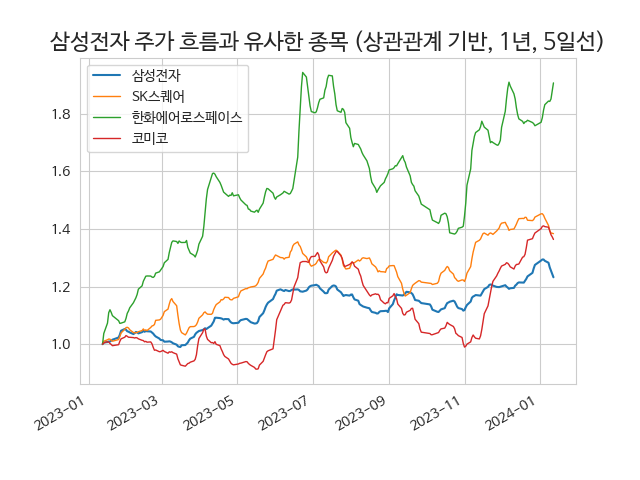
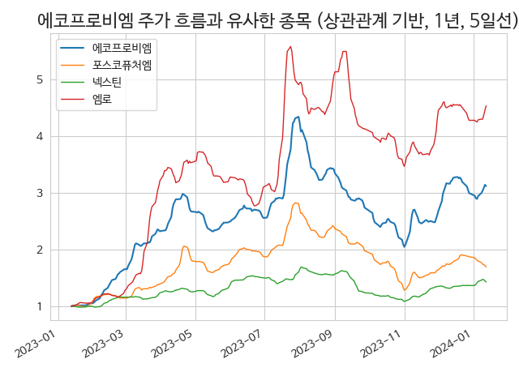
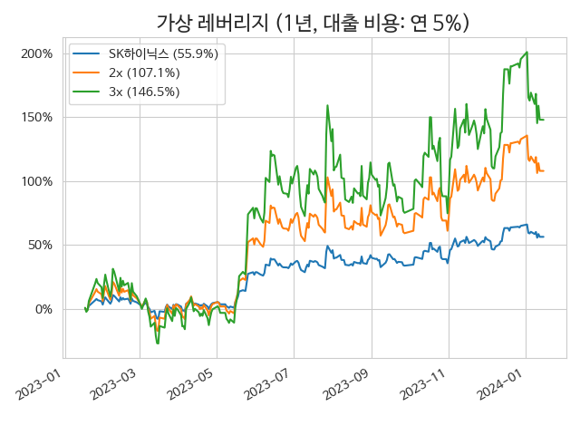
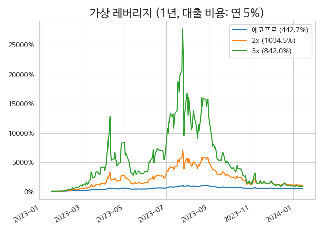

## 주요 기능
- 코스닥 200 및 코스피 150 지수 편입 종목 대상으로 분석
- 최근 1주일 DART 신규 공시 목록 (공시를 볼 수 있는 링크 제공)
- 종목의 이동평균선이 포함된 주가 그래프
- 유사한 주가 변화를 보였던 타 종목 제시

|**[삼성전자](/005930/)**|**[에코프로비엠](/247540/)**|
|------------------------|----------------------------|
|||

- 가상 레버리지 상품의 기대 성과

|**[SK하이닉스](/000660/)**|**[에코프로](/086520/)**|
|------------------------|----------------------------|
|||
