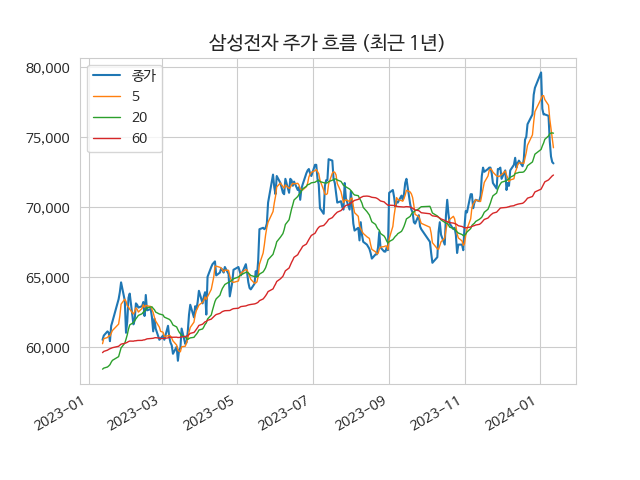
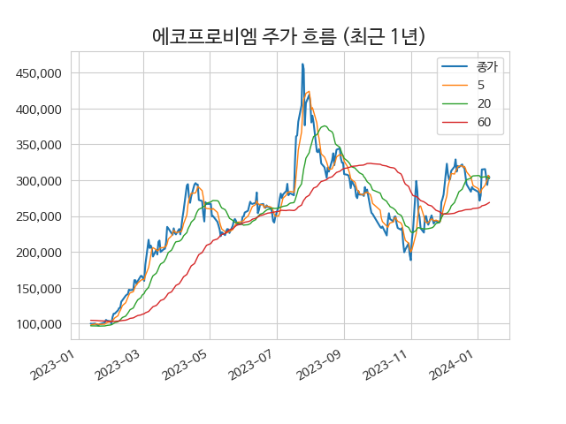
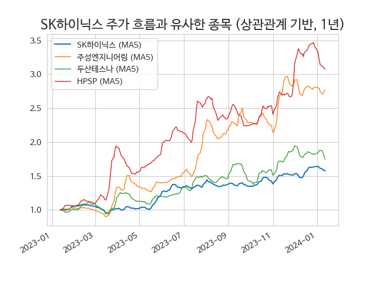
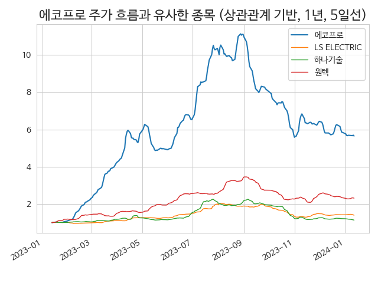
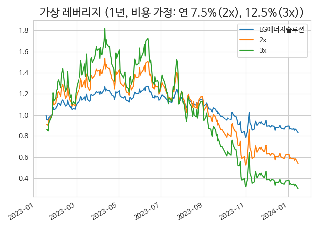
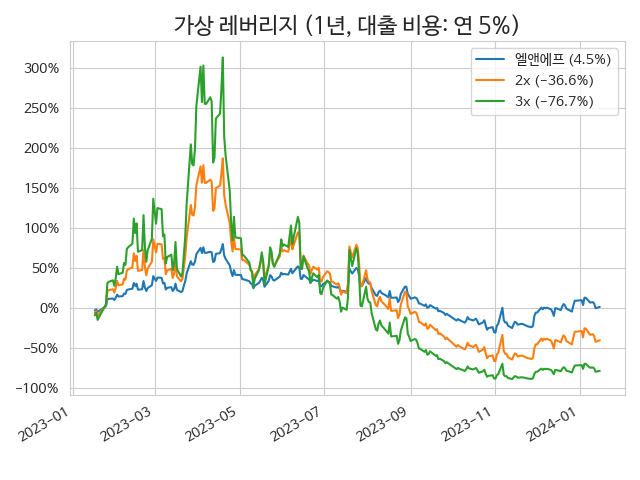

> **다양한 종목과 데이터를 주기적으로 분석**

매일 장마감 후 당일 업데이트 합니다.<small>[^fn_update]</small>
- 코스피 200 지수 편입 종목
- 코스닥 150 지수 편입 종목

> **DART 신규 공시 목록 제공 (공시 링크 포함)**



 
> ## 투자에 도움이 되는 다양한 통계 제공**

> ## 투자에 도움이 되는 다양한 통계 제공

> ### 투자에 도움이 되는 다양한 통계 제공**
> > #### 투자에 도움이 되는 다양한 통계 제공**

| **KRX 시장 비중** | **KOSPI 지역별 비율** |
| :---: | :---: |
|  |  |

 
> **이동평균선이 포함된 주가 그래프 제공**

| **[삼성전자](/005930/#price)** | **[에코프로비엠](/247540/#price)** |
| :----------------------------: | :--------------------------------: |
|  |  |

> **유사 주가 변화를 보인 타 종목 제시**

과거 유사한 주가 흐름을 보였던 종목을 보여줍니다. 관심있는 종목과 동일한 투자 아이디어를 적용할 수 있는 후보 종목 발굴에 활용할 수 있습니다.<small>[^fn_corr]</small>

| **[SK하이닉스](/000660/#corr)** | **[에코프로](/086520/#corr)** |
| :-----------------------------: | :---------------------------: |
|  |  |
   
 
> **가상 레버리지 상품 투자 시 성과 추정**

변동성 위험을 직관적으로 살펴봄으로써, 레버리지 투자 또는 포트폴리오 내 비중 확대에 적합한지 판단하는데 도움을 얻을 수 있습니다.

| **[LG에너지솔루션](/373220/#2x)** | **[엘앤에프](/066970/#2x)** |
| :-------------------------------: | :-------------------------: |
|  |  |

---

[^fn_update]: <small>장 마감 후 두어시간 이내 업데이트를 목표로 하지만, 상황에 따라서는 지연될 수 있습니다.</small>
[^fn_corr]: <small>미래에도 유사한 주가 흐름을 보일 것이라는 예상이 아닙니다.</small>
