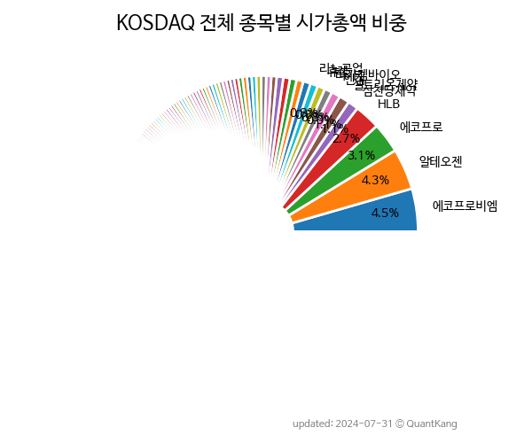

 

 
> **종목 목록 (1710)**

| **종목** | **PER** | **PBR** | **DIV** | **비중** |
| :------- | ------: | ------: | ------: | -------: |
| [에코프로비엠](/247540/) | 75.0 | 15.5 | 0.2<small>%</small> | 5.6<small>%</small> |
| [에코프로](/086520/) | 355.7 | 10.0 | 0.1<small>%</small> | 3.6<small>%</small> |
| [HLB](/028300/) | - | 14.7 | - | 2.5<small>%</small> |
| [알테오젠](/196170/) | - | 26.8 | - | 1.1<small>%</small> |
| [셀트리온제약](/068760/) | 163.2 | 11.9 | - | 1.1<small>%</small> |
| [HPSP](/403870/) | 51.0 | 19.2 | 0.3<small>%</small> | 1.0<small>%</small> |
| [엔켐](/348370/) | 147.6 | 11.7 | - | 0.9<small>%</small> |
| [리노공업](/058470/) | 26.2 | 6.1 | 1.5<small>%</small> | 0.8<small>%</small> |
| [레인보우로보틱스](/277810/) | 424.7 | 41.3 | - | 0.8<small>%</small> |
| 신성델타테크 | 160.4 | 16.6 | 0.1<small>%</small> | 0.7<small>%</small> |
| [JYP Ent.](/035900/) | 36.7 | 8.2 | 0.5<small>%</small> | 0.7<small>%</small> |
| [이오테크닉스](/039030/) | 28.4 | 4.1 | 0.6<small>%</small> | 0.6<small>%</small> |
| [솔브레인](/357780/) | 13.2 | 2.8 | 0.7<small>%</small> | 0.6<small>%</small> |
| [펄어비스](/263750/) | - | 2.9 | - | 0.6<small>%</small> |
| [카카오게임즈](/293490/) | - | 1.2 | - | 0.6<small>%</small> |
| [동진쎄미켐](/005290/) | 12.7 | 2.9 | 0.3<small>%</small> | 0.5<small>%</small> |
| LS머트리얼즈 | 181.1 | 15.8 | 0.1<small>%</small> | 0.5<small>%</small> |
| [휴젤](/145020/) | 32.9 | 2.4 | - | 0.5<small>%</small> |
| [클래시스](/214150/) | 24.7 | 8.1 | 0.4<small>%</small> | 0.5<small>%</small> |
| [HLB생명과학](/067630/) | - | 7.4 | - | 0.5<small>%</small> |
| [에스엠](/041510/) | 21.5 | 2.5 | 1.6<small>%</small> | 0.5<small>%</small> |
| [ISC](/095340/) | 31.7 | 5.0 | 0.8<small>%</small> | 0.4<small>%</small> |
| [위메이드](/112040/) | - | 4.4 | 1.5<small>%</small> | 0.4<small>%</small> |
| [동화기업](/025900/) | 39.1 | 2.2 | - | 0.4<small>%</small> |
| [CJ ENM](/035760/) | - | 0.4 | - | 0.4<small>%</small> |
| [루닛](/328130/) | - | 20.6 | - | 0.4<small>%</small> |
| [원익IPS](/240810/) | 16.7 | 1.7 | 0.7<small>%</small> | 0.4<small>%</small> |
| [삼천당제약](/000250/) | 236.2 | 8.0 | - | 0.4<small>%</small> |
| [주성엔지니어링](/036930/) | 13.2 | 2.9 | 0.7<small>%</small> | 0.4<small>%</small> |
| [스튜디오드래곤](/253450/) | 27.8 | 2.1 | - | 0.4<small>%</small> |
| [메디톡스](/086900/) | 34.1 | 2.8 | 0.5<small>%</small> | 0.4<small>%</small> |
| [씨젠](/096530/) | 7.2 | 1.1 | 3.1<small>%</small> | 0.4<small>%</small> |
| [더블유씨피](/393890/) | 20.6 | 1.4 | - | 0.4<small>%</small> |
| [레고켐바이오](/141080/) | - | 5.5 | - | 0.3<small>%</small> |
| [아프리카TV](/067160/) | 19.9 | 4.9 | 0.7<small>%</small> | 0.3<small>%</small> |
| [하나마이크론](/067310/) | 389.4 | 4.7 | 0.2<small>%</small> | 0.3<small>%</small> |
| [고영](/098460/) | 30.4 | 3.9 | 0.8<small>%</small> | 0.3<small>%</small> |
| [파라다이스](/034230/) | 44.0 | 0.8 | - | 0.3<small>%</small> |
| [나노신소재](/121600/) | 53.9 | 5.2 | 0.3<small>%</small> | 0.3<small>%</small> |
| [케어젠](/214370/) | 39.3 | 5.0 | 2.5<small>%</small> | 0.3<small>%</small> |
| [티씨케이](/064760/) | 12.4 | 2.8 | 1.7<small>%</small> | 0.3<small>%</small> |
| [에스티팜](/237690/) | 64.5 | 3.4 | 0.8<small>%</small> | 0.3<small>%</small> |
| [HK이노엔](/195940/) | 30.2 | 1.0 | 0.8<small>%</small> | 0.3<small>%</small> |
| [파크시스템스](/140860/) | 39.9 | 9.4 | 0.2<small>%</small> | 0.3<small>%</small> |
| [솔브레인홀딩스](/036830/) | 17.3 | 1.0 | 0.3<small>%</small> | 0.3<small>%</small> |
| [레이크머티리얼즈](/281740/) | 40.1 | 12.6 | - | 0.3<small>%</small> |
| [대주전자재료](/078600/) | 1043.3 | 8.7 | 0.1<small>%</small> | 0.3<small>%</small> |
| [성일하이텍](/365340/) | 23.3 | 3.7 | - | 0.3<small>%</small> |
| [심텍](/222800/) | 4.3 | 1.7 | 1.5<small>%</small> | 0.3<small>%</small> |
| [파마리서치](/214450/) | 24.9 | 2.9 | 0.7<small>%</small> | 0.3<small>%</small> |
| [SFA반도체](/036540/) | 24.2 | 2.3 | - | 0.3<small>%</small> |
| [메지온](/140410/) | - | 35.7 | - | 0.3<small>%</small> |
| [에이비엘바이오](/298380/) | 319.4 | 14.7 | - | 0.3<small>%</small> |
| [포스코엠텍](/009520/) | 212.1 | 8.9 | 0.1<small>%</small> | 0.3<small>%</small> |
| [차바이오텍](/085660/) | - | 3.5 | - | 0.3<small>%</small> |
| 파두 | - | 20.2 | - | 0.3<small>%</small> |
| [넥슨게임즈](/225570/) | 131.9 | 3.9 | - | 0.3<small>%</small> |
| 제주반도체 | 38.9 | 6.5 | - | 0.2<small>%</small> |
| [하나머티리얼즈](/166090/) | 11.5 | 3.1 | 1.3<small>%</small> | 0.2<small>%</small> |
| [에스에프에이](/056190/) | 11.7 | 0.8 | 3.4<small>%</small> | 0.2<small>%</small> |
| [에코프로에이치엔](/383310/) | 28.4 | 10.6 | 1.0<small>%</small> | 0.2<small>%</small> |
| 코오롱티슈진 | - | - | - | 0.2<small>%</small> |
| [현대바이오](/048410/) | - | 15.5 | - | 0.2<small>%</small> |
| [덕산네오룩스](/213420/) | 22.9 | 2.8 | - | 0.2<small>%</small> |
| [하림지주](/003380/) | 2.9 | 0.3 | 1.5<small>%</small> | 0.2<small>%</small> |
| 기가비스 | 25.2 | 7.3 | 1.1<small>%</small> | 0.2<small>%</small> |
| [에스앤에스텍](/101490/) | 47.8 | 4.4 | 0.4<small>%</small> | 0.2<small>%</small> |
| [천보](/278280/) | 22.5 | 2.5 | 0.6<small>%</small> | 0.2<small>%</small> |
| [피엔티](/137400/) | 13.3 | 3.3 | 0.3<small>%</small> | 0.2<small>%</small> |
| [동국제약](/086450/) | 14.8 | 1.6 | 1.0<small>%</small> | 0.2<small>%</small> |
| [유진테크](/084370/) | 20.3 | 2.4 | 0.8<small>%</small> | 0.2<small>%</small> |
| [두산테스나](/131970/) | 15.0 | 2.2 | 0.3<small>%</small> | 0.2<small>%</small> |
| [와이지엔터테인먼트](/122870/) | 22.8 | 1.9 | 0.6<small>%</small> | 0.2<small>%</small> |
| 가온칩스 | 160.3 | 14.0 | - | 0.2<small>%</small> |
| [원익QnC](/074600/) | 14.0 | 2.0 | 0.5<small>%</small> | 0.2<small>%</small> |
| [성우하이텍](/015750/) | 19.1 | 0.6 | 1.1<small>%</small> | 0.2<small>%</small> |
| [메가스터디교육](/215200/) | 7.2 | 1.8 | 3.3<small>%</small> | 0.2<small>%</small> |
| [디어유](/376300/) | 42.2 | 5.2 | - | 0.2<small>%</small> |
| [오스코텍](/039200/) | - | 5.7 | - | 0.2<small>%</small> |
| [넥스틴](/348210/) | 15.7 | 6.9 | 0.7<small>%</small> | 0.2<small>%</small> |
| [서진시스템](/178320/) | 438.1 | 1.3 | - | 0.2<small>%</small> |
| [씨아이에스](/222080/) | 52.6 | 4.5 | - | 0.2<small>%</small> |
| 현대힘스 | 135.5 | 3.5 | - | 0.2<small>%</small> |
| [안랩](/053800/) | 42.7 | 2.4 | 1.6<small>%</small> | 0.2<small>%</small> |
| 시노펙스 | 74.9 | 6.2 | - | 0.2<small>%</small> |
| [원텍](/336570/) | 49.0 | 11.9 | - | 0.2<small>%</small> |
| HLB제약 | - | 7.1 | - | 0.2<small>%</small> |
| 피에스케이홀딩스 | 15.8 | 2.3 | 1.6<small>%</small> | 0.2<small>%</small> |
| [바이오니아](/064550/) | 55.6 | 2.8 | - | 0.2<small>%</small> |
| [에스피지](/058610/) | 33.6 | 3.1 | 0.7<small>%</small> | 0.2<small>%</small> |
| 씨앤씨인터내셔널 | 40.6 | 5.0 | - | 0.2<small>%</small> |
| [이엠텍](/091120/) | 18.2 | 2.4 | 0.4<small>%</small> | 0.2<small>%</small> |
| [큐렉소](/060280/) | - | 7.5 | - | 0.2<small>%</small> |
| [엠로](/058970/) | 99.0 | 12.7 | - | 0.2<small>%</small> |
| [제이오](/418550/) | - | 8.6 | - | 0.2<small>%</small> |
| HLB테라퓨틱스 | - | 5.0 | - | 0.2<small>%</small> |
| [지씨셀](/144510/) | 24.0 | 1.1 | 0.9<small>%</small> | 0.2<small>%</small> |
| [커넥트웨이브](/119860/) | 58.8 | 0.9 | - | 0.2<small>%</small> |
| [제이시스메디칼](/287410/) | 21.5 | 7.3 | - | 0.2<small>%</small> |
| [한글과컴퓨터](/030520/) | 13.1 | 1.9 | - | 0.2<small>%</small> |
| [제이앤티씨](/204270/) | - | 1.8 | - | 0.2<small>%</small> |
| [코미코](/183300/) | 14.1 | 2.3 | 1.7<small>%</small> | 0.2<small>%</small> |
| 스마트솔루션즈 | - | - | - | 0.2<small>%</small> |
| [서울반도체](/046890/) | - | 0.8 | 2.1<small>%</small> | 0.2<small>%</small> |
| [케이엠더블유](/032500/) | - | 2.5 | - | 0.2<small>%</small> |
| [보로노이](/310210/) | - | 15.3 | - | 0.2<small>%</small> |
| [윤성에프앤씨](/372170/) | 20.2 | 4.4 | 0.2<small>%</small> | 0.2<small>%</small> |
| 웹젠 | 7.1 | 0.9 | 2.1<small>%</small> | 0.2<small>%</small> |
| [아이센스](/099190/) | 36.9 | 2.1 | 1.6<small>%</small> | 0.2<small>%</small> |
| [피에스케이](/319660/) | 7.7 | 1.7 | 2.0<small>%</small> | 0.2<small>%</small> |
| [컴투스](/078340/) | 16.4 | 0.5 | 2.8<small>%</small> | 0.2<small>%</small> |
| [이녹스첨단소재](/272290/) | 6.7 | 1.5 | 1.6<small>%</small> | 0.2<small>%</small> |
| 테크윙 | 17.6 | 2.4 | 0.8<small>%</small> | 0.2<small>%</small> |
| [네오위즈](/095660/) | 42.2 | 1.2 | - | 0.2<small>%</small> |
| 브이티 | 47.2 | 6.7 | - | 0.2<small>%</small> |
| [엘앤씨바이오](/290650/) | 126.5 | 5.9 | 0.2<small>%</small> | 0.2<small>%</small> |
| [인텔리안테크](/189300/) | 30.6 | 2.8 | 0.2<small>%</small> | 0.2<small>%</small> |
| [아난티](/025980/) | 17.4 | 1.1 | - | 0.1<small>%</small> |
| 유티아이 | - | 11.6 | - | 0.1<small>%</small> |
| [신라젠](/215600/) | - | 7.1 | - | 0.1<small>%</small> |
| [티에스이](/131290/) | 10.6 | 1.8 | 1.0<small>%</small> | 0.1<small>%</small> |
| 칩스앤미디어 | 49.5 | 11.5 | 0.8<small>%</small> | 0.1<small>%</small> |
| [다우데이타](/032190/) | 2.6 | 0.5 | 2.1<small>%</small> | 0.1<small>%</small> |
| [아이티엠반도체](/084850/) | - | 2.5 | - | 0.1<small>%</small> |
| 케이아이엔엑스 | 20.3 | 3.5 | 0.6<small>%</small> | 0.1<small>%</small> |
| 클리오 | 48.5 | 2.6 | 0.7<small>%</small> | 0.1<small>%</small> |
| [젬백스](/082270/) | - | 3.7 | - | 0.1<small>%</small> |
| [다원시스](/068240/) | - | 2.4 | - | 0.1<small>%</small> |
| 카페24 | - | 3.1 | - | 0.1<small>%</small> |
| [네이처셀](/007390/) | - | 8.5 | - | 0.1<small>%</small> |
| [에프에스티](/036810/) | 10.2 | 1.8 | 0.4<small>%</small> | 0.1<small>%</small> |
| 위지윅스튜디오 | - | 2.7 | - | 0.1<small>%</small> |
| [우리기술투자](/041190/) | - | 1.1 | - | 0.1<small>%</small> |
| 실리콘투 | 43.9 | 5.1 | - | 0.1<small>%</small> |
| [골프존](/215000/) | 4.3 | 1.3 | 5.8<small>%</small> | 0.1<small>%</small> |
| [콜마비앤에이치](/200130/) | 12.2 | 1.2 | 1.9<small>%</small> | 0.1<small>%</small> |
| [인탑스](/049070/) | 4.6 | 0.7 | 3.1<small>%</small> | 0.1<small>%</small> |
| 펩트론 | - | 9.1 | - | 0.1<small>%</small> |
| [서부T&D](/006730/) | 30.2 | 0.8 | 0.6<small>%</small> | 0.1<small>%</small> |
| [파트론](/091700/) | 11.6 | 0.9 | 3.7<small>%</small> | 0.1<small>%</small> |
| [프로텍](/053610/) | 9.4 | 1.4 | 1.1<small>%</small> | 0.1<small>%</small> |
| [셀바스AI](/108860/) | 61.6 | 7.6 | - | 0.1<small>%</small> |
| 에스티아이 | 14.5 | 2.0 | 0.9<small>%</small> | 0.1<small>%</small> |
| 오픈엣지테크놀로지 | - | 13.8 | - | 0.1<small>%</small> |
| 와이아이케이 | 17.1 | 1.5 | - | 0.1<small>%</small> |
| [RFHIC](/218410/) | 160.8 | 1.6 | 0.6<small>%</small> | 0.1<small>%</small> |
| [바텍](/043150/) | 5.8 | 1.3 | 0.3<small>%</small> | 0.1<small>%</small> |
| [데브시스터즈](/194480/) | - | 2.2 | - | 0.1<small>%</small> |
| 에이직랜드 | 44.5 | 71.9 | - | 0.1<small>%</small> |
| [박셀바이오](/323990/) | - | 16.0 | - | 0.1<small>%</small> |
| 에코앤드림 | 5421.4 | 5.0 | - | 0.1<small>%</small> |
| [NHN KCP](/060250/) | 11.9 | 2.1 | 1.9<small>%</small> | 0.1<small>%</small> |
| 비올 | 37.1 | 11.0 | 0.1<small>%</small> | 0.1<small>%</small> |
| [하나기술](/299030/) | 251.0 | 5.2 | - | 0.1<small>%</small> |
| 동운아나텍 | - | 18.3 | - | 0.1<small>%</small> |
| 지노믹트리 | - | 3.4 | - | 0.1<small>%</small> |
| [미래나노텍](/095500/) | - | 1.6 | 0.4<small>%</small> | 0.1<small>%</small> |
| 유바이오로직스 | - | 3.4 | - | 0.1<small>%</small> |
| 네오셈 | 34.8 | 5.5 | 0.4<small>%</small> | 0.1<small>%</small> |
| 휴온스 | 18.3 | 1.4 | 1.7<small>%</small> | 0.1<small>%</small> |
| [네패스](/033640/) | 5.3 | 1.6 | - | 0.1<small>%</small> |
| 바이오플러스 | 19.6 | 3.6 | 1.0<small>%</small> | 0.1<small>%</small> |
| 인터플렉스 | 27.0 | 2.1 | - | 0.1<small>%</small> |
| 샘씨엔에스 | 26.4 | 3.5 | - | 0.1<small>%</small> |
| 파워로직스 | - | 2.4 | - | 0.1<small>%</small> |
| 코스메카코리아 | 153.4 | 2.8 | - | 0.1<small>%</small> |
| 텔레칩스 | 7.7 | 2.1 | 0.5<small>%</small> | 0.1<small>%</small> |
| 뉴로메카 | - | 10.0 | - | 0.1<small>%</small> |
| [탑머티리얼](/360070/) | 30.7 | 4.2 | - | 0.1<small>%</small> |
| KG ETS | 0.8 | 0.5 | 1.3<small>%</small> | 0.1<small>%</small> |
| 월덱스 | 9.7 | 2.2 | 0.2<small>%</small> | 0.1<small>%</small> |
| 하림 | 79.6 | 1.3 | 0.5<small>%</small> | 0.1<small>%</small> |
| [티이엠씨](/425040/) | 7.7 | 3.3 | - | 0.1<small>%</small> |
| 유진로봇 | 80.4 | 8.9 | - | 0.1<small>%</small> |
| 인터로조 | 15.4 | 1.9 | 2.0<small>%</small> | 0.1<small>%</small> |
| [모트렉스](/118990/) | 9.8 | 2.1 | 1.6<small>%</small> | 0.1<small>%</small> |
| 위메이드맥스 | 14.3 | 5.0 | - | 0.1<small>%</small> |
| 원익머트리얼즈 | 6.7 | 0.9 | 2.6<small>%</small> | 0.1<small>%</small> |
| 비츠로셀 | 15.6 | 1.9 | 1.2<small>%</small> | 0.1<small>%</small> |
| 인텍플러스 | 22.3 | 5.4 | 0.7<small>%</small> | 0.1<small>%</small> |
| 덕산테코피아 | 23.4 | 2.0 | - | 0.1<small>%</small> |
| 마녀공장 | 18.9 | 6.4 | - | 0.1<small>%</small> |
| 바디텍메드 | 14.8 | 2.1 | 0.9<small>%</small> | 0.1<small>%</small> |
| 디아이티 | 38.9 | 2.0 | 1.5<small>%</small> | 0.1<small>%</small> |
| 현대무벡스 | 38.3 | 2.4 | 0.9<small>%</small> | 0.1<small>%</small> |
| 툴젠 | - | 5.3 | - | 0.1<small>%</small> |
| 뷰노 | - | 16.6 | - | 0.1<small>%</small> |
| 쏠리드 | 12.4 | 1.6 | 0.8<small>%</small> | 0.1<small>%</small> |
| 코난테크놀로지 | - | 9.1 | - | 0.1<small>%</small> |
| [제넥신](/095700/) | - | 1.1 | - | 0.1<small>%</small> |
| 티앤엘 | 17.4 | 3.5 | 1.0<small>%</small> | 0.1<small>%</small> |
| 에이디테크놀로지 | 60.9 | 2.2 | - | 0.1<small>%</small> |
| [테스](/095610/) | 7.2 | 1.1 | 2.7<small>%</small> | 0.1<small>%</small> |
| 에브리봇 | 52.2 | 5.8 | - | 0.1<small>%</small> |
| 바이넥스 | 28.2 | 1.8 | - | 0.1<small>%</small> |
| 필에너지 | 68.5 | 10.4 | - | 0.1<small>%</small> |
| 에코아이 | 16.6 | 5.7 | 1.2<small>%</small> | 0.1<small>%</small> |
| 티에프이 | 43.5 | 5.9 | - | 0.1<small>%</small> |
| 한국기업평가 | 17.0 | 3.1 | 6.6<small>%</small> | 0.1<small>%</small> |
| 원익홀딩스 | 3.4 | 0.3 | - | 0.1<small>%</small> |
| 제이브이엠 | 21.2 | 2.1 | 1.0<small>%</small> | 0.1<small>%</small> |
| 엘오티베큠 | 13.3 | 1.5 | 0.5<small>%</small> | 0.1<small>%</small> |
| 티로보틱스 | - | 11.2 | - | 0.1<small>%</small> |
| 미래에셋벤처투자 | 5.5 | 1.0 | - | 0.1<small>%</small> |
| 로보티즈 | - | 3.8 | - | 0.1<small>%</small> |
| 동성화인텍 | 39.1 | 2.2 | 3.0<small>%</small> | 0.1<small>%</small> |
| 이스트소프트 | - | 5.8 | - | 0.1<small>%</small> |
| 제룡전기 | 27.5 | 4.8 | 0.7<small>%</small> | 0.1<small>%</small> |
| 인바디 | 9.7 | 1.5 | 1.2<small>%</small> | 0.1<small>%</small> |
| 큐로셀 | - | - | - | 0.1<small>%</small> |
| 어보브반도체 | 24.9 | 2.6 | 1.0<small>%</small> | 0.1<small>%</small> |
| 신흥에스이씨 | 17.7 | 1.1 | 0.8<small>%</small> | 0.1<small>%</small> |
| [KG이니시스](/035600/) | 5.6 | 0.8 | 3.3<small>%</small> | 0.1<small>%</small> |
| 쎄트렉아이 | - | 2.3 | 0.3<small>%</small> | 0.1<small>%</small> |
| 퀄리타스반도체 | - | - | - | 0.1<small>%</small> |
| 인선이엔티 | 15.1 | 0.9 | - | 0.1<small>%</small> |
| [LB세미콘](/061970/) | 8.4 | 1.2 | - | 0.1<small>%</small> |
| 삼표시멘트 | 11.1 | 0.5 | 2.9<small>%</small> | 0.1<small>%</small> |
| 태광 | 9.2 | 0.7 | 1.3<small>%</small> | 0.1<small>%</small> |
| 이엔에프테크놀로지 | 7.2 | 0.9 | 0.6<small>%</small> | 0.1<small>%</small> |
| 덕산하이메탈 | 54.8 | 1.1 | - | 0.1<small>%</small> |
| 코엔텍 | 8.2 | 1.9 | 7.5<small>%</small> | 0.1<small>%</small> |
| 메드팩토 | - | 7.4 | - | 0.1<small>%</small> |
| 신성에스티 | 27.8 | 7.1 | - | 0.1<small>%</small> |
| 아미코젠 | - | 1.9 | - | 0.1<small>%</small> |
| 디오 | - | 1.9 | - | 0.1<small>%</small> |
| [한국정보통신](/025770/) | 14.6 | 1.3 | - | 0.1<small>%</small> |
| [강원에너지](/114190/) | 95.5 | 10.2 | - | 0.1<small>%</small> |
| 갤럭시아머니트리 | 60.5 | 2.9 | 0.5<small>%</small> | 0.1<small>%</small> |
| [모두투어](/080160/) | - | 5.4 | - | 0.1<small>%</small> |
| [매일유업](/267980/) | 20.9 | 0.6 | 2.9<small>%</small> | 0.1<small>%</small> |
| 코오롱생명과학 | 151.1 | 1.9 | - | 0.1<small>%</small> |
| 에이피티씨 | 10.3 | 2.4 | - | 0.1<small>%</small> |
| HLB바이오스텝 | - | 4.2 | - | 0.1<small>%</small> |
| 파인엠텍 | - | 2.5 | - | 0.1<small>%</small> |
| GST | 6.6 | 1.6 | 0.9<small>%</small> | 0.1<small>%</small> |
| 소룩스 | - | 6.2 | 2.3<small>%</small> | 0.1<small>%</small> |
| CJ프레시웨이 | 6.5 | 1.0 | 1.3<small>%</small> | 0.1<small>%</small> |
| 하이비젼시스템 | 12.1 | 1.4 | 0.6<small>%</small> | 0.1<small>%</small> |
| 켐트로닉스 | 50.1 | 2.1 | 1.0<small>%</small> | 0.1<small>%</small> |
| 아주IB투자 | 153.8 | 1.3 | 0.8<small>%</small> | 0.1<small>%</small> |
| 에코마케팅 | 8.3 | 1.6 | 3.2<small>%</small> | 0.1<small>%</small> |
| 휴메딕스 | 12.3 | 1.9 | 1.8<small>%</small> | 0.1<small>%</small> |
| [상아프론테크](/089980/) | 41.4 | 1.7 | 1.0<small>%</small> | 0.1<small>%</small> |
| 예스티 | - | 3.5 | - | 0.1<small>%</small> |
| 하이록코리아 | 9.3 | 0.8 | 2.5<small>%</small> | 0.1<small>%</small> |
| CMG제약 | - | 1.7 | - | 0.1<small>%</small> |
| 성광벤드 | 7.8 | 0.7 | 0.9<small>%</small> | 0.1<small>%</small> |
| 펌텍코리아 | 16.0 | 1.5 | 1.4<small>%</small> | 0.1<small>%</small> |
| AP시스템 | 3.8 | 1.1 | 1.3<small>%</small> | 0.1<small>%</small> |
| [KH바텍](/060720/) | 12.0 | 1.3 | 2.3<small>%</small> | 0.1<small>%</small> |
| 싸이토젠 | - | 43.7 | - | 0.1<small>%</small> |
| 디앤씨미디어 | 49.0 | 4.1 | - | 0.1<small>%</small> |
| 아나패스 | - | 7.7 | - | 0.1<small>%</small> |
| HB솔루션 | 6.4 | 1.9 | 3.6<small>%</small> | 0.1<small>%</small> |
| [카나리아바이오](/016790/) | - | 5.4 | - | 0.1<small>%</small> |
| 넵튠 | - | 0.8 | - | 0.1<small>%</small> |
| 이닉스 | 13.9 | 2.8 | 1.2<small>%</small> | 0.1<small>%</small> |
| 폴라리스오피스 | 20.6 | 4.5 | - | 0.1<small>%</small> |
| 솔트룩스 | - | 5.9 | - | 0.1<small>%</small> |
| [코미팜](/041960/) | - | 4.9 | - | 0.1<small>%</small> |
| 석경에이티 | 68.7 | 9.9 | - | 0.1<small>%</small> |
| 네패스아크 | 11.5 | 1.1 | - | 0.1<small>%</small> |
| 휴온스글로벌 | - | 0.6 | 2.1<small>%</small> | 0.1<small>%</small> |
| 미코 | - | 1.9 | - | 0.1<small>%</small> |
| 미래반도체 | 14.6 | 4.0 | - | 0.1<small>%</small> |
| 슈어소프트테크 | - | - | - | 0.1<small>%</small> |
| 로보스타 | 89.0 | 3.2 | - | 0.1<small>%</small> |
| 엑세스바이오 | - | - | - | 0.1<small>%</small> |
| 서희건설 | 2.8 | 0.4 | 3.5<small>%</small> | 0.1<small>%</small> |
| 한양이엔지 | 4.0 | 0.6 | 3.7<small>%</small> | 0.1<small>%</small> |
| 케이티알파 | 23.9 | 1.3 | - | 0.1<small>%</small> |
| 비즈니스온 | 26.1 | 4.2 | - | 0.1<small>%</small> |
| 레이 | 35.1 | 2.3 | - | 0.1<small>%</small> |
| 태웅 | 536.3 | 0.6 | - | 0.1<small>%</small> |
| 에이스침대 | 4.9 | 0.5 | 5.1<small>%</small> | 0.1<small>%</small> |
| 헬릭스미스 | - | 1.1 | - | 0.1<small>%</small> |
| 디알텍 | 38.0 | 3.8 | - | 0.1<small>%</small> |
| 국전약품 | 32.0 | 3.1 | - | 0.1<small>%</small> |
| 동국산업 | 42.2 | 0.7 | 2.5<small>%</small> | 0.1<small>%</small> |
| [유니테스트](/086390/) | - | 1.9 | - | 0.1<small>%</small> |
| 나스미디어 | 10.4 | 1.4 | 2.8<small>%</small> | 0.1<small>%</small> |
| 코윈테크 | 53.7 | 2.1 | 0.4<small>%</small> | 0.1<small>%</small> |
| 새로닉스 | 3.1 | 1.4 | - | 0.1<small>%</small> |
| 잉글우드랩 | - | - | - | 0.1<small>%</small> |
| 비씨엔씨 | 25.9 | 3.7 | - | 0.1<small>%</small> |
| [에스티큐브](/052020/) | - | 5.2 | - | 0.1<small>%</small> |
| 동원개발 | 3.4 | 0.3 | 5.2<small>%</small> | 0.1<small>%</small> |
| 유진기업 | 8.8 | 0.3 | 4.7<small>%</small> | 0.1<small>%</small> |
| 비나텍 | 23.9 | 4.6 | - | 0.1<small>%</small> |
| 디이엔티 | - | 9.4 | - | 0.1<small>%</small> |
| 뷰웍스 | 9.6 | 1.2 | 2.5<small>%</small> | 0.1<small>%</small> |
| 다날 | - | 0.8 | - | 0.1<small>%</small> |
| 랩지노믹스 | 5.2 | 1.2 | - | 0.1<small>%</small> |
| 오로스테크놀로지 | - | 4.4 | - | 0.1<small>%</small> |
| 코아스템켐온 | - | 4.3 | - | 0.1<small>%</small> |
| 바이오다인 | 48.2 | 5.8 | - | 0.1<small>%</small> |
| 에스에이엠티 | 4.6 | 0.7 | 8.5<small>%</small> | 0.1<small>%</small> |
| 아이패밀리에스씨 | 34.6 | 5.3 | 0.2<small>%</small> | 0.1<small>%</small> |
| 자이언트스텝 | - | 2.3 | - | 0.1<small>%</small> |
| 엠케이전자 | - | 0.7 | 0.8<small>%</small> | 0.1<small>%</small> |
| 한국비엔씨 | - | 1.4 | - | 0.1<small>%</small> |
| 나무가 | 7.8 | 2.1 | - | 0.1<small>%</small> |
| 새빗켐 | 30.0 | 4.3 | 0.5<small>%</small> | 0.1<small>%</small> |
| 한솔아이원스 | 8.4 | 1.7 | - | 0.1<small>%</small> |
| 에이프릴바이오 | - | 3.8 | - | 0.1<small>%</small> |
| 폰드그룹 | - | - | - | 0.1<small>%</small> |
| 한빛레이저 | - | - | - | 0.1<small>%</small> |
| 해성산업 | 8.5 | 0.3 | 2.8<small>%</small> | 0.1<small>%</small> |
| 원익피앤이 | 5580.0 | 1.9 | - | 0.1<small>%</small> |
| 톱텍 | 17.1 | 0.8 | 1.4<small>%</small> | 0.1<small>%</small> |
| 삼목에스폼 | 4.0 | 0.5 | 0.6<small>%</small> | 0.1<small>%</small> |
| 제테마 | 177.1 | 4.5 | - | 0.1<small>%</small> |
| LS마린솔루션 | - | 2.2 | 0.3<small>%</small> | 0.1<small>%</small> |
| 원준 | 16.8 | 2.3 | 1.2<small>%</small> | 0.1<small>%</small> |
| YTN | 46.7 | 1.0 | 1.0<small>%</small> | 0.1<small>%</small> |
| 비덴트 | - | 0.3 | - | 0.1<small>%</small> |
| 코세스 | 32.5 | 4.3 | - | 0.1<small>%</small> |
| 알멕 | 31.9 | 2.6 | - | 0.1<small>%</small> |
| 큐리옥스바이오시스템즈 | - | 4.8 | - | 0.1<small>%</small> |
| 인트론바이오 | 44.4 | 2.3 | - | 0.1<small>%</small> |
| 비에이치아이 | - | 4.3 | - | 0.1<small>%</small> |
| BGF에코머티리얼즈 | 4.4 | 0.7 | 2.1<small>%</small> | 0.1<small>%</small> |
| 피에이치에이 | 8.7 | 0.4 | 1.7<small>%</small> | 0.1<small>%</small> |
| 한국알콜 | 7.9 | 0.5 | 0.4<small>%</small> | 0.1<small>%</small> |
| 큐브엔터 | 40.8 | 6.5 | - | 0.1<small>%</small> |
| GRT | - | - | - | 0.1<small>%</small> |
| 프레스티지바이오로직스 | - | 2.5 | - | 0.1<small>%</small> |
| 세경하이테크 | 15.1 | 1.4 | - | 0.1<small>%</small> |
| 케이알엠 | - | 3.6 | - | 0.1<small>%</small> |
| 우진엔텍 | 32.2 | 6.4 | 1.1<small>%</small> | 0.1<small>%</small> |
| 유비케어 | 66.5 | 2.0 | 1.3<small>%</small> | 0.1<small>%</small> |
| 글로벌텍스프리 | - | 2.7 | - | 0.1<small>%</small> |
| 메디포스트 | 43.0 | 0.7 | - | 0.1<small>%</small> |
| 이트론 | - | 2.4 | - | 0.1<small>%</small> |
| 셀리버리 | - | 22.7 | - | 0.1<small>%</small> |
| 유니셈 | 12.0 | 1.2 | 1.2<small>%</small> | 0.1<small>%</small> |
| 이베스트투자증권 | 10.7 | 0.2 | 2.3<small>%</small> | 0.1<small>%</small> |
| 지아이이노베이션 | - | 4.6 | - | 0.1<small>%</small> |
| 알서포트 | 56.2 | 2.8 | 0.4<small>%</small> | 0.1<small>%</small> |
| 컨텍 | - | - | - | 0.1<small>%</small> |
| 유비쿼스홀딩스 | 14.5 | 0.9 | 1.9<small>%</small> | 0.1<small>%</small> |
| 컴투스홀딩스 | - | 0.8 | - | 0.1<small>%</small> |
| 티엘비 | 7.8 | 2.1 | 1.2<small>%</small> | 0.1<small>%</small> |
| 미래컴퍼니 | 7.2 | 1.6 | 1.1<small>%</small> | 0.1<small>%</small> |
| 코나아이 | 6.4 | 1.5 | - | 0.1<small>%</small> |
| HLB이노베이션 | 10.7 | 4.1 | - | 0.1<small>%</small> |
| 에스비비테크 | - | 10.4 | - | 0.1<small>%</small> |
| 엠에스오토텍 | 5.2 | 1.2 | 1.0<small>%</small> | 0.1<small>%</small> |
| [더네이쳐홀딩스](/298540/) | 3.4 | 0.8 | 2.5<small>%</small> | 0.1<small>%</small> |
| 디와이피엔에프 | - | 2.0 | 0.5<small>%</small> | 0.1<small>%</small> |
| KX | 10.6 | 0.9 | 3.2<small>%</small> | 0.1<small>%</small> |
| 큐알티 | 81.1 | 6.7 | 2.5<small>%</small> | 0.1<small>%</small> |
| 대아티아이 | 27.9 | 2.1 | - | 0.1<small>%</small> |
| 나노팀 | 50.3 | 11.5 | - | 0.1<small>%</small> |
| 한국파마 | - | 3.9 | 0.2<small>%</small> | 0.1<small>%</small> |
| 대명에너지 | 8.5 | 2.2 | - | 0.1<small>%</small> |
| 감성코퍼레이션 | 14.3 | 4.5 | - | 0.1<small>%</small> |
| 가비아 | 10.3 | 1.9 | 0.4<small>%</small> | 0.1<small>%</small> |
| 제이엘케이 | - | 13.0 | - | 0.1<small>%</small> |
| 이랜텍 | 4.2 | 0.9 | 1.6<small>%</small> | 0.1<small>%</small> |
| 노바텍 | 13.4 | 1.7 | 0.9<small>%</small> | 0.1<small>%</small> |
| 마크로젠 | - | 1.2 | 1.4<small>%</small> | 0.1<small>%</small> |
| 중앙첨단소재 | - | 5.1 | - | 0.1<small>%</small> |
| 인트로메딕 | - | 14.8 | - | 0.1<small>%</small> |
| [에치에프알](/230240/) | 3.3 | 1.3 | - | 0.1<small>%</small> |
| 포스뱅크 | 23.3 | 5.8 | - | 0.1<small>%</small> |
| 드림어스컴퍼니 | 6.3 | 1.0 | - | 0.1<small>%</small> |
| 올릭스 | - | 2.9 | - | 0.1<small>%</small> |
| 포인트모바일 | 37.8 | 4.8 | - | 0.1<small>%</small> |
| 토비스 | - | 1.2 | 0.7<small>%</small> | 0.1<small>%</small> |
| 쇼박스 | - | 1.7 | - | 0.1<small>%</small> |
| 뉴프렉스 | 15.7 | 3.5 | - | 0.1<small>%</small> |
| 유일로보틱스 | - | 5.5 | - | 0.1<small>%</small> |
| 네오팜 | 12.7 | 1.5 | 2.5<small>%</small> | 0.1<small>%</small> |
| 네오위즈홀딩스 | - | 0.5 | - | 0.1<small>%</small> |
| 필옵틱스 | 118.4 | 2.2 | 0.4<small>%</small> | 0.1<small>%</small> |
| 나이스정보통신 | 5.2 | 0.7 | 2.9<small>%</small> | 0.1<small>%</small> |
| 코어라인소프트 | - | - | - | 0.1<small>%</small> |
| 오킨스전자 | 77.8 | 6.7 | - | 0.1<small>%</small> |
| 넥스트칩 | - | 5.5 | - | 0.1<small>%</small> |
| 쿠콘 | 59.7 | 1.7 | 0.5<small>%</small> | 0.1<small>%</small> |
| 씨에스베어링 | - | 2.5 | - | 0.1<small>%</small> |
| 시너지이노베이션 | 13.4 | 1.6 | - | 0.1<small>%</small> |
| AP위성 | 50.8 | 2.4 | 0.5<small>%</small> | 0.1<small>%</small> |
| 진성티이씨 | 4.3 | 0.9 | 3.1<small>%</small> | 0.1<small>%</small> |
| 디엔에프 | 38.1 | 1.5 | 1.1<small>%</small> | 0.1<small>%</small> |
| 뉴파워프라즈마 | 8.1 | 0.9 | 1.0<small>%</small> | 0.1<small>%</small> |
| 선익시스템 | - | 2.5 | - | 0.1<small>%</small> |
| 한양디지텍 | 5.8 | 1.8 | - | 0.1<small>%</small> |
| 대보마그네틱 | 9.4 | 2.6 | - | 0.1<small>%</small> |
| 자람테크놀로지 | 297.9 | 9.8 | - | 0.1<small>%</small> |
| 아이티센 | 112.3 | 3.6 | - | 0.1<small>%</small> |
| 멀티캠퍼스 | 7.2 | 1.3 | 2.2<small>%</small> | 0.1<small>%</small> |
| 퓨런티어 | 103.7 | 5.5 | - | 0.1<small>%</small> |
| 아이디스 | 17.2 | 1.1 | 1.7<small>%</small> | 0.1<small>%</small> |
| 한국전자금융 | 22.5 | 1.1 | 1.7<small>%</small> | 0.1<small>%</small> |
| 휴림로봇 | - | 3.5 | - | 0.1<small>%</small> |
| 매커스 | 7.2 | 1.6 | 0.9<small>%</small> | 0.1<small>%</small> |
| KG모빌리언스 | 7.4 | 0.7 | 4.0<small>%</small> | 0.1<small>%</small> |
| 라온텍 | 314.8 | 24.1 | - | 0.1<small>%</small> |
| 지오릿에너지 | - | 4.3 | - | 0.1<small>%</small> |
| 앱클론 | - | 5.8 | - | 0.1<small>%</small> |
| 씨티씨바이오 | 31.2 | 2.2 | - | 0.1<small>%</small> |
| 한국정보인증 | 33.3 | 1.2 | 2.4<small>%</small> | 0.1<small>%</small> |
| JTC | - | - | - | 0.1<small>%</small> |
| 휴비츠 | 10.9 | 1.8 | 1.1<small>%</small> | 0.1<small>%</small> |
| 그린리소스 | 47.4 | 8.0 | - | 0.1<small>%</small> |
| 휴마시스 | 1.1 | 0.6 | - | 0.1<small>%</small> |
| 딥노이드 | - | 18.2 | - | 0.1<small>%</small> |
| CG인바이츠 | - | 1.0 | - | 0.1<small>%</small> |
| 조이시티 | 63.7 | 2.1 | - | 0.1<small>%</small> |
| 와이솔 | - | 0.6 | 3.4<small>%</small> | 0.1<small>%</small> |
| 슈피겐코리아 | 6.1 | 0.5 | 1.7<small>%</small> | 0.1<small>%</small> |
| 스마트레이더시스템 | - | 19.7 | - | 0.1<small>%</small> |
| 이노와이어리스 | 13.7 | 1.4 | 1.3<small>%</small> | 0.1<small>%</small> |
| 에코플라스틱 | 7.3 | 1.1 | 1.0<small>%</small> | 0.1<small>%</small> |
| 피에이치씨 | - | 10.9 | - | 0.1<small>%</small> |
| [하이드로리튬](/101670/) | - | 1.7 | - | 0.1<small>%</small> |
| 모다이노칩 | - | 0.6 | - | 0.1<small>%</small> |
| 상신이디피 | 8.3 | 1.7 | 0.8<small>%</small> | 0.1<small>%</small> |
| 영풍정밀 | 13.2 | 0.6 | 3.1<small>%</small> | 0.1<small>%</small> |
| 사람인 | 6.6 | 1.1 | 4.0<small>%</small> | 0.1<small>%</small> |
| 좋은사람들 | - | 3.8 | - | 0.1<small>%</small> |
| 덱스터 | - | 3.8 | - | 0.1<small>%</small> |
| 에스와이 | 24.4 | 1.1 | - | 0.1<small>%</small> |
| 비츠로테크 | 31.1 | 0.9 | 0.7<small>%</small> | 0.1<small>%</small> |
| 아바텍 | - | 1.3 | - | 0.1<small>%</small> |
| HLB파나진 | 69.8 | 5.0 | - | 0.1<small>%</small> |
| 노바렉스 | 8.8 | 1.0 | 1.4<small>%</small> | 0.1<small>%</small> |
| 에이엘티 | 11.4 | 2.5 | 0.5<small>%</small> | 0.1<small>%</small> |
| 하이딥 | - | 10.4 | - | 0.1<small>%</small> |
| [엔케이맥스](/182400/) | - | 2.2 | - | 0.1<small>%</small> |
| 티움바이오 | - | 3.1 | - | 0.1<small>%</small> |
| 아이쓰리시스템 | 31.4 | 2.5 | 0.7<small>%</small> | 0.1<small>%</small> |
| 이녹스 | 13.2 | 0.9 | - | 0.1<small>%</small> |
| 우리기술 | 56.2 | 2.0 | - | 0.1<small>%</small> |
| 파세코 | 21.6 | 1.9 | 2.0<small>%</small> | 0.1<small>%</small> |
| 블루엠텍 | - | 122.4 | - | 0.1<small>%</small> |
| 이지홀딩스 | 17.4 | 0.3 | 2.5<small>%</small> | 0.1<small>%</small> |
| 아바코 | 9.4 | 1.0 | 2.3<small>%</small> | 0.1<small>%</small> |
| 상상인 | 4.1 | 0.3 | 2.8<small>%</small> | 0.1<small>%</small> |
| 와이지-원 | 6.2 | 0.6 | 4.7<small>%</small> | 0.1<small>%</small> |
| 지니뮤직 | 11.1 | 1.2 | - | 0.1<small>%</small> |
| 퓨릿 | 13.9 | 4.2 | - | 0.1<small>%</small> |
| 신테카바이오 | - | 5.5 | - | 0.1<small>%</small> |
| 경동제약 | 14.2 | 0.7 | 6.3<small>%</small> | 0.1<small>%</small> |
| HB테크놀러지 | 5.9 | 0.8 | 0.9<small>%</small> | 0.1<small>%</small> |
| 케이엔솔 | 12.2 | 1.2 | 2.0<small>%</small> | 0.1<small>%</small> |
| 그래디언트 | 0.6 | 0.3 | 1.5<small>%</small> | 0.1<small>%</small> |
| 인카금융서비스 | 9.2 | 2.6 | 1.6<small>%</small> | 0.1<small>%</small> |
| 서울옥션 | 40.2 | 1.5 | 0.9<small>%</small> | 0.1<small>%</small> |
| 제우스 | 16.1 | 2.0 | 1.9<small>%</small> | 0.1<small>%</small> |
| 밀리의서재 | 10.5 | 19.9 | - | 0.1<small>%</small> |
| 푸른저축은행 | 7.5 | 0.5 | 5.1<small>%</small> | 0.1<small>%</small> |
| 녹원씨엔아이 | - | 3.2 | - | 0.0<small>%</small> |
| 엠아이텍 | 9.8 | 2.2 | 2.0<small>%</small> | 0.0<small>%</small> |
| 크레버스 | 27.2 | 3.0 | 10.8<small>%</small> | 0.0<small>%</small> |
| 양지사 | 132.1 | 0.9 | 0.4<small>%</small> | 0.0<small>%</small> |
| 보광산업 | 15.5 | 2.1 | 2.9<small>%</small> | 0.0<small>%</small> |
| 한국캐피탈 | 3.0 | 0.4 | 4.7<small>%</small> | 0.0<small>%</small> |
| 헥토파이낸셜 | 14.3 | 1.2 | 2.5<small>%</small> | 0.0<small>%</small> |
| 이수앱지스 | - | 2.8 | - | 0.0<small>%</small> |
| LB루셈 | 15.0 | 0.9 | - | 0.0<small>%</small> |
| [코웰패션](/033290/) | 4.5 | 0.6 | 5.8<small>%</small> | 0.0<small>%</small> |
| 이브이첨단소재 | - | 1.6 | - | 0.0<small>%</small> |
| 플리토 | - | 14.5 | - | 0.0<small>%</small> |
| 동국S&C | - | 0.7 | - | 0.0<small>%</small> |
| 켐트로스 | 47.9 | 3.1 | - | 0.0<small>%</small> |
| 헥토이노베이션 | 5.7 | 1.3 | 3.0<small>%</small> | 0.0<small>%</small> |
| 지앤비에스 에코 | 11.7 | 2.5 | - | 0.0<small>%</small> |
| 삼보판지 | 3.2 | 0.4 | 1.6<small>%</small> | 0.0<small>%</small> |
| 퓨쳐켐 | - | 2.6 | - | 0.0<small>%</small> |
| 이화전기 | - | 0.5 | - | 0.0<small>%</small> |
| 피엔에이치테크 | 22.1 | 5.9 | - | 0.0<small>%</small> |
| 스튜디오미르 | 92.0 | 7.0 | - | 0.0<small>%</small> |
| 서울바이오시스 | - | 1.9 | - | 0.0<small>%</small> |
| 슈프리마 | 9.8 | 1.0 | - | 0.0<small>%</small> |
| 팜스토리 | - | 0.9 | 1.6<small>%</small> | 0.0<small>%</small> |
| 와이더플래닛 | - | 15.4 | - | 0.0<small>%</small> |
| 윈스 | 8.4 | 0.9 | 3.9<small>%</small> | 0.0<small>%</small> |
| 드림시큐리티 | 18.5 | 2.1 | - | 0.0<small>%</small> |
| 크리스에프앤씨 | 6.2 | 0.5 | 3.3<small>%</small> | 0.0<small>%</small> |
| 한일사료 | - | 3.3 | - | 0.0<small>%</small> |
| 에이스테크 | - | 1.9 | - | 0.0<small>%</small> |
| 에이치피오 | 15.0 | 1.2 | 1.0<small>%</small> | 0.0<small>%</small> |
| 엑시콘 | 10.8 | 1.2 | 0.6<small>%</small> | 0.0<small>%</small> |
| 위닉스 | 70.9 | 0.8 | 4.1<small>%</small> | 0.0<small>%</small> |
| 펨트론 | 30.1 | 6.7 | - | 0.0<small>%</small> |
| SM C&C | 31.7 | 1.6 | - | 0.0<small>%</small> |
| 나이벡 | - | 4.6 | - | 0.0<small>%</small> |
| 워트 | 22.1 | 4.0 | - | 0.0<small>%</small> |
| 아모그린텍 | 15.2 | 3.1 | - | 0.0<small>%</small> |
| 에이프로 | - | 2.9 | - | 0.0<small>%</small> |
| 연우 | 466.3 | 0.7 | - | 0.0<small>%</small> |
| 일진파워 | 11.1 | 1.4 | 2.9<small>%</small> | 0.0<small>%</small> |
| 티앤알바이오팹 | - | 4.3 | - | 0.0<small>%</small> |
| 고바이오랩 | - | 2.1 | - | 0.0<small>%</small> |
| 레이저옵텍 | - | - | - | 0.0<small>%</small> |
| 티케이케미칼 | 0.6 | 0.2 | - | 0.0<small>%</small> |
| 엑셈 | 19.2 | 1.8 | - | 0.0<small>%</small> |
| 골프존뉴딘홀딩스 | 2.0 | 0.2 | 4.1<small>%</small> | 0.0<small>%</small> |
| 대한약품 | 6.8 | 0.7 | 2.3<small>%</small> | 0.0<small>%</small> |
| 미스터블루 | 54.4 | 2.5 | 0.4<small>%</small> | 0.0<small>%</small> |
| 세토피아 | - | 4.1 | - | 0.0<small>%</small> |
| 아가방컴퍼니 | 16.3 | 1.1 | - | 0.0<small>%</small> |
| 팅크웨어 | 43.0 | 0.9 | - | 0.0<small>%</small> |
| 케이엔에스 | 24.8 | 5.6 | - | 0.0<small>%</small> |
| 스튜디오삼익 | 69.4 | 8.0 | - | 0.0<small>%</small> |
| 에이에스텍 | 50.2 | 24.1 | - | 0.0<small>%</small> |
| 디케이티 | 7.5 | 1.5 | - | 0.0<small>%</small> |
| 지투파워 | 213.8 | 5.3 | - | 0.0<small>%</small> |
| 코아시아 | - | 2.4 | - | 0.0<small>%</small> |
| 고스트스튜디오 | - | - | - | 0.0<small>%</small> |
| 텔레필드 | - | 6.7 | - | 0.0<small>%</small> |
| 와이엠티 | - | 1.3 | - | 0.0<small>%</small> |
| 이크레더블 | 10.5 | 3.6 | 7.6<small>%</small> | 0.0<small>%</small> |
| 티에스아이 | 48.3 | 3.4 | - | 0.0<small>%</small> |
| 동구바이오제약 | 24.2 | 1.6 | 1.9<small>%</small> | 0.0<small>%</small> |
| 동신건설 | 27.1 | 1.8 | 0.8<small>%</small> | 0.0<small>%</small> |
| 대화제약 | 137.8 | 2.0 | 1.7<small>%</small> | 0.0<small>%</small> |
| 브랜드엑스코퍼레이션 | 16.2 | 2.1 | 2.1<small>%</small> | 0.0<small>%</small> |
| 범한퓨얼셀 | 63.8 | 1.5 | - | 0.0<small>%</small> |
| 다산네트웍스 | 0.8 | 0.4 | - | 0.0<small>%</small> |
| 마음AI | - | 6.2 | - | 0.0<small>%</small> |
| 디지털대성 | 8.7 | 1.0 | 3.4<small>%</small> | 0.0<small>%</small> |
| 엘앤케이바이오 | - | 9.8 | - | 0.0<small>%</small> |
| 삼기이브이 | 17.0 | 3.1 | - | 0.0<small>%</small> |
| 아진산업 | 4.9 | 0.7 | - | 0.0<small>%</small> |
| 리파인 | 8.4 | 1.1 | - | 0.0<small>%</small> |
| 파로스아이바이오 | - | 8.1 | - | 0.0<small>%</small> |
| DMS | 6.2 | 0.5 | 1.9<small>%</small> | 0.0<small>%</small> |
| 압타바이오 | - | 3.0 | - | 0.0<small>%</small> |
| 엑스게이트 | 25.5 | 5.2 | - | 0.0<small>%</small> |
| 도이치모터스 | 4.2 | 0.4 | 7.1<small>%</small> | 0.0<small>%</small> |
| 아비코전자 | 17.0 | 1.4 | 0.6<small>%</small> | 0.0<small>%</small> |
| 금화피에스시 | 5.6 | 0.5 | 4.9<small>%</small> | 0.0<small>%</small> |
| 셀바스헬스케어 | 52.3 | 4.2 | - | 0.0<small>%</small> |
| 아이텍 | 6.4 | 1.0 | - | 0.0<small>%</small> |
| 리드코프 | 4.8 | 0.4 | 13.4<small>%</small> | 0.0<small>%</small> |
| 녹십자웰빙 | 19.7 | 1.6 | 1.1<small>%</small> | 0.0<small>%</small> |
| 네오이뮨텍 | - | - | - | 0.0<small>%</small> |
| 제이스텍 | 4.7 | 0.9 | 2.2<small>%</small> | 0.0<small>%</small> |
| 하이로닉 | 46.7 | 2.3 | - | 0.0<small>%</small> |
| 유비쿼스 | 7.3 | 1.1 | 2.8<small>%</small> | 0.0<small>%</small> |
| 청담글로벌 | 30.1 | 2.4 | - | 0.0<small>%</small> |
| 한스바이오메드 | 18.5 | 2.4 | - | 0.0<small>%</small> |
| 아이엠티 | - | 16.3 | - | 0.0<small>%</small> |
| 제이씨케미칼 | 7.5 | 1.0 | 2.3<small>%</small> | 0.0<small>%</small> |
| 율호 | - | 2.2 | - | 0.0<small>%</small> |
| 지오엘리먼트 | 22.9 | 3.1 | 0.8<small>%</small> | 0.0<small>%</small> |
| 타이거일렉 | 43.0 | 2.8 | - | 0.0<small>%</small> |
| 스맥 | 11.8 | 1.6 | - | 0.0<small>%</small> |
| 에이비프로바이오 | - | 1.1 | - | 0.0<small>%</small> |
| 싸이맥스 | 18.4 | 0.9 | 2.1<small>%</small> | 0.0<small>%</small> |
| 와이랩 | - | 10.9 | - | 0.0<small>%</small> |
| 아이씨디 | - | 0.8 | 1.2<small>%</small> | 0.0<small>%</small> |
| 에이팩트 | 34.2 | 1.3 | - | 0.0<small>%</small> |
| APS | 14.8 | 0.7 | - | 0.0<small>%</small> |
| 우주일렉트로 | 10.8 | 0.6 | 1.9<small>%</small> | 0.0<small>%</small> |
| 켄코아에어로스페이스 | 43.6 | 3.8 | - | 0.0<small>%</small> |
| 퀀타피아 | - | 5.5 | - | 0.0<small>%</small> |
| 케이옥션 | 36.9 | 1.2 | 0.6<small>%</small> | 0.0<small>%</small> |
| 엘티씨 | 56.0 | 1.4 | - | 0.0<small>%</small> |
| 이랜시스 | 28.4 | 3.5 | 1.0<small>%</small> | 0.0<small>%</small> |
| 레이언스 | 6.5 | 0.6 | 3.3<small>%</small> | 0.0<small>%</small> |
| 풍국주정 | 43.9 | 1.0 | 0.5<small>%</small> | 0.0<small>%</small> |
| 동양이엔피 | 6.5 | 0.5 | 1.6<small>%</small> | 0.0<small>%</small> |
| 보성파워텍 | - | 1.9 | - | 0.0<small>%</small> |
| 오이솔루션 | - | 1.0 | 1.4<small>%</small> | 0.0<small>%</small> |
| 모베이스전자 | 21.1 | 0.8 | 0.5<small>%</small> | 0.0<small>%</small> |
| DXVX | - | 4.2 | - | 0.0<small>%</small> |
| 고려신용정보 | 13.7 | 3.7 | 3.2<small>%</small> | 0.0<small>%</small> |
| 흥구석유 | 54.3 | 1.8 | 1.5<small>%</small> | 0.0<small>%</small> |
| 샌즈랩 | 54.2 | 48.6 | - | 0.0<small>%</small> |
| 엔지켐생명과학 | - | 0.7 | - | 0.0<small>%</small> |
| 엔피 | - | 4.6 | - | 0.0<small>%</small> |
| 현대바이오랜드 | 31.1 | 1.1 | 0.7<small>%</small> | 0.0<small>%</small> |
| MDS테크 | - | 1.3 | - | 0.0<small>%</small> |
| 알체라 | - | 4.3 | - | 0.0<small>%</small> |
| 와이엠텍 | 11.6 | 2.5 | 2.8<small>%</small> | 0.0<small>%</small> |
| 특수건설 | 84.8 | 1.4 | - | 0.0<small>%</small> |
| 코센 | 31.3 | 4.5 | - | 0.0<small>%</small> |
| 부방 | 4.2 | 0.7 | - | 0.0<small>%</small> |
| 에이티넘인베스트 | 5.1 | 0.9 | 4.9<small>%</small> | 0.0<small>%</small> |
| 유니슨 | - | 2.1 | - | 0.0<small>%</small> |
| 큐라클 | - | 3.2 | - | 0.0<small>%</small> |
| 포바이포 | - | 2.4 | - | 0.0<small>%</small> |
| 3S | 100.2 | 3.2 | - | 0.0<small>%</small> |
| 애니플러스 | 26.4 | 1.8 | - | 0.0<small>%</small> |
| 제이아이테크 | 10.9 | 2.3 | - | 0.0<small>%</small> |
| SAMG엔터 | - | 2.8 | - | 0.0<small>%</small> |
| 빅텍 | - | 2.4 | - | 0.0<small>%</small> |
| 크라우드웍스 | - | - | - | 0.0<small>%</small> |
| 엔젯 | 28.8 | 3.0 | - | 0.0<small>%</small> |
| 대원미디어 | 24.7 | 1.4 | 0.9<small>%</small> | 0.0<small>%</small> |
| 서플러스글로벌 | 5.3 | 0.7 | 1.3<small>%</small> | 0.0<small>%</small> |
| 더라미 | - | 2.6 | - | 0.0<small>%</small> |
| 우리바이오 | 6.3 | 0.8 | - | 0.0<small>%</small> |
| 홈센타홀딩스 | 10.5 | 1.0 | 0.9<small>%</small> | 0.0<small>%</small> |
| 세종텔레콤 | - | 0.6 | - | 0.0<small>%</small> |
| 공구우먼 | 11.4 | 2.4 | 2.9<small>%</small> | 0.0<small>%</small> |
| 코렌텍 | 76.2 | 2.1 | - | 0.0<small>%</small> |
| 알에스오토메이션 | 162.1 | 3.4 | - | 0.0<small>%</small> |
| 레뷰코퍼레이션 | 749.4 | 4.6 | - | 0.0<small>%</small> |
| 신스틸 | 20.9 | 2.1 | - | 0.0<small>%</small> |
| 인크로스 | 8.6 | 1.2 | 3.5<small>%</small> | 0.0<small>%</small> |
| 한성크린텍 | - | 1.1 | - | 0.0<small>%</small> |
| 태웅로직스 | 1.5 | 0.7 | 4.1<small>%</small> | 0.0<small>%</small> |
| KNN | 18.9 | 0.7 | 1.9<small>%</small> | 0.0<small>%</small> |
| 풍원정밀 | 21.0 | 1.8 | - | 0.0<small>%</small> |
| 덴티스 | 103.3 | 4.3 | - | 0.0<small>%</small> |
| 비보존 제약 | - | 1.3 | - | 0.0<small>%</small> |
| 차백신연구소 | - | 4.1 | - | 0.0<small>%</small> |
| 라온시큐어 | 14.5 | 2.5 | - | 0.0<small>%</small> |
| [이오플로우](/294090/) | - | 1.4 | - | 0.0<small>%</small> |
| 지놈앤컴퍼니 | - | 1.4 | - | 0.0<small>%</small> |
| 라파스 | - | 3.3 | - | 0.0<small>%</small> |
| 한국경제TV | 9.3 | 0.8 | 2.6<small>%</small> | 0.0<small>%</small> |
| 브이원텍 | - | 1.3 | 1.1<small>%</small> | 0.0<small>%</small> |
| 야스 | - | 0.9 | - | 0.0<small>%</small> |
| [리튬포어스](/073570/) | 0.8 | 0.6 | - | 0.0<small>%</small> |
| 레드캡투어 | 6.2 | 0.7 | 5.6<small>%</small> | 0.0<small>%</small> |
| 삼지전자 | 2.7 | 0.4 | 5.3<small>%</small> | 0.0<small>%</small> |
| 케이엔제이 | 13.8 | 2.5 | - | 0.0<small>%</small> |
| 심텍홀딩스 | 4.0 | 0.6 | 1.8<small>%</small> | 0.0<small>%</small> |
| 라온피플 | - | 2.5 | 0.8<small>%</small> | 0.0<small>%</small> |
| 엠플러스 | - | 2.4 | - | 0.0<small>%</small> |
| 엠투아이 | 12.9 | 1.9 | 3.1<small>%</small> | 0.0<small>%</small> |
| 제로투세븐 | 32.5 | 1.7 | - | 0.0<small>%</small> |
| 메가스터디 | 7.0 | 0.4 | 9.2<small>%</small> | 0.0<small>%</small> |
| SBI인베스트먼트 | - | 1.1 | - | 0.0<small>%</small> |
| 지어소프트 | - | 1.1 | - | 0.0<small>%</small> |
| 인성정보 | 114.5 | 1.8 | - | 0.0<small>%</small> |
| 휴맥스 | - | 0.5 | - | 0.0<small>%</small> |
| 나인테크 | 3060.0 | 4.6 | - | 0.0<small>%</small> |
| CJ 바이오사이언스 | - | 2.0 | - | 0.0<small>%</small> |
| 케이프 | 616.4 | 0.7 | 2.3<small>%</small> | 0.0<small>%</small> |
| 현대이지웰 | 8.8 | 1.4 | 1.4<small>%</small> | 0.0<small>%</small> |
| 테라젠이텍스 | 13.7 | 0.9 | - | 0.0<small>%</small> |
| 엔바이오니아 | - | 6.1 | - | 0.0<small>%</small> |
| 모비스 | - | 5.6 | - | 0.0<small>%</small> |
| 에스코넥 | 25.9 | 2.3 | - | 0.0<small>%</small> |
| 안트로젠 | - | 1.2 | - | 0.0<small>%</small> |
| 와이바이오로직스 | - | 9.0 | - | 0.0<small>%</small> |
| 에이비온 | - | 7.5 | - | 0.0<small>%</small> |
| 와이엔텍 | 5.3 | 0.7 | 0.7<small>%</small> | 0.0<small>%</small> |
| 덕우전자 | 9.9 | 1.2 | 0.8<small>%</small> | 0.0<small>%</small> |
| 시스웍 | - | 2.6 | - | 0.0<small>%</small> |
| 초록뱀미디어 | - | 0.4 | - | 0.0<small>%</small> |
| 알에프텍 | 10.9 | 0.6 | - | 0.0<small>%</small> |
| 웹케시 | 11.3 | 1.3 | - | 0.0<small>%</small> |
| 농우바이오 | 13.3 | 0.5 | 2.4<small>%</small> | 0.0<small>%</small> |
| 라이온켐텍 | 14.8 | 1.1 | 5.5<small>%</small> | 0.0<small>%</small> |
| 삼보모터스 | 4.9 | 0.4 | 0.9<small>%</small> | 0.0<small>%</small> |
| 키이스트 | - | 2.2 | - | 0.0<small>%</small> |
| 바이오솔루션 | - | 2.9 | - | 0.0<small>%</small> |
| 이루다 | 13.9 | 2.5 | - | 0.0<small>%</small> |
| 광무 | - | 1.3 | - | 0.0<small>%</small> |
| 디에스케이 | - | 1.0 | - | 0.0<small>%</small> |
| 한선엔지니어링 | 17.4 | 4.7 | - | 0.0<small>%</small> |
| 아미노로직스 | - | 2.5 | - | 0.0<small>%</small> |
| 아스플로 | 14.2 | 2.4 | - | 0.0<small>%</small> |
| 센서뷰 | - | 7.6 | - | 0.0<small>%</small> |
| 크리스탈신소재 | - | - | - | 0.0<small>%</small> |
| 베노티앤알 | - | 1.8 | - | 0.0<small>%</small> |
| 남화산업 | 6.2 | 0.8 | 4.8<small>%</small> | 0.0<small>%</small> |
| 젬백스링크 | - | 0.8 | 0.7<small>%</small> | 0.0<small>%</small> |
| 꿈비 | 61.7 | 9.4 | - | 0.0<small>%</small> |
| 제노코 | 46.7 | 3.8 | 0.3<small>%</small> | 0.0<small>%</small> |
| 트루엔 | 12.7 | 1.9 | - | 0.0<small>%</small> |
| 와이씨켐 | 27.2 | 1.9 | 0.8<small>%</small> | 0.0<small>%</small> |
| 인피니트헬스케어 | 1038.0 | 1.1 | - | 0.0<small>%</small> |
| 금양그린파워 | 12.4 | 1.5 | 3.2<small>%</small> | 0.0<small>%</small> |
| 케이엔더블유 | 5.2 | 1.2 | - | 0.0<small>%</small> |
| 해성티피씨 | - | 2.8 | - | 0.0<small>%</small> |
| 아모센스 | - | 3.3 | - | 0.0<small>%</small> |
| 아이에이 | - | 1.3 | - | 0.0<small>%</small> |
| 노을 | - | 7.9 | - | 0.0<small>%</small> |
| 대원산업 | 3.3 | 0.3 | 2.8<small>%</small> | 0.0<small>%</small> |
| 엑스페릭스 | 38.7 | 2.5 | - | 0.0<small>%</small> |
| 맥스트 | - | 3.3 | - | 0.0<small>%</small> |
| 이지케어텍 | - | 3.6 | - | 0.0<small>%</small> |
| 대한뉴팜 | 5.0 | 1.2 | 1.1<small>%</small> | 0.0<small>%</small> |
| SCI평가정보 | 51.2 | 4.0 | 1.4<small>%</small> | 0.0<small>%</small> |
| 노랑풍선 | - | 3.8 | - | 0.0<small>%</small> |
| 예스24 | 86.5 | 0.7 | 4.1<small>%</small> | 0.0<small>%</small> |
| 라온테크 | 16.3 | 4.4 | 0.5<small>%</small> | 0.0<small>%</small> |
| 팸텍 | - | - | - | 0.0<small>%</small> |
| 대정화금 | 8.9 | 0.8 | 2.3<small>%</small> | 0.0<small>%</small> |
| 엔비티 | - | 3.2 | - | 0.0<small>%</small> |
| 카이노스메드 | - | 4.7 | - | 0.0<small>%</small> |
| 상보 | 14.0 | 1.9 | - | 0.0<small>%</small> |
| 화일약품 | - | 0.7 | - | 0.0<small>%</small> |
| 씨싸이트 | - | - | - | 0.0<small>%</small> |
| 엠투엔 | 23.3 | 0.9 | - | 0.0<small>%</small> |
| 유니트론텍 | 6.5 | 1.3 | 1.6<small>%</small> | 0.0<small>%</small> |
| 선광 | 7.4 | 0.3 | 1.9<small>%</small> | 0.0<small>%</small> |
| 동아화성 | 7.6 | 0.8 | 1.6<small>%</small> | 0.0<small>%</small> |
| 파이버프로 | - | 4.1 | - | 0.0<small>%</small> |
| 와이팜 | - | 1.7 | - | 0.0<small>%</small> |
| 코스맥스엔비티 | - | 2.8 | - | 0.0<small>%</small> |
| 씨앤지하이테크 | 6.3 | 1.1 | 3.9<small>%</small> | 0.0<small>%</small> |
| 휴센텍 | 8.5 | 3.0 | - | 0.0<small>%</small> |
| 일월지엠엘 | - | 47.8 | - | 0.0<small>%</small> |
| 비디아이 | - | - | - | 0.0<small>%</small> |
| 오성첨단소재 | 37.1 | 0.5 | - | 0.0<small>%</small> |
| 지니언스 | 15.7 | 2.4 | 1.2<small>%</small> | 0.0<small>%</small> |
| 솔본 | - | 0.9 | - | 0.0<small>%</small> |
| 오리엔탈정공 | 14.3 | 1.4 | 1.9<small>%</small> | 0.0<small>%</small> |
| 디알젬 | 8.1 | 1.6 | 3.0<small>%</small> | 0.0<small>%</small> |
| 우리산업 | - | 1.4 | 1.1<small>%</small> | 0.0<small>%</small> |
| 세운메디칼 | 11.4 | 1.0 | 2.2<small>%</small> | 0.0<small>%</small> |
| 코닉오토메이션 | - | 5.2 | - | 0.0<small>%</small> |
| 대양제지 | - | 0.6 | 0.9<small>%</small> | 0.0<small>%</small> |
| 메디아나 | 9.7 | 1.1 | 0.8<small>%</small> | 0.0<small>%</small> |
| 국보디자인 | 5.2 | 0.7 | 2.5<small>%</small> | 0.0<small>%</small> |
| 케이에스피 | 30.1 | 3.5 | - | 0.0<small>%</small> |
| 엠게임 | 5.2 | 1.2 | - | 0.0<small>%</small> |
| 아이디스홀딩스 | 2.5 | 0.4 | 2.2<small>%</small> | 0.0<small>%</small> |
| 지아이텍 | 18.0 | 2.1 | 1.1<small>%</small> | 0.0<small>%</small> |
| 이지바이오 | 12.8 | 2.3 | 2.2<small>%</small> | 0.0<small>%</small> |
| 비엠티 | 7.2 | 1.1 | 1.6<small>%</small> | 0.0<small>%</small> |
| 비트컴퓨터 | 23.7 | 1.8 | 0.9<small>%</small> | 0.0<small>%</small> |
| 에이텍 | 21.0 | 1.2 | 1.4<small>%</small> | 0.0<small>%</small> |
| 아모텍 | - | 0.7 | - | 0.0<small>%</small> |
| 유비벨록스 | 38.1 | 1.1 | - | 0.0<small>%</small> |
| 에스피시스템스 | 48.7 | 1.9 | - | 0.0<small>%</small> |
| 오션브릿지 | 7.8 | 1.2 | 3.6<small>%</small> | 0.0<small>%</small> |
| 로체시스템즈 | 5.6 | 1.1 | 0.7<small>%</small> | 0.0<small>%</small> |
| 우수AMS | - | 1.6 | - | 0.0<small>%</small> |
| 제너셈 | 9.4 | 2.9 | 0.6<small>%</small> | 0.0<small>%</small> |
| 에스트래픽 | 3.4 | 1.7 | - | 0.0<small>%</small> |
| 현대공업 | 10.0 | 0.8 | 2.2<small>%</small> | 0.0<small>%</small> |
| 위메이드플레이 | - | 0.5 | - | 0.0<small>%</small> |
| 하인크코리아 | - | 7.9 | 0.8<small>%</small> | 0.0<small>%</small> |
| 제이엔케이히터 | 15.7 | 1.0 | 2.0<small>%</small> | 0.0<small>%</small> |
| 트루윈 | - | 1.6 | - | 0.0<small>%</small> |
| 컴퍼니케이 | 17.5 | 1.5 | - | 0.0<small>%</small> |
| 한컴위드 | 14.7 | 0.7 | - | 0.0<small>%</small> |
| 중앙에너비스 | 160.5 | 1.4 | 1.8<small>%</small> | 0.0<small>%</small> |
| 쎌바이오텍 | 10.0 | 0.8 | 3.8<small>%</small> | 0.0<small>%</small> |
| SV인베스트먼트 | 32.6 | 1.6 | 0.9<small>%</small> | 0.0<small>%</small> |
| 유니테크노 | 22.7 | 0.9 | - | 0.0<small>%</small> |
| 코리아에프티 | 12.0 | 0.8 | 2.0<small>%</small> | 0.0<small>%</small> |
| 매일홀딩스 | 15.8 | 0.3 | 1.8<small>%</small> | 0.0<small>%</small> |
| 선바이오 | 123.2 | 4.7 | 0.6<small>%</small> | 0.0<small>%</small> |
| 안국약품 | 14.2 | 0.6 | 2.6<small>%</small> | 0.0<small>%</small> |
| 참좋은여행 | - | 1.4 | - | 0.0<small>%</small> |
| 디티앤씨알오 | 16.9 | 2.4 | - | 0.0<small>%</small> |
| 스톰테크 | 8.6 | 2.3 | - | 0.0<small>%</small> |
| 스코넥 | - | 4.3 | - | 0.0<small>%</small> |
| 수젠텍 | 3.9 | 0.8 | 2.3<small>%</small> | 0.0<small>%</small> |
| 코리아나 | 56.3 | 1.0 | - | 0.0<small>%</small> |
| 국순당 | - | 0.4 | 3.4<small>%</small> | 0.0<small>%</small> |
| 캠시스 | 17.3 | 1.1 | - | 0.0<small>%</small> |
| 엔브이에이치코리아 | - | 0.6 | 4.6<small>%</small> | 0.0<small>%</small> |
| 강스템바이오텍 | - | 1.6 | - | 0.0<small>%</small> |
| 오파스넷 | 19.6 | 3.4 | 0.5<small>%</small> | 0.0<small>%</small> |
| 현대에버다임 | 10.2 | 0.6 | 1.1<small>%</small> | 0.0<small>%</small> |
| 정상제이엘에스 | 7.8 | 1.3 | 7.7<small>%</small> | 0.0<small>%</small> |
| 시그네틱스 | 14.3 | 0.8 | - | 0.0<small>%</small> |
| 피엔티엠에스 | - | 4.3 | - | 0.0<small>%</small> |
| 유아이엘 | 15.1 | 0.7 | - | 0.0<small>%</small> |
| NEW | - | 0.9 | - | 0.0<small>%</small> |
| 엘컴텍 | 13.7 | 1.5 | - | 0.0<small>%</small> |
| 대양전기공업 | - | 0.5 | - | 0.0<small>%</small> |
| 세코닉스 | - | 1.0 | - | 0.0<small>%</small> |
| 서원인텍 | 4.7 | 0.5 | 7.0<small>%</small> | 0.0<small>%</small> |
| 큐리언트 | - | 2.3 | - | 0.0<small>%</small> |
| 위더스제약 | 43.1 | 1.3 | - | 0.0<small>%</small> |
| 이큐셀 | 9.9 | 2.1 | - | 0.0<small>%</small> |
| 푸드나무 | - | 2.2 | 1.3<small>%</small> | 0.0<small>%</small> |
| 바이오에프디엔씨 | 24.9 | 2.0 | - | 0.0<small>%</small> |
| 에이테크솔루션 | 22.2 | 1.3 | - | 0.0<small>%</small> |
| 알비더블유 | 247.3 | 1.4 | - | 0.0<small>%</small> |
| 에이스토리 | 25.2 | 1.8 | - | 0.0<small>%</small> |
| KCC건설 | 22.1 | 0.2 | 3.0<small>%</small> | 0.0<small>%</small> |
| 서남 | - | 12.1 | - | 0.0<small>%</small> |
| JW신약 | 74.1 | 1.9 | - | 0.0<small>%</small> |
| 코텍 | 3.4 | 0.3 | 3.7<small>%</small> | 0.0<small>%</small> |
| 스피어파워 | - | 8.1 | - | 0.0<small>%</small> |
| 와이어블 | 39.0 | 1.3 | 2.5<small>%</small> | 0.0<small>%</small> |
| 에스퓨얼셀 | 122.2 | 1.5 | 0.3<small>%</small> | 0.0<small>%</small> |
| HB인베스트먼트 | 10.4 | 1.6 | - | 0.0<small>%</small> |
| 기가레인 | - | 1.7 | - | 0.0<small>%</small> |
| 네온테크 | - | 2.2 | - | 0.0<small>%</small> |
| 우리손에프앤지 | 4.2 | 0.4 | 3.3<small>%</small> | 0.0<small>%</small> |
| 빅솔론 | 8.1 | 0.5 | 7.3<small>%</small> | 0.0<small>%</small> |
| 액션스퀘어 | - | 3.1 | - | 0.0<small>%</small> |
| 제일전기공업 | 14.1 | 0.9 | 2.1<small>%</small> | 0.0<small>%</small> |
| 오리콤 | 8.2 | 0.9 | 3.1<small>%</small> | 0.0<small>%</small> |
| 유틸렉스 | - | 1.2 | - | 0.0<small>%</small> |
| 씨씨에스 | 116.0 | 3.8 | - | 0.0<small>%</small> |
| 진로발효 | 31.8 | 1.4 | 2.9<small>%</small> | 0.0<small>%</small> |
| LB인베스트먼트 | 23.0 | 0.9 | - | 0.0<small>%</small> |
| 대봉엘에스 | 11.9 | 0.9 | 0.5<small>%</small> | 0.0<small>%</small> |
| 세아메카닉스 | 26.1 | 1.6 | - | 0.0<small>%</small> |
| 티사이언티픽 | - | 0.5 | - | 0.0<small>%</small> |
| 케이피에스 | - | 1.9 | - | 0.0<small>%</small> |
| 유일에너테크 | 6.6 | 1.6 | - | 0.0<small>%</small> |
| 나우IB | 12.2 | 1.1 | 1.7<small>%</small> | 0.0<small>%</small> |
| 오스테오닉 | 99.5 | 2.3 | - | 0.0<small>%</small> |
| 삼아제약 | 8.3 | 0.6 | 2.5<small>%</small> | 0.0<small>%</small> |
| 제이엔비 | - | - | - | 0.0<small>%</small> |
| 에스엠코어 | 41.6 | 1.4 | 1.4<small>%</small> | 0.0<small>%</small> |
| 오비고 | - | 2.9 | - | 0.0<small>%</small> |
| 탑엔지니어링 | - | 0.5 | - | 0.0<small>%</small> |
| 비아트론 | 6.1 | 0.6 | 1.8<small>%</small> | 0.0<small>%</small> |
| 씨티케이 | - | 0.7 | 0.9<small>%</small> | 0.0<small>%</small> |
| 국일제지 | - | 1.9 | - | 0.0<small>%</small> |
| 에스와이스틸텍 | 13.2 | 3.5 | - | 0.0<small>%</small> |
| 디바이스이엔지 | 9.3 | 0.7 | 1.4<small>%</small> | 0.0<small>%</small> |
| 메쎄이상 | - | 1.3 | - | 0.0<small>%</small> |
| 폴라리스세원 | 39.9 | 0.7 | - | 0.0<small>%</small> |
| 베뉴지 | - | 0.3 | 1.4<small>%</small> | 0.0<small>%</small> |
| 파라텍 | - | 0.8 | - | 0.0<small>%</small> |
| 러셀 | 28.3 | 1.8 | 0.9<small>%</small> | 0.0<small>%</small> |
| 지에스이 | 17.2 | 1.1 | 1.2<small>%</small> | 0.0<small>%</small> |
| 중앙백신 | 25.3 | 1.1 | 0.9<small>%</small> | 0.0<small>%</small> |
| 와이엠씨 | 5.0 | 0.9 | 4.8<small>%</small> | 0.0<small>%</small> |
| 로보로보 | - | 3.4 | - | 0.0<small>%</small> |
| 플래스크 | - | 1.4 | - | 0.0<small>%</small> |
| 태성 | - | 3.1 | - | 0.0<small>%</small> |
| 오상자이엘 | 11.9 | 1.4 | - | 0.0<small>%</small> |
| 센코 | 101.7 | 2.3 | - | 0.0<small>%</small> |
| 인벤티지랩 | - | 3.3 | - | 0.0<small>%</small> |
| 한송네오텍 | - | 3.9 | - | 0.0<small>%</small> |
| 모델솔루션 | 11.5 | 1.6 | 1.9<small>%</small> | 0.0<small>%</small> |
| 엔시스 | 28.2 | 1.8 | 0.6<small>%</small> | 0.0<small>%</small> |
| 에스엔유 | 13.2 | 0.7 | - | 0.0<small>%</small> |
| 이엠코리아 | - | 1.2 | - | 0.0<small>%</small> |
| 인화정공 | - | 0.6 | - | 0.0<small>%</small> |
| 선진뷰티사이언스 | 5.1 | 1.5 | 0.2<small>%</small> | 0.0<small>%</small> |
| 제노레이 | 6.9 | 1.1 | 2.3<small>%</small> | 0.0<small>%</small> |
| 화인써키트 | 23.4 | 2.7 | 5.8<small>%</small> | 0.0<small>%</small> |
| 에스텍 | 8.0 | 0.6 | 3.3<small>%</small> | 0.0<small>%</small> |
| CNT85 | 34.3 | 2.4 | - | 0.0<small>%</small> |
| 저스템 | 12.0 | 1.9 | - | 0.0<small>%</small> |
| FSN | - | 0.8 | - | 0.0<small>%</small> |
| 블리츠웨이 | - | 2.8 | - | 0.0<small>%</small> |
| 핌스 | 52.8 | 1.8 | - | 0.0<small>%</small> |
| 케이피에프 | 3.9 | 0.5 | 2.9<small>%</small> | 0.0<small>%</small> |
| SBI핀테크솔루션즈 | - | - | - | 0.0<small>%</small> |
| 위드텍 | 8.0 | 0.9 | 1.0<small>%</small> | 0.0<small>%</small> |
| 한라IMS | 12.2 | 1.0 | 1.7<small>%</small> | 0.0<small>%</small> |
| 옵티팜 | - | 3.4 | - | 0.0<small>%</small> |
| 디스플레이텍 | 12.1 | 0.5 | 0.9<small>%</small> | 0.0<small>%</small> |
| 메타바이오메드 | 35.7 | 1.6 | 0.5<small>%</small> | 0.0<small>%</small> |
| 우듬지팜 | - | - | - | 0.0<small>%</small> |
| 이노메트리 | 36.3 | 1.7 | - | 0.0<small>%</small> |
| 대동기어 | 23.1 | 1.3 | 0.4<small>%</small> | 0.0<small>%</small> |
| 엠벤처투자 | - | 1.8 | - | 0.0<small>%</small> |
| 서호전기 | 8.5 | 1.1 | 7.9<small>%</small> | 0.0<small>%</small> |
| 희림 | 12.3 | 1.3 | 2.1<small>%</small> | 0.0<small>%</small> |
| 버킷스튜디오 | - | 0.6 | - | 0.0<small>%</small> |
| 금강철강 | 15.6 | 0.7 | 2.3<small>%</small> | 0.0<small>%</small> |
| 유니크 | 27.2 | 0.9 | 0.3<small>%</small> | 0.0<small>%</small> |
| 이노시뮬레이션 | - | 5.7 | - | 0.0<small>%</small> |
| 애니젠 | - | 6.8 | - | 0.0<small>%</small> |
| 소마젠 | - | - | - | 0.0<small>%</small> |
| 옵트론텍 | - | 3.0 | - | 0.0<small>%</small> |
| 에스바이오메딕스 | - | - | - | 0.0<small>%</small> |
| 프리엠스 | 64.9 | 1.5 | 0.3<small>%</small> | 0.0<small>%</small> |
| 영화테크 | 19.9 | 1.7 | 0.6<small>%</small> | 0.0<small>%</small> |
| 아진엑스텍 | 55.9 | 2.1 | 0.8<small>%</small> | 0.0<small>%</small> |
| 대성창투 | 93.4 | 1.3 | - | 0.0<small>%</small> |
| 미투온 | 11.1 | 0.8 | - | 0.0<small>%</small> |
| 산돌 | 8.4 | 1.7 | 1.5<small>%</small> | 0.0<small>%</small> |
| 피제이전자 | 13.5 | 0.8 | 1.6<small>%</small> | 0.0<small>%</small> |
| 녹십자엠에스 | - | 2.8 | - | 0.0<small>%</small> |
| 바이오톡스텍 | 31.9 | 2.0 | - | 0.0<small>%</small> |
| 액토즈소프트 | 36.0 | 0.4 | - | 0.0<small>%</small> |
| 가온그룹 | 8.2 | 0.5 | 1.8<small>%</small> | 0.0<small>%</small> |
| 아톤 | 5.2 | 1.3 | 0.5<small>%</small> | 0.0<small>%</small> |
| 이노시스 | - | 1.6 | - | 0.0<small>%</small> |
| 유라테크 | 107.2 | 0.8 | 1.2<small>%</small> | 0.0<small>%</small> |
| 대한광통신 | - | 0.9 | - | 0.0<small>%</small> |
| 위지트 | 5.6 | 0.6 | - | 0.0<small>%</small> |
| 인포뱅크 | 63.0 | 1.5 | 0.2<small>%</small> | 0.0<small>%</small> |
| 홈캐스트 | - | 1.0 | - | 0.0<small>%</small> |
| 미래생명자원 | 88.1 | 2.1 | - | 0.0<small>%</small> |
| 메가터치 | 10.5 | 2.8 | - | 0.0<small>%</small> |
| 모비데이즈 | - | 2.3 | - | 0.0<small>%</small> |
| 메카로 | 2.1 | 0.5 | 5.0<small>%</small> | 0.0<small>%</small> |
| 파수 | 17.5 | 2.9 | 1.2<small>%</small> | 0.0<small>%</small> |
| 에스넷 | - | 1.1 | - | 0.0<small>%</small> |
| 큐에스아이 | 13.2 | 1.1 | 1.0<small>%</small> | 0.0<small>%</small> |
| 테크엘 | - | 0.9 | - | 0.0<small>%</small> |
| 레몬 | - | 7.2 | - | 0.0<small>%</small> |
| 티비씨 | 17.8 | 0.7 | 1.6<small>%</small> | 0.0<small>%</small> |
| 삼양옵틱스 | 11.2 | 2.5 | 9.9<small>%</small> | 0.0<small>%</small> |
| 바이젠셀 | - | 1.0 | - | 0.0<small>%</small> |
| 나이스디앤비 | 6.7 | 1.1 | 3.0<small>%</small> | 0.0<small>%</small> |
| 서한 | 2.3 | 0.2 | 5.5<small>%</small> | 0.0<small>%</small> |
| 인스웨이브시스템즈 | 11.1 | 4.9 | - | 0.0<small>%</small> |
| 모베이스 | 4.9 | 0.3 | 1.8<small>%</small> | 0.0<small>%</small> |
| 테고사이언스 | 342.4 | 1.9 | - | 0.0<small>%</small> |
| 다보링크 | - | 4.5 | - | 0.0<small>%</small> |
| 본느 | 39.9 | 3.1 | - | 0.0<small>%</small> |
| 신신제약 | 20.7 | 1.5 | 0.8<small>%</small> | 0.0<small>%</small> |
| 광림 | - | 0.6 | - | 0.0<small>%</small> |
| 핑거 | 51.5 | 2.0 | 1.0<small>%</small> | 0.0<small>%</small> |
| 나노엔텍 | 19.5 | 1.6 | - | 0.0<small>%</small> |
| 아이씨에이치 | - | 1.4 | - | 0.0<small>%</small> |
| 원티드랩 | 9.6 | 2.1 | - | 0.0<small>%</small> |
| 마이크로디지탈 | - | 15.8 | - | 0.0<small>%</small> |
| 마이크로컨텍솔 | 12.9 | 1.9 | 0.7<small>%</small> | 0.0<small>%</small> |
| 오르비텍 | - | 1.6 | - | 0.0<small>%</small> |
| 케이사인 | 17.8 | 1.3 | 2.3<small>%</small> | 0.0<small>%</small> |
| 아이큐어 | - | 1.0 | - | 0.0<small>%</small> |
| 윈팩 | - | 1.2 | - | 0.0<small>%</small> |
| 한국컴퓨터 | 5.1 | 0.7 | 4.5<small>%</small> | 0.0<small>%</small> |
| 세보엠이씨 | 3.6 | 0.5 | 5.9<small>%</small> | 0.0<small>%</small> |
| 바이브컴퍼니 | - | 7.2 | - | 0.0<small>%</small> |
| 제이티 | 7.8 | 1.5 | - | 0.0<small>%</small> |
| 에프엔에스테크 | 17.3 | 1.3 | 1.0<small>%</small> | 0.0<small>%</small> |
| 제노포커스 | - | 3.7 | - | 0.0<small>%</small> |
| 엠에스씨 | 4.9 | 0.7 | 1.2<small>%</small> | 0.0<small>%</small> |
| 손오공 | - | 3.8 | - | 0.0<small>%</small> |
| 덕신하우징 | 8.8 | 1.0 | 1.0<small>%</small> | 0.0<small>%</small> |
| 피씨엘 | - | 2.1 | - | 0.0<small>%</small> |
| 흥국에프엔비 | 7.2 | 1.0 | 1.8<small>%</small> | 0.0<small>%</small> |
| 트윔 | - | 1.3 | - | 0.0<small>%</small> |
| 모바일어플라이언스 | 41.8 | 1.9 | - | 0.0<small>%</small> |
| 한싹 | 25.9 | 4.7 | - | 0.0<small>%</small> |
| 리메드 | 22.0 | 3.0 | - | 0.0<small>%</small> |
| EG | - | 1.4 | - | 0.0<small>%</small> |
| 그린플러스 | - | 1.4 | - | 0.0<small>%</small> |
| 버넥트 | - | 2.9 | - | 0.0<small>%</small> |
| 파멥신 | - | 3.0 | - | 0.0<small>%</small> |
| 브리지텍 | 25.1 | 1.6 | 2.0<small>%</small> | 0.0<small>%</small> |
| SM Life Design | 35.3 | 1.7 | - | 0.0<small>%</small> |
| DSC인베스트먼트 | 5.5 | 0.9 | - | 0.0<small>%</small> |
| 유신 | 4.8 | 0.8 | 2.6<small>%</small> | 0.0<small>%</small> |
| 팬엔터테인먼트 | - | 1.2 | - | 0.0<small>%</small> |
| 경창산업 | 4.2 | 0.7 | - | 0.0<small>%</small> |
| 픽셀플러스 | 273.9 | 0.8 | 0.5<small>%</small> | 0.0<small>%</small> |
| 일승 | 35.8 | 2.6 | - | 0.0<small>%</small> |
| NE능률 | 19.1 | 1.0 | 1.1<small>%</small> | 0.0<small>%</small> |
| 제이씨현시스템 | 302.0 | 0.8 | - | 0.0<small>%</small> |
| 대성하이텍 | 32.8 | 1.3 | - | 0.0<small>%</small> |
| 자연과환경 | 212.2 | 1.3 | - | 0.0<small>%</small> |
| 하이텍팜 | 14.7 | 0.9 | 0.9<small>%</small> | 0.0<small>%</small> |
| 셀루메드 | - | 1.6 | - | 0.0<small>%</small> |
| 동일금속 | 5.8 | 0.5 | 4.2<small>%</small> | 0.0<small>%</small> |
| 티라유텍 | - | 5.0 | - | 0.0<small>%</small> |
| 인포마크 | - | 1.8 | - | 0.0<small>%</small> |
| 오토앤 | - | 2.9 | - | 0.0<small>%</small> |
| 에이치엘사이언스 | 52.5 | 0.8 | - | 0.0<small>%</small> |
| 유성티엔에스 | 1.2 | 0.2 | - | 0.0<small>%</small> |
| 데이타솔루션 | 35.8 | 2.7 | - | 0.0<small>%</small> |
| 시공테크 | 11.8 | 0.7 | 0.5<small>%</small> | 0.0<small>%</small> |
| 창해에탄올 | 933.0 | 0.5 | 5.4<small>%</small> | 0.0<small>%</small> |
| HRS | 8.3 | 0.8 | 3.8<small>%</small> | 0.0<small>%</small> |
| 한국선재 | 6.0 | 0.7 | 2.7<small>%</small> | 0.0<small>%</small> |
| 피제이메탈 | 14.7 | 1.4 | 3.9<small>%</small> | 0.0<small>%</small> |
| 에스씨디 | 10.2 | 0.7 | 2.0<small>%</small> | 0.0<small>%</small> |
| 텔콘RF제약 | - | 0.9 | - | 0.0<small>%</small> |
| 신일제약 | 6.7 | 0.7 | 1.4<small>%</small> | 0.0<small>%</small> |
| 한국전자인증 | 24.2 | 1.8 | 1.6<small>%</small> | 0.0<small>%</small> |
| 오픈놀 | - | 3.4 | - | 0.0<small>%</small> |
| 아이진 | - | 1.0 | - | 0.0<small>%</small> |
| 우림피티에스 | 16.3 | 1.0 | 1.6<small>%</small> | 0.0<small>%</small> |
| 케이씨에스 | 102.3 | 4.6 | 2.0<small>%</small> | 0.0<small>%</small> |
| 옵투스제약 | 16.6 | 0.6 | 1.9<small>%</small> | 0.0<small>%</small> |
| 수성샐바시온 | - | 1.2 | - | 0.0<small>%</small> |
| 지엘팜텍 | - | 5.2 | - | 0.0<small>%</small> |
| 모비릭스 | 14.9 | 1.1 | - | 0.0<small>%</small> |
| 삼천리자전거 | - | 0.8 | - | 0.0<small>%</small> |
| 알리코제약 | 10.2 | 0.9 | 2.4<small>%</small> | 0.0<small>%</small> |
| 아이에스이커머스 | - | 1.5 | - | 0.0<small>%</small> |
| 피코그램 | 25.9 | 2.6 | - | 0.0<small>%</small> |
| 케어랩스 | - | 0.9 | - | 0.0<small>%</small> |
| 머큐리 | 146.7 | 0.9 | - | 0.0<small>%</small> |
| 티쓰리 | 5.6 | 0.8 | 4.8<small>%</small> | 0.0<small>%</small> |
| 에스제이그룹 | 2.8 | 0.6 | 5.9<small>%</small> | 0.0<small>%</small> |
| 자이글 | - | 2.0 | - | 0.0<small>%</small> |
| 줌인터넷 | - | 2.7 | - | 0.0<small>%</small> |
| 경남스틸 | 8.6 | 0.8 | 4.2<small>%</small> | 0.0<small>%</small> |
| 디케이락 | 11.9 | 0.7 | 2.5<small>%</small> | 0.0<small>%</small> |
| 핸디소프트 | 78.7 | 1.3 | - | 0.0<small>%</small> |
| 진영 | 11.6 | 2.8 | - | 0.0<small>%</small> |
| KCI | 4.4 | 0.8 | 3.4<small>%</small> | 0.0<small>%</small> |
| TJ미디어 | 18.3 | 1.0 | 3.9<small>%</small> | 0.0<small>%</small> |
| 피엠티 | - | 1.6 | - | 0.0<small>%</small> |
| 코콤 | - | 0.7 | - | 0.0<small>%</small> |
| 에코바이오 | - | 1.0 | - | 0.0<small>%</small> |
| 아이엘사이언스 | 36.5 | 4.6 | - | 0.0<small>%</small> |
| 디에이테크놀로지 | - | 0.8 | - | 0.0<small>%</small> |
| 알피바이오 | 15.3 | 0.8 | - | 0.0<small>%</small> |
| 슈프리마에이치큐 | 5.8 | 0.4 | - | 0.0<small>%</small> |
| 플레이디 | 16.4 | 1.0 | - | 0.0<small>%</small> |
| 정다운 | 5.3 | 0.9 | 4.0<small>%</small> | 0.0<small>%</small> |
| 나라엠앤디 | 8.1 | 0.9 | 1.2<small>%</small> | 0.0<small>%</small> |
| 인지디스플레 | 20.5 | 0.4 | 2.7<small>%</small> | 0.0<small>%</small> |
| 린드먼아시아 | 22.1 | 1.4 | 0.5<small>%</small> | 0.0<small>%</small> |
| 레이저쎌 | - | 2.2 | - | 0.0<small>%</small> |
| 앤디포스 | - | 0.6 | - | 0.0<small>%</small> |
| 프로이천 | 17.5 | 2.5 | 0.7<small>%</small> | 0.0<small>%</small> |
| 오픈베이스 | 13.5 | 1.1 | 0.6<small>%</small> | 0.0<small>%</small> |
| 스톤브릿지벤처스 | 10.8 | 0.9 | 9.0<small>%</small> | 0.0<small>%</small> |
| 이노뎁 | 142.6 | 2.0 | - | 0.0<small>%</small> |
| 이삭엔지니어링 | 38.8 | 1.7 | - | 0.0<small>%</small> |
| 케일럼 | - | 1.2 | - | 0.0<small>%</small> |
| 어스앤에어로스페이스 | 57.2 | 5.7 | - | 0.0<small>%</small> |
| 씨앤투스 | 4.2 | 0.5 | 8.8<small>%</small> | 0.0<small>%</small> |
| 서린바이오 | 8.2 | 0.9 | 1.4<small>%</small> | 0.0<small>%</small> |
| 프롬바이오 | 24.7 | 0.9 | - | 0.0<small>%</small> |
| 램테크놀러지 | 12.9 | 1.5 | - | 0.0<small>%</small> |
| 에이루트 | 12.2 | 0.5 | - | 0.0<small>%</small> |
| 포인트엔지니어링 | 98.3 | 1.0 | 0.7<small>%</small> | 0.0<small>%</small> |
| 삼화네트웍스 | 5.3 | 1.3 | - | 0.0<small>%</small> |
| 코메론 | 5.0 | 0.4 | 2.8<small>%</small> | 0.0<small>%</small> |
| 포시에스 | 15.1 | 1.1 | 3.4<small>%</small> | 0.0<small>%</small> |
| 우리넷 | - | 1.2 | - | 0.0<small>%</small> |
| 삼기 | - | 0.7 | - | 0.0<small>%</small> |
| 오브젠 | - | 595.6 | - | 0.0<small>%</small> |
| 마이크로투나노 | 11.3 | 2.5 | - | 0.0<small>%</small> |
| 모아데이타 | 41.1 | 2.1 | - | 0.0<small>%</small> |
| 에프앤가이드 | 9.7 | 1.4 | 2.8<small>%</small> | 0.0<small>%</small> |
| 현우산업 | 16.3 | 0.8 | 2.4<small>%</small> | 0.0<small>%</small> |
| 아이비김영 | 291.7 | 2.0 | - | 0.0<small>%</small> |
| RF머트리얼즈 | 22.7 | 1.8 | 1.1<small>%</small> | 0.0<small>%</small> |
| 구영테크 | 18.0 | 0.9 | 1.1<small>%</small> | 0.0<small>%</small> |
| 에스텍파마 | - | 0.7 | 1.5<small>%</small> | 0.0<small>%</small> |
| 디지틀조선 | 28.2 | 1.0 | 0.9<small>%</small> | 0.0<small>%</small> |
| 씨유박스 | - | 15.7 | - | 0.0<small>%</small> |
| 웰크론 | 115.6 | 1.0 | - | 0.0<small>%</small> |
| 액트로 | - | 1.1 | 1.3<small>%</small> | 0.0<small>%</small> |
| 테라사이언스 | 2.1 | 0.8 | - | 0.0<small>%</small> |
| 시큐레터 | - | 9.4 | - | 0.0<small>%</small> |
| 이라이콤 | - | 0.4 | 4.7<small>%</small> | 0.0<small>%</small> |
| 티플랙스 | 5.0 | 0.5 | 0.9<small>%</small> | 0.0<small>%</small> |
| 삼현철강 | 4.7 | 0.4 | 6.1<small>%</small> | 0.0<small>%</small> |
| 오로라 | 10.0 | 0.6 | 1.7<small>%</small> | 0.0<small>%</small> |
| 한일단조 | 10.5 | 0.7 | - | 0.0<small>%</small> |
| 동우팜투테이블 | 4.7 | 0.4 | - | 0.0<small>%</small> |
| 이엠넷 | 11.1 | 0.8 | 2.6<small>%</small> | 0.0<small>%</small> |
| 성호전자 | - | 0.8 | - | 0.0<small>%</small> |
| 나무기술 | 220.0 | 1.8 | - | 0.0<small>%</small> |
| 에이텀 | - | 28.5 | - | 0.0<small>%</small> |
| 비아이매트릭스 | 17.1 | 4.7 | - | 0.0<small>%</small> |
| 피엔케이피부임상연구센타 | 10.6 | 1.1 | 1.4<small>%</small> | 0.0<small>%</small> |
| YBM넷 | 9.8 | 1.5 | 3.2<small>%</small> | 0.0<small>%</small> |
| iMBC | 45.1 | 1.4 | - | 0.0<small>%</small> |
| 미코바이오메드 | - | 2.5 | - | 0.0<small>%</small> |
| 코디 | - | 2.8 | - | 0.0<small>%</small> |
| 에프엔씨엔터 | - | 1.6 | - | 0.0<small>%</small> |
| 에이텍모빌리티 | 17.0 | 1.3 | 0.7<small>%</small> | 0.0<small>%</small> |
| 파이오링크 | 6.0 | 1.0 | 2.7<small>%</small> | 0.0<small>%</small> |
| 대림제지 | 3.0 | 0.3 | 1.2<small>%</small> | 0.0<small>%</small> |
| 제놀루션 | 4.7 | 0.7 | - | 0.0<small>%</small> |
| 모니터랩 | 70.0 | 4.1 | - | 0.0<small>%</small> |
| 코츠테크놀로지 | 21.6 | 3.0 | - | 0.0<small>%</small> |
| 아셈스 | 10.4 | 1.3 | - | 0.0<small>%</small> |
| 원익큐브 | 17.4 | 0.8 | - | 0.0<small>%</small> |
| 한빛소프트 | 36.6 | 3.9 | - | 0.0<small>%</small> |
| 하이소닉 | 79.0 | 4.3 | - | 0.0<small>%</small> |
| 보라티알 | 4.2 | 0.9 | 2.7<small>%</small> | 0.0<small>%</small> |
| 코퍼스코리아 | - | 1.4 | 0.5<small>%</small> | 0.0<small>%</small> |
| 디에이피 | 6.3 | 0.5 | - | 0.0<small>%</small> |
| 힘스 | - | 1.2 | - | 0.0<small>%</small> |
| 퀀타매트릭스 | - | 1.9 | - | 0.0<small>%</small> |
| 고려제약 | 6.2 | 0.9 | 2.7<small>%</small> | 0.0<small>%</small> |
| PN풍년 | 39.1 | 1.5 | 0.3<small>%</small> | 0.0<small>%</small> |
| 엔에프씨 | 39.4 | 1.3 | 0.2<small>%</small> | 0.0<small>%</small> |
| 잉크테크 | 18.6 | 1.1 | - | 0.0<small>%</small> |
| 동아엘텍 | 45.6 | 0.4 | 2.9<small>%</small> | 0.0<small>%</small> |
| KX하이텍 | 4.7 | 0.7 | - | 0.0<small>%</small> |
| 영림원소프트랩 | 10.1 | 1.6 | 1.6<small>%</small> | 0.0<small>%</small> |
| 서진오토모티브 | 9.6 | 0.9 | - | 0.0<small>%</small> |
| 우양 | - | 1.6 | - | 0.0<small>%</small> |
| 코스텍시스 | 241.8 | 1.1 | - | 0.0<small>%</small> |
| 미래에셋드림스팩1호 | - | - | - | 0.0<small>%</small> |
| 지니너스 | - | 1.6 | - | 0.0<small>%</small> |
| 나라셀라 | 5.6 | 1.2 | - | 0.0<small>%</small> |
| 클리노믹스 | - | 1.0 | - | 0.0<small>%</small> |
| 플래티어 | 18.0 | 1.5 | - | 0.0<small>%</small> |
| 이글루 | 9.5 | 1.0 | 2.7<small>%</small> | 0.0<small>%</small> |
| 제이엠티 | 2.4 | 0.7 | 3.5<small>%</small> | 0.0<small>%</small> |
| 유진테크놀로지 | 36.3 | 3.0 | - | 0.0<small>%</small> |
| 큐라티스 | - | - | - | 0.0<small>%</small> |
| 진양제약 | 5.3 | 0.8 | 2.5<small>%</small> | 0.0<small>%</small> |
| 링크제니시스 | 36.3 | 1.7 | - | 0.0<small>%</small> |
| SG | 17.6 | 0.7 | - | 0.0<small>%</small> |
| 웨이브일렉트로 | - | 1.0 | - | 0.0<small>%</small> |
| 인포바인 | 7.9 | 0.5 | 4.0<small>%</small> | 0.0<small>%</small> |
| 원익 | 1.9 | 0.3 | - | 0.0<small>%</small> |
| 아이즈비전 | - | 0.4 | - | 0.0<small>%</small> |
| 네오오토 | 9.0 | 0.7 | 1.1<small>%</small> | 0.0<small>%</small> |
| CSA 코스믹 | - | 14.6 | - | 0.0<small>%</small> |
| 푸른기술 | 351.2 | 2.0 | 0.2<small>%</small> | 0.0<small>%</small> |
| 에스앤디 | 7.2 | 0.9 | 1.7<small>%</small> | 0.0<small>%</small> |
| 애머릿지 | - | - | - | 0.0<small>%</small> |
| 웨이버스 | - | 2.6 | - | 0.0<small>%</small> |
| 대모 | 54.6 | 1.5 | 1.1<small>%</small> | 0.0<small>%</small> |
| 링네트 | 5.7 | 0.7 | - | 0.0<small>%</small> |
| 케이피엠테크 | - | 0.7 | - | 0.0<small>%</small> |
| 나래나노텍 | 27.3 | 0.7 | 1.6<small>%</small> | 0.0<small>%</small> |
| 메가엠디 | 31.2 | 1.0 | - | 0.0<small>%</small> |
| 씨엔알리서치 | 17.5 | 1.9 | - | 0.0<small>%</small> |
| 조광ILI | - | 0.8 | - | 0.0<small>%</small> |
| 우리로 | - | 1.3 | - | 0.0<small>%</small> |
| 수산아이앤티 | 28.1 | 0.9 | 1.2<small>%</small> | 0.0<small>%</small> |
| 피에스텍 | - | 0.5 | 5.5<small>%</small> | 0.0<small>%</small> |
| 제일테크노스 | 6.0 | 0.8 | 1.6<small>%</small> | 0.0<small>%</small> |
| 에이치와이티씨 | 30.1 | 1.2 | - | 0.0<small>%</small> |
| 샤페론 | - | 2.3 | - | 0.0<small>%</small> |
| 에코볼트 | - | 0.2 | - | 0.0<small>%</small> |
| 흥국 | 7.6 | 0.7 | 3.9<small>%</small> | 0.0<small>%</small> |
| 바이오스마트 | 85.7 | 0.7 | - | 0.0<small>%</small> |
| 남화토건 | 3.4 | 0.4 | 3.4<small>%</small> | 0.0<small>%</small> |
| 제이스코홀딩스 | - | 0.8 | - | 0.0<small>%</small> |
| 오텍 | - | 0.6 | 2.9<small>%</small> | 0.0<small>%</small> |
| CNH | - | 0.5 | 1.1<small>%</small> | 0.0<small>%</small> |
| 대창솔루션 | - | 2.5 | - | 0.0<small>%</small> |
| 드림씨아이에스 | 14.9 | 1.4 | - | 0.0<small>%</small> |
| KBG | 19.7 | 1.8 | 1.7<small>%</small> | 0.0<small>%</small> |
| 엠아이큐브솔루션 | 15.3 | 9.5 | - | 0.0<small>%</small> |
| 팬젠 | - | 4.0 | - | 0.0<small>%</small> |
| 아스타 | - | 9.2 | - | 0.0<small>%</small> |
| 제룡산업 | 7.5 | 0.9 | 4.4<small>%</small> | 0.0<small>%</small> |
| 에코캡 | - | 0.8 | - | 0.0<small>%</small> |
| 쏘닉스 | - | 2.3 | - | 0.0<small>%</small> |
| 내츄럴엔도텍 | - | 1.9 | - | 0.0<small>%</small> |
| 에이프로젠 H&G | - | 0.1 | - | 0.0<small>%</small> |
| 인산가 | 15.1 | 1.1 | 2.3<small>%</small> | 0.0<small>%</small> |
| 자비스 | 147.0 | 5.3 | - | 0.0<small>%</small> |
| 케이엘넷 | 9.0 | 1.2 | 2.9<small>%</small> | 0.0<small>%</small> |
| 엠에프엠코리아 | - | 1.5 | - | 0.0<small>%</small> |
| 유에스티 | 5.3 | 1.0 | 3.5<small>%</small> | 0.0<small>%</small> |
| 대원 | 3.4 | 0.2 | 6.0<small>%</small> | 0.0<small>%</small> |
| 와이즈버즈 | 29.4 | 1.5 | 1.5<small>%</small> | 0.0<small>%</small> |
| 지엔씨에너지 | 2.4 | 0.6 | 1.2<small>%</small> | 0.0<small>%</small> |
| 코데즈컴바인 | 8.8 | 1.1 | - | 0.0<small>%</small> |
| 동국알앤에스 | 16.9 | 0.8 | 2.2<small>%</small> | 0.0<small>%</small> |
| 소니드 | - | 0.5 | - | 0.0<small>%</small> |
| 이글벳 | 24.3 | 1.5 | 0.8<small>%</small> | 0.0<small>%</small> |
| SDN | 83.9 | 0.6 | - | 0.0<small>%</small> |
| CBI | - | 1.0 | - | 0.0<small>%</small> |
| 효성오앤비 | 49.9 | 0.9 | - | 0.0<small>%</small> |
| NHN벅스 | 23.7 | 0.8 | - | 0.0<small>%</small> |
| 큐로컴 | - | 1.5 | - | 0.0<small>%</small> |
| 씨유테크 | 17.2 | 0.7 | 1.7<small>%</small> | 0.0<small>%</small> |
| 상신전자 | 58.0 | 1.6 | - | 0.0<small>%</small> |
| 이니텍 | 299.6 | 0.5 | 0.6<small>%</small> | 0.0<small>%</small> |
| 쎄노텍 | - | 1.6 | - | 0.0<small>%</small> |
| 뉴트리 | 13.4 | 0.7 | 3.5<small>%</small> | 0.0<small>%</small> |
| DH오토웨어 | - | 1.0 | - | 0.0<small>%</small> |
| 웨스트라이즈 | - | 7.8 | - | 0.0<small>%</small> |
| 하츠 | 13.2 | 0.6 | 1.4<small>%</small> | 0.0<small>%</small> |
| 아스트 | - | 0.3 | - | 0.0<small>%</small> |
| 에쎈테크 | 136.2 | 2.0 | - | 0.0<small>%</small> |
| 오하임앤컴퍼니 | 42.8 | 2.3 | - | 0.0<small>%</small> |
| 한독크린텍 | 12.4 | 1.1 | 3.3<small>%</small> | 0.0<small>%</small> |
| 소프트센 | 5.0 | 0.8 | - | 0.0<small>%</small> |
| 씨이랩 | - | 3.1 | - | 0.0<small>%</small> |
| 래몽래인 | - | 1.5 | - | 0.0<small>%</small> |
| 티에스넥스젠 | - | 1.3 | - | 0.0<small>%</small> |
| 에이치시티 | 11.6 | 0.9 | - | 0.0<small>%</small> |
| 대륙제관 | 6.6 | 0.5 | 2.5<small>%</small> | 0.0<small>%</small> |
| 이건홀딩스 | 29.6 | 0.4 | 1.8<small>%</small> | 0.0<small>%</small> |
| 신화인터텍 | - | 0.7 | - | 0.0<small>%</small> |
| 에스에이티 | 7.0 | 0.6 | 2.0<small>%</small> | 0.0<small>%</small> |
| 미디어젠 | - | 3.9 | - | 0.0<small>%</small> |
| 에너토크 | 81.9 | 1.4 | 0.8<small>%</small> | 0.0<small>%</small> |
| 탑코미디어 | - | 1.4 | - | 0.0<small>%</small> |
| 우리산업홀딩스 | - | 0.5 | 1.3<small>%</small> | 0.0<small>%</small> |
| 에이디엠코리아 | 242.9 | 2.0 | - | 0.0<small>%</small> |
| 더블유에스아이 | 14.6 | 1.7 | - | 0.0<small>%</small> |
| 리노스 | - | 0.8 | - | 0.0<small>%</small> |
| 젠큐릭스 | - | 5.7 | - | 0.0<small>%</small> |
| 이미지스 | 34.4 | 5.9 | - | 0.0<small>%</small> |
| BF랩스 | - | 1.5 | - | 0.0<small>%</small> |
| 한주라이트메탈 | 535.0 | 1.2 | - | 0.0<small>%</small> |
| 성도이엔지 | 51.7 | 0.2 | 2.5<small>%</small> | 0.0<small>%</small> |
| 브레인즈컴퍼니 | 12.2 | 1.4 | 0.8<small>%</small> | 0.0<small>%</small> |
| 토마토시스템 | 10.2 | 4.0 | - | 0.0<small>%</small> |
| 한국팩키지 | - | 0.9 | 1.7<small>%</small> | 0.0<small>%</small> |
| 일신바이오 | 15.7 | 1.1 | 0.5<small>%</small> | 0.0<small>%</small> |
| 코아시아씨엠 | - | 0.8 | - | 0.0<small>%</small> |
| 큐캐피탈 | - | 0.5 | - | 0.0<small>%</small> |
| 라이콤 | - | 1.1 | - | 0.0<small>%</small> |
| 이화공영 | 107.4 | 1.3 | - | 0.0<small>%</small> |
| 피플바이오 | - | 11.1 | - | 0.0<small>%</small> |
| TPC | 1962.5 | 1.5 | 0.6<small>%</small> | 0.0<small>%</small> |
| 세원물산 | 3.8 | 0.2 | 0.3<small>%</small> | 0.0<small>%</small> |
| 비트나인 | - | 1.8 | - | 0.0<small>%</small> |
| 전진바이오팜 | - | 5.9 | - | 0.0<small>%</small> |
| 파워넷 | 31.9 | 0.6 | - | 0.0<small>%</small> |
| 에스에이티이엔지 | 77.1 | 2.2 | 0.6<small>%</small> | 0.0<small>%</small> |
| 태양 | 8.6 | 0.3 | 4.2<small>%</small> | 0.0<small>%</small> |
| 한국가구 | 5.2 | 0.4 | 4.3<small>%</small> | 0.0<small>%</small> |
| 아이퀘스트 | 20.3 | 1.3 | 1.6<small>%</small> | 0.0<small>%</small> |
| 인지소프트 | 13.6 | 1.0 | 3.9<small>%</small> | 0.0<small>%</small> |
| 위세아이텍 | 13.1 | 1.8 | 1.8<small>%</small> | 0.0<small>%</small> |
| 셀리드 | - | 2.1 | - | 0.0<small>%</small> |
| 캡스톤파트너스 | 7.7 | 2.2 | 0.2<small>%</small> | 0.0<small>%</small> |
| 제일바이오 | - | 1.7 | - | 0.0<small>%</small> |
| 대명소노시즌 | - | 0.5 | - | 0.0<small>%</small> |
| 그리티 | 29.6 | 0.9 | 1.0<small>%</small> | 0.0<small>%</small> |
| TKG애강 | 13.2 | 0.6 | - | 0.0<small>%</small> |
| 체리부로 | 6.8 | 0.9 | - | 0.0<small>%</small> |
| 디엔에이링크 | - | 2.0 | - | 0.0<small>%</small> |
| 삼륭물산 | - | 1.0 | 1.9<small>%</small> | 0.0<small>%</small> |
| 얼라인드 | 25.6 | 2.1 | - | 0.0<small>%</small> |
| 코위버 | 12.7 | 0.4 | 0.8<small>%</small> | 0.0<small>%</small> |
| KH 건설 | - | 0.4 | - | 0.0<small>%</small> |
| 드림인사이트 | - | - | - | 0.0<small>%</small> |
| 압타머사이언스 | - | 2.0 | - | 0.0<small>%</small> |
| 비비씨 | 58.0 | 0.8 | 1.9<small>%</small> | 0.0<small>%</small> |
| 승일 | 43.5 | 0.4 | 0.9<small>%</small> | 0.0<small>%</small> |
| 아이톡시 | - | 7.2 | - | 0.0<small>%</small> |
| 아우딘퓨쳐스 | - | 4.1 | - | 0.0<small>%</small> |
| 대주산업 | 13.6 | 0.9 | 2.1<small>%</small> | 0.0<small>%</small> |
| 우원개발 | 15.8 | 0.6 | - | 0.0<small>%</small> |
| 쌍용정보통신 | 4.8 | 1.0 | - | 0.0<small>%</small> |
| SGC이테크건설 | 1.1 | 0.2 | 8.3<small>%</small> | 0.0<small>%</small> |
| SG&G | 1.4 | 0.2 | - | 0.0<small>%</small> |
| 팜스빌 | 14.3 | 0.9 | 1.4<small>%</small> | 0.0<small>%</small> |
| 화신정공 | 8.0 | 0.6 | 2.5<small>%</small> | 0.0<small>%</small> |
| 신도기연 | - | 0.9 | - | 0.0<small>%</small> |
| NPX | 472.7 | 2.4 | - | 0.0<small>%</small> |
| 삼보산업 | - | 2.2 | - | 0.0<small>%</small> |
| 디에이치오토리드 | 1.8 | 0.5 | 5.3<small>%</small> | 0.0<small>%</small> |
| 브릿지바이오테라퓨틱스 | - | 1.0 | - | 0.0<small>%</small> |
| 엠젠솔루션 | - | 1.0 | - | 0.0<small>%</small> |
| ITX-AI | 27.9 | 3.1 | - | 0.0<small>%</small> |
| 엔젠바이오 | - | 2.2 | - | 0.0<small>%</small> |
| 이노테라피 | - | 3.4 | - | 0.0<small>%</small> |
| 원바이오젠 | 17.3 | 2.0 | 0.6<small>%</small> | 0.0<small>%</small> |
| 서암기계공업 | 26.3 | 0.9 | 0.8<small>%</small> | 0.0<small>%</small> |
| 티엘아이 | - | 0.7 | - | 0.0<small>%</small> |
| 누보 | - | 2.0 | - | 0.0<small>%</small> |
| 바른손 | - | 0.9 | - | 0.0<small>%</small> |
| 디티앤씨 | 39.3 | 0.6 | - | 0.0<small>%</small> |
| 엔투텍 | 61.1 | 0.6 | - | 0.0<small>%</small> |
| 대유 | - | 0.5 | - | 0.0<small>%</small> |
| 옵티시스 | 6.6 | 0.9 | 2.0<small>%</small> | 0.0<small>%</small> |
| 배럴 | - | 1.9 | - | 0.0<small>%</small> |
| 비투엔 | - | 3.0 | - | 0.0<small>%</small> |
| 오디텍 | - | 0.4 | 2.1<small>%</small> | 0.0<small>%</small> |
| 고려시멘트 | - | 0.5 | - | 0.0<small>%</small> |
| 조아제약 | 101.4 | 1.1 | - | 0.0<small>%</small> |
| 티엔엔터테인먼트 | - | 0.7 | - | 0.0<small>%</small> |
| 휴림에이텍 | 4.9 | 1.6 | - | 0.0<small>%</small> |
| 플라즈맵 | - | 5.3 | - | 0.0<small>%</small> |
| 핑거스토리 | - | 3.1 | - | 0.0<small>%</small> |
| 아이크래프트 | 91.9 | 1.4 | - | 0.0<small>%</small> |
| 비씨월드제약 | 192.1 | 0.7 | 1.6<small>%</small> | 0.0<small>%</small> |
| 루멘스 | 3.5 | 0.6 | - | 0.0<small>%</small> |
| 우리이앤엘 | 10.4 | 0.7 | - | 0.0<small>%</small> |
| 한일화학 | 12.9 | 0.5 | 0.6<small>%</small> | 0.0<small>%</small> |
| 이지트로닉스 | - | 0.9 | 1.7<small>%</small> | 0.0<small>%</small> |
| 엘엠에스 | 142.9 | 0.4 | 3.2<small>%</small> | 0.0<small>%</small> |
| 썸에이지 | - | 1.6 | - | 0.0<small>%</small> |
| 화성밸브 | 18.7 | 0.7 | - | 0.0<small>%</small> |
| 프리시젼바이오 | - | 1.7 | - | 0.0<small>%</small> |
| 일지테크 | - | 0.6 | - | 0.0<small>%</small> |
| 현대에이치티 | 25.7 | 0.6 | 2.0<small>%</small> | 0.0<small>%</small> |
| 에스씨엠생명과학 | - | 1.7 | - | 0.0<small>%</small> |
| 아이윈 | - | 0.7 | 2.7<small>%</small> | 0.0<small>%</small> |
| 한일진공 | - | 1.1 | - | 0.0<small>%</small> |
| 엠브레인 | 13.8 | 1.8 | 4.0<small>%</small> | 0.0<small>%</small> |
| 에스디생명공학 | - | 0.6 | - | 0.0<small>%</small> |
| 스페코 | 71.8 | 1.2 | - | 0.0<small>%</small> |
| 아세아텍 | 5.4 | 0.4 | 2.1<small>%</small> | 0.0<small>%</small> |
| 진매트릭스 | - | 2.2 | - | 0.0<small>%</small> |
| 뷰티스킨 | 14.1 | 1.4 | - | 0.0<small>%</small> |
| 케이엠 | 6.9 | 0.4 | 1.1<small>%</small> | 0.0<small>%</small> |
| 이즈미디어 | - | 1.9 | - | 0.0<small>%</small> |
| 클라우드에어 | 12.6 | 0.5 | - | 0.0<small>%</small> |
| 휴엠앤씨 | 69.1 | 1.8 | - | 0.0<small>%</small> |
| TS인베스트먼트 | 6.3 | 0.7 | 0.8<small>%</small> | 0.0<small>%</small> |
| 이상네트웍스 | 5.4 | 0.5 | 1.9<small>%</small> | 0.0<small>%</small> |
| 지니틱스 | - | 2.5 | - | 0.0<small>%</small> |
| 대창스틸 | 1.0 | 0.3 | 5.9<small>%</small> | 0.0<small>%</small> |
| 웰크론한텍 | - | 0.8 | - | 0.0<small>%</small> |
| 메이슨캐피탈 | - | 1.0 | - | 0.0<small>%</small> |
| 오공 | 7.2 | 0.5 | 1.6<small>%</small> | 0.0<small>%</small> |
| 아이앤씨 | 53.6 | 1.2 | - | 0.0<small>%</small> |
| 모아텍 | - | 0.5 | - | 0.0<small>%</small> |
| 블루콤 | - | 0.3 | - | 0.0<small>%</small> |
| 키네마스터 | - | 5.4 | - | 0.0<small>%</small> |
| 피씨디렉트 | - | 1.2 | 8.6<small>%</small> | 0.0<small>%</small> |
| 위즈코프 | 17.8 | 0.6 | - | 0.0<small>%</small> |
| 옴니시스템 | 72.0 | 0.5 | - | 0.0<small>%</small> |
| 제주맥주 | - | 1.7 | - | 0.0<small>%</small> |
| 휴맥스홀딩스 | - | 0.5 | - | 0.0<small>%</small> |
| 바이오인프라 | 7.3 | 2.5 | - | 0.0<small>%</small> |
| 씨티프라퍼티 | - | 0.3 | - | 0.0<small>%</small> |
| 메디프론 | - | 1.5 | - | 0.0<small>%</small> |
| 엔텔스 | 429.2 | 1.0 | - | 0.0<small>%</small> |
| 비엘 | - | 2.4 | - | 0.0<small>%</small> |
| 삼영엠텍 | - | 0.8 | 1.2<small>%</small> | 0.0<small>%</small> |
| 한국테크놀로지 | - | 1.2 | - | 0.0<small>%</small> |
| 와이엠 | 20.8 | 1.2 | - | 0.0<small>%</small> |
| 이루온 | 29.5 | 1.2 | - | 0.0<small>%</small> |
| 한네트 | 26.5 | 1.5 | 3.3<small>%</small> | 0.0<small>%</small> |
| 시지트로닉스 | - | 3.5 | - | 0.0<small>%</small> |
| 컬러레이 | - | - | - | 0.0<small>%</small> |
| 윌링스 | - | 1.7 | - | 0.0<small>%</small> |
| 와이제이엠게임즈 | 7.1 | 0.6 | - | 0.0<small>%</small> |
| 라이트론 | - | 0.8 | - | 0.0<small>%</small> |
| 알로이스 | 8.5 | 1.6 | - | 0.0<small>%</small> |
| 알에프세미 | - | 1.1 | - | 0.0<small>%</small> |
| 아이엠 | - | 1.1 | - | 0.0<small>%</small> |
| 케이디켐 | 5.9 | 0.5 | 3.4<small>%</small> | 0.0<small>%</small> |
| 뉴인텍 | - | 1.9 | - | 0.0<small>%</small> |
| 플레이위드 | - | 1.8 | - | 0.0<small>%</small> |
| KB오토시스 | 46.0 | 0.5 | 3.4<small>%</small> | 0.0<small>%</small> |
| 오스템 | - | 0.5 | 1.1<small>%</small> | 0.0<small>%</small> |
| EDGC | - | 1.2 | - | 0.0<small>%</small> |
| 네오크레마 | - | 1.0 | - | 0.0<small>%</small> |
| 세림B&G | 22.5 | 1.7 | - | 0.0<small>%</small> |
| 한국맥널티 | - | 1.3 | - | 0.0<small>%</small> |
| SBW생명과학 | - | 1.2 | - | 0.0<small>%</small> |
| 빅텐츠 | 29.8 | 3.4 | - | 0.0<small>%</small> |
| 바른손이앤에이 | - | 0.6 | - | 0.0<small>%</small> |
| 피델릭스 | 6.1 | 1.0 | - | 0.0<small>%</small> |
| 에이에프더블류 | - | 0.8 | - | 0.0<small>%</small> |
| 아이스크림에듀 | 59.9 | 0.7 | - | 0.0<small>%</small> |
| 엔에이치스팩20호 | - | - | - | 0.0<small>%</small> |
| 원풍 | 5.6 | 0.6 | 4.8<small>%</small> | 0.0<small>%</small> |
| 지엔코 | - | 1.0 | - | 0.0<small>%</small> |
| 앱코 | - | 0.9 | - | 0.0<small>%</small> |
| 네오티스 | 8.8 | 0.8 | 7.0<small>%</small> | 0.0<small>%</small> |
| 파버나인 | 6.1 | 0.6 | 2.9<small>%</small> | 0.0<small>%</small> |
| 비스토스 | - | 2.9 | - | 0.0<small>%</small> |
| 마니커에프앤지 | - | 0.8 | - | 0.0<small>%</small> |
| 나노브릭 | - | 4.8 | - | 0.0<small>%</small> |
| 씨큐브 | 8.2 | 0.7 | 3.7<small>%</small> | 0.0<small>%</small> |
| 서연탑메탈 | 17.5 | 0.6 | 1.1<small>%</small> | 0.0<small>%</small> |
| 유투바이오 | 3.3 | 1.3 | 2.9<small>%</small> | 0.0<small>%</small> |
| 코맥스 | - | 1.0 | 1.6<small>%</small> | 0.0<small>%</small> |
| 멕아이씨에스 | - | 0.7 | 1.0<small>%</small> | 0.0<small>%</small> |
| 케이씨티 | 72.8 | 1.4 | 2.1<small>%</small> | 0.0<small>%</small> |
| 푸드웰 | 10.8 | 0.5 | 1.9<small>%</small> | 0.0<small>%</small> |
| 엔피디 | - | 0.5 | - | 0.0<small>%</small> |
| 누리플렉스 | 72.8 | 0.6 | - | 0.0<small>%</small> |
| 쎄니트 | 5.2 | 0.5 | 3.5<small>%</small> | 0.0<small>%</small> |
| 파인디지털 | - | 0.4 | 1.1<small>%</small> | 0.0<small>%</small> |
| 진시스템 | - | 1.4 | - | 0.0<small>%</small> |
| 동양파일 | 9.8 | 0.4 | - | 0.0<small>%</small> |
| 오에스피 | 35.8 | 1.4 | - | 0.0<small>%</small> |
| 백금T&A | 10.0 | 1.0 | - | 0.0<small>%</small> |
| 하이즈항공 | - | 0.8 | - | 0.0<small>%</small> |
| 비플라이소프트 | - | 4.0 | - | 0.0<small>%</small> |
| 싸이버원 | 22.6 | 1.6 | 0.8<small>%</small> | 0.0<small>%</small> |
| KBI메탈 | 27.4 | 0.5 | - | 0.0<small>%</small> |
| 재영솔루텍 | - | 0.7 | - | 0.0<small>%</small> |
| 삼일기업공사 | 19.0 | 0.8 | 3.3<small>%</small> | 0.0<small>%</small> |
| 우리엔터프라이즈 | 6.1 | 0.3 | - | 0.0<small>%</small> |
| 팬스타엔터프라이즈 | 78.7 | 0.9 | - | 0.0<small>%</small> |
| 밸로프 | 26.4 | 1.8 | - | 0.0<small>%</small> |
| 나노씨엠에스 | 220.4 | 1.5 | - | 0.0<small>%</small> |
| 신진에스엠 | 10.5 | 0.6 | 3.7<small>%</small> | 0.0<small>%</small> |
| 파인디앤씨 | - | 1.5 | - | 0.0<small>%</small> |
| 바이오로그디바이스 | 124.5 | 0.6 | - | 0.0<small>%</small> |
| 경남제약 | - | 0.4 | - | 0.0<small>%</small> |
| 신화콘텍 | 9.0 | 0.7 | - | 0.0<small>%</small> |
| 이씨에스 | 9.9 | 0.8 | 3.2<small>%</small> | 0.0<small>%</small> |
| 대한과학 | 9.4 | 1.3 | 1.0<small>%</small> | 0.0<small>%</small> |
| 아이디피 | 4.5 | 0.9 | 4.3<small>%</small> | 0.0<small>%</small> |
| 네이블 | 8.6 | 1.4 | - | 0.0<small>%</small> |
| 룽투코리아 | - | 1.2 | - | 0.0<small>%</small> |
| 디케이앤디 | 6.3 | 0.7 | 1.7<small>%</small> | 0.0<small>%</small> |
| 아이윈플러스 | - | 0.8 | - | 0.0<small>%</small> |
| 뉴지랩파마 | - | - | - | 0.0<small>%</small> |
| 이스트아시아홀딩스 | - | - | - | 0.0<small>%</small> |
| 바이온 | - | 1.8 | - | 0.0<small>%</small> |
| 동일기연 | 40.2 | 0.7 | 0.3<small>%</small> | 0.0<small>%</small> |
| 한국큐빅 | 6.9 | 0.6 | 2.1<small>%</small> | 0.0<small>%</small> |
| 율촌 | - | - | - | 0.0<small>%</small> |
| 네오펙트 | - | 3.5 | - | 0.0<small>%</small> |
| 큐로홀딩스 | - | 1.1 | - | 0.0<small>%</small> |
| 폴라리스우노 | 10.6 | 0.5 | - | 0.0<small>%</small> |
| 유니온커뮤니티 | 18.5 | 1.1 | - | 0.0<small>%</small> |
| 국영지앤엠 | 23.4 | 0.9 | - | 0.0<small>%</small> |
| 해성옵틱스 | - | 1.1 | - | 0.0<small>%</small> |
| 영우디에스피 | - | 1.1 | - | 0.0<small>%</small> |
| 이원컴포텍 | - | 0.7 | - | 0.0<small>%</small> |
| 대호특수강 | - | 0.7 | - | 0.0<small>%</small> |
| 삼성스팩8호 | - | - | - | 0.0<small>%</small> |
| 지더블유바이텍 | - | 1.1 | - | 0.0<small>%</small> |
| 솔트웨어 | - | 2.0 | - | 0.0<small>%</small> |
| 크린앤사이언스 | - | 1.5 | - | 0.0<small>%</small> |
| 시큐브 | 8.5 | 1.0 | 2.5<small>%</small> | 0.0<small>%</small> |
| 삼진 | 25.9 | 0.5 | 1.5<small>%</small> | 0.0<small>%</small> |
| 오리엔트정공 | - | 1.0 | - | 0.0<small>%</small> |
| 메디콕스 | - | 0.3 | - | 0.0<small>%</small> |
| 에이티세미콘 | - | 1.0 | - | 0.0<small>%</small> |
| 시큐센 | 15.8 | 4.3 | - | 0.0<small>%</small> |
| 무림SP | - | 0.2 | 0.8<small>%</small> | 0.0<small>%</small> |
| 그린생명과학 | - | 0.8 | - | 0.0<small>%</small> |
| 포커스에이치엔에스 | 15.7 | 2.0 | 1.3<small>%</small> | 0.0<small>%</small> |
| 아이컴포넌트 | 13.1 | 1.2 | - | 0.0<small>%</small> |
| 라닉스 | - | 3.0 | - | 0.0<small>%</small> |
| 대신정보통신 | - | 1.5 | 1.8<small>%</small> | 0.0<small>%</small> |
| 아시아경제 | 2.3 | 0.2 | - | 0.0<small>%</small> |
| 옵티코어 | - | 1.8 | - | 0.0<small>%</small> |
| 세중 | 11.6 | 0.5 | - | 0.0<small>%</small> |
| YW | 10.7 | 0.4 | 4.0<small>%</small> | 0.0<small>%</small> |
| 핀텔 | - | 2.0 | - | 0.0<small>%</small> |
| 신시웨이 | - | - | - | 0.0<small>%</small> |
| 스튜디오산타클로스 | - | 0.4 | - | 0.0<small>%</small> |
| 포메탈 | 24.4 | 0.9 | 1.7<small>%</small> | 0.0<small>%</small> |
| 베셀 | - | 0.7 | - | 0.0<small>%</small> |
| 삼진엘앤디 | - | 0.5 | - | 0.0<small>%</small> |
| 세명전기 | 18.6 | 0.6 | 2.5<small>%</small> | 0.0<small>%</small> |
| 윈하이텍 | 6.5 | 0.7 | - | 0.0<small>%</small> |
| 빛샘전자 | 18.6 | 0.6 | 3.2<small>%</small> | 0.0<small>%</small> |
| 휴럼 | - | 1.2 | - | 0.0<small>%</small> |
| 리더스코스메틱 | - | 0.9 | - | 0.0<small>%</small> |
| 모헨즈 | 22.2 | 1.6 | - | 0.0<small>%</small> |
| 캐스텍코리아 | - | 0.5 | - | 0.0<small>%</small> |
| 디지캡 | 41.5 | 0.9 | 0.7<small>%</small> | 0.0<small>%</small> |
| 비피도 | 26.7 | 0.8 | - | 0.0<small>%</small> |
| 한창산업 | 6.7 | 0.7 | 2.5<small>%</small> | 0.0<small>%</small> |
| 서울제약 | 37.3 | 1.2 | - | 0.0<small>%</small> |
| 상상인인더스트리 | - | 3.6 | - | 0.0<small>%</small> |
| 플랜티넷 | - | 0.6 | 4.0<small>%</small> | 0.0<small>%</small> |
| 예림당 | - | 0.3 | - | 0.0<small>%</small> |
| 케이씨피드 | 9.2 | 0.6 | 2.0<small>%</small> | 0.0<small>%</small> |
| 하나금융25호스팩 | - | - | - | 0.0<small>%</small> |
| 넥스트아이 | - | 0.4 | - | 0.0<small>%</small> |
| 드래곤플라이 | - | 0.6 | - | 0.0<small>%</small> |
| 윈텍 | 22.8 | 1.8 | - | 0.0<small>%</small> |
| 대성미생물 | 23.8 | 1.0 | 0.7<small>%</small> | 0.0<small>%</small> |
| 인콘 | 7.3 | 0.3 | - | 0.0<small>%</small> |
| 이노인스트루먼트 | 7.2 | 0.4 | - | 0.0<small>%</small> |
| 서전기전 | - | 1.2 | - | 0.0<small>%</small> |
| 아이티아이즈 | - | 1.6 | - | 0.0<small>%</small> |
| 토탈소프트 | 15.2 | 2.1 | - | 0.0<small>%</small> |
| 휴림네트웍스 | - | 0.7 | - | 0.0<small>%</small> |
| 성우테크론 | 8.3 | 0.6 | 1.0<small>%</small> | 0.0<small>%</small> |
| 코이즈 | - | 2.1 | - | 0.0<small>%</small> |
| 나노 | - | 1.5 | - | 0.0<small>%</small> |
| THE E&M | - | 0.6 | - | 0.0<small>%</small> |
| 상지카일룸 | - | 0.6 | - | 0.0<small>%</small> |
| SGA솔루션즈 | 8.5 | 0.8 | - | 0.0<small>%</small> |
| GH신소재 | 8.1 | 0.5 | - | 0.0<small>%</small> |
| 동양에스텍 | 7.8 | 0.5 | 2.5<small>%</small> | 0.0<small>%</small> |
| 한국유니온제약 | - | 0.7 | - | 0.0<small>%</small> |
| 정원엔시스 | 32.1 | 0.9 | - | 0.0<small>%</small> |
| 카스 | 12.2 | 0.6 | 0.7<small>%</small> | 0.0<small>%</small> |
| 휴네시온 | - | 1.1 | 1.0<small>%</small> | 0.0<small>%</small> |
| 원일특강 | 3.7 | 0.3 | 2.5<small>%</small> | 0.0<small>%</small> |
| 신라섬유 | - | 2.5 | - | 0.0<small>%</small> |
| 부스타 | - | 0.5 | 1.1<small>%</small> | 0.0<small>%</small> |
| KH 전자 | - | 0.3 | - | 0.0<small>%</small> |
| 대동스틸 | - | 0.5 | 0.8<small>%</small> | 0.0<small>%</small> |
| 이노룰스 | 15.0 | 1.2 | 1.5<small>%</small> | 0.0<small>%</small> |
| 파인텍 | 6.4 | 1.1 | - | 0.0<small>%</small> |
| 알톤스포츠 | - | 1.4 | - | 0.0<small>%</small> |
| 프로티아 | 26.8 | 2.1 | - | 0.0<small>%</small> |
| 넥스턴바이오 | - | 0.3 | - | 0.0<small>%</small> |
| 씨유메디칼 | 4.0 | 0.6 | - | 0.0<small>%</small> |
| 풍강 | 8.7 | 0.5 | 3.4<small>%</small> | 0.0<small>%</small> |
| 에스엘에스바이오 | 12.0 | 5.0 | - | 0.0<small>%</small> |
| ES큐브 | 1.4 | 0.3 | - | 0.0<small>%</small> |
| 네오리진 | - | 0.9 | - | 0.0<small>%</small> |
| 한탑 | - | 0.7 | - | 0.0<small>%</small> |
| 디와이디 | 23.5 | 0.6 | - | 0.0<small>%</small> |
| 성창오토텍 | 15.7 | 0.8 | 1.4<small>%</small> | 0.0<small>%</small> |
| 앤씨앤 | - | 0.7 | - | 0.0<small>%</small> |
| 엔시트론 | - | 1.0 | - | 0.0<small>%</small> |
| 토박스코리아 | 9.1 | 1.2 | - | 0.0<small>%</small> |
| 티피씨글로벌 | - | 0.6 | - | 0.0<small>%</small> |
| 피앤씨테크 | 12.4 | 0.5 | - | 0.0<small>%</small> |
| 신한제11호스팩 | - | - | - | 0.0<small>%</small> |
| 블레이드 Ent | - | 1.2 | - | 0.0<small>%</small> |
| 세화피앤씨 | 27.2 | 1.0 | 1.1<small>%</small> | 0.0<small>%</small> |
| 기산텔레콤 | 11.8 | 1.0 | - | 0.0<small>%</small> |
| 비엘팜텍 | - | 1.1 | - | 0.0<small>%</small> |
| 진바이오텍 | 23.5 | 0.8 | - | 0.0<small>%</small> |
| 딜리 | 13.0 | 0.6 | 3.3<small>%</small> | 0.0<small>%</small> |
| 메디앙스 | - | 0.4 | - | 0.0<small>%</small> |
| 지란지교시큐리티 | 23.7 | 0.8 | - | 0.0<small>%</small> |
| 알파홀딩스 | - | 0.5 | - | 0.0<small>%</small> |
| 에스에너지 | - | 0.5 | - | 0.0<small>%</small> |
| 삼영이엔씨 | - | 0.8 | - | 0.0<small>%</small> |
| 성우전자 | 6.2 | 0.3 | 2.2<small>%</small> | 0.0<small>%</small> |
| 셀바이오휴먼텍 | - | - | - | 0.0<small>%</small> |
| 서울리거 | - | 1.2 | - | 0.0<small>%</small> |
| 대성파인텍 | - | 0.7 | - | 0.0<small>%</small> |
| 디와이씨 | 8.0 | 0.8 | - | 0.0<small>%</small> |
| 신원종합개발 | 7.5 | 0.4 | - | 0.0<small>%</small> |
| 와토스코리아 | 6.5 | 0.5 | 4.2<small>%</small> | 0.0<small>%</small> |
| 인바이오 | - | 0.8 | - | 0.0<small>%</small> |
| 소프트캠프 | 37.5 | 2.0 | - | 0.0<small>%</small> |
| 코리아에셋투자증권 | - | 0.4 | 3.7<small>%</small> | 0.0<small>%</small> |
| TS트릴리온 | - | 1.9 | - | 0.0<small>%</small> |
| 윙입푸드 | - | - | - | 0.0<small>%</small> |
| 삼성스팩7호 | - | - | - | 0.0<small>%</small> |
| 알티캐스트 | - | 0.7 | - | 0.0<small>%</small> |
| 웰킵스하이텍 | - | 1.0 | - | 0.0<small>%</small> |
| 투비소프트 | - | 0.7 | - | 0.0<small>%</small> |
| MIT | - | 5.2 | - | 0.0<small>%</small> |
| 비유테크놀러지 | - | 1.2 | - | 0.0<small>%</small> |
| 프럼파스트 | 22.3 | 0.8 | 1.4<small>%</small> | 0.0<small>%</small> |
| 씨엑스아이 | - | - | - | 0.0<small>%</small> |
| 이엠앤아이 | - | 2.6 | - | 0.0<small>%</small> |
| 제이에스티나 | 24.0 | 0.7 | 4.9<small>%</small> | 0.0<small>%</small> |
| 아즈텍WB | - | 0.3 | 1.3<small>%</small> | 0.0<small>%</small> |
| DGP | - | 0.8 | - | 0.0<small>%</small> |
| 제넨바이오 | - | 0.3 | - | 0.0<small>%</small> |
| 에이치케이 | 7.8 | 0.6 | 1.6<small>%</small> | 0.0<small>%</small> |
| 제이엠아이 | 13.2 | 0.8 | - | 0.0<small>%</small> |
| 셀레믹스 | - | 1.8 | - | 0.0<small>%</small> |
| 디젠스 | - | 2.0 | - | 0.0<small>%</small> |
| 엔피케이 | 22.5 | 0.8 | 1.7<small>%</small> | 0.0<small>%</small> |
| 우진비앤지 | 39.5 | 0.9 | - | 0.0<small>%</small> |
| SGA | - | 0.7 | - | 0.0<small>%</small> |
| 알엔투테크놀로지 | - | 0.8 | 0.7<small>%</small> | 0.0<small>%</small> |
| 뉴보텍 | - | 1.8 | - | 0.0<small>%</small> |
| 글로본 | - | 2.2 | - | 0.0<small>%</small> |
| 세동 | 2.6 | 1.1 | - | 0.0<small>%</small> |
| 파나케이아 | - | 0.4 | - | 0.0<small>%</small> |
| 베스파 | - | - | - | 0.0<small>%</small> |
| 캐리소프트 | - | 2.9 | - | 0.0<small>%</small> |
| 로지시스 | 159.1 | 1.9 | 1.8<small>%</small> | 0.0<small>%</small> |
| 브이씨 | 23.1 | 0.7 | - | 0.0<small>%</small> |
| 신라에스지 | 28.3 | 1.8 | - | 0.0<small>%</small> |
| 원풍물산 | - | 2.2 | - | 0.0<small>%</small> |
| 에스폴리텍 | - | 0.5 | - | 0.0<small>%</small> |
| IBKS제19호스팩 | - | - | - | 0.0<small>%</small> |
| 다산솔루에타 | 6.1 | 0.9 | - | 0.0<small>%</small> |
| 이엘피 | - | 0.5 | 1.8<small>%</small> | 0.0<small>%</small> |
| 아시아종묘 | - | 1.3 | - | 0.0<small>%</small> |
| 패션플랫폼 | 3.1 | 0.5 | - | 0.0<small>%</small> |
| S&K폴리텍 | - | 0.3 | - | 0.0<small>%</small> |
| 디모아 | - | 0.6 | - | 0.0<small>%</small> |
| 삼일 | 24.4 | 0.5 | - | 0.0<small>%</small> |
| 모코엠시스 | - | 1.6 | 1.1<small>%</small> | 0.0<small>%</small> |
| 케스피온 | - | 1.8 | - | 0.0<small>%</small> |
| 세종메디칼 | - | 1.1 | - | 0.0<small>%</small> |
| 서산 | 26.1 | 0.5 | - | 0.0<small>%</small> |
| 엑서지21 | - | 0.4 | - | 0.0<small>%</small> |
| 듀오백 | - | 1.4 | - | 0.0<small>%</small> |
| 벨로크 | - | - | - | 0.0<small>%</small> |
| 라이프시맨틱스 | - | 2.3 | - | 0.0<small>%</small> |
| 대동금속 | 13.9 | 0.7 | 0.6<small>%</small> | 0.0<small>%</small> |
| 나노캠텍 | - | 0.8 | - | 0.0<small>%</small> |
| 이노진 | 17.4 | 3.4 | - | 0.0<small>%</small> |
| 까스텔바작 | - | 0.5 | - | 0.0<small>%</small> |
| 서울전자통신 | - | 0.6 | - | 0.0<small>%</small> |
| 셀피글로벌 | 2.7 | 1.1 | - | 0.0<small>%</small> |
| 엔터파트너즈 | - | 1.8 | - | 0.0<small>%</small> |
| 에스유홀딩스 | - | 0.3 | - | 0.0<small>%</small> |
| 케이엠제약 | - | 0.8 | - | 0.0<small>%</small> |
| 동방선기 | 22.6 | 1.0 | - | 0.0<small>%</small> |
| 리더스 기술투자 | - | 0.7 | - | 0.0<small>%</small> |
| 엔에이치스팩29호 | - | - | - | 0.0<small>%</small> |
| 유비온 | 11.4 | 5.6 | - | 0.0<small>%</small> |
| 애드바이오텍 | 10.6 | 1.8 | - | 0.0<small>%</small> |
| 글로벌에스엠 | - | - | - | 0.0<small>%</small> |
| 케이피티유 | 12.4 | 0.6 | - | 0.0<small>%</small> |
| 에스에스알 | 14.9 | 1.0 | - | 0.0<small>%</small> |
| 비츠로시스 | - | 1.5 | - | 0.0<small>%</small> |
| 케이바이오 | - | 0.3 | - | 0.0<small>%</small> |
| 더코디 | - | 0.4 | - | 0.0<small>%</small> |
| 솔고바이오 | - | 0.9 | - | 0.0<small>%</small> |
| 헝셩그룹 | - | - | - | 0.0<small>%</small> |
| 엑사이엔씨 | 3.7 | 0.5 | - | 0.0<small>%</small> |
| 국일신동 | 27.2 | 0.6 | 2.0<small>%</small> | 0.0<small>%</small> |
| 지티지웰니스 | - | 6.0 | - | 0.0<small>%</small> |
| 에프알텍 | 3.4 | 0.5 | - | 0.0<small>%</small> |
| 골든센츄리 | - | - | - | 0.0<small>%</small> |
| 대산F&B | - | 0.8 | - | 0.0<small>%</small> |
| 인베니아 | - | 0.5 | - | 0.0<small>%</small> |
| 코스나인 | - | 0.8 | - | 0.0<small>%</small> |
| 인터엠 | 25.4 | 0.8 | - | 0.0<small>%</small> |
| 한국정보공학 | 8.0 | 0.6 | - | 0.0<small>%</small> |
| 파루 | - | 1.1 | - | 0.0<small>%</small> |
| 삼영에스앤씨 | - | 1.0 | - | 0.0<small>%</small> |
| 협진 | - | 0.7 | - | 0.0<small>%</small> |
| 우정바이오 | - | 0.9 | - | 0.0<small>%</small> |
| 세니젠 | - | - | - | 0.0<small>%</small> |
| 제닉 | - | 1.6 | - | 0.0<small>%</small> |
| 에스티오 | 15.8 | 0.8 | 5.3<small>%</small> | 0.0<small>%</small> |
| 디지아이 | 37.7 | 0.6 | - | 0.0<small>%</small> |
| 위니아에이드 | 1.4 | 0.1 | - | 0.0<small>%</small> |
| 로스웰 | - | - | - | 0.0<small>%</small> |
| 이퓨쳐 | 7.8 | 1.0 | - | 0.0<small>%</small> |
| 와이오엠 | 27.0 | 0.8 | - | 0.0<small>%</small> |
| 엔지스테크널러지 | - | 3.8 | - | 0.0<small>%</small> |
| 에이치앤비디자인 | - | 0.6 | - | 0.0<small>%</small> |
| 파인테크닉스 | 0.2 | 0.3 | - | 0.0<small>%</small> |
| 에스앤더블류 | 10.7 | 0.6 | - | 0.0<small>%</small> |
| 한솔인티큐브 | - | 1.1 | - | 0.0<small>%</small> |
| 동일철강 | - | 0.6 | - | 0.0<small>%</small> |
| 커머스마이너 | - | 1.0 | - | 0.0<small>%</small> |
| 판타지오 | - | 0.6 | - | 0.0<small>%</small> |
| KB제27호스팩 | - | - | - | 0.0<small>%</small> |
| 윙스풋 | - | 0.9 | - | 0.0<small>%</small> |
| 한국정밀기계 | 47.9 | 0.5 | - | 0.0<small>%</small> |
| 에스디시스템 | - | 2.6 | - | 0.0<small>%</small> |
| 웹스 | - | 0.7 | - | 0.0<small>%</small> |
| 스킨앤스킨 | - | 0.9 | - | 0.0<small>%</small> |
| 골드앤에스 | - | 1.7 | - | 0.0<small>%</small> |
| 세진티에스 | - | 0.5 | - | 0.0<small>%</small> |
| 육일씨엔에쓰 | 36.3 | 1.0 | - | 0.0<small>%</small> |
| 예선테크 | - | 0.7 | - | 0.0<small>%</small> |
| CS | - | 1.3 | - | 0.0<small>%</small> |
| 광진실업 | 20.4 | 0.8 | - | 0.0<small>%</small> |
| 스타플렉스 | 3.5 | 0.3 | - | 0.0<small>%</small> |
| 에이디칩스 | - | 0.8 | - | 0.0<small>%</small> |
| 에스엘에너지 | - | 0.3 | - | 0.0<small>%</small> |
| 형지I&C | - | 0.8 | - | 0.0<small>%</small> |
| 누리플랜 | - | 0.5 | - | 0.0<small>%</small> |
| 스카이문스테크놀로지 | 12.6 | 0.9 | - | 0.0<small>%</small> |
| 비케이홀딩스 | - | 1.0 | - | 0.0<small>%</small> |
| 씨엔플러스 | 12.5 | 1.9 | - | 0.0<small>%</small> |
| 위니아 | - | 0.8 | - | 0.0<small>%</small> |
| 삼성스팩9호 | - | - | - | 0.0<small>%</small> |
| 엑스큐어 | 24.1 | 0.9 | - | 0.0<small>%</small> |
| 유아이디 | 5.6 | 1.0 | - | 0.0<small>%</small> |
| 피피아이 | 41.2 | 4.3 | - | 0.0<small>%</small> |
| 하나머스트7호스팩 | - | - | - | 0.0<small>%</small> |
| 디딤이앤에프 | - | 1.6 | - | 0.0<small>%</small> |
| 에스아이리소스 | - | 1.1 | - | 0.0<small>%</small> |
| 오가닉티코스메틱 | - | - | - | 0.0<small>%</small> |
| 파커스 | - | 0.3 | - | 0.0<small>%</small> |
| 유안타제13호스팩 | - | - | - | 0.0<small>%</small> |
| 엘디티 | 9.9 | 1.2 | - | 0.0<small>%</small> |
| 대신밸런스제16호스팩 | - | - | - | 0.0<small>%</small> |
| 하나금융24호스팩 | - | - | - | 0.0<small>%</small> |
| 케이비제22호스팩 | - | - | - | 0.0<small>%</small> |
| 엔에이치스팩30호 | - | - | - | 0.0<small>%</small> |
| 엔에이치스팩26호 | - | - | - | 0.0<small>%</small> |
| 올리패스 | - | 1.6 | - | 0.0<small>%</small> |
| KD | - | 0.5 | - | 0.0<small>%</small> |
| 아이오케이 | - | 0.2 | - | 0.0<small>%</small> |
| 신영스팩7호 | - | - | - | 0.0<small>%</small> |
| 엔에이치스팩27호 | - | - | - | 0.0<small>%</small> |
| 하나금융21호스팩 | - | - | - | 0.0<small>%</small> |
| 케이비제21호스팩 | - | - | - | 0.0<small>%</small> |
| 노블엠앤비 | - | 0.3 | - | 0.0<small>%</small> |
| 신영스팩8호 | - | - | - | 0.0<small>%</small> |
| 엔에이치스팩23호 | - | - | - | 0.0<small>%</small> |
| 대신밸런스제15호스팩 | - | - | - | 0.0<small>%</small> |
| 신한제8호스팩 | - | - | - | 0.0<small>%</small> |
| 대신밸런스제14호스팩 | - | - | - | 0.0<small>%</small> |
| 교보11호스팩 | - | - | - | 0.0<small>%</small> |
| 하나28호스팩 | - | - | - | 0.0<small>%</small> |
| 하나30호스팩 | - | - | - | 0.0<small>%</small> |
| 유진스팩8호 | - | - | - | 0.0<small>%</small> |
| 코다코 | - | 1.1 | - | 0.0<small>%</small> |
| 한국제11호스팩 | - | - | - | 0.0<small>%</small> |
| 해성산업1우 | - | - | 2.4<small>%</small> | 0.0<small>%</small> |
| 미래에셋비전스팩1호 | - | - | - | 0.0<small>%</small> |
| 교보12호스팩 | - | - | - | 0.0<small>%</small> |
| 하나금융22호스팩 | - | - | - | 0.0<small>%</small> |
| 대신밸런스제17호스팩 | - | - | - | 0.0<small>%</small> |
| 하나26호스팩 | - | - | - | 0.0<small>%</small> |
| 대신밸런스제13호스팩 | - | - | - | 0.0<small>%</small> |
| 한화플러스제3호스팩 | - | - | - | 0.0<small>%</small> |
| 삼성스팩6호 | - | - | - | 0.0<small>%</small> |
| DB금융스팩11호 | - | - | - | 0.0<small>%</small> |
| 키움제8호스팩 | - | - | - | 0.0<small>%</small> |
| 유진스팩7호 | - | - | - | 0.0<small>%</small> |
| 유안타제10호스팩 | - | - | - | 0.0<small>%</small> |
| 신영스팩9호 | - | - | - | 0.0<small>%</small> |
| 하나27호스팩 | - | - | - | 0.0<small>%</small> |
| 장원테크 | - | 0.2 | - | 0.0<small>%</small> |
| 유안타제9호스팩 | - | - | - | 0.0<small>%</small> |
| KB제26호스팩 | - | - | - | 0.0<small>%</small> |
| 하나29호스팩 | - | - | - | 0.0<small>%</small> |
| 하이제7호스팩 | - | - | - | 0.0<small>%</small> |
| 에스케이증권제9호스팩 | - | - | - | 0.0<small>%</small> |
| 엔에이치스팩24호 | - | - | - | 0.0<small>%</small> |
| 상상인제3호스팩 | - | - | - | 0.0<small>%</small> |
| 미래에셋비전스팩3호 | - | - | - | 0.0<small>%</small> |
| 유안타제11호스팩 | - | - | - | 0.0<small>%</small> |
| 신한제9호스팩 | - | - | - | 0.0<small>%</small> |
| 미래에셋비전스팩2호 | - | - | - | 0.0<small>%</small> |
| 아리온 | - | - | - | 0.0<small>%</small> |
| 하이제8호스팩 | - | - | - | 0.0<small>%</small> |
| IBKS제20호스팩 | - | - | - | 0.0<small>%</small> |
| 한화플러스제4호스팩 | - | - | - | 0.0<small>%</small> |
| 상상인제4호스팩 | - | - | - | 0.0<small>%</small> |
| IBKS제22호스팩 | - | - | - | 0.0<small>%</small> |
| IBKS제21호스팩 | - | - | - | 0.0<small>%</small> |
| 유안타제12호스팩 | - | - | - | 0.0<small>%</small> |
| 신영스팩10호 | - | - | - | 0.0<small>%</small> |
| 유안타제14호스팩 | - | - | - | 0.0<small>%</small> |
| KB제25호스팩 | - | - | - | 0.0<small>%</small> |
| 한국제13호스팩 | - | - | - | 0.0<small>%</small> |
| 한국제12호스팩 | - | - | - | 0.0<small>%</small> |
| IBKS제23호스팩 | - | - | - | 0.0<small>%</small> |
| 교보14호스팩 | - | - | - | 0.0<small>%</small> |
| IBKS제24호스팩 | - | - | - | 0.0<small>%</small> |
| 비엔케이제1호스팩 | - | - | - | 0.0<small>%</small> |
| 에이치엠씨제6호스팩 | - | - | - | 0.0<small>%</small> |
| 교보13호스팩 | - | - | - | 0.0<small>%</small> |
| 키움제7호스팩 | - | - | - | 0.0<small>%</small> |
| 신한제10호스팩 | - | - | - | 0.0<small>%</small> |
| 한화플러스제2호스팩 | - | - | - | 0.0<small>%</small> |
| 에스케이증권제8호스팩 | - | - | - | 0.0<small>%</small> |
| 유진스팩9호 | - | - | - | 0.0<small>%</small> |
| 교보15호스팩 | - | - | - | 0.0<small>%</small> |
| THE MIDONG | - | 0.4 | - | 0.0<small>%</small> |
| 키움제6호스팩 | - | - | - | 0.0<small>%</small> |
| 엔에이치스팩25호 | - | - | - | 0.0<small>%</small> |
| 에스케이증권제10호스팩 | - | - | - | 0.0<small>%</small> |
| 소프트센우 | - | - | - | 0.0<small>%</small> |
| 대호특수강우 | - | - | - | 0.0<small>%</small> |
| 크루셜텍 | - | 0.5 | - | 0.0<small>%</small> |

---
