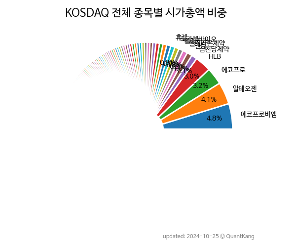

 
> **KOSDAQ 전체 종목별 시가총액 비중**

 
> **종목 목록**

| **종목** | **PER** | **PBR** | **DIV** | **비중** |
| :------- | ------: | ------: | ------: | -------: |
| 에코프로비엠 : 96.7 | 20.0 | 0.2% | 6.8% |
| 에코프로 : 388.5 | 11.0 | 0.1% | 3.7% |
| 엘앤에프 : 23.3 | 5.0 | 0.3% | 1.8% |
| HLB : - | 9.1 | - | 1.5% |
| 알테오젠 : - | 26.2 | - | 1.0% |
| HPSP : 52.9 | 19.9 | 0.3% | 1.0% |
| 셀트리온제약 : 157.8 | 11.5 | - | 1.0% |
| 레인보우로보틱스 : 487.6 | 47.4 | - | 0.8% |
| 리노공업 : 27.9 | 6.5 | 1.4% | 0.8% |
| JYP Ent. : 41.2 | 9.3 | 0.4% | 0.8% |
| LS머트리얼즈 : 253.4 | 22.1 | 0.1% | 0.7% |
| 솔브레인 : 14.4 | 3.0 | 0.7% | 0.6% |
| 이오테크닉스 : 29.2 | 4.2 | 0.5% | 0.6% |
| 클래시스 : 29.6 | 9.7 | 0.3% | 0.6% |
| 동진쎄미켐 : 13.5 | 3.1 | 0.3% | 0.5% |
| 펄어비스 : - | 2.8 | - | 0.5% |
| 카카오게임즈 : - | 1.2 | - | 0.5% |
| 루닛 : - | 24.9 | - | 0.5% |
| 휴젤 : 33.3 | 2.4 | - | 0.5% |
| 에스엠 : 23.3 | 2.7 | 1.5% | 0.5% |
| 위메이드 : - | 4.8 | 1.4% | 0.5% |
| ISC : 33.3 | 5.2 | 0.7% | 0.4% |
| 엔켐 : 74.1 | 5.9 | - | 0.4% |
| 신성델타테크 : 99.7 | 10.3 | 0.2% | 0.4% |
| 원익IPS : 18.3 | 1.9 | 0.6% | 0.4% |
| 삼천당제약 : 266.4 | 9.0 | - | 0.4% |
| 주성엔지니어링 : 15.2 | 3.3 | 0.6% | 0.4% |
| 더블유씨피 : 23.7 | 1.6 | - | 0.4% |
| 메디톡스 : 37.6 | 3.1 | 0.5% | 0.4% |
| 레고켐바이오 : - | 5.7 | - | 0.3% |
| 스튜디오드래곤 : 26.8 | 2.0 | - | 0.3% |
| CJ ENM : - | 0.4 | - | 0.3% |
| 하나마이크론 : 420.4 | 5.0 | 0.2% | 0.3% |
| 나노신소재 : 59.6 | 5.8 | 0.2% | 0.3% |
| 동화기업 : 30.4 | 1.8 | - | 0.3% |
| 파크시스템스 : 45.4 | 10.7 | 0.2% | 0.3% |
| 티씨케이 : 13.6 | 3.1 | 1.6% | 0.3% |
| 아프리카TV : 19.8 | 4.9 | 0.7% | 0.3% |
| 케어젠 : 40.7 | 5.2 | 2.4% | 0.3% |
| 파마리서치 : 28.8 | 3.4 | 0.6% | 0.3% |
| 심텍 : 4.9 | 2.0 | 1.3% | 0.3% |
| HK이노엔 : 31.4 | 1.0 | 0.8% | 0.3% |
| 대주전자재료 : 1150.8 | 9.6 | 0.1% | 0.3% |
| 성일하이텍 : 25.7 | 4.0 | - | 0.3% |
| 씨젠 : 6.2 | 1.0 | 3.6% | 0.3% |
| 파라다이스 : 42.7 | 0.8 | - | 0.3% |
| 에스티팜 : 63.3 | 3.4 | 0.8% | 0.3% |
| 레이크머티리얼즈 : 41.3 | 13.0 | - | 0.3% |
| 고영 : 27.5 | 3.5 | 0.9% | 0.3% |
| 파두 : - | 22.5 | - | 0.3% |
| 메지온 : - | 37.3 | - | 0.3% |
| 하나머티리얼즈 : 12.9 | 3.5 | 1.1% | 0.3% |
| 포스코엠텍 : 216.4 | 9.1 | 0.2% | 0.3% |
| HLB생명과학 : - | 4.4 | - | 0.3% |
| 덕산네오룩스 : 26.6 | 3.2 | - | 0.3% |
| 에스에프에이 : 13.0 | 0.9 | 3.0% | 0.3% |
| 에이비엘바이오 : 316.4 | 14.6 | - | 0.3% |
| SFA반도체 : 23.4 | 2.2 | - | 0.3% |
| 유진테크 : 25.7 | 3.0 | 0.6% | 0.3% |
| 넥슨게임즈 : 135.3 | 4.0 | - | 0.2% |
| 차바이오텍 : - | 3.3 | - | 0.2% |
| 에코프로에이치엔 : 29.5 | 11.0 | 1.0% | 0.2% |
| 현대바이오 : - | 16.2 | - | 0.2% |
| 천보 : 25.1 | 2.7 | 0.5% | 0.2% |
| 피엔티 : 15.3 | 3.8 | 0.2% | 0.2% |
| 솔브레인홀딩스 : 14.2 | 0.8 | 0.4% | 0.2% |
| 기가비스 : 26.6 | 7.7 | 1.0% | 0.2% |
| 제주반도체 : 37.2 | 6.2 | - | 0.2% |
| 에스앤에스텍 : 50.1 | 4.6 | 0.4% | 0.2% |
| 두산테스나 : 17.0 | 2.5 | 0.3% | 0.2% |
| 엠로 : 133.2 | 17.0 | - | 0.2% |
| 코오롱티슈진 : - | - | - | 0.2% |
| 원익QnC : 15.4 | 2.2 | 0.5% | 0.2% |
| 하림지주 : 2.7 | 0.2 | 1.6% | 0.2% |
| 제이시스메디칼 : 27.7 | 9.5 | - | 0.2% |
| 와이지엔터테인먼트 : 23.3 | 1.9 | 0.6% | 0.2% |
| 동국제약 : 14.5 | 1.5 | 1.0% | 0.2% |
| 오스코텍 : - | 6.0 | - | 0.2% |
| 원텍 : 54.4 | 13.2 | - | 0.2% |
| 인텔리안테크 : 40.6 | 3.6 | 0.1% | 0.2% |
| 에스피지 : 37.8 | 3.5 | 0.6% | 0.2% |
| 서진시스템 : 466.3 | 1.4 | - | 0.2% |
| 디어유 : 43.3 | 5.3 | - | 0.2% |
| 가온칩스 : 156.7 | 13.7 | - | 0.2% |
| 씨앤씨인터내셔널 : 45.0 | 5.5 | - | 0.2% |
| 제이오 : - | 9.9 | - | 0.2% |
| 한글과컴퓨터 : 15.5 | 2.3 | - | 0.2% |
| 아이센스 : 45.4 | 2.6 | 1.3% | 0.2% |
| 큐렉소 : - | 8.5 | - | 0.2% |
| 바이오니아 : 60.4 | 3.1 | - | 0.2% |
| 씨아이에스 : 53.3 | 4.6 | - | 0.2% |
| 안랩 : 43.1 | 2.4 | 1.6% | 0.2% |
| 넥스틴 : 15.4 | 6.8 | 0.7% | 0.2% |
| 이엠텍 : 19.2 | 2.6 | 0.4% | 0.2% |
| 시노펙스 : 80.1 | 6.7 | - | 0.2% |
| 위지윅스튜디오 : - | 3.8 | - | 0.2% |
| 메가스터디교육 : 6.6 | 1.6 | 3.6% | 0.2% |
| 보로노이 : - | 17.1 | - | 0.2% |
| 윤성에프앤씨 : 22.4 | 4.9 | 0.2% | 0.2% |
| 커넥트웨이브 : 61.8 | 0.9 | - | 0.2% |
| 케이엠더블유 : - | 2.8 | - | 0.2% |
| 코미코 : 14.9 | 2.4 | 1.6% | 0.2% |
| 성우하이텍 : 16.7 | 0.6 | 1.2% | 0.2% |
| 칩스앤미디어 : 59.9 | 14.0 | 0.6% | 0.2% |
| 제이앤티씨 : - | 1.9 | - | 0.2% |
| 지씨셀 : 24.0 | 1.1 | 0.9% | 0.2% |
| 유티아이 : - | 12.9 | - | 0.2% |
| 스마트솔루션즈 : - | - | - | 0.2% |
| 피에스케이 : 8.0 | 1.7 | 1.9% | 0.2% |
| 아이티엠반도체 : - | 2.9 | - | 0.2% |
| 서울반도체 : - | 0.8 | 2.1% | 0.2% |
| 펩트론 : - | 11.3 | - | 0.2% |
| 아난티 : 18.3 | 1.1 | - | 0.2% |
| 카페24 : - | 4.0 | - | 0.1% |
| 엘앤씨바이오 : 130.0 | 6.0 | 0.2% | 0.1% |
| 피에스케이홀딩스 : 13.8 | 2.0 | 1.8% | 0.1% |
| 셀바스AI : 75.6 | 9.3 | - | 0.1% |
| 이녹스첨단소재 : 6.7 | 1.5 | 1.6% | 0.1% |
| 케이아이엔엑스 : 22.7 | 4.0 | 0.5% | 0.1% |
| 클리오 : 53.9 | 2.9 | 0.6% | 0.1% |
| 네오위즈 : 41.2 | 1.2 | - | 0.1% |
| 브이티 : 46.2 | 6.6 | - | 0.1% |
| 에이직랜드 : 55.4 | 89.5 | - | 0.1% |
| 웹젠 : 6.5 | 0.8 | 2.3% | 0.1% |
| 컴투스 : 15.4 | 0.4 | 3.0% | 0.1% |
| 실리콘투 : 48.6 | 5.6 | - | 0.1% |
| 테크윙 : 16.5 | 2.2 | 0.9% | 0.1% |
| 인탑스 : 5.2 | 0.8 | 2.7% | 0.1% |
| 다원시스 : - | 2.6 | - | 0.1% |
| 신라젠 : - | 6.8 | - | 0.1% |
| 젬백스 : - | 3.9 | - | 0.1% |
| 와이아이케이 : 20.0 | 1.8 | - | 0.1% |
| 비올 : 45.2 | 13.4 | 0.1% | 0.1% |
| 우리기술투자 : - | 1.2 | - | 0.1% |
| 골프존 : 4.5 | 1.4 | 5.4% | 0.1% |
| 지노믹트리 : - | 4.1 | - | 0.1% |
| 코웰패션 : 8.0 | 1.0 | 3.3% | 0.1% |
| 오픈엣지테크놀로지 : - | 15.5 | - | 0.1% |
| 티에스이 : 9.9 | 1.7 | 1.1% | 0.1% |
| 다우데이타 : 2.5 | 0.4 | 2.3% | 0.1% |
| RFHIC : 176.9 | 1.8 | 0.5% | 0.1% |
| 콜마비앤에이치 : 12.2 | 1.2 | 1.8% | 0.1% |
| 프로텍 : 9.6 | 1.5 | 1.1% | 0.1% |
| 에프에스티 : 10.0 | 1.8 | 0.4% | 0.1% |
| 네오셈 : 40.6 | 6.5 | 0.3% | 0.1% |
| 바텍 : 6.3 | 1.4 | 0.3% | 0.1% |
| 파트론 : 11.6 | 0.9 | 3.7% | 0.1% |
| 네이처셀 : - | 8.1 | - | 0.1% |
| NHN KCP : 13.1 | 2.3 | 1.7% | 0.1% |
| 미래나노텍 : - | 1.8 | 0.4% | 0.1% |
| 탑머티리얼 : 35.7 | 4.9 | - | 0.1% |
| 엔케이맥스 : - | 5.2 | - | 0.1% |
| 하나기술 : 269.2 | 5.6 | - | 0.1% |
| 뷰노 : - | 20.2 | - | 0.1% |
| 텔레칩스 : 8.6 | 2.4 | 0.4% | 0.1% |
| 박셀바이오 : - | 16.4 | - | 0.1% |
| 네패스 : 5.8 | 1.8 | - | 0.1% |
| 퀄리타스반도체 : - | - | - | 0.1% |
| 이스트소프트 : - | 7.5 | - | 0.1% |
| 휴온스 : 19.6 | 1.6 | 1.6% | 0.1% |
| 에스티아이 : 14.0 | 1.9 | 0.9% | 0.1% |
| 에스티큐브 : - | 8.1 | - | 0.1% |
| 바디텍메드 : 17.4 | 2.5 | 0.8% | 0.1% |
| 에코아이 : 20.3 | 7.0 | 1.0% | 0.1% |
| 유진로봇 : 89.9 | 10.0 | - | 0.1% |
| 디앤씨미디어 : 69.0 | 5.7 | - | 0.1% |
| 코난테크놀로지 : - | 10.5 | - | 0.1% |
| 툴젠 : - | 6.0 | - | 0.1% |
| 데브시스터즈 : - | 2.1 | - | 0.1% |
| 뉴로메카 : - | 10.5 | - | 0.1% |
| 서부T&D : 26.5 | 0.6 | 0.7% | 0.1% |
| 월덱스 : 10.1 | 2.2 | 0.2% | 0.1% |
| 하림 : 83.8 | 1.4 | 0.5% | 0.1% |
| 현대무벡스 : 42.8 | 2.6 | 0.8% | 0.1% |
| HLB제약 : - | 4.4 | - | 0.1% |
| HB솔루션 : 9.2 | 2.7 | 2.5% | 0.1% |
| 코스메카코리아 : 156.0 | 2.8 | - | 0.1% |
| 티로보틱스 : - | 13.1 | - | 0.1% |
| 모트렉스 : 10.4 | 2.3 | 1.5% | 0.1% |
| 위메이드맥스 : 15.2 | 5.3 | - | 0.1% |
| 쏠리드 : 13.4 | 1.7 | 0.8% | 0.1% |
| 쎄트렉아이 : - | 2.7 | 0.2% | 0.1% |
| 바이오플러스 : 18.8 | 3.5 | 1.0% | 0.1% |
| 덕산테코피아 : 24.4 | 2.1 | - | 0.1% |
| 카나리아바이오 : - | 7.0 | - | 0.1% |
| 디아이티 : 41.2 | 2.2 | 1.4% | 0.1% |
| 로보티즈 : - | 4.3 | - | 0.1% |
| 테스 : 7.7 | 1.1 | 2.5% | 0.1% |
| 강원에너지 : 112.6 | 12.0 | - | 0.1% |
| 에이디테크놀로지 : 64.2 | 2.3 | - | 0.1% |
| 필에너지 : 73.5 | 11.1 | - | 0.1% |
| 인텍플러스 : 22.3 | 5.4 | 0.7% | 0.1% |
| KG ETS : 0.8 | 0.5 | 1.4% | 0.1% |
| 동운아나텍 : - | 16.3 | - | 0.1% |
| 에코앤드림 : 4728.6 | 4.3 | - | 0.1% |
| 인바디 : 10.6 | 1.7 | 1.1% | 0.1% |
| 큐로셀 : - | - | - | 0.1% |
| 이엔에프테크놀로지 : 8.0 | 1.0 | 0.6% | 0.1% |
| 마녀공장 : 18.6 | 6.2 | - | 0.1% |
| 유바이오로직스 : - | 3.0 | - | 0.1% |
| 티에프이 : 45.3 | 6.1 | - | 0.1% |
| 원익머트리얼즈 : 6.4 | 0.8 | 2.7% | 0.1% |
| 제넥신 : - | 1.1 | - | 0.1% |
| 인터로조 : 14.6 | 1.8 | 2.2% | 0.1% |
| 비츠로셀 : 14.9 | 1.8 | 1.2% | 0.1% |
| 티앤엘 : 17.3 | 3.4 | 1.0% | 0.1% |
| 슈어소프트테크 : - | - | - | 0.1% |
| 폴라리스오피스 : 24.9 | 5.5 | - | 0.1% |
| 새로닉스 : 4.0 | 1.8 | - | 0.1% |
| 솔트룩스 : - | 7.2 | - | 0.1% |
| 엘오티베큠 : 13.7 | 1.6 | 0.5% | 0.1% |
| 제이브이엠 : 21.6 | 2.2 | 1.0% | 0.1% |
| 인터플렉스 : 23.3 | 1.8 | - | 0.1% |
| 제룡전기 : 28.4 | 5.0 | 0.7% | 0.1% |
| 동성화인텍 : 39.9 | 2.3 | 3.0% | 0.1% |
| 네패스아크 : 13.7 | 1.4 | - | 0.1% |
| 켐트로닉스 : 55.5 | 2.3 | 0.9% | 0.1% |
| 한국기업평가 : 16.8 | 3.0 | 6.6% | 0.1% |
| 디오 : - | 2.0 | - | 0.1% |
| 태광 : 9.5 | 0.7 | 1.3% | 0.1% |
| 바이오다인 : 61.3 | 7.4 | - | 0.1% |
| 신흥에스이씨 : 17.9 | 1.1 | 0.8% | 0.1% |
| KG이니시스 : 5.7 | 0.8 | 3.3% | 0.1% |
| AP시스템 : 4.1 | 1.2 | 1.2% | 0.1% |
| 아미코젠 : - | 2.0 | - | 0.1% |
| 미래에셋벤처투자 : 5.4 | 1.0 | - | 0.1% |
| 인선이엔티 : 15.2 | 1.0 | - | 0.1% |
| 레이 : 41.0 | 2.7 | - | 0.1% |
| 한국정보통신 : 15.0 | 1.3 | - | 0.1% |
| 에이피티씨 : 10.8 | 2.5 | - | 0.1% |
| 자이언트스텝 : - | 2.8 | - | 0.1% |
| 상아프론테크 : 44.0 | 1.8 | 1.0% | 0.1% |
| 코엔텍 : 8.1 | 1.9 | 7.6% | 0.1% |
| 휴메딕스 : 12.9 | 1.9 | 1.7% | 0.1% |
| 파인엠텍 : - | 2.6 | - | 0.1% |
| 아주IB투자 : 158.2 | 1.3 | 0.7% | 0.1% |
| KH바텍 : 12.5 | 1.3 | 2.2% | 0.1% |
| 덕산하이메탈 : 53.1 | 1.1 | - | 0.1% |
| 비씨엔씨 : 29.7 | 4.2 | - | 0.1% |
| 삼표시멘트 : 10.6 | 0.5 | 3.0% | 0.1% |
| 성광벤드 : 8.0 | 0.7 | 0.9% | 0.1% |
| 로보스타 : 97.5 | 3.6 | - | 0.1% |
| 갤럭시아머니트리 : 59.1 | 2.8 | 0.6% | 0.1% |
| 하이록코리아 : 9.4 | 0.8 | 2.4% | 0.1% |
| 태웅 : 586.7 | 0.7 | - | 0.1% |
| 미래반도체 : 15.7 | 4.3 | - | 0.1% |
| 동국산업 : 46.7 | 0.8 | 2.2% | 0.1% |
| LB세미콘 : 7.9 | 1.2 | - | 0.1% |
| 매일유업 : 20.4 | 0.6 | 3.0% | 0.1% |
| 제이엘케이 : - | 17.4 | - | 0.1% |
| CMG제약 : - | 1.7 | - | 0.1% |
| 코오롱생명과학 : 145.7 | 1.8 | - | 0.1% |
| 넵튠 : - | 0.8 | - | 0.1% |
| 코미팜 : - | 5.1 | - | 0.1% |
| 모두투어 : - | 5.1 | - | 0.1% |
| 예스티 : - | 3.4 | - | 0.1% |
| 에코마케팅 : 8.0 | 1.6 | 3.3% | 0.1% |
| 케이티알파 : 25.0 | 1.3 | - | 0.1% |
| 큐알티 : 104.6 | 8.7 | 1.9% | 0.1% |
| 디알텍 : 40.3 | 4.0 | - | 0.1% |
| 엑세스바이오 : - | - | - | 0.1% |
| 펌텍코리아 : 15.3 | 1.4 | 1.5% | 0.1% |
| 알멕 : 37.3 | 3.0 | - | 0.1% |
| 새빗켐 : 33.3 | 4.7 | 0.5% | 0.1% |
| 잉글우드랩 : - | - | - | 0.1% |
| 아나패스 : - | 7.5 | - | 0.1% |
| 비즈니스온 : 26.8 | 4.3 | - | 0.1% |
| 유니테스트 : - | 2.0 | - | 0.1% |
| 서희건설 : 2.8 | 0.4 | 3.5% | 0.1% |
| 파워로직스 : - | 1.7 | - | 0.1% |
| 미코 : - | 2.0 | - | 0.1% |
| 다날 : - | 0.9 | - | 0.1% |
| 티엘비 : 9.6 | 2.6 | 1.0% | 0.1% |
| 석경에이티 : 67.5 | 9.7 | - | 0.1% |
| 컨텍 : - | - | - | 0.1% |
| 국전약품 : 32.4 | 3.2 | - | 0.1% |
| HLB테라퓨틱스 : - | 2.2 | - | 0.1% |
| 에이스침대 : 4.9 | 0.4 | 5.1% | 0.1% |
| 넥스트칩 : - | 7.0 | - | 0.1% |
| CJ프레시웨이 : 5.8 | 0.9 | 1.4% | 0.1% |
| 뷰웍스 : 9.9 | 1.3 | 2.4% | 0.1% |
| 한빛레이저 : - | - | - | 0.1% |
| 샘씨엔에스 : 18.4 | 2.5 | - | 0.1% |
| 하이비젼시스템 : 10.8 | 1.3 | 0.6% | 0.1% |
| 한솔아이원스 : 8.9 | 1.8 | - | 0.1% |
| 휴림로봇 : - | 4.6 | - | 0.1% |
| 알서포트 : 65.6 | 3.2 | 0.4% | 0.1% |
| 휴온스글로벌 : - | 0.6 | 2.2% | 0.1% |
| 드림어스컴퍼니 : 7.7 | 1.3 | - | 0.1% |
| 에이프릴바이오 : - | 4.0 | - | 0.1% |
| 원익피앤이 : 5910.0 | 2.0 | - | 0.1% |
| 큐리옥스바이오시스템즈 : - | 5.2 | - | 0.1% |
| 한양이엔지 : 3.8 | 0.6 | 3.9% | 0.1% |
| 디이엔티 : - | 9.5 | - | 0.1% |
| 나스미디어 : 10.1 | 1.3 | 2.9% | 0.1% |
| 큐브엔터 : 44.8 | 7.1 | - | 0.1% |
| 원준 : 17.9 | 2.4 | 1.1% | 0.1% |
| 플리토 : - | 22.6 | - | 0.1% |
| 에스에이엠티 : 4.6 | 0.7 | 8.4% | 0.1% |
| 메드팩토 : - | 6.0 | - | 0.1% |
| 코어라인소프트 : - | - | - | 0.1% |
| 동원개발 : 3.3 | 0.3 | 5.4% | 0.1% |
| 밀리의서재 : 14.8 | 28.1 | - | 0.1% |
| 코윈테크 : 51.1 | 2.0 | 0.4% | 0.1% |
| 글로벌텍스프리 : - | 3.0 | - | 0.1% |
| 나노팀 : 58.0 | 13.2 | - | 0.1% |
| 미래컴퍼니 : 8.2 | 1.8 | 1.0% | 0.1% |
| 메디포스트 : 47.0 | 0.8 | - | 0.1% |
| 오로스테크놀로지 : - | 4.3 | - | 0.1% |
| 톱텍 : 17.4 | 0.8 | 1.4% | 0.1% |
| 제테마 : 181.7 | 4.7 | - | 0.1% |
| 랩지노믹스 : 5.0 | 1.2 | - | 0.1% |
| 프레스티지바이오로직스 : - | 2.6 | - | 0.1% |
| 바이넥스 : 20.6 | 1.3 | - | 0.1% |
| 대명에너지 : 9.6 | 2.5 | - | 0.1% |
| 에스비비테크 : - | 11.5 | - | 0.1% |
| 싸이토젠 : - | 37.0 | - | 0.1% |
| 선익시스템 : - | 3.0 | - | 0.1% |
| 이랜텍 : 4.8 | 1.0 | 1.4% | 0.1% |
| 엠케이전자 : - | 0.6 | 0.8% | 0.1% |
| 비에이치아이 : - | 4.4 | - | 0.1% |
| LS마린솔루션 : - | 2.2 | 0.3% | 0.1% |
| 토비스 : - | 1.4 | 0.6% | 0.1% |
| 감성코퍼레이션 : 15.9 | 5.0 | - | 0.1% |
| 하이드로리튬 : - | 2.2 | - | 0.1% |
| 비나텍 : 22.3 | 4.2 | - | 0.1% |
| 씨에스베어링 : - | 2.9 | - | 0.1% |
| 유진기업 : 8.2 | 0.3 | 5.1% | 0.1% |
| AP위성 : 59.4 | 2.8 | 0.4% | 0.1% |
| 코아스템켐온 : - | 4.0 | - | 0.1% |
| 비덴트 : - | 0.3 | - | 0.1% |
| 지아이이노베이션 : - | 4.8 | - | 0.1% |
| 아이패밀리에스씨 : 32.8 | 5.0 | 0.2% | 0.1% |
| 인트론바이오 : 44.6 | 2.3 | - | 0.1% |
| 라온텍 : 373.9 | 28.7 | - | 0.1% |
| 노바텍 : 14.6 | 1.9 | 0.8% | 0.1% |
| 에치에프알 : 3.7 | 1.4 | - | 0.1% |
| 디엔에프 : 43.5 | 1.7 | 0.9% | 0.1% |
| 원익홀딩스 : 2.4 | 0.2 | - | 0.1% |
| 케이알엠 : - | 3.6 | - | 0.1% |
| 유비쿼스홀딩스 : 15.1 | 1.0 | 1.9% | 0.1% |
| 가비아 : 11.0 | 2.0 | 0.4% | 0.1% |
| 유니셈 : 12.1 | 1.2 | 1.2% | 0.1% |
| 해성산업 : 7.9 | 0.2 | 3.0% | 0.1% |
| 피엔에이치테크 : 30.2 | 8.0 | - | 0.1% |
| 이트론 : - | 2.4 | - | 0.1% |
| 셀리버리 : - | 22.7 | - | 0.1% |
| 나무가 : 7.1 | 2.0 | - | 0.1% |
| 코나아이 : 6.5 | 1.5 | - | 0.1% |
| 딥노이드 : - | 21.3 | - | 0.1% |
| 올릭스 : - | 3.1 | - | 0.1% |
| GST : 5.0 | 1.2 | 1.2% | 0.1% |
| BGF에코머티리얼즈 : 4.2 | 0.7 | 2.2% | 0.1% |
| 한국비엔씨 : - | 1.3 | - | 0.1% |
| 대아티아이 : 28.8 | 2.2 | - | 0.1% |
| YTN : 43.8 | 0.9 | 1.0% | 0.1% |
| 디와이피엔에프 : - | 2.0 | 0.4% | 0.1% |
| 한국전자금융 : 25.0 | 1.2 | 1.6% | 0.1% |
| 덱스터 : - | 4.4 | - | 0.1% |
| 한양디지텍 : 6.3 | 1.9 | - | 0.1% |
| 이베스트투자증권 : 10.5 | 0.2 | 2.3% | 0.1% |
| 아이디스 : 18.9 | 1.2 | 1.6% | 0.1% |
| 매커스 : 8.0 | 1.8 | 0.8% | 0.1% |
| 에브리봇 : 34.3 | 3.8 | - | 0.1% |
| 유비케어 : 64.2 | 2.0 | 1.3% | 0.1% |
| 그린리소스 : 52.7 | 8.9 | - | 0.1% |
| 유일로보틱스 : - | 5.7 | - | 0.1% |
| 시너지이노베이션 : 14.3 | 1.7 | - | 0.1% |
| 한국알콜 : 7.4 | 0.5 | 0.5% | 0.1% |
| 휴비츠 : 12.0 | 2.0 | 1.0% | 0.1% |
| GRT : - | - | - | 0.1% |
| 퓨런티어 : 110.9 | 5.9 | - | 0.1% |
| 삼목에스폼 : 3.5 | 0.5 | 0.6% | 0.1% |
| 쇼박스 : - | 1.7 | - | 0.1% |
| 스마트레이더시스템 : - | 22.0 | - | 0.1% |
| 마크로젠 : - | 1.2 | 1.4% | 0.1% |
| 중앙첨단소재 : - | 5.1 | - | 0.1% |
| 인트로메딕 : - | 14.8 | - | 0.1% |
| 휴마시스 : 1.2 | 0.6 | - | 0.1% |
| 대보마그네틱 : 10.0 | 2.7 | - | 0.1% |
| 하이딥 : - | 12.0 | - | 0.1% |
| 포인트모바일 : 37.8 | 4.8 | - | 0.1% |
| 세경하이테크 : 13.8 | 1.3 | - | 0.1% |
| 한국파마 : - | 3.8 | 0.2% | 0.1% |
| 헥토파이낸셜 : 17.5 | 1.5 | 2.1% | 0.1% |
| 쿠콘 : 61.5 | 1.8 | 0.4% | 0.1% |
| 신성에스티 : 18.9 | 4.8 | - | 0.1% |
| 엠에스오토텍 : 5.0 | 1.2 | 1.0% | 0.1% |
| KX : 10.2 | 0.8 | 3.4% | 0.1% |
| 에이스테크 : - | 2.4 | - | 0.1% |
| 네오위즈홀딩스 : - | 0.5 | - | 0.1% |
| 네오팜 : 12.6 | 1.5 | 2.6% | 0.1% |
| 컴투스홀딩스 : - | 0.7 | - | 0.1% |
| 지오릿에너지 : - | 4.5 | - | 0.1% |
| 티이엠씨 : 8.6 | 3.7 | - | 0.1% |
| HLB바이오스텝 : - | 2.9 | - | 0.1% |
| 와이더플래닛 : - | 19.1 | - | 0.1% |
| 더네이쳐홀딩스 : 3.2 | 0.8 | 2.6% | 0.1% |
| 이노와이어리스 : 14.6 | 1.5 | 1.2% | 0.1% |
| 어보브반도체 : 16.2 | 1.7 | 1.6% | 0.1% |
| 케이엔에스 : 32.4 | 7.4 | - | 0.1% |
| 세종텔레콤 : - | 0.9 | - | 0.1% |
| 노바렉스 : 9.7 | 1.2 | 1.3% | 0.1% |
| 아이쓰리시스템 : 34.7 | 2.7 | 0.6% | 0.1% |
| 씨티씨바이오 : 32.1 | 2.3 | - | 0.1% |
| 이녹스 : 14.5 | 1.0 | - | 0.1% |
| 뉴파워프라즈마 : 8.1 | 0.9 | 1.0% | 0.1% |
| HB테크놀러지 : 6.6 | 0.9 | 0.8% | 0.1% |
| 엠아이텍 : 11.2 | 2.6 | 1.8% | 0.1% |
| 한국정보인증 : 33.7 | 1.2 | 2.3% | 0.1% |
| 와이솔 : - | 0.6 | 3.3% | 0.1% |
| 블루엠텍 : - | 131.0 | - | 0.1% |
| 아바코 : 10.1 | 1.1 | 2.2% | 0.1% |
| 필옵틱스 : 110.6 | 2.1 | 0.4% | 0.1% |
| 사람인 : 6.8 | 1.2 | 3.9% | 0.1% |
| 양지사 : 148.1 | 1.0 | 0.4% | 0.1% |
| 진성티이씨 : 4.1 | 0.9 | 3.2% | 0.1% |
| 한일사료 : - | 3.9 | - | 0.1% |
| 퓨릿 : 14.9 | 4.4 | - | 0.1% |
| 상신이디피 : 8.4 | 1.7 | 0.8% | 0.1% |
| 피에이치씨 : - | 10.9 | - | 0.1% |
| 나이스정보통신 : 4.7 | 0.6 | 3.2% | 0.1% |
| 팅크웨어 : 52.3 | 1.1 | - | 0.1% |
| 조이시티 : 62.4 | 2.0 | - | 0.1% |
| 좋은사람들 : - | 3.8 | - | 0.1% |
| KG모빌리언스 : 7.0 | 0.6 | 4.2% | 0.1% |
| 에스와이 : 24.6 | 1.1 | - | 0.1% |
| 퓨쳐켐 : - | 2.9 | - | 0.1% |
| 지니뮤직 : 11.5 | 1.3 | - | 0.1% |
| 아바텍 : - | 1.3 | - | 0.1% |
| 아가방컴퍼니 : 19.5 | 1.2 | - | 0.1% |
| 우리기술 : 57.2 | 2.1 | - | 0.1% |
| CG인바이츠 : - | 1.0 | - | 0.1% |
| 파세코 : 21.9 | 1.9 | 2.0% | 0.1% |
| 티움바이오 : - | 3.2 | - | 0.1% |
| 비츠로테크 : 31.1 | 0.9 | 0.6% | 0.1% |
| 앱클론 : - | 5.4 | - | 0.1% |
| 레뷰코퍼레이션 : 1058.8 | 6.5 | - | 0.1% |
| 고바이오랩 : - | 2.4 | - | 0.1% |
| 아모그린텍 : 17.4 | 3.6 | - | 0.1% |
| 피에이치에이 : 6.9 | 0.3 | 2.1% | 0.0% |
| 멀티캠퍼스 : 6.6 | 1.2 | 2.4% | 0.0% |
| JTC : - | - | - | 0.0% |
| 티앤알바이오팹 : - | 5.0 | - | 0.0% |
| 이지홀딩스 : 17.3 | 0.4 | 2.5% | 0.0% |
| 상상인 : 4.1 | 0.3 | 2.8% | 0.0% |
| 이수앱지스 : - | 2.9 | - | 0.0% |
| 모다이노칩 : - | 0.6 | - | 0.0% |
| 아이티센 : 101.9 | 3.2 | - | 0.0% |
| 엑셈 : 22.0 | 2.0 | - | 0.0% |
| 경동제약 : 14.2 | 0.7 | 6.3% | 0.0% |
| 서울옥션 : 40.6 | 1.5 | 0.9% | 0.0% |
| 에이에스텍 : 58.1 | 27.9 | - | 0.0% |
| 브이원텍 : - | 1.8 | 0.8% | 0.0% |
| 브랜드엑스코퍼레이션 : 19.3 | 2.5 | 1.8% | 0.0% |
| 그래디언트 : 0.6 | 0.3 | 1.5% | 0.0% |
| 이브이첨단소재 : - | 1.7 | - | 0.0% |
| 알체라 : - | 5.6 | - | 0.0% |
| 세토피아 : - | 4.7 | - | 0.0% |
| 슈피겐코리아 : 5.7 | 0.4 | 1.8% | 0.0% |
| 코세스 : 24.4 | 3.2 | - | 0.0% |
| 에이엘티 : 10.9 | 2.4 | 0.5% | 0.0% |
| 엑시콘 : 11.7 | 1.3 | 0.6% | 0.0% |
| 팜스토리 : - | 0.9 | 1.5% | 0.0% |
| 서울바이오시스 : - | 2.0 | - | 0.0% |
| 제우스 : 15.8 | 2.0 | 1.9% | 0.0% |
| 크라우드웍스 : - | - | - | 0.0% |
| 에코플라스틱 : 6.7 | 1.0 | 1.1% | 0.0% |
| 녹원씨엔아이 : - | 3.2 | - | 0.0% |
| 엔피 : - | 5.9 | - | 0.0% |
| 크리스에프앤씨 : 6.5 | 0.5 | 3.1% | 0.0% |
| 보광산업 : 15.5 | 2.1 | 2.9% | 0.0% |
| 아비코전자 : 20.0 | 1.6 | 0.5% | 0.0% |
| 인카금융서비스 : 8.8 | 2.5 | 1.6% | 0.0% |
| 신테카바이오 : - | 5.3 | - | 0.0% |
| 동국S&C : - | 0.7 | - | 0.0% |
| 코아시아 : - | 2.7 | - | 0.0% |
| 흥구석유 : 67.8 | 2.2 | 1.2% | 0.0% |
| 이랜시스 : 34.9 | 4.3 | 0.8% | 0.0% |
| 일진파워 : 11.8 | 1.5 | 2.7% | 0.0% |
| 드림시큐리티 : 19.2 | 2.2 | - | 0.0% |
| 에이팩트 : 41.6 | 1.6 | - | 0.0% |
| 영풍정밀 : 11.9 | 0.5 | 3.4% | 0.0% |
| 한국캐피탈 : 2.9 | 0.4 | 4.8% | 0.0% |
| 헥토이노베이션 : 5.8 | 1.3 | 3.0% | 0.0% |
| 지앤비에스 에코 : 11.9 | 2.5 | - | 0.0% |
| 율호 : - | 2.7 | - | 0.0% |
| 크레버스 : 26.6 | 3.0 | 11.1% | 0.0% |
| 연우 : 493.7 | 0.7 | - | 0.0% |
| 나이벡 : - | 4.8 | - | 0.0% |
| 마음AI : - | 7.0 | - | 0.0% |
| 이화전기 : - | 0.5 | - | 0.0% |
| 헬릭스미스 : - | 0.7 | - | 0.0% |
| 고스트스튜디오 : - | - | - | 0.0% |
| 와이지-원 : 5.8 | 0.5 | 5.1% | 0.0% |
| 에이프로 : - | 3.0 | - | 0.0% |
| HLB이노베이션 : 8.1 | 3.1 | - | 0.0% |
| 디케이티 : 8.1 | 1.6 | - | 0.0% |
| 지투파워 : 229.3 | 5.7 | - | 0.0% |
| 위닉스 : 72.7 | 0.8 | 4.0% | 0.0% |
| 녹십자웰빙 : 22.4 | 1.9 | 1.0% | 0.0% |
| 케이엔솔 : 11.2 | 1.1 | 2.2% | 0.0% |
| 티에스아이 : 52.3 | 3.7 | - | 0.0% |
| 파로스아이바이오 : - | 9.0 | - | 0.0% |
| 에이치피오 : 15.3 | 1.2 | 0.9% | 0.0% |
| 와이엠티 : - | 1.4 | - | 0.0% |
| 스튜디오미르 : 90.3 | 6.8 | - | 0.0% |
| 오킨스전자 : 61.4 | 5.3 | - | 0.0% |
| 삼기이브이 : 18.6 | 3.4 | - | 0.0% |
| 슈프리마 : 9.6 | 0.9 | - | 0.0% |
| 텔레필드 : - | 7.1 | - | 0.0% |
| SM C&C : 31.8 | 1.6 | - | 0.0% |
| 엘앤케이바이오 : - | 10.6 | - | 0.0% |
| 켐트로스 : 45.5 | 3.0 | - | 0.0% |
| 윈스 : 8.2 | 0.9 | 4.0% | 0.0% |
| 맥스트 : - | 4.6 | - | 0.0% |
| 리튬포어스 : 1.2 | 0.9 | - | 0.0% |
| 스맥 : 13.2 | 1.8 | - | 0.0% |
| 티케이케미칼 : 0.6 | 0.2 | - | 0.0% |
| 태웅로직스 : 1.8 | 0.8 | 3.3% | 0.0% |
| 와이바이오로직스 : - | 11.7 | - | 0.0% |
| 엑스게이트 : 27.7 | 5.6 | - | 0.0% |
| 켄코아에어로스페이스 : 50.1 | 4.3 | - | 0.0% |
| 네오이뮨텍 : - | - | - | 0.0% |
| 범한퓨얼셀 : 67.0 | 1.6 | - | 0.0% |
| 3S : 117.5 | 3.7 | - | 0.0% |
| 셀바스헬스케어 : 56.4 | 4.5 | - | 0.0% |
| 포바이포 : - | 2.8 | - | 0.0% |
| 압타바이오 : - | 3.2 | - | 0.0% |
| 뉴프렉스 : 11.7 | 2.6 | - | 0.0% |
| 자람테크놀로지 : 231.4 | 7.6 | - | 0.0% |
| 우리바이오 : 7.4 | 0.9 | - | 0.0% |
| MDS테크 : - | 1.5 | - | 0.0% |
| 유비쿼스 : 7.8 | 1.2 | 2.6% | 0.0% |
| 동신건설 : 27.7 | 1.9 | 0.8% | 0.0% |
| 한스바이오메드 : 19.9 | 2.6 | - | 0.0% |
| DMS : 6.5 | 0.6 | 1.8% | 0.0% |
| 덕우전자 : 12.5 | 1.5 | 0.7% | 0.0% |
| DXVX : - | 4.7 | - | 0.0% |
| 와이엠텍 : 13.1 | 2.8 | 2.5% | 0.0% |
| 빅텍 : - | 2.7 | - | 0.0% |
| 청담글로벌 : 32.1 | 2.6 | - | 0.0% |
| 아이씨디 : - | 0.9 | 1.1% | 0.0% |
| 지놈앤컴퍼니 : - | 1.6 | - | 0.0% |
| 대한약품 : 6.6 | 0.7 | 2.4% | 0.0% |
| APS : 16.1 | 0.8 | - | 0.0% |
| 대화제약 : 138.9 | 2.0 | 1.7% | 0.0% |
| 엔젯 : 32.9 | 3.5 | - | 0.0% |
| 보성파워텍 : - | 2.0 | - | 0.0% |
| 동구바이오제약 : 24.2 | 1.6 | 1.9% | 0.0% |
| 다산네트웍스 : 0.8 | 0.4 | - | 0.0% |
| 스코넥 : - | 6.3 | - | 0.0% |
| 이크레더블 : 10.4 | 3.5 | 7.7% | 0.0% |
| 케이엔제이 : 16.3 | 3.0 | - | 0.0% |
| 지오엘리먼트 : 24.1 | 3.3 | 0.8% | 0.0% |
| 에이비프로바이오 : - | 1.1 | - | 0.0% |
| 오이솔루션 : - | 1.1 | 1.3% | 0.0% |
| 대원미디어 : 27.7 | 1.6 | 0.8% | 0.0% |
| LB루셈 : 13.1 | 0.8 | - | 0.0% |
| SAMG엔터 : - | 3.2 | - | 0.0% |
| 아진산업 : 4.9 | 0.7 | - | 0.0% |
| 부방 : 4.6 | 0.8 | - | 0.0% |
| 디지털대성 : 8.6 | 1.0 | 3.5% | 0.0% |
| 삼보판지 : 2.8 | 0.3 | 1.8% | 0.0% |
| 라파스 : - | 3.8 | - | 0.0% |
| 큐라클 : - | 3.4 | - | 0.0% |
| 애니플러스 : 28.5 | 1.9 | - | 0.0% |
| 하이로닉 : 46.8 | 2.3 | - | 0.0% |
| 아이텍 : 6.3 | 1.0 | - | 0.0% |
| 리파인 : 8.3 | 1.0 | - | 0.0% |
| 싸이맥스 : 18.8 | 1.0 | 2.1% | 0.0% |
| 우주일렉트로 : 11.2 | 0.6 | 1.8% | 0.0% |
| 엔비티 : - | 4.1 | - | 0.0% |
| 제이씨케미칼 : 7.5 | 1.0 | 2.3% | 0.0% |
| 제이스텍 : 4.7 | 0.9 | 2.2% | 0.0% |
| 미스터블루 : 49.4 | 2.3 | 0.5% | 0.0% |
| 풍원정밀 : 23.2 | 1.9 | - | 0.0% |
| 골프존뉴딘홀딩스 : 1.8 | 0.2 | 4.5% | 0.0% |
| 엔지켐생명과학 : - | 0.8 | - | 0.0% |
| 코렌텍 : 81.8 | 2.2 | - | 0.0% |
| 디티앤씨알오 : 23.1 | 3.2 | - | 0.0% |
| 엘티씨 : 57.1 | 1.5 | - | 0.0% |
| 퀀타피아 : - | 5.4 | - | 0.0% |
| HLB파나진 : 52.6 | 3.7 | - | 0.0% |
| 유니슨 : - | 2.2 | - | 0.0% |
| 레이언스 : 6.5 | 0.6 | 3.3% | 0.0% |
| 알에스오토메이션 : 172.2 | 3.6 | - | 0.0% |
| 비보존 제약 : - | 1.4 | - | 0.0% |
| 서플러스글로벌 : 5.5 | 0.8 | 1.2% | 0.0% |
| 금화피에스시 : 5.3 | 0.5 | 5.2% | 0.0% |
| 와이랩 : - | 10.7 | - | 0.0% |
| 심텍홀딩스 : 4.4 | 0.6 | 1.6% | 0.0% |
| 지어소프트 : - | 1.2 | - | 0.0% |
| 에이티넘인베스트 : 5.2 | 0.9 | 4.8% | 0.0% |
| 라온피플 : - | 2.7 | 0.7% | 0.0% |
| 리드코프 : 4.5 | 0.3 | 14.3% | 0.0% |
| 제이아이테크 : 11.1 | 2.4 | - | 0.0% |
| 제로투세븐 : 35.2 | 1.8 | - | 0.0% |
| 바이오솔루션 : - | 3.3 | - | 0.0% |
| 풍국주정 : 42.7 | 1.0 | 0.5% | 0.0% |
| 코스맥스엔비티 : - | 3.4 | - | 0.0% |
| 덴티스 : 108.1 | 4.5 | - | 0.0% |
| 에이비온 : - | 8.3 | - | 0.0% |
| SBI인베스트먼트 : - | 1.2 | - | 0.0% |
| 인크로스 : 8.9 | 1.3 | 3.4% | 0.0% |
| 홈센타홀딩스 : 10.8 | 1.0 | 0.9% | 0.0% |
| 한선엔지니어링 : 19.4 | 5.2 | - | 0.0% |
| 모베이스전자 : 20.2 | 0.8 | 0.5% | 0.0% |
| 특수건설 : 82.6 | 1.4 | - | 0.0% |
| 고려신용정보 : 13.2 | 3.6 | 3.3% | 0.0% |
| 더라미 : - | 2.6 | - | 0.0% |
| 동양이엔피 : 6.2 | 0.5 | 1.6% | 0.0% |
| 도이치모터스 : 3.8 | 0.4 | 7.9% | 0.0% |
| 케이옥션 : 34.6 | 1.1 | 0.7% | 0.0% |
| 에스코넥 : 27.8 | 2.5 | - | 0.0% |
| 워트 : 18.0 | 3.2 | - | 0.0% |
| 현대바이오랜드 : 29.6 | 1.1 | 0.7% | 0.0% |
| 라온시큐어 : 14.6 | 2.6 | - | 0.0% |
| 이루다 : 15.0 | 2.7 | - | 0.0% |
| 나인테크 : 3215.0 | 4.8 | - | 0.0% |
| 차백신연구소 : - | 4.1 | - | 0.0% |
| 휴맥스 : - | 0.5 | - | 0.0% |
| CJ 바이오사이언스 : - | 2.0 | - | 0.0% |
| 키이스트 : - | 2.4 | - | 0.0% |
| 꿈비 : 67.1 | 10.2 | - | 0.0% |
| 디에스케이 : - | 1.0 | - | 0.0% |
| 제노코 : 50.8 | 4.1 | 0.3% | 0.0% |
| 타이거일렉 : 38.4 | 2.5 | - | 0.0% |
| 야스 : - | 0.9 | - | 0.0% |
| 현대이지웰 : 9.1 | 1.5 | 1.4% | 0.0% |
| 센서뷰 : - | 8.1 | - | 0.0% |
| 모비스 : - | 5.8 | - | 0.0% |
| 한국경제TV : 9.2 | 0.8 | 2.7% | 0.0% |
| 아이에이 : - | 1.4 | - | 0.0% |
| 삼지전자 : 2.7 | 0.4 | 5.4% | 0.0% |
| 화일약품 : - | 0.8 | - | 0.0% |
| 안트로젠 : - | 1.3 | - | 0.0% |
| 아미노로직스 : - | 2.6 | - | 0.0% |
| KNN : 18.2 | 0.6 | 2.0% | 0.0% |
| 대양제지 : - | 0.7 | 0.8% | 0.0% |
| 아모센스 : - | 3.6 | - | 0.0% |
| 아이엠티 : - | 14.1 | - | 0.0% |
| 금양그린파워 : 13.1 | 1.6 | 3.1% | 0.0% |
| 유니트론텍 : 7.2 | 1.4 | 1.4% | 0.0% |
| 지니언스 : 17.5 | 2.6 | 1.1% | 0.0% |
| 테라젠이텍스 : 13.7 | 0.9 | - | 0.0% |
| 코센 : 28.2 | 4.0 | - | 0.0% |
| 아스플로 : 14.6 | 2.4 | - | 0.0% |
| 엠플러스 : - | 2.3 | - | 0.0% |
| 인스웨이브시스템즈 : 16.0 | 7.0 | - | 0.0% |
| 시스웍 : - | 2.6 | - | 0.0% |
| 초록뱀미디어 : - | 0.4 | - | 0.0% |
| 남화산업 : 6.4 | 0.8 | 4.7% | 0.0% |
| 와이엔텍 : 5.3 | 0.7 | 0.7% | 0.0% |
| 레드캡투어 : 5.9 | 0.6 | 5.9% | 0.0% |
| 케이엔더블유 : 5.4 | 1.2 | - | 0.0% |
| 하인크코리아 : - | 9.0 | 0.7% | 0.0% |
| SCI평가정보 : 54.3 | 4.3 | 1.4% | 0.0% |
| 씨싸이트 : - | - | - | 0.0% |
| 공구우먼 : 10.4 | 2.2 | 3.1% | 0.0% |
| 플래스크 : - | 1.8 | - | 0.0% |
| 엠투아이 : 12.3 | 1.8 | 3.2% | 0.0% |
| 엔바이오니아 : - | 6.0 | - | 0.0% |
| 크리스탈신소재 : - | - | - | 0.0% |
| 농우바이오 : 13.0 | 0.5 | 2.5% | 0.0% |
| 위메이드플레이 : - | 0.6 | - | 0.0% |
| 알에프텍 : 10.6 | 0.5 | - | 0.0% |
| 오성첨단소재 : 39.2 | 0.5 | - | 0.0% |
| 대한뉴팜 : 5.1 | 1.2 | 1.1% | 0.0% |
| 메가스터디 : 6.5 | 0.4 | 9.9% | 0.0% |
| 케이프 : 585.7 | 0.6 | 2.4% | 0.0% |
| 유비벨록스 : 41.4 | 1.2 | - | 0.0% |
| 삼보모터스 : 4.8 | 0.4 | 0.9% | 0.0% |
| 파라텍 : - | 1.0 | - | 0.0% |
| 코닉오토메이션 : - | 5.4 | - | 0.0% |
| 엑스페릭스 : 38.7 | 2.5 | - | 0.0% |
| 엠투엔 : 23.7 | 0.9 | - | 0.0% |
| 오리엔탈정공 : 14.8 | 1.5 | 1.8% | 0.0% |
| 라이온켐텍 : 14.0 | 1.0 | 5.8% | 0.0% |
| 웹케시 : 10.6 | 1.2 | - | 0.0% |
| 디알젬 : 8.4 | 1.6 | 2.9% | 0.0% |
| 이지케어텍 : - | 3.6 | - | 0.0% |
| 선바이오 : 135.1 | 5.2 | 0.5% | 0.0% |
| 에이스토리 : 29.2 | 2.0 | - | 0.0% |
| 아모텍 : - | 0.7 | - | 0.0% |
| 인피니트헬스케어 : 1002.0 | 1.1 | - | 0.0% |
| 트루엔 : 12.3 | 1.8 | - | 0.0% |
| 샌즈랩 : 44.4 | 39.8 | - | 0.0% |
| 푸른저축은행 : 4.8 | 0.3 | 8.0% | 0.0% |
| 동아화성 : 7.6 | 0.8 | 1.6% | 0.0% |
| 이오플로우 : - | 1.2 | - | 0.0% |
| 안국약품 : 15.4 | 0.7 | 2.4% | 0.0% |
| 우듬지팜 : - | - | - | 0.0% |
| NEW : - | 1.0 | - | 0.0% |
| 스톰테크 : 9.4 | 2.5 | - | 0.0% |
| 한컴위드 : 15.7 | 0.8 | - | 0.0% |
| 세운메디칼 : 11.5 | 1.0 | 2.2% | 0.0% |
| 휴센텍 : 8.5 | 3.0 | - | 0.0% |
| 일월지엠엘 : - | 47.8 | - | 0.0% |
| 비디아이 : - | - | - | 0.0% |
| 오션브릿지 : 8.1 | 1.2 | 3.5% | 0.0% |
| 솔본 : - | 0.9 | - | 0.0% |
| 유니테크노 : 24.3 | 1.0 | - | 0.0% |
| 중앙에너비스 : 170.9 | 1.5 | 1.7% | 0.0% |
| 지아이텍 : 18.4 | 2.1 | 1.1% | 0.0% |
| 유일에너테크 : 7.7 | 1.9 | - | 0.0% |
| 노을 : - | 7.6 | - | 0.0% |
| 현대공업 : 10.3 | 0.9 | 2.1% | 0.0% |
| 제이엔케이히터 : 16.4 | 1.0 | 2.0% | 0.0% |
| 파이버프로 : - | 4.0 | - | 0.0% |
| 광무 : - | 1.2 | - | 0.0% |
| DSC인베스트먼트 : 7.5 | 1.3 | - | 0.0% |
| 대정화금 : 8.6 | 0.8 | 2.4% | 0.0% |
| 비엠티 : 7.3 | 1.1 | 1.5% | 0.0% |
| 오파스넷 : 21.4 | 3.7 | 0.5% | 0.0% |
| 펨트론 : 41.1 | 9.1 | - | 0.0% |
| 이노시뮬레이션 : - | 7.0 | - | 0.0% |
| 우리산업 : - | 1.4 | 1.2% | 0.0% |
| 엘컴텍 : 15.1 | 1.6 | - | 0.0% |
| 제너셈 : 9.7 | 3.0 | 0.6% | 0.0% |
| 엠게임 : 5.2 | 1.2 | - | 0.0% |
| 시그네틱스 : 15.6 | 0.9 | - | 0.0% |
| 유아이엘 : 16.5 | 0.8 | - | 0.0% |
| 미래생명자원 : 111.0 | 2.7 | - | 0.0% |
| 예스24 : 82.5 | 0.6 | 4.3% | 0.0% |
| 이지바이오 : 12.8 | 2.3 | 2.2% | 0.0% |
| 인성정보 : 99.3 | 1.6 | - | 0.0% |
| 제이엔비 : - | - | - | 0.0% |
| 네온테크 : - | 2.5 | - | 0.0% |
| 수젠텍 : 4.1 | 0.8 | 2.2% | 0.0% |
| 인벤티지랩 : - | 3.8 | - | 0.0% |
| 신스틸 : 17.2 | 1.8 | - | 0.0% |
| 카이노스메드 : - | 4.5 | - | 0.0% |
| 코리아나 : 59.4 | 1.1 | - | 0.0% |
| 에스피시스템스 : 48.6 | 1.9 | - | 0.0% |
| 씨앤지하이테크 : 6.1 | 1.1 | 4.0% | 0.0% |
| 오비고 : - | 3.3 | - | 0.0% |
| 지에스이 : 19.6 | 1.3 | 1.0% | 0.0% |
| 아이디스홀딩스 : 2.5 | 0.4 | 2.2% | 0.0% |
| 와이어블 : 42.8 | 1.4 | 2.3% | 0.0% |
| 바이오에프디엔씨 : 26.9 | 2.1 | - | 0.0% |
| 자이글 : - | 2.7 | - | 0.0% |
| 오리콤 : 9.1 | 1.0 | 2.8% | 0.0% |
| 에이텍 : 20.6 | 1.2 | 1.4% | 0.0% |
| JW신약 : 80.4 | 2.0 | - | 0.0% |
| 에스퓨얼셀 : 133.2 | 1.6 | 0.3% | 0.0% |
| 바이브컴퍼니 : - | 9.1 | - | 0.0% |
| 오픈놀 : - | 4.6 | - | 0.0% |
| 선광 : 6.9 | 0.3 | 2.0% | 0.0% |
| 피씨엘 : - | 2.8 | - | 0.0% |
| 베노티앤알 : - | 1.6 | - | 0.0% |
| 큐리언트 : - | 2.4 | - | 0.0% |
| 세코닉스 : - | 1.0 | - | 0.0% |
| 기가레인 : - | 1.8 | - | 0.0% |
| 라온테크 : 14.9 | 4.0 | 0.6% | 0.0% |
| 옵트론텍 : - | 3.7 | - | 0.0% |
| 위더스제약 : 45.2 | 1.4 | - | 0.0% |
| SV인베스트먼트 : 32.4 | 1.6 | 1.0% | 0.0% |
| 나우IB : 13.3 | 1.2 | 1.5% | 0.0% |
| 씨씨에스 : 125.0 | 4.1 | - | 0.0% |
| 케이피에스 : - | 2.1 | - | 0.0% |
| 스피어파워 : - | 8.6 | - | 0.0% |
| 아이큐어 : - | 1.2 | - | 0.0% |
| 캠시스 : 17.6 | 1.1 | - | 0.0% |
| 와이씨켐 : 24.0 | 1.6 | 0.9% | 0.0% |
| 메디아나 : 10.5 | 1.2 | 0.7% | 0.0% |
| 트루윈 : - | 1.6 | - | 0.0% |
| 대원산업 : 3.0 | 0.3 | 3.2% | 0.0% |
| 에이테크솔루션 : 23.2 | 1.3 | - | 0.0% |
| LB인베스트먼트 : 24.6 | 1.0 | - | 0.0% |
| 비아이매트릭스 : 24.9 | 6.8 | - | 0.0% |
| 오스테오닉 : 107.0 | 2.4 | - | 0.0% |
| 태성 : - | 3.4 | - | 0.0% |
| 컴퍼니케이 : 17.1 | 1.4 | - | 0.0% |
| 티사이언티픽 : - | 0.5 | - | 0.0% |
| 현대에버다임 : 10.2 | 0.6 | 1.1% | 0.0% |
| 강스템바이오텍 : - | 1.7 | - | 0.0% |
| 테라사이언스 : 3.0 | 1.1 | - | 0.0% |
| 디스플레이텍 : 13.5 | 0.6 | 0.8% | 0.0% |
| 우수AMS : - | 1.5 | - | 0.0% |
| 와이팜 : - | 1.6 | - | 0.0% |
| 한성크린텍 : - | 0.8 | - | 0.0% |
| 엔브이에이치코리아 : - | 0.6 | 4.6% | 0.0% |
| 국순당 : - | 0.4 | 3.4% | 0.0% |
| 젬백스링크 : - | 0.6 | 0.8% | 0.0% |
| 로보로보 : - | 3.7 | - | 0.0% |
| 중앙백신 : 27.1 | 1.1 | 0.9% | 0.0% |
| 알비더블유 : 252.7 | 1.4 | - | 0.0% |
| 쎌바이오텍 : 9.6 | 0.7 | 3.9% | 0.0% |
| 정상제이엘에스 : 7.8 | 1.3 | 7.7% | 0.0% |
| 모델솔루션 : 12.3 | 1.7 | 1.8% | 0.0% |
| 피엔티엠에스 : - | 4.3 | - | 0.0% |
| 이큐셀 : 9.9 | 2.1 | - | 0.0% |
| 파수 : 20.1 | 3.3 | 1.1% | 0.0% |
| 대양전기공업 : - | 0.5 | - | 0.0% |
| 선진뷰티사이언스 : 5.4 | 1.6 | 0.2% | 0.0% |
| SBI핀테크솔루션즈 : - | - | - | 0.0% |
| 푸드나무 : - | 2.2 | 1.3% | 0.0% |
| 세아메카닉스 : 26.7 | 1.7 | - | 0.0% |
| 우리손에프앤지 : 4.2 | 0.4 | 3.3% | 0.0% |
| 서원인텍 : 4.6 | 0.5 | 7.0% | 0.0% |
| 로체시스템즈 : 5.1 | 1.0 | 0.7% | 0.0% |
| 대한광통신 : - | 1.0 | - | 0.0% |
| 와이엠씨 : 5.2 | 0.9 | 4.6% | 0.0% |
| 에스트래픽 : 3.1 | 1.5 | - | 0.0% |
| 유틸렉스 : - | 1.2 | - | 0.0% |
| 제일전기공업 : 14.3 | 0.9 | 2.1% | 0.0% |
| 브리지텍 : 30.1 | 2.0 | 1.7% | 0.0% |
| 노랑풍선 : - | 3.2 | - | 0.0% |
| 엔시스 : 29.5 | 1.8 | 0.6% | 0.0% |
| 액토즈소프트 : 39.9 | 0.5 | - | 0.0% |
| 메가터치 : 11.8 | 3.1 | - | 0.0% |
| 원티드랩 : 11.0 | 2.4 | - | 0.0% |
| 코리아에프티 : 11.1 | 0.7 | 2.1% | 0.0% |
| 영화테크 : 21.5 | 1.8 | 0.5% | 0.0% |
| 인포뱅크 : 69.7 | 1.6 | 0.2% | 0.0% |
| 진로발효 : 31.7 | 1.4 | 2.9% | 0.0% |
| 러셀 : 28.8 | 1.8 | 0.9% | 0.0% |
| 서남 : - | 11.9 | - | 0.0% |
| 메쎄이상 : - | 1.3 | - | 0.0% |
| 씨티케이 : - | 0.6 | 0.9% | 0.0% |
| 매일홀딩스 : 14.4 | 0.3 | 2.0% | 0.0% |
| 국보디자인 : 4.5 | 0.6 | 2.9% | 0.0% |
| 소마젠 : - | - | - | 0.0% |
| 한라IMS : 12.8 | 1.1 | 1.7% | 0.0% |
| 본느 : 44.8 | 3.5 | - | 0.0% |
| CNT85 : 35.3 | 2.4 | - | 0.0% |
| 폴라리스세원 : 40.0 | 0.7 | - | 0.0% |
| 국일제지 : - | 1.9 | - | 0.0% |
| 마이크로컨텍솔 : 14.5 | 2.1 | 0.6% | 0.0% |
| 디에이테크놀로지 : - | 1.0 | - | 0.0% |
| 에스엠코어 : 41.4 | 1.4 | 1.4% | 0.0% |
| KCC건설 : 21.4 | 0.2 | 3.2% | 0.0% |
| 인화정공 : - | 0.6 | - | 0.0% |
| 티라유텍 : - | 5.9 | - | 0.0% |
| 피제이전자 : 14.5 | 0.8 | 1.5% | 0.0% |
| 비아트론 : 6.1 | 0.6 | 1.8% | 0.0% |
| 버넥트 : - | 3.4 | - | 0.0% |
| 이노메트리 : 37.7 | 1.8 | - | 0.0% |
| 홈캐스트 : - | 1.0 | - | 0.0% |
| 아진엑스텍 : 59.1 | 2.2 | 0.7% | 0.0% |
| 옵티팜 : - | 3.5 | - | 0.0% |
| 케이에스피 : 25.9 | 3.0 | - | 0.0% |
| 케이피에프 : 4.0 | 0.5 | 2.9% | 0.0% |
| 엠벤처투자 : - | 1.9 | - | 0.0% |
| 위드텍 : 8.2 | 0.9 | 1.0% | 0.0% |
| 베뉴지 : - | 0.3 | 1.4% | 0.0% |
| 팸텍 : - | - | - | 0.0% |
| 빅솔론 : 7.8 | 0.5 | 7.6% | 0.0% |
| 한송네오텍 : - | 3.9 | - | 0.0% |
| 제노레이 : 7.0 | 1.1 | 2.3% | 0.0% |
| 포시에스 : 19.1 | 1.4 | 2.7% | 0.0% |
| 코텍 : 3.2 | 0.3 | 3.9% | 0.0% |
| 삼아제약 : 8.0 | 0.5 | 2.6% | 0.0% |
| 바이젠셀 : - | 1.1 | - | 0.0% |
| 이엠코리아 : - | 1.2 | - | 0.0% |
| 상보 : 11.4 | 1.5 | - | 0.0% |
| 디바이스이엔지 : 9.1 | 0.7 | 1.5% | 0.0% |
| 핑거 : 56.5 | 2.2 | 0.9% | 0.0% |
| 희림 : 12.6 | 1.4 | 2.1% | 0.0% |
| 피코그램 : 30.6 | 3.1 | - | 0.0% |
| 레몬 : - | 7.7 | - | 0.0% |
| 하이텍팜 : 16.8 | 1.0 | 0.8% | 0.0% |
| 제이씨현시스템 : 344.0 | 0.9 | - | 0.0% |
| 메타바이오메드 : 35.9 | 1.6 | 0.5% | 0.0% |
| 에스엔유 : 13.0 | 0.7 | - | 0.0% |
| 오브젠 : - | 741.2 | - | 0.0% |
| 프리엠스 : 66.4 | 1.5 | 0.3% | 0.0% |
| 애니젠 : - | 6.9 | - | 0.0% |
| 유니크 : 27.7 | 0.9 | 0.3% | 0.0% |
| 팬엔터테인먼트 : - | 1.3 | - | 0.0% |
| 비트컴퓨터 : 19.9 | 1.5 | 1.0% | 0.0% |
| 린드먼아시아 : 26.8 | 1.7 | 0.4% | 0.0% |
| 윈팩 : - | 1.3 | - | 0.0% |
| 에스와이스틸텍 : 12.6 | 3.4 | - | 0.0% |
| 위지트 : 5.8 | 0.6 | - | 0.0% |
| 참좋은여행 : - | 1.2 | - | 0.0% |
| 리메드 : 24.2 | 3.2 | - | 0.0% |
| EG : - | 1.5 | - | 0.0% |
| 대동기어 : 23.0 | 1.3 | 0.4% | 0.0% |
| 대봉엘에스 : 11.1 | 0.8 | 0.6% | 0.0% |
| 에스바이오메딕스 : - | - | - | 0.0% |
| 버킷스튜디오 : - | 0.6 | - | 0.0% |
| 바이오톡스텍 : 32.6 | 2.0 | - | 0.0% |
| 일승 : 39.9 | 2.9 | - | 0.0% |
| 화인써키트 : 22.7 | 2.6 | 6.0% | 0.0% |
| 대성창투 : 94.1 | 1.3 | - | 0.0% |
| 블리츠웨이 : - | 2.7 | - | 0.0% |
| 손오공 : - | 4.1 | - | 0.0% |
| 저스템 : 11.6 | 1.8 | - | 0.0% |
| 텔콘RF제약 : - | 1.1 | - | 0.0% |
| 서호전기 : 8.4 | 1.0 | 8.0% | 0.0% |
| 모비데이즈 : - | 2.4 | - | 0.0% |
| 이삭엔지니어링 : 46.2 | 2.0 | - | 0.0% |
| 금강철강 : 15.4 | 0.7 | 2.4% | 0.0% |
| 셀루메드 : - | 1.7 | - | 0.0% |
| 미투온 : 11.0 | 0.8 | - | 0.0% |
| 티비씨 : 18.2 | 0.7 | 1.6% | 0.0% |
| 센코 : 95.8 | 2.2 | - | 0.0% |
| 오르비텍 : - | 1.6 | - | 0.0% |
| 오상자이엘 : 12.0 | 1.4 | - | 0.0% |
| 아이씨에이치 : - | 1.4 | - | 0.0% |
| 녹십자엠에스 : - | 2.8 | - | 0.0% |
| 테고사이언스 : 353.0 | 1.9 | - | 0.0% |
| 트윔 : - | 1.4 | - | 0.0% |
| 유라테크 : 107.6 | 0.8 | 1.2% | 0.0% |
| 메카로 : 2.1 | 0.5 | 4.9% | 0.0% |
| 서한 : 2.4 | 0.2 | 5.4% | 0.0% |
| 아톤 : 5.1 | 1.3 | 0.5% | 0.0% |
| 에프엔에스테크 : 18.3 | 1.4 | 0.9% | 0.0% |
| 마이크로디지탈 : - | 16.3 | - | 0.0% |
| 탑엔지니어링 : - | 0.5 | - | 0.0% |
| 이노시스 : - | 1.6 | - | 0.0% |
| 핌스 : 49.6 | 1.6 | - | 0.0% |
| 나노엔텍 : 19.9 | 1.6 | - | 0.0% |
| 에스넷 : - | 1.1 | - | 0.0% |
| 나이스디앤비 : 6.8 | 1.1 | 3.0% | 0.0% |
| 하이소닉 : 98.4 | 5.4 | - | 0.0% |
| 큐에스아이 : 13.2 | 1.1 | 1.0% | 0.0% |
| 한싹 : 27.1 | 4.9 | - | 0.0% |
| 한국컴퓨터 : 5.2 | 0.7 | 4.3% | 0.0% |
| 데이타솔루션 : 38.5 | 3.0 | - | 0.0% |
| 케이사인 : 18.1 | 1.3 | 2.3% | 0.0% |
| 줌인터넷 : - | 2.9 | - | 0.0% |
| 대성하이텍 : 34.8 | 1.3 | - | 0.0% |
| 에이텀 : - | 34.3 | - | 0.0% |
| 나무기술 : 264.0 | 2.2 | - | 0.0% |
| 삼양옵틱스 : 11.1 | 2.5 | 10.0% | 0.0% |
| 광림 : - | 0.6 | - | 0.0% |
| 에스텍 : 7.4 | 0.5 | 3.6% | 0.0% |
| 모바일어플라이언스 : 43.1 | 2.0 | - | 0.0% |
| 우림피티에스 : 17.5 | 1.0 | 1.5% | 0.0% |
| 케일럼 : - | 1.4 | - | 0.0% |
| 신신제약 : 20.5 | 1.5 | 0.8% | 0.0% |
| RF머트리얼즈 : 26.1 | 2.0 | 0.9% | 0.0% |
| 머큐리 : 157.8 | 1.0 | - | 0.0% |
| 아이진 : - | 1.1 | - | 0.0% |
| 프로이천 : 19.3 | 2.7 | 0.6% | 0.0% |
| NE능률 : 19.6 | 1.0 | 1.1% | 0.0% |
| 스톤브릿지벤처스 : 11.9 | 1.0 | 8.2% | 0.0% |
| 에이루트 : 13.6 | 0.6 | - | 0.0% |
| SM Life Design : 35.7 | 1.7 | - | 0.0% |
| 코츠테크놀로지 : 25.6 | 3.6 | - | 0.0% |
| 한국전자인증 : 25.1 | 1.9 | 1.5% | 0.0% |
| 파멥신 : - | 3.0 | - | 0.0% |
| 덕신하우징 : 8.7 | 1.0 | 1.0% | 0.0% |
| 그린플러스 : - | 1.4 | - | 0.0% |
| 엠에스씨 : 4.8 | 0.7 | 1.2% | 0.0% |
| 앤디포스 : - | 0.6 | - | 0.0% |
| 코콤 : - | 0.7 | - | 0.0% |
| 세보엠이씨 : 3.5 | 0.4 | 6.0% | 0.0% |
| 제노포커스 : - | 3.6 | - | 0.0% |
| 한국선재 : 6.1 | 0.7 | 2.7% | 0.0% |
| 인포마크 : - | 1.8 | - | 0.0% |
| 오토앤 : - | 2.9 | - | 0.0% |
| 삼천리자전거 : - | 0.8 | - | 0.0% |
| 케이씨에스 : 104.5 | 4.7 | 1.9% | 0.0% |
| 피제이메탈 : 15.0 | 1.4 | 3.9% | 0.0% |
| 씨유박스 : - | 17.3 | - | 0.0% |
| 해성티피씨 : - | 2.0 | - | 0.0% |
| 마이크로투나노 : 12.3 | 2.7 | - | 0.0% |
| 엠아이큐브솔루션 : 19.2 | 12.0 | - | 0.0% |
| 제이티 : 7.5 | 1.4 | - | 0.0% |
| 코스텍시스 : 286.2 | 1.4 | - | 0.0% |
| 시공테크 : 11.8 | 0.7 | 0.5% | 0.0% |
| 에스씨디 : 10.3 | 0.7 | 2.0% | 0.0% |
| 에스제이그룹 : 2.9 | 0.7 | 5.8% | 0.0% |
| 나라엠앤디 : 8.6 | 0.9 | 1.2% | 0.0% |
| 디케이락 : 12.3 | 0.7 | 2.4% | 0.0% |
| 가온그룹 : 7.5 | 0.4 | 2.0% | 0.0% |
| 유신 : 4.7 | 0.8 | 2.6% | 0.0% |
| 자연과환경 : 210.2 | 1.2 | - | 0.0% |
| HRS : 8.3 | 0.8 | 3.8% | 0.0% |
| 프롬바이오 : 26.3 | 1.0 | - | 0.0% |
| 미디어젠 : - | 5.1 | - | 0.0% |
| 경창산업 : 4.1 | 0.7 | - | 0.0% |
| 현우산업 : 17.7 | 0.9 | 2.2% | 0.0% |
| 오픈베이스 : 14.2 | 1.1 | 0.6% | 0.0% |
| 알리코제약 : 10.3 | 0.9 | 2.4% | 0.0% |
| 신일제약 : 6.7 | 0.7 | 1.4% | 0.0% |
| 모아데이타 : 44.0 | 2.2 | - | 0.0% |
| 에코바이오 : - | 1.0 | - | 0.0% |
| YBM넷 : 10.9 | 1.7 | 2.9% | 0.0% |
| 다보링크 : - | 4.2 | - | 0.0% |
| 동일금속 : 5.6 | 0.5 | 4.3% | 0.0% |
| CSA 코스믹 : - | 17.3 | - | 0.0% |
| 창해에탄올 : 910.0 | 0.5 | 5.5% | 0.0% |
| 옵투스제약 : 16.4 | 0.6 | 1.9% | 0.0% |
| 이노뎁 : 147.7 | 2.1 | - | 0.0% |
| 흥국에프엔비 : 6.7 | 0.9 | 1.9% | 0.0% |
| 레이저쎌 : - | 2.3 | - | 0.0% |
| 씨앤투스 : 4.4 | 0.5 | 8.5% | 0.0% |
| 경남스틸 : 8.6 | 0.8 | 4.2% | 0.0% |
| 우리넷 : - | 1.3 | - | 0.0% |
| 캡스톤파트너스 : 10.5 | 3.0 | 0.2% | 0.0% |
| 아이엘사이언스 : 38.0 | 4.8 | - | 0.0% |
| 인지디스플레 : 20.9 | 0.4 | 2.7% | 0.0% |
| 액션스퀘어 : - | 2.4 | - | 0.0% |
| 우양 : - | 1.8 | - | 0.0% |
| 유성티엔에스 : 1.2 | 0.2 | - | 0.0% |
| KCI : 4.4 | 0.8 | 3.5% | 0.0% |
| 정다운 : 5.3 | 0.9 | 4.0% | 0.0% |
| 제이엠티 : 2.8 | 0.8 | 3.1% | 0.0% |
| 성호전자 : - | 0.9 | - | 0.0% |
| 디지틀조선 : 29.1 | 1.0 | 0.9% | 0.0% |
| 오하임앤컴퍼니 : 53.7 | 2.9 | - | 0.0% |
| 미코바이오메드 : - | 2.7 | - | 0.0% |
| FSN : - | 0.7 | - | 0.0% |
| 네오오토 : 10.3 | 0.8 | 1.0% | 0.0% |
| 아이비김영 : 299.0 | 2.1 | - | 0.0% |
| 웰크론 : 119.0 | 1.0 | - | 0.0% |
| 한일단조 : 11.0 | 0.7 | - | 0.0% |
| 큐라티스 : - | - | - | 0.0% |
| 이글루 : 10.6 | 1.1 | 2.5% | 0.0% |
| 코메론 : 5.0 | 0.4 | 2.8% | 0.0% |
| 삼기 : - | 0.7 | - | 0.0% |
| 코디 : - | 3.0 | - | 0.0% |
| 유진테크놀로지 : 40.5 | 3.3 | - | 0.0% |
| 힘스 : - | 1.2 | - | 0.0% |
| TJ미디어 : 17.8 | 0.9 | 4.0% | 0.0% |
| 티쓰리 : 5.4 | 0.8 | 5.1% | 0.0% |
| 삼화네트웍스 : 5.3 | 1.3 | - | 0.0% |
| 시큐레터 : - | 9.7 | - | 0.0% |
| 액트로 : - | 1.2 | 1.3% | 0.0% |
| 클리노믹스 : - | 1.1 | - | 0.0% |
| 엔에프씨 : 42.2 | 1.4 | 0.2% | 0.0% |
| PN풍년 : 41.8 | 1.6 | 0.3% | 0.0% |
| 에프앤가이드 : 9.7 | 1.4 | 2.8% | 0.0% |
| 원익큐브 : 18.4 | 0.8 | - | 0.0% |
| 서린바이오 : 8.1 | 0.9 | 1.4% | 0.0% |
| 포인트엔지니어링 : 96.6 | 1.0 | 0.7% | 0.0% |
| 아이에스이커머스 : - | 1.4 | - | 0.0% |
| 에스텍파마 : - | 0.7 | 1.5% | 0.0% |
| 케어랩스 : - | 0.9 | - | 0.0% |
| 모니터랩 : 73.2 | 4.3 | - | 0.0% |
| 티플랙스 : 5.0 | 0.5 | 0.9% | 0.0% |
| 에이치엘사이언스 : 47.4 | 0.7 | - | 0.0% |
| 이라이콤 : - | 0.4 | 4.7% | 0.0% |
| 지니너스 : - | 1.8 | - | 0.0% |
| 에이텍모빌리티 : 17.4 | 1.4 | 0.7% | 0.0% |
| 애머릿지 : - | - | - | 0.0% |
| 동우팜투테이블 : 4.7 | 0.4 | - | 0.0% |
| 우리로 : - | 1.5 | - | 0.0% |
| 쏘닉스 : - | 2.6 | - | 0.0% |
| 링크제니시스 : 38.9 | 1.8 | - | 0.0% |
| 보라티알 : 4.3 | 1.0 | 2.6% | 0.0% |
| CBI : - | 1.1 | - | 0.0% |
| 퀀타매트릭스 : - | 1.9 | - | 0.0% |
| 소니드 : - | 0.6 | - | 0.0% |
| 씨이랩 : - | 3.6 | - | 0.0% |
| 플래티어 : 19.1 | 1.6 | - | 0.0% |
| 동아엘텍 : 47.4 | 0.4 | 2.8% | 0.0% |
| 한빛소프트 : 37.5 | 4.0 | - | 0.0% |
| 피엔케이피부임상연구센타 : 10.6 | 1.1 | 1.4% | 0.0% |
| 에프엔씨엔터 : - | 1.6 | - | 0.0% |
| 제놀루션 : 4.8 | 0.7 | - | 0.0% |
| 램테크놀러지 : 12.3 | 1.4 | - | 0.0% |
| 아스타 : - | 10.4 | - | 0.0% |
| 나라셀라 : 5.9 | 1.2 | - | 0.0% |
| 웨이버스 : - | 2.8 | - | 0.0% |
| 라이콤 : - | 1.3 | - | 0.0% |
| 아셈스 : 10.5 | 1.3 | - | 0.0% |
| 삼현철강 : 4.6 | 0.4 | 6.2% | 0.0% |
| 푸른기술 : 377.1 | 2.2 | 0.2% | 0.0% |
| 오로라 : 9.8 | 0.6 | 1.7% | 0.0% |
| 잉크테크 : 19.1 | 1.1 | - | 0.0% |
| 알피바이오 : 14.1 | 0.8 | - | 0.0% |
| 파이오링크 : 6.0 | 1.0 | 2.7% | 0.0% |
| 이글벳 : 27.7 | 1.7 | 0.7% | 0.0% |
| 고려제약 : 6.2 | 0.9 | 2.6% | 0.0% |
| 영림원소프트랩 : 10.4 | 1.7 | 1.5% | 0.0% |
| 모베이스 : 4.0 | 0.2 | 2.2% | 0.0% |
| 모비릭스 : 13.2 | 0.9 | - | 0.0% |
| 스페코 : 97.9 | 1.6 | - | 0.0% |
| 구영테크 : 17.1 | 0.8 | 1.1% | 0.0% |
| 웨이브일렉트로 : - | 1.1 | - | 0.0% |
| 피플바이오 : - | 13.3 | - | 0.0% |
| 나래나노텍 : 28.9 | 0.7 | 1.5% | 0.0% |
| 수성샐바시온 : - | 1.1 | - | 0.0% |
| 테크엘 : - | 0.9 | - | 0.0% |
| 픽셀플러스 : 230.8 | 0.7 | 0.6% | 0.0% |
| 드림씨아이에스 : 16.0 | 1.5 | - | 0.0% |
| 자비스 : 158.7 | 5.8 | - | 0.0% |
| 아스트 : - | 0.4 | - | 0.0% |
| 팬젠 : - | 4.2 | - | 0.0% |
| 에스앤디 : 7.4 | 0.9 | 1.7% | 0.0% |
| 에코캡 : - | 0.8 | - | 0.0% |
| 핸디소프트 : 69.6 | 1.1 | - | 0.0% |
| 대창솔루션 : - | 2.7 | - | 0.0% |
| 큐로컴 : - | 1.6 | - | 0.0% |
| 지엔씨에너지 : 2.6 | 0.6 | 1.1% | 0.0% |
| 대모 : 56.3 | 1.5 | 1.0% | 0.0% |
| 진양제약 : 5.4 | 0.8 | 2.5% | 0.0% |
| 슈프리마에이치큐 : 5.2 | 0.4 | - | 0.0% |
| 탑코미디어 : - | 1.5 | - | 0.0% |
| SDN : 92.0 | 0.7 | - | 0.0% |
| 미래에셋드림스팩1호 : - | - | - | 0.0% |
| 이엠넷 : 10.5 | 0.8 | 2.8% | 0.0% |
| 코퍼스코리아 : - | 1.4 | 0.5% | 0.0% |
| 위세아이텍 : 15.5 | 2.1 | 1.5% | 0.0% |
| 케이피엠테크 : - | 0.7 | - | 0.0% |
| 전진바이오팜 : - | 6.9 | - | 0.0% |
| 바이오스마트 : 88.7 | 0.7 | - | 0.0% |
| 남화토건 : 3.6 | 0.4 | 3.3% | 0.0% |
| 대림제지 : 2.9 | 0.3 | 1.3% | 0.0% |
| NHN벅스 : 25.7 | 0.9 | - | 0.0% |
| 에스에이티 : 7.8 | 0.7 | 1.8% | 0.0% |
| 신화인터텍 : - | 0.8 | - | 0.0% |
| 샤페론 : - | 2.4 | - | 0.0% |
| 서진오토모티브 : 9.4 | 0.8 | - | 0.0% |
| 제이스코홀딩스 : - | 0.9 | - | 0.0% |
| 유에스티 : 5.6 | 1.0 | 3.3% | 0.0% |
| iMBC : 42.2 | 1.3 | - | 0.0% |
| SG : 18.0 | 0.7 | - | 0.0% |
| 삼보산업 : - | 2.6 | - | 0.0% |
| CNH : - | 0.6 | 1.0% | 0.0% |
| 인산가 : 15.7 | 1.1 | 2.2% | 0.0% |
| 지엘팜텍 : - | 4.4 | - | 0.0% |
| 디에이피 : 6.0 | 0.4 | - | 0.0% |
| KX하이텍 : 4.5 | 0.6 | - | 0.0% |
| 인포바인 : 7.8 | 0.5 | 4.1% | 0.0% |
| 조광ILI : - | 0.8 | - | 0.0% |
| 플레이디 : 14.2 | 0.9 | - | 0.0% |
| 제룡산업 : 7.6 | 0.9 | 4.3% | 0.0% |
| 에너토크 : 89.4 | 1.5 | 0.7% | 0.0% |
| 에이프로젠 H&G : - | 0.1 | - | 0.0% |
| 젠큐릭스 : - | 6.3 | - | 0.0% |
| 링네트 : 5.6 | 0.7 | - | 0.0% |
| 오텍 : - | 0.6 | 2.9% | 0.0% |
| 효성오앤비 : 52.4 | 0.9 | - | 0.0% |
| 에이치와이티씨 : 29.9 | 1.2 | - | 0.0% |
| KBG : 19.8 | 1.8 | 1.7% | 0.0% |
| 비트나인 : - | 2.0 | - | 0.0% |
| 수산아이앤티 : 27.7 | 0.8 | 1.2% | 0.0% |
| 피에스텍 : - | 0.5 | 5.6% | 0.0% |
| 와이즈버즈 : 30.3 | 1.5 | 1.5% | 0.0% |
| 대원 : 3.5 | 0.2 | 5.9% | 0.0% |
| 씨엔알리서치 : 17.1 | 1.9 | - | 0.0% |
| 쎄노텍 : - | 1.7 | - | 0.0% |
| 제일테크노스 : 5.8 | 0.8 | 1.6% | 0.0% |
| 플라즈맵 : - | 6.3 | - | 0.0% |
| 산돌 : 5.9 | 1.2 | 2.1% | 0.0% |
| 하츠 : 13.8 | 0.6 | 1.3% | 0.0% |
| 엘엠에스 : 171.8 | 0.4 | 2.6% | 0.0% |
| 진영 : 9.5 | 2.3 | - | 0.0% |
| 코데즈컴바인 : 8.8 | 1.1 | - | 0.0% |
| 내츄럴엔도텍 : - | 1.9 | - | 0.0% |
| 에이치시티 : 12.1 | 0.9 | - | 0.0% |
| 웨스트라이즈 : - | 8.0 | - | 0.0% |
| 에코볼트 : - | 0.3 | - | 0.0% |
| 토마토시스템 : 10.9 | 4.3 | - | 0.0% |
| 브레인즈컴퍼니 : 13.0 | 1.5 | 0.7% | 0.0% |
| 일신바이오 : 16.8 | 1.2 | 0.5% | 0.0% |
| 한주라이트메탈 : 566.7 | 1.3 | - | 0.0% |
| 동국알앤에스 : 16.8 | 0.8 | 2.2% | 0.0% |
| 아이즈비전 : - | 0.4 | - | 0.0% |
| 소프트센 : 5.1 | 0.9 | - | 0.0% |
| 흥국 : 7.2 | 0.7 | 4.1% | 0.0% |
| 인지소프트 : 14.7 | 1.1 | 3.6% | 0.0% |
| 엔투텍 : 70.6 | 0.7 | - | 0.0% |
| 원익 : 1.7 | 0.3 | - | 0.0% |
| 체리부로 : 7.4 | 1.0 | - | 0.0% |
| DH오토웨어 : - | 1.0 | - | 0.0% |
| 디티앤씨 : 45.2 | 0.6 | - | 0.0% |
| 케이엘넷 : 8.7 | 1.2 | 3.0% | 0.0% |
| 에쎈테크 : 137.8 | 2.1 | - | 0.0% |
| NPX : 522.7 | 2.7 | - | 0.0% |
| 현대에이치티 : 30.0 | 0.6 | 1.7% | 0.0% |
| 이니텍 : 296.4 | 0.5 | 0.6% | 0.0% |
| 삼륭물산 : - | 1.1 | 1.8% | 0.0% |
| 에스에이티이엔지 : 81.2 | 2.4 | 0.6% | 0.0% |
| 비투엔 : - | 3.4 | - | 0.0% |
| 브릿지바이오테라퓨틱스 : - | 1.1 | - | 0.0% |
| 파워넷 : 33.6 | 0.7 | - | 0.0% |
| 뉴트리 : 13.2 | 0.6 | 3.6% | 0.0% |
| 메가엠디 : 28.5 | 0.9 | - | 0.0% |
| 한국팩키지 : - | 1.0 | 1.6% | 0.0% |
| 신도기연 : - | 1.0 | - | 0.0% |
| 래몽래인 : - | 1.5 | - | 0.0% |
| 대륙제관 : 6.6 | 0.5 | 2.5% | 0.0% |
| 더블유에스아이 : 14.6 | 1.7 | - | 0.0% |
| 쌍용정보통신 : 5.2 | 1.1 | - | 0.0% |
| 피엠티 : - | 1.2 | - | 0.0% |
| 우리산업홀딩스 : - | 0.5 | 1.3% | 0.0% |
| 티에스넥스젠 : - | 1.3 | - | 0.0% |
| 엔젠바이오 : - | 2.4 | - | 0.0% |
| TKG애강 : 13.8 | 0.7 | - | 0.0% |
| 아이크래프트 : 102.6 | 1.6 | - | 0.0% |
| 진시스템 : - | 1.8 | - | 0.0% |
| 누보 : - | 2.2 | - | 0.0% |
| 에스씨엠생명과학 : - | 2.0 | - | 0.0% |
| 이화공영 : 109.0 | 1.3 | - | 0.0% |
| 어스앤에어로스페이스 : 57.2 | 5.7 | - | 0.0% |
| 코위버 : 13.2 | 0.4 | 0.8% | 0.0% |
| 한독크린텍 : 12.0 | 1.1 | 3.4% | 0.0% |
| 씨유테크 : 16.3 | 0.6 | 1.8% | 0.0% |
| 이건홀딩스 : 28.7 | 0.4 | 1.8% | 0.0% |
| 코아시아씨엠 : - | 0.8 | - | 0.0% |
| 이지트로닉스 : - | 1.0 | 1.6% | 0.0% |
| 큐캐피탈 : - | 0.5 | - | 0.0% |
| 프리시젼바이오 : - | 1.8 | - | 0.0% |
| 웰크론한텍 : - | 0.9 | - | 0.0% |
| 대주산업 : 14.2 | 0.9 | 2.0% | 0.0% |
| 원바이오젠 : 18.5 | 2.2 | 0.6% | 0.0% |
| 키네마스터 : - | 6.2 | - | 0.0% |
| 셀리드 : - | 2.1 | - | 0.0% |
| 팜스빌 : 14.9 | 1.0 | 1.3% | 0.0% |
| 엠에프엠코리아 : - | 1.3 | - | 0.0% |
| 옵티시스 : 7.1 | 1.0 | 1.8% | 0.0% |
| 대명소노시즌 : - | 0.5 | - | 0.0% |
| 태양 : 8.6 | 0.3 | 4.2% | 0.0% |
| 제일바이오 : - | 1.7 | - | 0.0% |
| 핑거스토리 : - | 3.4 | - | 0.0% |
| 바른손 : - | 1.0 | - | 0.0% |
| 상신전자 : 53.5 | 1.5 | - | 0.0% |
| 디엔에이링크 : - | 2.0 | - | 0.0% |
| 시티랩스 : - | 1.4 | - | 0.0% |
| 루멘스 : 3.7 | 0.6 | - | 0.0% |
| 배럴 : - | 2.0 | - | 0.0% |
| 얼라인드 : 25.8 | 2.1 | - | 0.0% |
| 엠젠솔루션 : - | 1.0 | - | 0.0% |
| 아이앤씨 : 59.9 | 1.3 | - | 0.0% |
| 그리티 : 29.4 | 0.9 | 1.0% | 0.0% |
| 성도이엔지 : 49.4 | 0.2 | 2.6% | 0.0% |
| 피씨디렉트 : - | 1.3 | 7.8% | 0.0% |
| 우리이앤엘 : 11.0 | 0.8 | - | 0.0% |
| SGC이테크건설 : 1.1 | 0.2 | 8.2% | 0.0% |
| SBW생명과학 : - | 1.4 | - | 0.0% |
| 뷰티스킨 : 15.3 | 1.6 | - | 0.0% |
| TPC : 1867.5 | 1.4 | 0.7% | 0.0% |
| 화신정공 : 8.0 | 0.6 | 2.5% | 0.0% |
| 휴림에이텍 : 5.1 | 1.6 | - | 0.0% |
| 티엔엔터테인먼트 : - | 0.7 | - | 0.0% |
| 아우딘퓨쳐스 : - | 4.1 | - | 0.0% |
| 한국가구 : 4.9 | 0.4 | 4.5% | 0.0% |
| 아이윈 : - | 0.7 | 2.5% | 0.0% |
| ITX-AI : 27.9 | 3.1 | - | 0.0% |
| 라이트론 : - | 0.9 | - | 0.0% |
| 조아제약 : 103.8 | 1.1 | - | 0.0% |
| 승일 : 42.5 | 0.4 | 0.9% | 0.0% |
| 엔텔스 : 470.0 | 1.1 | - | 0.0% |
| 진매트릭스 : - | 2.3 | - | 0.0% |
| 넥스트아이 : - | 0.6 | - | 0.0% |
| 비씨월드제약 : 196.1 | 0.7 | 1.6% | 0.0% |
| 우원개발 : 15.4 | 0.6 | - | 0.0% |
| 유투바이오 : 3.9 | 1.5 | 2.5% | 0.0% |
| 아이퀘스트 : 19.0 | 1.3 | 1.7% | 0.0% |
| 티엘아이 : - | 0.7 | - | 0.0% |
| 오디텍 : - | 0.4 | 2.0% | 0.0% |
| 이미지스 : 31.1 | 5.4 | - | 0.0% |
| 나노씨엠에스 : 267.4 | 1.8 | - | 0.0% |
| 한네트 : 28.9 | 1.6 | 3.0% | 0.0% |
| 이노테라피 : - | 3.4 | - | 0.0% |
| 대유에이피 : 1.8 | 0.5 | 5.5% | 0.0% |
| 대유 : - | 0.5 | - | 0.0% |
| 씨티프라퍼티 : - | 0.3 | - | 0.0% |
| 서암기계공업 : 26.0 | 0.9 | 0.8% | 0.0% |
| 엠브레인 : 14.2 | 1.8 | 3.9% | 0.0% |
| 한일화학 : 13.0 | 0.5 | 0.6% | 0.0% |
| SG&G : 1.4 | 0.2 | - | 0.0% |
| 피델릭스 : 6.8 | 1.2 | - | 0.0% |
| KH 건설 : - | 0.4 | - | 0.0% |
| 엔피디 : - | 0.6 | - | 0.0% |
| 지니틱스 : - | 2.6 | - | 0.0% |
| 와이제이엠게임즈 : 7.7 | 0.6 | - | 0.0% |
| 에이에프더블류 : - | 0.8 | - | 0.0% |
| 바이오인프라 : 7.7 | 2.7 | - | 0.0% |
| 클라우드에어 : 13.0 | 0.5 | - | 0.0% |
| 리노스 : - | 0.7 | - | 0.0% |
| 옴니시스템 : 75.2 | 0.5 | - | 0.0% |
| 압타머사이언스 : - | 1.9 | - | 0.0% |
| TS인베스트먼트 : 6.4 | 0.8 | 0.8% | 0.0% |
| 휴엠앤씨 : 70.6 | 1.8 | - | 0.0% |
| 썸에이지 : - | 1.6 | - | 0.0% |
| 나노브릭 : - | 5.4 | - | 0.0% |
| 비비씨 : 53.8 | 0.8 | 2.0% | 0.0% |
| 고려시멘트 : - | 0.5 | - | 0.0% |
| 모아텍 : - | 0.5 | - | 0.0% |
| 화성밸브 : 18.4 | 0.7 | - | 0.0% |
| 시지트로닉스 : - | 3.7 | - | 0.0% |
| 휴맥스홀딩스 : - | 0.5 | - | 0.0% |
| 제주맥주 : - | 1.8 | - | 0.0% |
| 한일진공 : - | 1.1 | - | 0.0% |
| 아세아텍 : 5.4 | 0.4 | 2.1% | 0.0% |
| 오공 : 7.3 | 0.5 | 1.6% | 0.0% |
| 이즈미디어 : - | 1.9 | - | 0.0% |
| 케이엠 : 6.9 | 0.4 | 1.1% | 0.0% |
| 컬러레이 : - | - | - | 0.0% |
| 바른손이앤에이 : - | 0.6 | - | 0.0% |
| 이상네트웍스 : 5.3 | 0.5 | 1.9% | 0.0% |
| 세원물산 : 3.3 | 0.2 | 0.4% | 0.0% |
| 지엔코 : - | 1.0 | - | 0.0% |
| 빅텐츠 : 31.6 | 3.6 | - | 0.0% |
| 대창스틸 : 1.0 | 0.4 | 6.0% | 0.0% |
| 아이스크림에듀 : 63.4 | 0.8 | - | 0.0% |
| 메이슨캐피탈 : - | 1.0 | - | 0.0% |
| 블루콤 : - | 0.3 | - | 0.0% |
| 이원컴포텍 : - | 0.8 | - | 0.0% |
| 뉴인텍 : - | 2.0 | - | 0.0% |
| 코맥스 : - | 1.1 | 1.5% | 0.0% |
| 메디프론 : - | 1.5 | - | 0.0% |
| 비엘 : - | 2.4 | - | 0.0% |
| 한국테크놀로지 : - | 1.2 | - | 0.0% |
| 알로이스 : 8.6 | 1.7 | - | 0.0% |
| 한국맥널티 : - | 1.4 | - | 0.0% |
| 위즈코프 : 17.4 | 0.6 | - | 0.0% |
| 솔트웨어 : - | 2.4 | - | 0.0% |
| 멕아이씨에스 : - | 0.8 | 0.9% | 0.0% |
| 와이엠 : 20.8 | 1.2 | - | 0.0% |
| 삼영엠텍 : - | 0.8 | 1.2% | 0.0% |
| 오에스피 : 39.0 | 1.5 | - | 0.0% |
| 크린앤사이언스 : - | 1.8 | - | 0.0% |
| 비스토스 : - | 3.0 | - | 0.0% |
| 베셀 : - | 0.8 | - | 0.0% |
| 알에프세미 : - | 1.1 | - | 0.0% |
| 이루온 : 29.1 | 1.2 | - | 0.0% |
| 파버나인 : 6.4 | 0.6 | 2.8% | 0.0% |
| 원풍 : 5.8 | 0.6 | 4.7% | 0.0% |
| 네오크레마 : - | 1.0 | - | 0.0% |
| 앱코 : - | 0.9 | - | 0.0% |
| 아이윈플러스 : - | 0.9 | - | 0.0% |
| 일지테크 : - | 0.5 | - | 0.0% |
| 파인디지털 : - | 0.5 | 1.0% | 0.0% |
| 마니커에프앤지 : - | 0.8 | - | 0.0% |
| 네오티스 : 9.0 | 0.8 | 6.8% | 0.0% |
| 하이즈항공 : - | 0.9 | - | 0.0% |
| 밸로프 : 28.5 | 1.9 | - | 0.0% |
| 엔에이치스팩20호 : - | - | - | 0.0% |
| 씨큐브 : 8.5 | 0.7 | 3.6% | 0.0% |
| 영우디에스피 : - | 1.2 | - | 0.0% |
| 쎄니트 : 5.5 | 0.5 | 3.4% | 0.0% |
| 재영솔루텍 : - | 0.8 | - | 0.0% |
| 바이오로그디바이스 : 133.7 | 0.7 | - | 0.0% |
| 이스트아시아홀딩스 : - | - | - | 0.0% |
| 케이씨티 : 74.9 | 1.4 | 2.0% | 0.0% |
| 아이엠 : - | 1.1 | - | 0.0% |
| 팬스타엔터프라이즈 : 83.6 | 0.9 | - | 0.0% |
| 오스템 : - | 0.5 | 1.1% | 0.0% |
| KBI메탈 : 28.8 | 0.5 | - | 0.0% |
| 경남제약 : - | 0.5 | - | 0.0% |
| 옵티코어 : - | 2.1 | - | 0.0% |
| 에이디엠코리아 : 189.6 | 1.6 | - | 0.0% |
| 케이디켐 : 5.8 | 0.5 | 3.5% | 0.0% |
| KB오토시스 : 44.8 | 0.5 | 3.5% | 0.0% |
| 세림B&G : 22.0 | 1.7 | - | 0.0% |
| 큐로홀딩스 : - | 1.2 | - | 0.0% |
| 삼일기업공사 : 19.7 | 0.8 | 3.2% | 0.0% |
| 플레이위드 : - | 1.7 | - | 0.0% |
| 바이온 : - | 1.9 | - | 0.0% |
| 율촌 : - | - | - | 0.0% |
| 백금T&A : 10.2 | 1.0 | - | 0.0% |
| 누리플렉스 : 72.6 | 0.6 | - | 0.0% |
| 비플라이소프트 : - | 4.0 | - | 0.0% |
| 서연탑메탈 : 17.0 | 0.6 | 1.1% | 0.0% |
| 싸이버원 : 22.7 | 1.6 | 0.8% | 0.0% |
| 신진에스엠 : 10.6 | 0.6 | 3.7% | 0.0% |
| 동일기연 : 41.7 | 0.8 | 0.3% | 0.0% |
| 동양파일 : 9.6 | 0.4 | - | 0.0% |
| 우리엔터프라이즈 : 6.1 | 0.3 | - | 0.0% |
| EDGC : - | 1.1 | - | 0.0% |
| 이씨에스 : 10.1 | 0.8 | 3.1% | 0.0% |
| 푸드웰 : 10.4 | 0.5 | 1.9% | 0.0% |
| 삼진엘앤디 : - | 0.5 | - | 0.0% |
| 빛샘전자 : 21.0 | 0.7 | 2.9% | 0.0% |
| 룽투코리아 : - | 1.2 | - | 0.0% |
| 네오펙트 : - | 3.6 | - | 0.0% |
| 네이블 : 8.6 | 1.4 | - | 0.0% |
| 핀텔 : - | 2.1 | - | 0.0% |
| 대신정보통신 : - | 1.6 | 1.7% | 0.0% |
| 시큐센 : 17.0 | 4.6 | - | 0.0% |
| 아이디피 : 4.5 | 0.9 | 4.3% | 0.0% |
| 국영지앤엠 : 24.0 | 0.9 | - | 0.0% |
| 아이티아이즈 : - | 1.9 | - | 0.0% |
| 웰킵스하이텍 : - | 1.3 | - | 0.0% |
| 뉴지랩파마 : - | - | - | 0.0% |
| 한국큐빅 : 6.9 | 0.6 | 2.2% | 0.0% |
| 넥스턴바이오 : - | 0.4 | - | 0.0% |
| 대한과학 : 9.3 | 1.2 | 1.0% | 0.0% |
| 신화콘텍 : 8.9 | 0.7 | - | 0.0% |
| 오리엔트정공 : - | 1.0 | - | 0.0% |
| 라닉스 : - | 3.1 | - | 0.0% |
| 대성미생물 : 26.3 | 1.2 | 0.6% | 0.0% |
| 아이컴포넌트 : 13.6 | 1.3 | - | 0.0% |
| 휴림네트웍스 : - | 0.8 | - | 0.0% |
| 아이톡시 : - | 5.4 | - | 0.0% |
| 삼성스팩8호 : - | - | - | 0.0% |
| 시큐브 : 8.6 | 1.0 | 2.5% | 0.0% |
| 삼진 : 26.2 | 0.5 | 1.4% | 0.0% |
| 대호특수강 : - | 0.6 | - | 0.0% |
| 휴럼 : - | 1.3 | - | 0.0% |
| 디케이앤디 : 6.0 | 0.7 | 1.8% | 0.0% |
| 리더스코스메틱 : - | 1.0 | - | 0.0% |
| 코이즈 : - | 2.3 | - | 0.0% |
| 포메탈 : 25.4 | 0.9 | 1.6% | 0.0% |
| 유니온커뮤니티 : 18.0 | 1.0 | - | 0.0% |
| 서전기전 : - | 1.3 | - | 0.0% |
| 윌링스 : - | 1.4 | - | 0.0% |
| 스튜디오산타클로스 : - | 0.4 | - | 0.0% |
| 비유테크놀러지 : - | 1.6 | - | 0.0% |
| 비피도 : 28.2 | 0.8 | - | 0.0% |
| 에이티세미콘 : - | 1.0 | - | 0.0% |
| 디지캡 : 43.4 | 0.9 | 0.7% | 0.0% |
| 케이씨피드 : 9.7 | 0.7 | 1.9% | 0.0% |
| 상상인인더스트리 : - | 3.8 | - | 0.0% |
| 드래곤플라이 : - | 0.6 | - | 0.0% |
| 아시아경제 : 2.3 | 0.2 | - | 0.0% |
| 그린생명과학 : - | 0.8 | - | 0.0% |
| 폴라리스우노 : 10.0 | 0.5 | - | 0.0% |
| YW : 10.6 | 0.4 | 4.0% | 0.0% |
| 윈하이텍 : 6.6 | 0.7 | - | 0.0% |
| 네오리진 : - | 1.1 | - | 0.0% |
| 모헨즈 : 22.6 | 1.7 | - | 0.0% |
| 예림당 : - | 0.3 | - | 0.0% |
| 윈텍 : 23.8 | 1.9 | - | 0.0% |
| 지더블유바이텍 : - | 1.1 | - | 0.0% |
| 하나금융25호스팩 : - | - | - | 0.0% |
| 서울제약 : 38.0 | 1.2 | - | 0.0% |
| 인콘 : 7.6 | 0.3 | - | 0.0% |
| 한창산업 : 6.8 | 0.7 | 2.5% | 0.0% |
| 알톤스포츠 : - | 1.6 | - | 0.0% |
| 세명전기 : 18.6 | 0.6 | 2.5% | 0.0% |
| 디와이디 : 26.6 | 0.6 | - | 0.0% |
| 상지카일룸 : - | 0.6 | - | 0.0% |
| SGA솔루션즈 : 8.9 | 0.9 | - | 0.0% |
| DGP : - | 1.0 | - | 0.0% |
| 세중 : 11.3 | 0.5 | - | 0.0% |
| 메디콕스 : - | 0.3 | - | 0.0% |
| TS트릴리온 : - | 2.2 | - | 0.0% |
| 성우테크론 : 8.5 | 0.6 | 1.0% | 0.0% |
| 이노인스트루먼트 : 7.3 | 0.4 | - | 0.0% |
| 휴네시온 : - | 1.1 | 0.9% | 0.0% |
| 파인디앤씨 : - | 1.3 | - | 0.0% |
| 정원엔시스 : 33.2 | 1.0 | - | 0.0% |
| 부스타 : - | 0.5 | 1.0% | 0.0% |
| 토탈소프트 : 15.3 | 2.1 | - | 0.0% |
| 파인텍 : 6.6 | 1.2 | - | 0.0% |
| GH신소재 : 8.2 | 0.6 | - | 0.0% |
| 한탑 : - | 0.8 | - | 0.0% |
| 무림SP : - | 0.2 | 0.8% | 0.0% |
| 신시웨이 : - | - | - | 0.0% |
| THE E&M : - | 0.6 | - | 0.0% |
| 에스엘에스바이오 : 12.6 | 5.3 | - | 0.0% |
| 씨유메디칼 : 4.1 | 0.6 | - | 0.0% |
| 나노 : - | 1.5 | - | 0.0% |
| 포커스에이치엔에스 : 14.6 | 1.9 | 1.4% | 0.0% |
| 이노룰스 : 15.3 | 1.3 | 1.4% | 0.0% |
| 동양에스텍 : 7.8 | 0.5 | 2.5% | 0.0% |
| 플랜티넷 : - | 0.5 | 4.2% | 0.0% |
| 카스 : 12.2 | 0.6 | 0.7% | 0.0% |
| 에스에너지 : - | 0.6 | - | 0.0% |
| 에스유홀딩스 : - | 0.4 | - | 0.0% |
| 코리아에셋투자증권 : - | 0.4 | 3.3% | 0.0% |
| 신라섬유 : - | 2.5 | - | 0.0% |
| 프로티아 : 26.7 | 2.1 | - | 0.0% |
| 캐스텍코리아 : - | 0.4 | - | 0.0% |
| 소프트캠프 : 41.4 | 2.2 | - | 0.0% |
| 신원종합개발 : 8.2 | 0.4 | - | 0.0% |
| ES큐브 : 1.5 | 0.3 | - | 0.0% |
| 기산텔레콤 : 12.5 | 1.1 | - | 0.0% |
| 토박스코리아 : 9.5 | 1.2 | - | 0.0% |
| 세화피앤씨 : 28.6 | 1.0 | 1.1% | 0.0% |
| 풍강 : 8.6 | 0.5 | 3.4% | 0.0% |
| 메디앙스 : - | 0.4 | - | 0.0% |
| 진바이오텍 : 24.6 | 0.8 | - | 0.0% |
| 한국유니온제약 : - | 0.7 | - | 0.0% |
| 블레이드 Ent : - | 1.3 | - | 0.0% |
| 대동스틸 : - | 0.5 | 0.8% | 0.0% |
| 원일특강 : 3.5 | 0.2 | 2.6% | 0.0% |
| 피앤씨테크 : 12.6 | 0.5 | - | 0.0% |
| 삼영이엔씨 : - | 0.8 | - | 0.0% |
| 알엔투테크놀로지 : - | 0.9 | 0.6% | 0.0% |
| 인바이오 : - | 0.8 | - | 0.0% |
| 앤씨앤 : - | 0.6 | - | 0.0% |
| 해성옵틱스 : - | 0.9 | - | 0.0% |
| 딜리 : 13.3 | 0.6 | 3.2% | 0.0% |
| 캐리소프트 : - | 3.2 | - | 0.0% |
| KH 전자 : - | 0.3 | - | 0.0% |
| 투비소프트 : - | 0.7 | - | 0.0% |
| 에스폴리텍 : - | 0.5 | - | 0.0% |
| 엔시트론 : - | 1.0 | - | 0.0% |
| 디젠스 : - | 2.2 | - | 0.0% |
| 셀바이오휴먼텍 : - | - | - | 0.0% |
| 대성파인텍 : - | 0.7 | - | 0.0% |
| 성창오토텍 : 15.4 | 0.8 | 1.4% | 0.0% |
| 지란지교시큐리티 : 23.8 | 0.8 | - | 0.0% |
| 우진비앤지 : 42.8 | 1.0 | - | 0.0% |
| 신한제11호스팩 : - | - | - | 0.0% |
| 제이에스티나 : 25.4 | 0.7 | 4.6% | 0.0% |
| 알파홀딩스 : - | 0.5 | - | 0.0% |
| 이엠앤아이 : - | 2.8 | - | 0.0% |
| 디와이씨 : 8.2 | 0.8 | - | 0.0% |
| 성우전자 : 6.2 | 0.3 | 2.2% | 0.0% |
| 엑서지21 : - | 0.5 | - | 0.0% |
| 윙입푸드 : - | - | - | 0.0% |
| 셀레믹스 : - | 1.9 | - | 0.0% |
| 와토스코리아 : 6.6 | 0.4 | 4.1% | 0.0% |
| 비엘팜텍 : - | 1.0 | - | 0.0% |
| 케스피온 : - | 2.0 | - | 0.0% |
| 엔피케이 : 23.3 | 0.8 | 1.6% | 0.0% |
| 티피씨글로벌 : - | 0.6 | - | 0.0% |
| 판타지오 : - | 0.8 | - | 0.0% |
| 코스나인 : - | 1.0 | - | 0.0% |
| 제이엠아이 : 13.5 | 0.8 | - | 0.0% |
| 이노진 : 19.8 | 3.9 | - | 0.0% |
| 브이씨 : 24.5 | 0.7 | - | 0.0% |
| 삼성스팩7호 : - | - | - | 0.0% |
| 모코엠시스 : - | 1.7 | 1.0% | 0.0% |
| S&K폴리텍 : - | 0.4 | - | 0.0% |
| 로지시스 : 167.4 | 2.0 | 1.7% | 0.0% |
| 세종메디칼 : - | 1.3 | - | 0.0% |
| MIT : - | 5.2 | - | 0.0% |
| 알티캐스트 : - | 0.7 | - | 0.0% |
| 아즈텍WB : - | 0.3 | 1.3% | 0.0% |
| SGA : - | 0.7 | - | 0.0% |
| 뉴보텍 : - | 1.8 | - | 0.0% |
| 엔터파트너즈 : - | 2.1 | - | 0.0% |
| 다산솔루에타 : 6.4 | 0.9 | - | 0.0% |
| 서울리거 : - | 1.1 | - | 0.0% |
| 소룩스 : - | 9.8 | 1.5% | 0.0% |
| 프럼파스트 : 22.0 | 0.8 | 1.5% | 0.0% |
| 삼일 : 26.0 | 0.5 | - | 0.0% |
| 아시아종묘 : - | 1.3 | - | 0.0% |
| 씨엑스아이 : - | - | - | 0.0% |
| 이엘피 : - | 0.5 | 1.7% | 0.0% |
| 에이치케이 : 7.6 | 0.6 | 1.7% | 0.0% |
| 대동금속 : 15.0 | 0.7 | 0.6% | 0.0% |
| 파나케이아 : - | 0.4 | - | 0.0% |
| 디모아 : - | 0.6 | - | 0.0% |
| 베스파 : - | - | - | 0.0% |
| 신라에스지 : 28.4 | 1.8 | - | 0.0% |
| 리더스 기술투자 : - | 0.8 | - | 0.0% |
| IBKS제19호스팩 : - | - | - | 0.0% |
| 듀오백 : - | 1.4 | - | 0.0% |
| 제넨바이오 : - | 0.4 | - | 0.0% |
| 벨로크 : - | - | - | 0.0% |
| 더코디 : - | 0.4 | - | 0.0% |
| 나노캠텍 : - | 0.8 | - | 0.0% |
| 패션플랫폼 : 3.1 | 0.4 | - | 0.0% |
| 세동 : 2.5 | 1.1 | - | 0.0% |
| 애드바이오텍 : 11.4 | 1.9 | - | 0.0% |
| 대산F&B : - | 0.9 | - | 0.0% |
| 유비온 : 12.2 | 6.0 | - | 0.0% |
| 원풍물산 : - | 2.1 | - | 0.0% |
| 라이프시맨틱스 : - | 2.3 | - | 0.0% |
| 동방선기 : 23.8 | 1.0 | - | 0.0% |
| 서산 : 25.5 | 0.4 | - | 0.0% |
| 까스텔바작 : - | 0.5 | - | 0.0% |
| 셀피글로벌 : 2.7 | 1.1 | - | 0.0% |
| 협진 : - | 0.8 | - | 0.0% |
| 글로본 : - | 2.0 | - | 0.0% |
| 한국정보공학 : 8.6 | 0.7 | - | 0.0% |
| 케이바이오 : - | 0.3 | - | 0.0% |
| 글로벌에스엠 : - | - | - | 0.0% |
| 엔에이치스팩29호 : - | - | - | 0.0% |
| 케이엠제약 : - | 0.8 | - | 0.0% |
| 케이피티유 : 12.5 | 0.6 | - | 0.0% |
| 엑사이엔씨 : 3.8 | 0.5 | - | 0.0% |
| 서울전자통신 : - | 0.5 | - | 0.0% |
| 비츠로시스 : - | 1.5 | - | 0.0% |
| 에이치앤비디자인 : - | 0.6 | - | 0.0% |
| 동일철강 : - | 0.6 | - | 0.0% |
| 오가닉티코스메틱 : - | - | - | 0.0% |
| 에스에스알 : 14.6 | 1.0 | - | 0.0% |
| 삼영에스앤씨 : - | 1.1 | - | 0.0% |
| 국일신동 : 27.4 | 0.6 | 2.0% | 0.0% |
| 인베니아 : - | 0.5 | - | 0.0% |
| 하나금융23호스팩 : - | - | - | 0.0% |
| 파루 : - | 1.2 | - | 0.0% |
| 지티지웰니스 : - | 6.0 | - | 0.0% |
| 세니젠 : - | - | - | 0.0% |
| 에프알텍 : 3.4 | 0.5 | - | 0.0% |
| 에스티오 : 16.3 | 0.9 | 5.1% | 0.0% |
| 한솔인티큐브 : - | 1.2 | - | 0.0% |
| 인터엠 : 25.2 | 0.8 | - | 0.0% |
| 웹스 : - | 0.8 | - | 0.0% |
| 커머스마이너 : - | 1.1 | - | 0.0% |
| 파인테크닉스 : 0.2 | 0.3 | - | 0.0% |
| 골드앤에스 : - | 1.8 | - | 0.0% |
| 에스앤더블류 : 11.2 | 0.6 | - | 0.0% |
| 위니아에이드 : 1.4 | 0.1 | - | 0.0% |
| 디지아이 : 37.5 | 0.6 | - | 0.0% |
| 헝셩그룹 : - | - | - | 0.0% |
| 로스웰 : - | - | - | 0.0% |
| 육일씨엔에쓰 : 38.4 | 1.0 | - | 0.0% |
| 우정바이오 : - | 0.8 | - | 0.0% |
| 솔고바이오 : - | 0.9 | - | 0.0% |
| 누리플랜 : - | 0.6 | - | 0.0% |
| 엔지스테크널러지 : - | 3.8 | - | 0.0% |
| 와이오엠 : 26.8 | 0.8 | - | 0.0% |
| 예선테크 : - | 0.8 | - | 0.0% |
| 제닉 : - | 1.5 | - | 0.0% |
| 이퓨쳐 : 7.7 | 1.0 | - | 0.0% |
| 크루셜텍 : - | 10.2 | - | 0.0% |
| 스킨앤스킨 : - | 0.9 | - | 0.0% |
| KB제27호스팩 : - | - | - | 0.0% |
| 한국정밀기계 : 48.0 | 0.5 | - | 0.0% |
| 윙스풋 : - | 0.9 | - | 0.0% |
| CS : - | 1.3 | - | 0.0% |
| 광진실업 : 21.1 | 0.9 | - | 0.0% |
| 세진티에스 : - | 0.5 | - | 0.0% |
| 씨엔플러스 : 13.3 | 2.0 | - | 0.0% |
| 에스디시스템 : - | 2.5 | - | 0.0% |
| 에이디칩스 : - | 0.8 | - | 0.0% |
| 스타플렉스 : 3.5 | 0.3 | - | 0.0% |
| 디딤이앤에프 : - | 1.8 | - | 0.0% |
| 골든센츄리 : - | - | - | 0.0% |
| 에스엘에너지 : - | 0.3 | - | 0.0% |
| 피피아이 : 44.2 | 4.6 | - | 0.0% |
| 형지I&C : - | 0.8 | - | 0.0% |
| 유아이디 : 5.8 | 1.0 | - | 0.0% |
| 위니아 : - | 0.8 | - | 0.0% |
| 삼성스팩9호 : - | - | - | 0.0% |
| 스카이문스테크놀로지 : 12.4 | 0.9 | - | 0.0% |
| 엑스큐어 : 24.5 | 0.9 | - | 0.0% |
| 파커스 : - | 0.3 | - | 0.0% |
| 하나머스트7호스팩 : - | - | - | 0.0% |
| 비케이홀딩스 : - | 0.9 | - | 0.0% |
| 에스아이리소스 : - | 1.1 | - | 0.0% |
| 엘디티 : 10.2 | 1.3 | - | 0.0% |
| 케이비제22호스팩 : - | - | - | 0.0% |
| 대신밸런스제16호스팩 : - | - | - | 0.0% |
| 유안타제13호스팩 : - | - | - | 0.0% |
| 신영스팩7호 : - | - | - | 0.0% |
| 하나금융24호스팩 : - | - | - | 0.0% |
| 올리패스 : - | 1.7 | - | 0.0% |
| 엔에이치스팩30호 : - | - | - | 0.0% |
| KD : - | 0.5 | - | 0.0% |
| 엔에이치스팩26호 : - | - | - | 0.0% |
| 교보11호스팩 : - | - | - | 0.0% |
| 엔에이치스팩27호 : - | - | - | 0.0% |
| 코다코 : - | 1.2 | - | 0.0% |
| 노블엠앤비 : - | 0.3 | - | 0.0% |
| 하나금융21호스팩 : - | - | - | 0.0% |
| 케이비제21호스팩 : - | - | - | 0.0% |
| 아이오케이 : - | 0.2 | - | 0.0% |
| 신영스팩8호 : - | - | - | 0.0% |
| 대신밸런스제15호스팩 : - | - | - | 0.0% |
| 대신밸런스제14호스팩 : - | - | - | 0.0% |
| 엔에이치스팩23호 : - | - | - | 0.0% |
| 신한제8호스팩 : - | - | - | 0.0% |
| 에스디생명공학 : - | 0.6 | - | 0.0% |
| 하나28호스팩 : - | - | - | 0.0% |
| 유진스팩8호 : - | - | - | 0.0% |
| 하나30호스팩 : - | - | - | 0.0% |
| 교보12호스팩 : - | - | - | 0.0% |
| 미래에셋비전스팩1호 : - | - | - | 0.0% |
| 하나금융22호스팩 : - | - | - | 0.0% |
| 대신밸런스제13호스팩 : - | - | - | 0.0% |
| 한국제11호스팩 : - | - | - | 0.0% |
| 삼성스팩6호 : - | - | - | 0.0% |
| 하나26호스팩 : - | - | - | 0.0% |
| 한화플러스제3호스팩 : - | - | - | 0.0% |
| 키움제8호스팩 : - | - | - | 0.0% |
| 유진스팩7호 : - | - | - | 0.0% |
| 유안타제10호스팩 : - | - | - | 0.0% |
| 해성산업1우 : - | - | 2.7% | 0.0% |
| DB금융스팩11호 : - | - | - | 0.0% |
| 하나27호스팩 : - | - | - | 0.0% |
| 신영스팩9호 : - | - | - | 0.0% |
| 장원테크 : - | 0.2 | - | 0.0% |
| 하이제6호스팩 : - | - | - | 0.0% |
| 유안타제9호스팩 : - | - | - | 0.0% |
| 하나29호스팩 : - | - | - | 0.0% |
| KB제26호스팩 : - | - | - | 0.0% |
| 에스케이증권제9호스팩 : - | - | - | 0.0% |
| 상상인제3호스팩 : - | - | - | 0.0% |
| 신한제9호스팩 : - | - | - | 0.0% |
| 하이제7호스팩 : - | - | - | 0.0% |
| 유안타제11호스팩 : - | - | - | 0.0% |
| 엔에이치스팩24호 : - | - | - | 0.0% |
| 아리온 : - | - | - | 0.0% |
| IBKS제20호스팩 : - | - | - | 0.0% |
| 하이제8호스팩 : - | - | - | 0.0% |
| 미래에셋비전스팩3호 : - | - | - | 0.0% |
| 미래에셋비전스팩2호 : - | - | - | 0.0% |
| 상상인제4호스팩 : - | - | - | 0.0% |
| 한화플러스제4호스팩 : - | - | - | 0.0% |
| IBKS제22호스팩 : - | - | - | 0.0% |
| 유안타제12호스팩 : - | - | - | 0.0% |
| IBKS제21호스팩 : - | - | - | 0.0% |
| 삼성머스트스팩5호 : - | - | - | 0.0% |
| 유안타제14호스팩 : - | - | - | 0.0% |
| IBKS제23호스팩 : - | - | - | 0.0% |
| 교보14호스팩 : - | - | - | 0.0% |
| 한국제13호스팩 : - | - | - | 0.0% |
| 비엔케이제1호스팩 : - | - | - | 0.0% |
| KB제25호스팩 : - | - | - | 0.0% |
| 한국제12호스팩 : - | - | - | 0.0% |
| 교보13호스팩 : - | - | - | 0.0% |
| 에이치엠씨제6호스팩 : - | - | - | 0.0% |
| 신한제10호스팩 : - | - | - | 0.0% |
| 키움제7호스팩 : - | - | - | 0.0% |
| 한화플러스제2호스팩 : - | - | - | 0.0% |
| 에스케이증권제8호스팩 : - | - | - | 0.0% |
| 유진스팩9호 : - | - | - | 0.0% |
| 교보15호스팩 : - | - | - | 0.0% |
| THE MIDONG : - | 0.4 | - | 0.0% |
| 에스케이증권제10호스팩 : - | - | - | 0.0% |
| 엔에이치스팩25호 : - | - | - | 0.0% |
| 키움제6호스팩 : - | - | - | 0.0% |
| 소프트센우 : - | - | - | 0.0% |
| 대호특수강우 : - | - | - | 0.0% |

---
