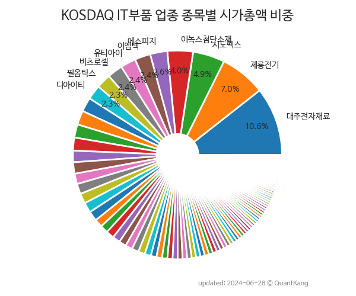

 

 
> **종목 목록 (105)**

| **종목** | **PER** | **PBR** | **DIV** | **비중** |
| :------- | ------: | ------: | ------: | -------: |
| [대주전자재료](/078600/) | 1107.5 | 9.2 | 0.1<small>%</small> | 6.0<small>%</small> |
| [에스피지](/058610/) | 38.6 | 3.6 | 0.6<small>%</small> | 4.1<small>%</small> |
| [이엠텍](/091120/) | 18.9 | 2.5 | 0.4<small>%</small> | 3.6<small>%</small> |
| 시노펙스 | 76.6 | 6.4 | - | 3.5<small>%</small> |
| 유티아이 | - | 13.4 | - | 3.4<small>%</small> |
| [이녹스첨단소재](/272290/) | 6.8 | 1.5 | 1.5<small>%</small> | 3.1<small>%</small> |
| [인탑스](/049070/) | 5.4 | 0.9 | 2.6<small>%</small> | 3.0<small>%</small> |
| [다원시스](/068240/) | - | 2.6 | - | 2.9<small>%</small> |
| [파트론](/091700/) | 11.8 | 0.9 | 3.6<small>%</small> | 2.6<small>%</small> |
| [미래나노텍](/095500/) | - | 1.8 | 0.4<small>%</small> | 2.4<small>%</small> |
| [에스티큐브](/052020/) | - | 8.0 | - | 2.3<small>%</small> |
| 인터플렉스 | 26.1 | 2.0 | - | 2.1<small>%</small> |
| 디아이티 | 41.6 | 2.2 | 1.4<small>%</small> | 2.1<small>%</small> |
| 파워로직스 | - | 2.2 | - | 2.0<small>%</small> |
| 비츠로셀 | 14.7 | 1.8 | 1.2<small>%</small> | 1.9<small>%</small> |
| 제룡전기 | 27.8 | 4.9 | 0.7<small>%</small> | 1.8<small>%</small> |
| 파인엠텍 | - | 2.7 | - | 1.8<small>%</small> |
| 새로닉스 | 3.7 | 1.7 | - | 1.8<small>%</small> |
| 신흥에스이씨 | 17.5 | 1.1 | 0.8<small>%</small> | 1.8<small>%</small> |
| [KH바텍](/060720/) | 12.8 | 1.4 | 2.1<small>%</small> | 1.7<small>%</small> |
| 한솔아이원스 | 8.8 | 1.8 | - | 1.5<small>%</small> |
| 이랜텍 | 4.8 | 1.0 | 1.4<small>%</small> | 1.4<small>%</small> |
| 나무가 | 7.6 | 2.1 | - | 1.4<small>%</small> |
| 비나텍 | 21.9 | 4.2 | - | 1.3<small>%</small> |
| 뉴프렉스 | 14.3 | 3.1 | - | 1.1<small>%</small> |
| 아바텍 | - | 1.4 | - | 1.1<small>%</small> |
| 필옵틱스 | 108.9 | 2.0 | 0.4<small>%</small> | 1.1<small>%</small> |
| 상신이디피 | 8.2 | 1.6 | 0.8<small>%</small> | 1.1<small>%</small> |
| 모다이노칩 | - | 0.6 | - | 1.0<small>%</small> |
| 슈피겐코리아 | 5.7 | 0.5 | 1.8<small>%</small> | 1.0<small>%</small> |
| 아모그린텍 | 17.1 | 3.5 | - | 1.0<small>%</small> |
| 코아시아 | - | 2.8 | - | 1.0<small>%</small> |
| 서울바이오시스 | - | 2.0 | - | 1.0<small>%</small> |
| 이브이첨단소재 | - | 1.6 | - | 1.0<small>%</small> |
| 이화전기 | - | 0.5 | - | 1.0<small>%</small> |
| 디케이티 | 8.0 | 1.6 | - | 0.9<small>%</small> |
| 우주일렉트로 | 11.6 | 0.6 | 1.8<small>%</small> | 0.9<small>%</small> |
| 풍원정밀 | 23.4 | 2.0 | - | 0.8<small>%</small> |
| 알에스오토메이션 | 176.2 | 3.6 | - | 0.8<small>%</small> |
| 라온피플 | - | 2.8 | 0.7<small>%</small> | 0.8<small>%</small> |
| 센서뷰 | - | 9.0 | - | 0.8<small>%</small> |
| 심텍홀딩스 | 4.4 | 0.6 | 1.6<small>%</small> | 0.8<small>%</small> |
| 야스 | - | 0.9 | - | 0.8<small>%</small> |
| 동양이엔피 | 6.2 | 0.5 | 1.7<small>%</small> | 0.7<small>%</small> |
| 나인테크 | 3150.0 | 4.7 | - | 0.7<small>%</small> |
| 에스코넥 | 26.7 | 2.4 | - | 0.7<small>%</small> |
| 아모센스 | - | 3.5 | - | 0.7<small>%</small> |
| 오성첨단소재 | 39.8 | 0.5 | - | 0.7<small>%</small> |
| 아모텍 | - | 0.7 | - | 0.7<small>%</small> |
| 엘컴텍 | 15.0 | 1.6 | - | 0.6<small>%</small> |
| 유아이엘 | 16.3 | 0.8 | - | 0.6<small>%</small> |
| 캠시스 | 18.1 | 1.1 | - | 0.6<small>%</small> |
| 옵트론텍 | - | 3.6 | - | 0.6<small>%</small> |
| 와이팜 | - | 1.6 | - | 0.6<small>%</small> |
| 피엔티엠에스 | - | 4.3 | - | 0.6<small>%</small> |
| 서원인텍 | 4.6 | 0.5 | 7.0<small>%</small> | 0.6<small>%</small> |
| 디스플레이텍 | 13.0 | 0.6 | 0.9<small>%</small> | 0.6<small>%</small> |
| 와이엠씨 | 5.2 | 0.9 | 4.6<small>%</small> | 0.6<small>%</small> |
| 하이소닉 | 100.8 | 5.5 | - | 0.5<small>%</small> |
| 한국컴퓨터 | 5.3 | 0.7 | 4.3<small>%</small> | 0.5<small>%</small> |
| 핌스 | 49.7 | 1.6 | - | 0.5<small>%</small> |
| 현우산업 | 18.1 | 0.9 | 2.1<small>%</small> | 0.5<small>%</small> |
| 인지디스플레 | 21.6 | 0.5 | 2.6<small>%</small> | 0.4<small>%</small> |
| 성호전자 | - | 0.9 | - | 0.4<small>%</small> |
| 제이엠티 | 2.8 | 0.8 | 3.0<small>%</small> | 0.4<small>%</small> |
| 액트로 | - | 1.2 | 1.2<small>%</small> | 0.4<small>%</small> |
| 이라이콤 | - | 0.4 | 4.8<small>%</small> | 0.4<small>%</small> |
| 모베이스 | 4.0 | 0.2 | 2.2<small>%</small> | 0.4<small>%</small> |
| 웨이브일렉트로 | - | 1.1 | - | 0.4<small>%</small> |
| 디에이피 | 6.1 | 0.4 | - | 0.4<small>%</small> |
| 신화인터텍 | - | 0.7 | - | 0.4<small>%</small> |
| 엘엠에스 | 174.3 | 0.5 | 2.6<small>%</small> | 0.4<small>%</small> |
| 에이치와이티씨 | 29.3 | 1.2 | - | 0.4<small>%</small> |
| 에스에이티이엔지 | 80.4 | 2.3 | 0.6<small>%</small> | 0.3<small>%</small> |
| 씨유테크 | 16.1 | 0.6 | 1.8<small>%</small> | 0.3<small>%</small> |
| 엔피디 | - | 0.6 | - | 0.3<small>%</small> |
| SBW생명과학 | - | 1.4 | - | 0.3<small>%</small> |
| 와이제이엠게임즈 | 7.7 | 0.6 | - | 0.3<small>%</small> |
| 모아텍 | - | 0.5 | - | 0.3<small>%</small> |
| 블루콤 | - | 0.3 | - | 0.3<small>%</small> |
| 재영솔루텍 | - | 0.8 | - | 0.3<small>%</small> |
| 바이오로그디바이스 | 132.5 | 0.7 | - | 0.3<small>%</small> |
| 아이엠 | - | 1.1 | - | 0.3<small>%</small> |
| 동일기연 | 42.3 | 0.8 | 0.3<small>%</small> | 0.3<small>%</small> |
| 신화콘텍 | 9.1 | 0.7 | - | 0.2<small>%</small> |
| 아이컴포넌트 | 14.2 | 1.3 | - | 0.2<small>%</small> |
| 삼진엘앤디 | - | 0.5 | - | 0.2<small>%</small> |
| 코이즈 | - | 2.3 | - | 0.2<small>%</small> |
| 파인디앤씨 | - | 1.3 | - | 0.2<small>%</small> |
| 파인텍 | 6.5 | 1.1 | - | 0.2<small>%</small> |
| 해성옵틱스 | - | 1.0 | - | 0.2<small>%</small> |
| 에스에너지 | - | 0.6 | - | 0.2<small>%</small> |
| 이엠앤아이 | - | 2.8 | - | 0.2<small>%</small> |
| 성우전자 | 6.1 | 0.3 | 2.2<small>%</small> | 0.2<small>%</small> |
| S&K폴리텍 | - | 0.3 | - | 0.2<small>%</small> |
| 다산솔루에타 | 6.4 | 0.9 | - | 0.2<small>%</small> |
| 서울전자통신 | - | 0.5 | - | 0.2<small>%</small> |
| 파루 | - | 1.1 | - | 0.1<small>%</small> |
| 육일씨엔에쓰 | 37.7 | 1.0 | - | 0.1<small>%</small> |
| 크루셜텍 | - | 10.2 | - | 0.1<small>%</small> |
| 세진티에스 | - | 0.5 | - | 0.1<small>%</small> |
| 씨엔플러스 | 13.2 | 2.0 | - | 0.1<small>%</small> |
| 비케이홀딩스 | - | 1.0 | - | 0.1<small>%</small> |
| 유아이디 | 5.8 | 1.0 | - | 0.1<small>%</small> |
| 파커스 | - | 0.3 | - | 0.1<small>%</small> |

---
