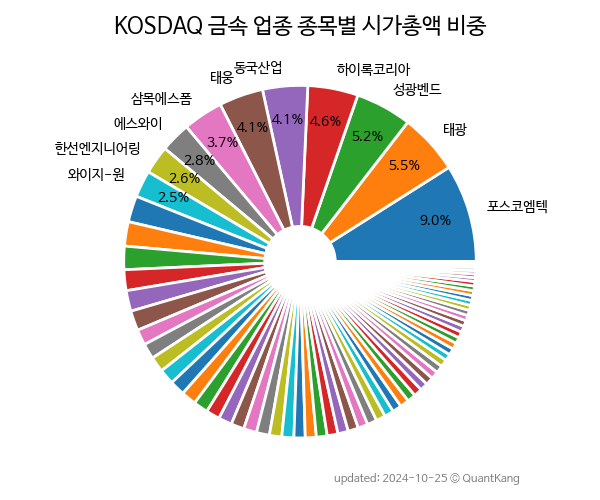

 
> **KOSDAQ 금속 업종 종목별 시가총액 비중**

 
> **종목 목록**

| **종목** | **PER** | **PBR** | **DIV** | **비중** |
| :------- | ------: | ------: | ------: | -------: |
| 포스코엠텍 : 216.4 | 9.1 | 0.2% | 12.3% |
| 강원에너지 : 112.6 | 12.0 | - | 4.6% |
| 태광 : 9.5 | 0.7 | 1.3% | 4.1% |
| 성광벤드 : 8.0 | 0.7 | 0.9% | 3.8% |
| 하이록코리아 : 9.4 | 0.8 | 2.4% | 3.8% |
| 태웅 : 586.7 | 0.7 | - | 3.7% |
| 동국산업 : 46.7 | 0.8 | 2.2% | 3.7% |
| 알멕 : 37.3 | 3.0 | - | 3.5% |
| 하이드로리튬 : - | 2.2 | - | 3.0% |
| 삼목에스폼 : 3.5 | 0.5 | 0.6% | 2.7% |
| 에스와이 : 24.6 | 1.1 | - | 2.4% |
| 세토피아 : - | 4.7 | - | 2.3% |
| 동국S&C : - | 0.7 | - | 2.2% |
| 와이지-원 : 5.8 | 0.5 | 5.1% | 2.1% |
| 보성파워텍 : - | 2.0 | - | 1.9% |
| 한선엔지니어링 : 19.4 | 5.2 | - | 1.7% |
| 코센 : 28.2 | 4.0 | - | 1.6% |
| 엠투엔 : 23.7 | 0.9 | - | 1.5% |
| 신스틸 : 17.2 | 1.8 | - | 1.4% |
| 테라사이언스 : 3.0 | 1.1 | - | 1.3% |
| 세아메카닉스 : 26.7 | 1.7 | - | 1.2% |
| 케이피에프 : 4.0 | 0.5 | 2.9% | 1.2% |
| 이엠코리아 : - | 1.2 | - | 1.2% |
| 에스와이스틸텍 : 12.6 | 3.4 | - | 1.1% |
| 금강철강 : 15.4 | 0.7 | 2.4% | 1.1% |
| 케일럼 : - | 1.4 | - | 1.1% |
| 덕신하우징 : 8.7 | 1.0 | 1.0% | 1.0% |
| 그린플러스 : - | 1.4 | - | 1.0% |
| 한국선재 : 6.1 | 0.7 | 2.7% | 1.0% |
| 피제이메탈 : 15.0 | 1.4 | 3.9% | 1.0% |
| 해성티피씨 : - | 2.0 | - | 1.0% |
| 동일금속 : 5.6 | 0.5 | 4.3% | 1.0% |
| 경남스틸 : 8.6 | 0.8 | 4.2% | 1.0% |
| 유진테크놀로지 : 40.5 | 3.3 | - | 0.9% |
| 포인트엔지니어링 : 96.6 | 1.0 | 0.7% | 0.9% |
| 티플랙스 : 5.0 | 0.5 | 0.9% | 0.9% |
| 삼현철강 : 4.6 | 0.4 | 6.2% | 0.9% |
| 대창솔루션 : - | 2.7 | - | 0.9% |
| 제이스코홀딩스 : - | 0.9 | - | 0.8% |
| 유에스티 : 5.6 | 1.0 | 3.3% | 0.8% |
| 삼보산업 : - | 2.6 | - | 0.8% |
| 제룡산업 : 7.6 | 0.9 | 4.3% | 0.8% |
| 제일테크노스 : 5.8 | 0.8 | 1.6% | 0.8% |
| 한주라이트메탈 : 566.7 | 1.3 | - | 0.8% |
| 대륙제관 : 6.6 | 0.5 | 2.5% | 0.7% |
| 태양 : 8.6 | 0.3 | 4.2% | 0.7% |
| 승일 : 42.5 | 0.4 | 0.9% | 0.7% |
| 대창스틸 : 1.0 | 0.4 | 6.0% | 0.6% |
| 와이엠 : 20.8 | 1.2 | - | 0.6% |
| 삼영엠텍 : - | 0.8 | 1.2% | 0.6% |
| 쎄니트 : 5.5 | 0.5 | 3.4% | 0.6% |
| KBI메탈 : 28.8 | 0.5 | - | 0.6% |
| 율촌 : - | - | - | 0.6% |
| 신진에스엠 : 10.6 | 0.6 | 3.7% | 0.6% |
| 대호특수강 : - | 0.6 | - | 0.5% |
| 포메탈 : 25.4 | 0.9 | 1.6% | 0.5% |
| 윈하이텍 : 6.6 | 0.7 | - | 0.5% |
| 한창산업 : 6.8 | 0.7 | 2.5% | 0.5% |
| 세명전기 : 18.6 | 0.6 | 2.5% | 0.5% |
| 부스타 : - | 0.5 | 1.0% | 0.5% |
| 동양에스텍 : 7.8 | 0.5 | 2.5% | 0.5% |
| 풍강 : 8.6 | 0.5 | 3.4% | 0.4% |
| 대동스틸 : - | 0.5 | 0.8% | 0.4% |
| 원일특강 : 3.5 | 0.2 | 2.6% | 0.4% |
| 대동금속 : 15.0 | 0.7 | 0.6% | 0.4% |
| 케이피티유 : 12.5 | 0.6 | - | 0.3% |
| 동일철강 : - | 0.6 | - | 0.3% |
| 국일신동 : 27.4 | 0.6 | 2.0% | 0.3% |
| 누리플랜 : - | 0.6 | - | 0.3% |
| 광진실업 : 21.1 | 0.9 | - | 0.3% |
| 대호특수강우 : - | - | - | 0.0% |

---
