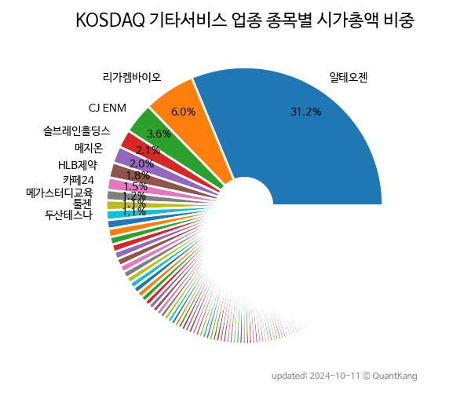

 

 
> **종목 목록 (116)**

| **종목** | **PER** | **PBR** | **DIV** | **비중** |
| :------- | ------: | ------: | ------: | -------: |
| [알테오젠](/196170/) | - | 25.5 | - | 14.6<small>%</small> |
| [레고켐바이오](/141080/) | - | 6.0 | - | 5.4<small>%</small> |
| [메지온](/140410/) | - | 35.9 | - | 3.9<small>%</small> |
| [솔브레인홀딩스](/036830/) | 12.8 | 0.7 | 0.4<small>%</small> | 3.1<small>%</small> |
| [메가스터디교육](/215200/) | 7.0 | 1.7 | 3.4<small>%</small> | 2.7<small>%</small> |
| [제이오](/418550/) | - | 9.1 | - | 2.5<small>%</small> |
| [지씨셀](/144510/) | 23.9 | 1.1 | 0.9<small>%</small> | 2.4<small>%</small> |
| [신라젠](/215600/) | - | 6.6 | - | 2.0<small>%</small> |
| 지노믹트리 | - | 3.5 | - | 1.7<small>%</small> |
| HLB제약 | - | 4.6 | - | 1.6<small>%</small> |
| [박셀바이오](/323990/) | - | 15.8 | - | 1.6<small>%</small> |
| 에코아이 | 18.8 | 6.5 | 1.1<small>%</small> | 1.5<small>%</small> |
| 큐로셀 | - | - | - | 1.5<small>%</small> |
| 툴젠 | - | 5.6 | - | 1.5<small>%</small> |
| [제넥신](/095700/) | - | 1.1 | - | 1.4<small>%</small> |
| 큐알티 | 120.3 | 10.0 | 1.7<small>%</small> | 1.3<small>%</small> |
| 한국기업평가 | 16.6 | 3.0 | 6.7<small>%</small> | 1.3<small>%</small> |
| 인선이엔티 | 15.1 | 0.9 | - | 1.3<small>%</small> |
| 코엔텍 | 8.1 | 1.9 | 7.6<small>%</small> | 1.2<small>%</small> |
| 에코마케팅 | 8.2 | 1.6 | 3.2<small>%</small> | 1.2<small>%</small> |
| [모두투어](/080160/) | - | 5.2 | - | 1.2<small>%</small> |
| 한양이엔지 | 4.0 | 0.6 | 3.7<small>%</small> | 1.1<small>%</small> |
| 나스미디어 | 10.6 | 1.4 | 2.8<small>%</small> | 1.1<small>%</small> |
| 에이프릴바이오 | - | 4.0 | - | 1.1<small>%</small> |
| 메드팩토 | - | 5.8 | - | 1.0<small>%</small> |
| 싸이토젠 | - | 36.4 | - | 1.0<small>%</small> |
| 랩지노믹스 | 4.9 | 1.1 | - | 1.0<small>%</small> |
| 우진엔텍 | 33.0 | 6.6 | 1.1<small>%</small> | 1.0<small>%</small> |
| 지아이이노베이션 | - | 4.8 | - | 0.9<small>%</small> |
| HLB바이오스텝 | - | 3.3 | - | 0.9<small>%</small> |
| 셀리버리 | - | 22.7 | - | 0.9<small>%</small> |
| 올릭스 | - | 3.0 | - | 0.9<small>%</small> |
| 마크로젠 | - | 1.2 | 1.4<small>%</small> | 0.9<small>%</small> |
| 한국전자금융 | 24.0 | 1.2 | 1.6<small>%</small> | 0.9<small>%</small> |
| 지오릿에너지 | - | 4.4 | - | 0.8<small>%</small> |
| 티움바이오 | - | 3.2 | - | 0.8<small>%</small> |
| CG인바이츠 | - | 0.9 | - | 0.7<small>%</small> |
| 크레버스 | 26.6 | 3.0 | 11.1<small>%</small> | 0.7<small>%</small> |
| 고바이오랩 | - | 2.1 | - | 0.7<small>%</small> |
| 파로스아이바이오 | - | 9.0 | - | 0.7<small>%</small> |
| 엔피 | - | 5.3 | - | 0.6<small>%</small> |
| 헬릭스미스 | - | 0.6 | - | 0.6<small>%</small> |
| 리파인 | 8.8 | 1.1 | - | 0.6<small>%</small> |
| DXVX | - | 4.5 | - | 0.6<small>%</small> |
| 네오이뮨텍 | - | - | - | 0.6<small>%</small> |
| 압타바이오 | - | 3.0 | - | 0.6<small>%</small> |
| 이크레더블 | 10.1 | 3.4 | 7.9<small>%</small> | 0.6<small>%</small> |
| 디지털대성 | 8.5 | 1.0 | 3.5<small>%</small> | 0.6<small>%</small> |
| 와이바이오로직스 | - | 10.7 | - | 0.6<small>%</small> |
| 에이비온 | - | 8.8 | - | 0.6<small>%</small> |
| 엔비티 | - | 4.1 | - | 0.6<small>%</small> |
| 부방 | 4.2 | 0.7 | - | 0.6<small>%</small> |
| 큐라클 | - | 3.2 | - | 0.5<small>%</small> |
| 고려신용정보 | 13.5 | 3.6 | 3.2<small>%</small> | 0.5<small>%</small> |
| 인크로스 | 8.8 | 1.3 | 3.5<small>%</small> | 0.5<small>%</small> |
| 더라미 | - | 2.6 | - | 0.5<small>%</small> |
| 차백신연구소 | - | 4.2 | - | 0.5<small>%</small> |
| 현대이지웰 | 9.1 | 1.5 | 1.4<small>%</small> | 0.5<small>%</small> |
| 디티앤씨알오 | 20.6 | 2.9 | - | 0.5<small>%</small> |
| CJ 바이오사이언스 | - | 2.0 | - | 0.5<small>%</small> |
| 와이엔텍 | 5.3 | 0.7 | 0.7<small>%</small> | 0.5<small>%</small> |
| 레드캡투어 | 5.9 | 0.7 | 5.9<small>%</small> | 0.5<small>%</small> |
| SCI평가정보 | 53.5 | 4.2 | 1.4<small>%</small> | 0.5<small>%</small> |
| 드림인사이트 | - | - | - | 0.5<small>%</small> |
| 솔본 | - | 0.9 | - | 0.5<small>%</small> |
| 노랑풍선 | - | 3.7 | - | 0.5<small>%</small> |
| 아이디스홀딩스 | 2.5 | 0.4 | 2.3<small>%</small> | 0.4<small>%</small> |
| 참좋은여행 | - | 1.4 | - | 0.4<small>%</small> |
| 카이노스메드 | - | 4.3 | - | 0.4<small>%</small> |
| 큐리언트 | - | 2.4 | - | 0.4<small>%</small> |
| 정상제이엘에스 | 7.8 | 1.3 | 7.6<small>%</small> | 0.4<small>%</small> |
| 오리콤 | 8.3 | 1.0 | 3.1<small>%</small> | 0.4<small>%</small> |
| 메쎄이상 | - | 1.3 | - | 0.4<small>%</small> |
| 소마젠 | - | - | - | 0.4<small>%</small> |
| 바이오톡스텍 | 32.8 | 2.0 | - | 0.4<small>%</small> |
| 희림 | 12.2 | 1.3 | 2.2<small>%</small> | 0.4<small>%</small> |
| 나이스디앤비 | 6.6 | 1.1 | 3.1<small>%</small> | 0.3<small>%</small> |
| 오르비텍 | - | 1.6 | - | 0.3<small>%</small> |
| 모비데이즈 | - | 2.2 | - | 0.3<small>%</small> |
| 유신 | 4.7 | 0.8 | 2.6<small>%</small> | 0.3<small>%</small> |
| 시공테크 | 11.6 | 0.7 | 0.5<small>%</small> | 0.3<small>%</small> |
| YBM넷 | 10.9 | 1.7 | 2.9<small>%</small> | 0.3<small>%</small> |
| 에코바이오 | - | 1.0 | - | 0.3<small>%</small> |
| 아이진 | - | 1.0 | - | 0.3<small>%</small> |
| 케어랩스 | - | 0.9 | - | 0.3<small>%</small> |
| 아이비김영 | 296.7 | 2.1 | - | 0.3<small>%</small> |
| 에프앤가이드 | 9.8 | 1.4 | 2.7<small>%</small> | 0.3<small>%</small> |
| 큐라티스 | - | - | - | 0.3<small>%</small> |
| 오로라 | 9.7 | 0.6 | 1.7<small>%</small> | 0.3<small>%</small> |
| 이엠넷 | 10.8 | 0.8 | 2.7<small>%</small> | 0.3<small>%</small> |
| 피엔케이피부임상연구센타 | 10.2 | 1.0 | 1.4<small>%</small> | 0.3<small>%</small> |
| 클리노믹스 | - | 1.0 | - | 0.3<small>%</small> |
| 플레이디 | 14.6 | 0.9 | - | 0.3<small>%</small> |
| 드림씨아이에스 | 15.7 | 1.4 | - | 0.3<small>%</small> |
| 지니너스 | - | 1.6 | - | 0.3<small>%</small> |
| 씨엔알리서치 | 17.5 | 1.9 | - | 0.3<small>%</small> |
| 메가엠디 | 31.1 | 1.0 | - | 0.3<small>%</small> |
| 지엘팜텍 | - | 4.3 | - | 0.3<small>%</small> |
| 에이치시티 | 12.1 | 0.9 | - | 0.3<small>%</small> |
| 와이즈버즈 | 29.3 | 1.5 | 1.5<small>%</small> | 0.2<small>%</small> |
| 내츄럴엔도텍 | - | 1.8 | - | 0.2<small>%</small> |
| 엔젠바이오 | - | 2.4 | - | 0.2<small>%</small> |
| 디엔에이링크 | - | 2.0 | - | 0.2<small>%</small> |
| 성도이엔지 | 49.5 | 0.2 | 2.6<small>%</small> | 0.2<small>%</small> |
| 디티앤씨 | 41.0 | 0.6 | - | 0.2<small>%</small> |
| 셀리드 | - | 2.0 | - | 0.2<small>%</small> |
| 바이오인프라 | 7.9 | 2.7 | - | 0.2<small>%</small> |
| 비엘 | - | 2.5 | - | 0.2<small>%</small> |
| 엠브레인 | 13.6 | 1.8 | 4.0<small>%</small> | 0.2<small>%</small> |
| 진매트릭스 | - | 2.2 | - | 0.2<small>%</small> |
| 유투바이오 | 3.5 | 1.4 | 2.7<small>%</small> | 0.2<small>%</small> |
| 압타머사이언스 | - | 1.7 | - | 0.2<small>%</small> |
| 에이디엠코리아 | 182.1 | 1.5 | - | 0.2<small>%</small> |
| EDGC | - | 1.0 | - | 0.2<small>%</small> |
| 에스엘에스바이오 | 13.0 | 5.5 | - | 0.2<small>%</small> |
| 우정바이오 | - | 0.8 | - | 0.1<small>%</small> |

---
