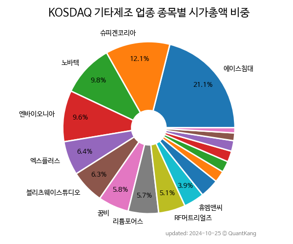

 

 
> **종목 목록 (17)**

| **종목** | **PER** | **PBR** | **DIV** | **비중** |
| :------- | ------: | ------: | ------: | -------: |
| 에이스침대 | 4.8 | 0.4 | 5.2<small>%</small> | 16.5<small>%</small> |
| 노바텍 | 14.1 | 1.8 | 0.9<small>%</small> | 14.3<small>%</small> |
| [리튬포어스](/073570/) | 1.1 | 0.8 | - | 9.1<small>%</small> |
| 하인크코리아 | - | 10.0 | 0.7<small>%</small> | 8.5<small>%</small> |
| 꿈비 | 61.3 | 9.3 | - | 7.4<small>%</small> |
| 엔바이오니아 | - | 5.7 | - | 7.3<small>%</small> |
| 블리츠웨이 | - | 2.8 | - | 5.8<small>%</small> |
| 아이씨에이치 | - | 1.4 | - | 5.6<small>%</small> |
| 피코그램 | 27.1 | 2.8 | - | 5.1<small>%</small> |
| RF머트리얼즈 | 24.4 | 1.9 | 1.0<small>%</small> | 4.9<small>%</small> |
| 비비씨 | 58.1 | 0.8 | 1.9<small>%</small> | 3.5<small>%</small> |
| 휴엠앤씨 | 68.0 | 1.8 | - | 3.1<small>%</small> |
| 제이에스티나 | 24.7 | 0.7 | 4.8<small>%</small> | 2.0<small>%</small> |
| 브이씨 | 23.9 | 0.7 | - | 2.0<small>%</small> |
| 듀오백 | - | 1.3 | - | 1.7<small>%</small> |
| 세니젠 | - | - | - | 1.6<small>%</small> |
| 에이디칩스 | - | 0.8 | - | 1.4<small>%</small> |

---
