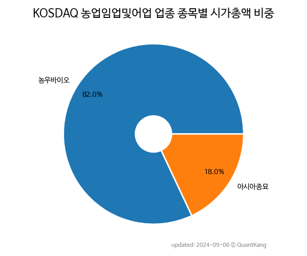

 

 
> **종목 목록 (2)**

| **종목** | **PER** | **PBR** | **DIV** | **비중** |
| :------- | ------: | ------: | ------: | -------: |
| 농우바이오 | 13.0 | 0.5 | 2.5% | 79.5% |
| 아시아종묘 | - | 1.3 | - | 20.5% |

---
