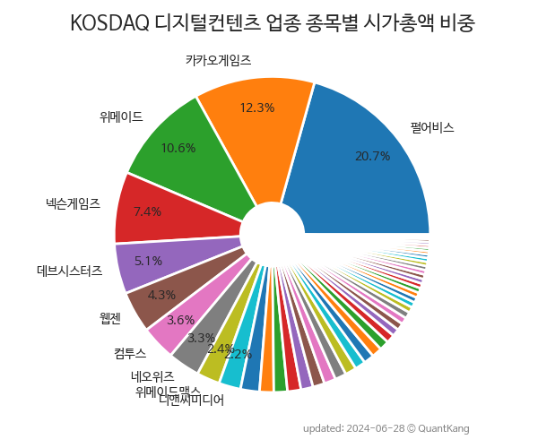

 

 
> **종목 목록 (47)**

| **종목** | **PER** | **PBR** | **DIV** | **비중** |
| :------- | ------: | ------: | ------: | -------: |
| 펄어비스 | - | 2.9 | - | 14.6<small>%</small> |
| 카카오게임즈 | - | 1.2 | - | 14.0<small>%</small> |
| 위메이드 | - | 4.6 | 1.4<small>%</small> | 12.1<small>%</small> |
| 넥슨게임즈 | 136.0 | 4.0 | - | 6.8<small>%</small> |
| 웹젠 | 6.9 | 0.9 | 2.2<small>%</small> | 4.1<small>%</small> |
| 컴투스 | 16.3 | 0.5 | 2.8<small>%</small> | 4.0<small>%</small> |
| 네오위즈 | 40.8 | 1.2 | - | 3.9<small>%</small> |
| 데브시스터즈 | - | 2.4 | - | 3.4<small>%</small> |
| 위메이드맥스 | 14.4 | 5.0 | - | 2.7<small>%</small> |
| 디앤씨미디어 | 53.6 | 4.5 | - | 2.3<small>%</small> |
| 다날 | - | 0.8 | - | 1.9<small>%</small> |
| 컴투스홀딩스 | - | 0.8 | - | 1.8<small>%</small> |
| 드림어스컴퍼니 | 6.8 | 1.1 | - | 1.7<small>%</small> |
| 알서포트 | 56.1 | 2.8 | 0.4<small>%</small> | 1.7<small>%</small> |
| 네오위즈홀딩스 | - | 0.6 | - | 1.6<small>%</small> |
| 조이시티 | 68.7 | 2.2 | - | 1.6<small>%</small> |
| 멀티캠퍼스 | 7.0 | 1.2 | 2.2<small>%</small> | 1.5<small>%</small> |
| 밀리의서재 | 11.3 | 21.4 | - | 1.4<small>%</small> |
| 플리토 | - | 16.6 | - | 1.4<small>%</small> |
| 미스터블루 | 61.2 | 2.8 | 0.4<small>%</small> | 1.3<small>%</small> |
| 지니뮤직 | 10.9 | 1.2 | - | 1.3<small>%</small> |
| 와이랩 | - | 11.7 | - | 1.1<small>%</small> |
| 포바이포 | - | 2.1 | - | 0.9<small>%</small> |
| 엠게임 | 5.2 | 1.2 | - | 0.8<small>%</small> |
| 위메이드플레이 | - | 0.5 | - | 0.8<small>%</small> |
| 스코넥 | - | 4.6 | - | 0.8<small>%</small> |
| 액토즈소프트 | 39.2 | 0.5 | - | 0.7<small>%</small> |
| 액션스퀘어 | - | 3.0 | - | 0.7<small>%</small> |
| 로보로보 | - | 3.4 | - | 0.7<small>%</small> |
| 이노시뮬레이션 | - | 5.9 | - | 0.7<small>%</small> |
| 티사이언티픽 | - | 0.4 | - | 0.7<small>%</small> |
| 미투온 | 11.1 | 0.8 | - | 0.7<small>%</small> |
| 한성크린텍 | - | 0.7 | - | 0.6<small>%</small> |
| 모비릭스 | 14.7 | 1.0 | - | 0.6<small>%</small> |
| 티쓰리 | 5.5 | 0.8 | 4.9<small>%</small> | 0.6<small>%</small> |
| 디지틀조선 | 27.5 | 0.9 | 1.0<small>%</small> | 0.5<small>%</small> |
| 한빛소프트 | 36.4 | 3.9 | - | 0.5<small>%</small> |
| iMBC | 42.5 | 1.3 | - | 0.5<small>%</small> |
| NHN벅스 | 24.2 | 0.8 | - | 0.5<small>%</small> |
| 핑거스토리 | - | 3.3 | - | 0.4<small>%</small> |
| 플레이위드 | - | 1.8 | - | 0.4<small>%</small> |
| 밸로프 | 27.1 | 1.8 | - | 0.3<small>%</small> |
| 아시아경제 | 2.3 | 0.2 | - | 0.3<small>%</small> |
| 룽투코리아 | - | 1.1 | - | 0.3<small>%</small> |
| 드래곤플라이 | - | 0.6 | - | 0.3<small>%</small> |
| 베스파 | - | - | - | 0.2<small>%</small> |
| 스카이문스테크놀로지 | 12.1 | 0.9 | - | 0.1<small>%</small> |

---
