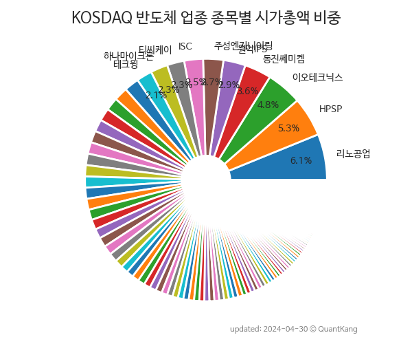

 

 
> **종목 목록 (142)**

| **종목** | **PER** | **PBR** | **DIV** | **비중** |
| :------- | ------: | ------: | ------: | -------: |
| HPSP | 52.9 | 19.9 | 0.3<small>%</small> | 7.1<small>%</small> |
| 리노공업 | 27.9 | 6.5 | 1.4<small>%</small> | 5.7<small>%</small> |
| 이오테크닉스 | 29.2 | 4.2 | 0.5<small>%</small> | 4.0<small>%</small> |
| 동진쎄미켐 | 13.5 | 3.1 | 0.3<small>%</small> | 3.8<small>%</small> |
| ISC | 33.3 | 5.2 | 0.7<small>%</small> | 3.2<small>%</small> |
| 원익IPS | 18.3 | 1.9 | 0.6<small>%</small> | 3.0<small>%</small> |
| 주성엔지니어링 | 15.2 | 3.3 | 0.6<small>%</small> | 2.9<small>%</small> |
| 하나마이크론 | 420.4 | 5.0 | 0.2<small>%</small> | 2.4<small>%</small> |
| 티씨케이 | 13.6 | 3.1 | 1.6<small>%</small> | 2.3<small>%</small> |
| 심텍 | 4.9 | 2.0 | 1.3<small>%</small> | 2.1<small>%</small> |
| 파두 | - | 22.5 | - | 1.9<small>%</small> |
| 하나머티리얼즈 | 12.9 | 3.5 | 1.1<small>%</small> | 1.9<small>%</small> |
| 덕산네오룩스 | 26.6 | 3.2 | - | 1.9<small>%</small> |
| SFA반도체 | 23.4 | 2.2 | - | 1.8<small>%</small> |
| 유진테크 | 25.7 | 3.0 | 0.6<small>%</small> | 1.8<small>%</small> |
| 기가비스 | 26.6 | 7.7 | 1.0<small>%</small> | 1.6<small>%</small> |
| 제주반도체 | 37.2 | 6.2 | - | 1.6<small>%</small> |
| 에스앤에스텍 | 50.1 | 4.6 | 0.4<small>%</small> | 1.6<small>%</small> |
| 두산테스나 | 17.0 | 2.5 | 0.3<small>%</small> | 1.6<small>%</small> |
| 가온칩스 | 156.7 | 13.7 | - | 1.3<small>%</small> |
| 넥스틴 | 15.4 | 6.8 | 0.7<small>%</small> | 1.3<small>%</small> |
| 코미코 | 14.9 | 2.4 | 1.6<small>%</small> | 1.2<small>%</small> |
| 칩스앤미디어 | 59.9 | 14.0 | 0.6<small>%</small> | 1.2<small>%</small> |
| 피에스케이 | 8.0 | 1.7 | 1.9<small>%</small> | 1.1<small>%</small> |
| 아이티엠반도체 | - | 2.9 | - | 1.1<small>%</small> |
| 서울반도체 | - | 0.8 | 2.1<small>%</small> | 1.1<small>%</small> |
| 피에스케이홀딩스 | 13.8 | 2.0 | 1.8<small>%</small> | 1.0<small>%</small> |
| 에이직랜드 | 55.4 | 89.5 | - | 1.0<small>%</small> |
| 테크윙 | 16.5 | 2.2 | 0.9<small>%</small> | 1.0<small>%</small> |
| 와이아이케이 | 20.0 | 1.8 | - | 0.9<small>%</small> |
| 티에스이 | 9.9 | 1.7 | 1.1<small>%</small> | 0.9<small>%</small> |
| 프로텍 | 9.6 | 1.5 | 1.1<small>%</small> | 0.9<small>%</small> |
| 에프에스티 | 10.0 | 1.8 | 0.4<small>%</small> | 0.9<small>%</small> |
| 네오셈 | 40.6 | 6.5 | 0.3<small>%</small> | 0.9<small>%</small> |
| 텔레칩스 | 8.6 | 2.4 | 0.4<small>%</small> | 0.8<small>%</small> |
| 네패스 | 5.8 | 1.8 | - | 0.8<small>%</small> |
| 퀄리타스반도체 | - | - | - | 0.8<small>%</small> |
| 에스티아이 | 14.0 | 1.9 | 0.9<small>%</small> | 0.8<small>%</small> |
| 월덱스 | 10.1 | 2.2 | 0.2<small>%</small> | 0.7<small>%</small> |
| 덕산테코피아 | 24.4 | 2.1 | - | 0.7<small>%</small> |
| 테스 | 7.7 | 1.1 | 2.5<small>%</small> | 0.7<small>%</small> |
| 에이디테크놀로지 | 64.2 | 2.3 | - | 0.7<small>%</small> |
| 인텍플러스 | 22.3 | 5.4 | 0.7<small>%</small> | 0.7<small>%</small> |
| 동운아나텍 | - | 16.3 | - | 0.7<small>%</small> |
| 티에프이 | 45.3 | 6.1 | - | 0.7<small>%</small> |
| 원익머트리얼즈 | 6.4 | 0.8 | 2.7<small>%</small> | 0.7<small>%</small> |
| 엘오티베큠 | 13.7 | 1.6 | 0.5<small>%</small> | 0.6<small>%</small> |
| 네패스아크 | 13.7 | 1.4 | - | 0.6<small>%</small> |
| AP시스템 | 4.1 | 1.2 | 1.2<small>%</small> | 0.6<small>%</small> |
| 비씨엔씨 | 29.7 | 4.2 | - | 0.6<small>%</small> |
| LB세미콘 | 7.9 | 1.2 | - | 0.6<small>%</small> |
| 예스티 | - | 3.4 | - | 0.5<small>%</small> |
| 아나패스 | - | 7.5 | - | 0.5<small>%</small> |
| 유니테스트 | - | 2.0 | - | 0.5<small>%</small> |
| 미코 | - | 2.0 | - | 0.5<small>%</small> |
| 넥스트칩 | - | 7.0 | - | 0.5<small>%</small> |
| 샘씨엔에스 | 18.4 | 2.5 | - | 0.5<small>%</small> |
| 선익시스템 | - | 3.0 | - | 0.5<small>%</small> |
| 엠케이전자 | - | 0.6 | 0.8<small>%</small> | 0.5<small>%</small> |
| 라온텍 | 373.9 | 28.7 | - | 0.5<small>%</small> |
| 케이알엠 | - | 3.6 | - | 0.4<small>%</small> |
| 유니셈 | 12.1 | 1.2 | 1.2<small>%</small> | 0.4<small>%</small> |
| GST | 5.0 | 1.2 | 1.2<small>%</small> | 0.4<small>%</small> |
| 한양디지텍 | 6.3 | 1.9 | - | 0.4<small>%</small> |
| 하이딥 | - | 12.0 | - | 0.4<small>%</small> |
| 티이엠씨 | 8.6 | 3.7 | - | 0.4<small>%</small> |
| 어보브반도체 | 16.2 | 1.7 | 1.6<small>%</small> | 0.4<small>%</small> |
| 와이솔 | - | 0.6 | 3.3<small>%</small> | 0.4<small>%</small> |
| 퓨릿 | 14.9 | 4.4 | - | 0.4<small>%</small> |
| 코세스 | 24.4 | 3.2 | - | 0.3<small>%</small> |
| 에이엘티 | 10.9 | 2.4 | 0.5<small>%</small> | 0.3<small>%</small> |
| 엑시콘 | 11.7 | 1.3 | 0.6<small>%</small> | 0.3<small>%</small> |
| 에이팩트 | 41.6 | 1.6 | - | 0.3<small>%</small> |
| HLB이노베이션 | 8.1 | 3.1 | - | 0.3<small>%</small> |
| 오킨스전자 | 61.4 | 5.3 | - | 0.3<small>%</small> |
| 아이씨디 | - | 0.9 | 1.1<small>%</small> | 0.3<small>%</small> |
| 케이엔제이 | 16.3 | 3.0 | - | 0.3<small>%</small> |
| LB루셈 | 13.1 | 0.8 | - | 0.3<small>%</small> |
| 아이텍 | 6.3 | 1.0 | - | 0.3<small>%</small> |
| 싸이맥스 | 18.8 | 1.0 | 2.1<small>%</small> | 0.3<small>%</small> |
| 제이스텍 | 4.7 | 0.9 | 2.2<small>%</small> | 0.3<small>%</small> |
| 엘티씨 | 57.1 | 1.5 | - | 0.3<small>%</small> |
| 제이아이테크 | 11.1 | 2.4 | - | 0.3<small>%</small> |
| 워트 | 18.0 | 3.2 | - | 0.3<small>%</small> |
| 타이거일렉 | 38.4 | 2.5 | - | 0.2<small>%</small> |
| 아이에이 | - | 1.4 | - | 0.2<small>%</small> |
| 오션브릿지 | 8.1 | 1.2 | 3.5<small>%</small> | 0.2<small>%</small> |
| 제너셈 | 9.7 | 3.0 | 0.6<small>%</small> | 0.2<small>%</small> |
| 시그네틱스 | 15.6 | 0.9 | - | 0.2<small>%</small> |
| 씨앤지하이테크 | 6.1 | 1.1 | 4.0<small>%</small> | 0.2<small>%</small> |
| 기가레인 | - | 1.8 | - | 0.2<small>%</small> |
| 라온테크 | 14.9 | 4.0 | 0.6<small>%</small> | 0.2<small>%</small> |
| 케이피에스 | - | 2.1 | - | 0.2<small>%</small> |
| 와이씨켐 | 24.0 | 1.6 | 0.9<small>%</small> | 0.2<small>%</small> |
| 로체시스템즈 | 5.1 | 1.0 | 0.7<small>%</small> | 0.2<small>%</small> |
| 메가터치 | 11.8 | 3.1 | - | 0.2<small>%</small> |
| 마이크로컨텍솔 | 14.5 | 2.1 | 0.6<small>%</small> | 0.2<small>%</small> |
| 비아트론 | 6.1 | 0.6 | 1.8<small>%</small> | 0.2<small>%</small> |
| 아진엑스텍 | 59.1 | 2.2 | 0.7<small>%</small> | 0.2<small>%</small> |
| 팸텍 | - | - | - | 0.2<small>%</small> |
| 디바이스이엔지 | 9.1 | 0.7 | 1.5<small>%</small> | 0.2<small>%</small> |
| 윈팩 | - | 1.3 | - | 0.2<small>%</small> |
| 화인써키트 | 22.7 | 2.6 | 6.0<small>%</small> | 0.2<small>%</small> |
| 저스템 | 11.6 | 1.8 | - | 0.2<small>%</small> |
| 메카로 | 2.1 | 0.5 | 4.9<small>%</small> | 0.2<small>%</small> |
| 큐에스아이 | 13.2 | 1.1 | 1.0<small>%</small> | 0.2<small>%</small> |
| 마이크로투나노 | 12.3 | 2.7 | - | 0.2<small>%</small> |
| 제이티 | 7.5 | 1.4 | - | 0.2<small>%</small> |
| 코스텍시스 | 286.2 | 1.4 | - | 0.2<small>%</small> |
| 레이저쎌 | - | 2.3 | - | 0.1<small>%</small> |
| 힘스 | - | 1.2 | - | 0.1<small>%</small> |
| 쏘닉스 | - | 2.6 | - | 0.1<small>%</small> |
| 램테크놀러지 | 12.3 | 1.4 | - | 0.1<small>%</small> |
| 테크엘 | - | 0.9 | - | 0.1<small>%</small> |
| 픽셀플러스 | 230.8 | 0.7 | 0.6<small>%</small> | 0.1<small>%</small> |
| KX하이텍 | 4.5 | 0.6 | - | 0.1<small>%</small> |
| 루멘스 | 3.7 | 0.6 | - | 0.1<small>%</small> |
| 아이앤씨 | 59.9 | 1.3 | - | 0.1<small>%</small> |
| 우리이앤엘 | 11.0 | 0.8 | - | 0.1<small>%</small> |
| 티엘아이 | - | 0.7 | - | 0.1<small>%</small> |
| 오디텍 | - | 0.4 | 2.0<small>%</small> | 0.1<small>%</small> |
| 이미지스 | 31.1 | 5.4 | - | 0.1<small>%</small> |
| 피델릭스 | 6.8 | 1.2 | - | 0.1<small>%</small> |
| 지니틱스 | - | 2.6 | - | 0.1<small>%</small> |
| 클라우드에어 | 13.0 | 0.5 | - | 0.1<small>%</small> |
| 시지트로닉스 | - | 3.7 | - | 0.1<small>%</small> |
| 베셀 | - | 0.8 | - | 0.1<small>%</small> |
| 알에프세미 | - | 1.1 | - | 0.1<small>%</small> |
| 아이윈플러스 | - | 0.9 | - | 0.1<small>%</small> |
| 영우디에스피 | - | 1.2 | - | 0.1<small>%</small> |
| 빛샘전자 | 21.0 | 0.7 | 2.9<small>%</small> | 0.1<small>%</small> |
| 웰킵스하이텍 | - | 1.3 | - | 0.1<small>%</small> |
| 에이티세미콘 | - | 1.0 | - | 0.1<small>%</small> |
| 성우테크론 | 8.5 | 0.6 | 1.0<small>%</small> | 0.1<small>%</small> |
| 앤씨앤 | - | 0.6 | - | 0.1<small>%</small> |
| 엔시트론 | - | 1.0 | - | 0.1<small>%</small> |
| 알파홀딩스 | - | 0.5 | - | 0.1<small>%</small> |
| 이엘피 | - | 0.5 | 1.7<small>%</small> | 0.1<small>%</small> |
| 더코디 | - | 0.4 | - | 0.1<small>%</small> |
| 스킨앤스킨 | - | 0.9 | - | 0.0<small>%</small> |
| 에스엘에너지 | - | 0.3 | - | 0.0<small>%</small> |
| 엘디티 | 10.2 | 1.3 | - | 0.0<small>%</small> |

---
