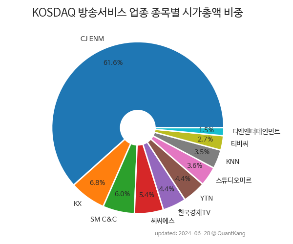

 

 
> **종목 목록 (10)**

| **종목** | **PER** | **PBR** | **DIV** | **비중** |
| :------- | ------: | ------: | ------: | -------: |
| [CJ ENM](/035760/) | - | 0.4 | - | 55.3<small>%</small> |
| YTN | 43.0 | 0.9 | 1.1<small>%</small> | 8.3<small>%</small> |
| KX | 9.9 | 0.8 | 3.4<small>%</small> | 7.8<small>%</small> |
| SM C&C | 31.1 | 1.6 | - | 6.0<small>%</small> |
| 스튜디오미르 | 81.9 | 6.2 | - | 5.7<small>%</small> |
| 한국경제TV | 9.3 | 0.8 | 2.6<small>%</small> | 4.9<small>%</small> |
| KNN | 17.6 | 0.6 | 2.0<small>%</small> | 4.6<small>%</small> |
| 티비씨 | 17.8 | 0.7 | 1.6<small>%</small> | 3.3<small>%</small> |
| 씨씨에스 | 69.3 | 2.3 | - | 2.2<small>%</small> |
| 티엔엔터테인먼트 | - | 0.7 | - | 2.0<small>%</small> |

---
