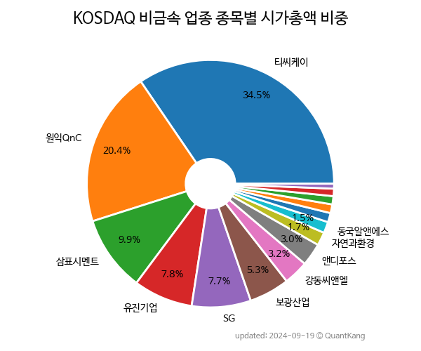

 
> **KOSDAQ 비금속 업종 종목별 시가총액 비중**

 
> **종목 목록**

| **종목** | **PER** | **PBR** | **DIV** | **비중** |
| :------- | ------: | ------: | ------: | -------: |
| 원익QnC : 15.4 | 2.2 | 0.5% | 37.7% |
| 삼표시멘트 : 10.6 | 0.5 | 3.0% | 14.7% |
| 유진기업 : 8.2 | 0.3 | 5.1% | 11.8% |
| 보광산업 : 15.5 | 2.1 | 2.9% | 8.5% |
| 앤디포스 : - | 0.6 | - | 4.0% |
| 자연과환경 : 210.2 | 1.2 | - | 3.9% |
| SG : 18.0 | 0.7 | - | 3.2% |
| 쎄노텍 : - | 1.7 | - | 3.1% |
| 동국알앤에스 : 16.8 | 0.8 | 2.2% | 3.0% |
| 고려시멘트 : - | 0.5 | - | 2.5% |
| 동양파일 : 9.6 | 0.4 | - | 2.2% |
| 국영지앤엠 : 24.0 | 0.9 | - | 2.1% |
| 모헨즈 : 22.6 | 1.7 | - | 1.9% |
| 서산 : 25.5 | 0.4 | - | 1.4% |

---
