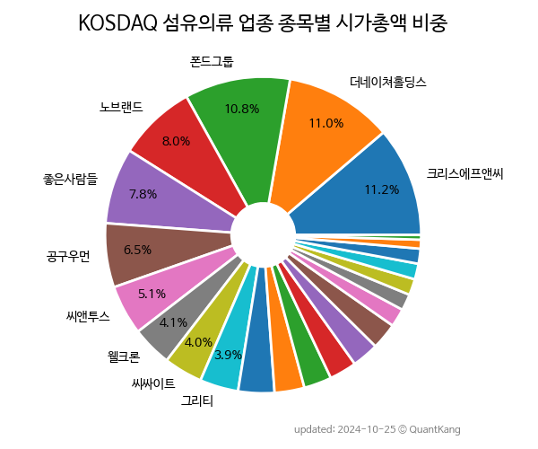

 

 
> **종목 목록 (22)**

| **종목** | **PER** | **PBR** | **DIV** | **비중** |
| :------- | ------: | ------: | ------: | -------: |
| 폰드그룹 | - | - | - | 14.8<small>%</small> |
| [더네이쳐홀딩스](/298540/) | 3.5 | 0.8 | 2.5<small>%</small> | 11.9<small>%</small> |
| 좋은사람들 | - | 3.8 | - | 10.1<small>%</small> |
| 크리스에프앤씨 | 6.3 | 0.5 | 3.2<small>%</small> | 9.0<small>%</small> |
| 공구우먼 | 11.9 | 2.5 | 2.8<small>%</small> | 7.3<small>%</small> |
| 씨싸이트 | - | - | - | 5.9<small>%</small> |
| 에스제이그룹 | 2.9 | 0.7 | 5.8<small>%</small> | 4.3<small>%</small> |
| 웰크론 | 119.2 | 1.0 | - | 4.0<small>%</small> |
| 씨앤투스 | 4.2 | 0.5 | 8.8<small>%</small> | 4.0<small>%</small> |
| 엠에프엠코리아 | - | 1.5 | - | 3.4<small>%</small> |
| 코데즈컴바인 | 8.8 | 1.1 | - | 3.3<small>%</small> |
| 그리티 | 30.5 | 0.9 | 1.0<small>%</small> | 3.1<small>%</small> |
| 배럴 | - | 2.0 | - | 3.0<small>%</small> |
| 케이엠 | 6.8 | 0.4 | 1.1<small>%</small> | 2.7<small>%</small> |
| 지엔코 | - | 1.0 | - | 2.4<small>%</small> |
| GH신소재 | 7.8 | 0.5 | - | 1.9<small>%</small> |
| 셀바이오휴먼텍 | - | - | - | 1.7<small>%</small> |
| 아즈텍WB | - | 0.3 | 1.3<small>%</small> | 1.7<small>%</small> |
| 원풍물산 | - | 2.2 | - | 1.6<small>%</small> |
| 패션플랫폼 | 3.1 | 0.5 | - | 1.6<small>%</small> |
| 에스티오 | 15.9 | 0.8 | 5.2<small>%</small> | 1.3<small>%</small> |
| 형지I&C | - | 0.8 | - | 1.1<small>%</small> |

---
