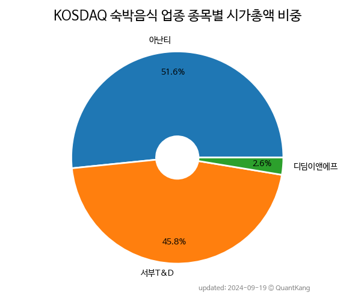

 

 
> **종목 목록 (3)**

| **종목** | **PER** | **PBR** | **DIV** | **비중** |
| :------- | ------: | ------: | ------: | -------: |
| 아난티 | 18.3 | 1.1 | - | 57.4% |
| 서부T&D | 26.5 | 0.6 | 0.7% | 40.4% |
| 디딤이앤에프 | - | 1.8 | - | 2.2% |

---
