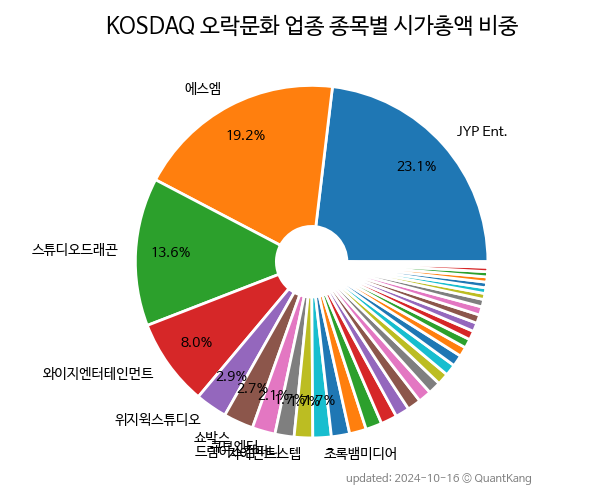

 

 
> **종목 목록 (29)**

| **종목** | **PER** | **PBR** | **DIV** | **비중** |
| :------- | ------: | ------: | ------: | -------: |
| [JYP Ent.](/035900/) | 37.2 | 8.4 | 0.5<small>%</small> | 24.6<small>%</small> |
| [에스엠](/041510/) | 22.1 | 2.5 | 1.6<small>%</small> | 16.3<small>%</small> |
| [스튜디오드래곤](/253450/) | 28.0 | 2.1 | - | 12.9<small>%</small> |
| [파라다이스](/034230/) | 44.0 | 0.8 | - | 10.9<small>%</small> |
| [와이지엔터테인먼트](/122870/) | 23.1 | 1.9 | 0.6<small>%</small> | 7.2<small>%</small> |
| 위지윅스튜디오 | - | 2.8 | - | 4.6<small>%</small> |
| 자이언트스텝 | - | 2.4 | - | 2.6<small>%</small> |
| 큐브엔터 | 41.3 | 6.5 | - | 2.3<small>%</small> |
| 쇼박스 | - | 1.7 | - | 2.1<small>%</small> |
| 덱스터 | - | 3.9 | - | 1.9<small>%</small> |
| 애니플러스 | 26.4 | 1.8 | - | 1.3<small>%</small> |
| SAMG엔터 | - | 2.8 | - | 1.3<small>%</small> |
| 초록뱀미디어 | - | 0.4 | - | 1.2<small>%</small> |
| 키이스트 | - | 2.2 | - | 1.2<small>%</small> |
| 남화산업 | 6.2 | 0.8 | 4.8<small>%</small> | 1.2<small>%</small> |
| NEW | - | 0.9 | - | 1.0<small>%</small> |
| 에이스토리 | 25.6 | 1.8 | - | 1.0<small>%</small> |
| 알비더블유 | 248.7 | 1.4 | - | 1.0<small>%</small> |
| 팬엔터테인먼트 | - | 1.2 | - | 0.8<small>%</small> |
| 삼화네트웍스 | 5.4 | 1.3 | - | 0.7<small>%</small> |
| 코퍼스코리아 | - | 1.4 | 0.5<small>%</small> | 0.7<small>%</small> |
| 에프엔씨엔터 | - | 1.6 | - | 0.7<small>%</small> |
| 래몽래인 | - | 1.5 | - | 0.6<small>%</small> |
| 바른손이앤에이 | - | 0.6 | - | 0.5<small>%</small> |
| 빅텐츠 | 27.9 | 3.2 | - | 0.4<small>%</small> |
| 스튜디오산타클로스 | - | 0.3 | - | 0.3<small>%</small> |
| 캐리소프트 | - | 2.9 | - | 0.3<small>%</small> |
| 판타지오 | - | 0.6 | - | 0.2<small>%</small> |
| 아이오케이 | - | 0.2 | - | 0.1<small>%</small> |

---
