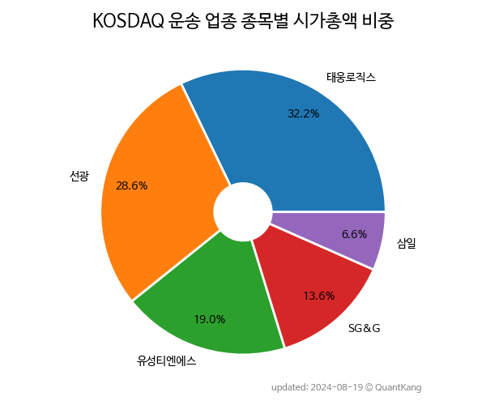

 

 
> **종목 목록 (5)**

| **종목** | **PER** | **PBR** | **DIV** | **비중** |
| :------- | ------: | ------: | ------: | -------: |
| 태웅로직스 | 1.5 | 0.7 | 4.1<small>%</small> | 32.0<small>%</small> |
| 선광 | 7.4 | 0.3 | 1.9<small>%</small> | 27.9<small>%</small> |
| 유성티엔에스 | 1.2 | 0.2 | - | 19.6<small>%</small> |
| SG&G | 1.4 | 0.2 | - | 13.4<small>%</small> |
| 삼일 | 24.4 | 0.5 | - | 7.1<small>%</small> |

---
