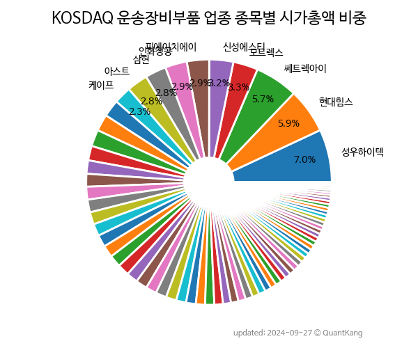

 

 
> **종목 목록 (68)**

| **종목** | **PER** | **PBR** | **DIV** | **비중** |
| :------- | ------: | ------: | ------: | -------: |
| [성우하이텍](/015750/) | 20.4 | 0.7 | 1.0<small>%</small> | 10.1<small>%</small> |
| 현대힘스 | 108.2 | 2.8 | - | 7.0<small>%</small> |
| [모트렉스](/118990/) | 10.3 | 2.2 | 1.5<small>%</small> | 5.1<small>%</small> |
| 이닉스 | 14.1 | 2.8 | 1.2<small>%</small> | 3.9<small>%</small> |
| 피에이치에이 | 9.2 | 0.4 | 1.6<small>%</small> | 3.3<small>%</small> |
| 엠에스오토텍 | 5.3 | 1.2 | 0.9<small>%</small> | 3.0<small>%</small> |
| 신성에스티 | 19.3 | 4.9 | - | 2.9<small>%</small> |
| 에코플라스틱 | 8.0 | 1.2 | 0.9<small>%</small> | 2.9<small>%</small> |
| 이녹스 | 14.0 | 1.0 | - | 2.7<small>%</small> |
| 삼기이브이 | 17.4 | 3.1 | - | 2.1<small>%</small> |
| 아진산업 | 4.9 | 0.7 | - | 2.0<small>%</small> |
| 켄코아에어로스페이스 | 43.9 | 3.8 | - | 1.9<small>%</small> |
| 모베이스전자 | 21.1 | 0.8 | 0.5<small>%</small> | 1.9<small>%</small> |
| 삼보모터스 | 5.1 | 0.4 | 0.8<small>%</small> | 1.7<small>%</small> |
| 케이프 | 628.6 | 0.7 | 2.3<small>%</small> | 1.7<small>%</small> |
| 대원산업 | 3.5 | 0.3 | 2.6<small>%</small> | 1.7<small>%</small> |
| 케이엔더블유 | 5.3 | 1.2 | - | 1.6<small>%</small> |
| 우리산업 | - | 1.5 | 1.1<small>%</small> | 1.5<small>%</small> |
| 현대공업 | 10.5 | 0.9 | 2.1<small>%</small> | 1.5<small>%</small> |
| 코리아에프티 | 12.5 | 0.8 | 1.9<small>%</small> | 1.5<small>%</small> |
| 우수AMS | - | 1.5 | - | 1.4<small>%</small> |
| 유니테크노 | 22.6 | 0.9 | - | 1.4<small>%</small> |
| 대양전기공업 | - | 0.5 | - | 1.4<small>%</small> |
| 엔브이에이치코리아 | - | 0.6 | 4.7<small>%</small> | 1.4<small>%</small> |
| 폴라리스세원 | 40.9 | 0.7 | - | 1.3<small>%</small> |
| 한라IMS | 12.5 | 1.0 | 1.7<small>%</small> | 1.3<small>%</small> |
| 인화정공 | - | 0.6 | - | 1.3<small>%</small> |
| 영화테크 | 20.5 | 1.7 | 0.5<small>%</small> | 1.3<small>%</small> |
| 유니크 | 27.2 | 0.9 | 0.3<small>%</small> | 1.2<small>%</small> |
| 광림 | - | 0.6 | - | 1.2<small>%</small> |
| 일승 | 36.5 | 2.6 | - | 1.1<small>%</small> |
| 경창산업 | 4.2 | 0.7 | - | 1.1<small>%</small> |
| 구영테크 | 18.6 | 0.9 | 1.0<small>%</small> | 1.0<small>%</small> |
| 삼기 | - | 0.7 | - | 1.0<small>%</small> |
| 어스앤에어로스페이스 | 57.2 | 5.7 | - | 1.0<small>%</small> |
| 한일단조 | 10.7 | 0.7 | - | 1.0<small>%</small> |
| 네오오토 | 9.7 | 0.8 | 1.0<small>%</small> | 1.0<small>%</small> |
| 서진오토모티브 | 9.9 | 0.9 | - | 1.0<small>%</small> |
| 에코볼트 | - | 0.2 | - | 0.9<small>%</small> |
| 오텍 | - | 0.6 | 2.9<small>%</small> | 0.9<small>%</small> |
| 아스트 | - | 0.3 | - | 0.9<small>%</small> |
| 에코캡 | - | 0.7 | - | 0.9<small>%</small> |
| CBI | - | 1.0 | - | 0.8<small>%</small> |
| 우리산업홀딩스 | - | 0.5 | 1.3<small>%</small> | 0.8<small>%</small> |
| 세원물산 | 3.7 | 0.2 | 0.3<small>%</small> | 0.8<small>%</small> |
| 화신정공 | 8.2 | 0.6 | 2.4<small>%</small> | 0.8<small>%</small> |
| 디에이치오토리드 | 1.8 | 0.5 | 5.4<small>%</small> | 0.7<small>%</small> |
| 휴림에이텍 | 4.9 | 1.6 | - | 0.7<small>%</small> |
| 아이윈 | - | 0.7 | 2.6<small>%</small> | 0.7<small>%</small> |
| 일지테크 | - | 0.6 | - | 0.7<small>%</small> |
| 뉴인텍 | - | 2.0 | - | 0.7<small>%</small> |
| KB오토시스 | 46.2 | 0.5 | 3.4<small>%</small> | 0.6<small>%</small> |
| 오스템 | - | 0.5 | 1.1<small>%</small> | 0.6<small>%</small> |
| 네오티스 | 8.9 | 0.8 | 7.0<small>%</small> | 0.6<small>%</small> |
| 하이즈항공 | - | 0.8 | - | 0.6<small>%</small> |
| 이원컴포텍 | - | 0.7 | - | 0.6<small>%</small> |
| 메디콕스 | - | 0.3 | - | 0.5<small>%</small> |
| 오리엔트정공 | - | 1.0 | - | 0.5<small>%</small> |
| 캐스텍코리아 | - | 0.5 | - | 0.5<small>%</small> |
| 알톤스포츠 | - | 1.5 | - | 0.5<small>%</small> |
| 디젠스 | - | 2.2 | - | 0.4<small>%</small> |
| 성창오토텍 | 14.9 | 0.8 | 1.5<small>%</small> | 0.4<small>%</small> |
| 티피씨글로벌 | - | 0.6 | - | 0.4<small>%</small> |
| 대성파인텍 | - | 0.7 | - | 0.4<small>%</small> |
| 디와이씨 | 8.0 | 0.7 | - | 0.4<small>%</small> |
| 세동 | 2.6 | 1.1 | - | 0.4<small>%</small> |
| 동방선기 | 22.3 | 0.9 | - | 0.4<small>%</small> |
| 코다코 | - | 1.1 | - | 0.2<small>%</small> |

---
