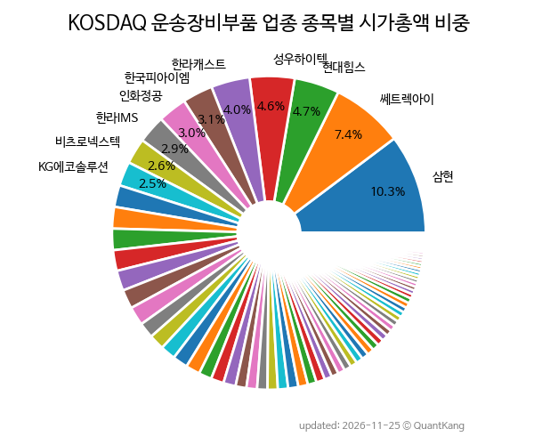

{: .align-center}

> **종목 목록 (77)**

| **종목** | **PER** | **PBR** | **DIV** | **비중** |
| :------- | ------: | ------: | ------: | -------: |
| [삼현](/437730/) | 197.1 | 14.5 | 0.1<small>%</small> | 10.3<small>%</small> |
| [쎄트렉아이](/099320/) | 59.2 | 3.6 | 0.1<small>%</small> | 7.4<small>%</small> |
| 현대힘스 | 14.9 | 1.3 | 1.4<small>%</small> | 4.7<small>%</small> |
| [성우하이텍](/015750/) | 2.5 | 0.2 | 3.8<small>%</small> | 4.6<small>%</small> |
| [한라캐스트](/125490/) | 97.1 | 4.3 | - | 4.0<small>%</small> |
| 한국피아이엠 | - | 6.0 | - | 3.1<small>%</small> |
| 인화정공 | 11.7 | 0.9 | 4.6<small>%</small> | 3.0<small>%</small> |
| 한라IMS | 8.0 | 1.0 | 5.2<small>%</small> | 2.9<small>%</small> |
| 비츠로넥스텍 | - | 3.8 | - | 2.6<small>%</small> |
| KG에코솔루션 | 1.9 | 0.1 | 4.1<small>%</small> | 2.5<small>%</small> |
| 케이프 | 2.8 | 0.6 | 12.4<small>%</small> | 2.2<small>%</small> |
| 네오티스 | 30.4 | 2.4 | 2.0<small>%</small> | 2.2<small>%</small> |
| 피에이치에이 | 4.7 | 0.3 | 3.6<small>%</small> | 2.2<small>%</small> |
| 대원산업 | 3.0 | 0.4 | 2.2<small>%</small> | 2.1<small>%</small> |
| 아스트 | - | 0.5 | - | 2.1<small>%</small> |
| 이노스페이스 | - | 3.1 | - | 2.0<small>%</small> |
| 신성에스티 | 321.1 | 1.7 | 1.0<small>%</small> | 1.9<small>%</small> |
| 모베이스전자 | 8.5 | 0.7 | 1.7<small>%</small> | 1.6<small>%</small> |
| 대양전기공업 | 5.5 | 0.5 | 1.4<small>%</small> | 1.6<small>%</small> |
| 화신정공 | 8.5 | 0.7 | 3.0<small>%</small> | 1.6<small>%</small> |
| 코다코 | - | - | - | 1.6<small>%</small> |
| 코리아에프티 | 3.1 | 0.5 | 4.1<small>%</small> | 1.5<small>%</small> |
| 켄코아에어로스페이스 | - | 0.8 | - | 1.3<small>%</small> |
| 모트렉스 | 18.1 | 0.5 | - | 1.3<small>%</small> |
| 네오오토 | 8.7 | 0.9 | 1.8<small>%</small> | 1.3<small>%</small> |
| 일승 | 10.3 | 1.7 | - | 1.1<small>%</small> |
| 나라스페이스테크놀로지 | - | 2.0 | - | 1.1<small>%</small> |
| 루미르 | 1608.3 | 1.4 | - | 1.1<small>%</small> |
| 케이엔더블유 | - | 0.7 | - | 1.1<small>%</small> |
| 엠에스오토텍 | - | 0.4 | - | 1.1<small>%</small> |
| 삼보모터스 | 3.6 | 0.2 | 1.5<small>%</small> | 1.0<small>%</small> |
| 스모트로닉 | - | 1.1 | - | 1.0<small>%</small> |
| 아진산업 | 3.3 | 0.2 | 5.0<small>%</small> | 0.9<small>%</small> |
| 삼기에너지솔루션즈 | - | 1.3 | - | 0.9<small>%</small> |
| 에코플라스틱 | 31.4 | 0.2 | 3.2<small>%</small> | 0.8<small>%</small> |
| 세원물산 | 3.6 | 0.2 | 2.5<small>%</small> | 0.7<small>%</small> |
| 현대공업 | 5.3 | 0.4 | 7.1<small>%</small> | 0.7<small>%</small> |
| 일지테크 | 1.2 | 0.3 | 3.5<small>%</small> | 0.7<small>%</small> |
| 영화테크 | 3.2 | 0.7 | 2.2<small>%</small> | 0.7<small>%</small> |
| 디에스엠 | 31.8 | 0.7 | - | 0.7<small>%</small> |
| 유니크 | 6.4 | 0.5 | 1.7<small>%</small> | 0.7<small>%</small> |
| 오텍 | - | 0.5 | - | 0.7<small>%</small> |
| 엔브이에이치코리아 | - | 0.3 | 9.7<small>%</small> | 0.7<small>%</small> |
| 한일단조 | 39.2 | 0.4 | - | 0.7<small>%</small> |
| 이녹스 | 2.3 | 0.3 | - | 0.7<small>%</small> |
| 유니테크노 | - | 0.5 | 0.7<small>%</small> | 0.6<small>%</small> |
| 경창산업 | - | 0.4 | - | 0.6<small>%</small> |
| 케이피항공산업 | - | - | - | 0.6<small>%</small> |
| 우리산업 | 3.3 | 0.4 | 3.9<small>%</small> | 0.6<small>%</small> |
| 삼기 | - | 0.5 | - | 0.6<small>%</small> |
| 구영테크 | 2.1 | 0.3 | 3.9<small>%</small> | 0.5<small>%</small> |
| 이닉스 | 145.4 | 0.3 | - | 0.5<small>%</small> |
| SG&G | 1.6 | 0.1 | - | 0.5<small>%</small> |
| 우리산업홀딩스 | 2.8 | 0.2 | 3.7<small>%</small> | 0.4<small>%</small> |
| 동방선기 | 3.4 | 0.5 | - | 0.4<small>%</small> |
| 오리엔트정공 | 13.7 | 0.6 | - | 0.4<small>%</small> |
| 서진오토모티브 | - | 0.2 | - | 0.4<small>%</small> |
| 폴라리스세원 | 77.5 | 0.2 | - | 0.4<small>%</small> |
| 하이즈항공 | 16.1 | 0.8 | - | 0.4<small>%</small> |
| DH오토리드 | 1.9 | 0.3 | 6.0<small>%</small> | 0.4<small>%</small> |
| KB오토시스 | 8.3 | 0.3 | 8.9<small>%</small> | 0.3<small>%</small> |
| 에코캡 | - | 0.2 | - | 0.3<small>%</small> |
| 캐스텍코리아 | - | 0.5 | - | 0.3<small>%</small> |
| 오스템 | 29.4 | 0.4 | 1.8<small>%</small> | 0.3<small>%</small> |
| 디와이씨 | 7.1 | 0.5 | 1.6<small>%</small> | 0.3<small>%</small> |
| 휴림에이텍 | - | 0.6 | - | 0.3<small>%</small> |
| 청보 | - | 0.4 | - | 0.3<small>%</small> |
| 티피씨글로벌 | - | 0.3 | - | 0.2<small>%</small> |
| 아이윈 | 2.4 | 0.5 | - | 0.2<small>%</small> |
| 에코볼트 | - | - | - | 0.2<small>%</small> |
| 세동 | 4.0 | 0.6 | - | 0.2<small>%</small> |
| 알톤 | 92.3 | 1.0 | - | 0.2<small>%</small> |
| 성창오토텍 | 2.0 | 0.3 | 3.0<small>%</small> | 0.2<small>%</small> |
| 이원컴포텍 | - | 2.1 | - | 0.2<small>%</small> |
| 디젠스 | 26.0 | 0.8 | - | 0.2<small>%</small> |
| 메디콕스 | - | 0.3 | - | 0.1<small>%</small> |
| 뉴인텍 | - | 0.5 | - | 0.1<small>%</small> |

