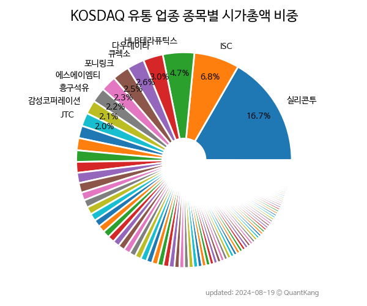

 

 
> **종목 목록 (93)**

| **종목** | **PER** | **PBR** | **DIV** | **비중** |
| :------- | ------: | ------: | ------: | -------: |
| 큐렉소 | - | 8.5<small></small> | - | 6.6<small>%</small> |
| 실리콘투 | 48.6<small></small> | 5.6<small></small> | - | 4.9<small>%</small> |
| 코웰패션 | 8.0<small></small> | 1.0<small></small> | 3.3<small>%</small> | 4.5<small>%</small> |
| 다우데이타 | 2.5<small></small> | 0.4<small></small> | 2.3<small>%</small> | 4.5<small>%</small> |
| 미래반도체 | 15.7<small></small> | 4.3<small></small> | - | 2.8<small>%</small> |
| 케이티알파 | 25.0<small></small> | 1.3<small></small> | - | 2.7<small>%</small> |
| HLB테라퓨틱스 | - | 2.2<small></small> | - | 2.6<small>%</small> |
| CJ프레시웨이 | 5.8<small></small> | 0.9<small></small> | 1.4<small>%</small> | 2.6<small>%</small> |
| 에스에이엠티 | 4.6<small></small> | 0.7<small></small> | 8.4<small>%</small> | 2.4<small>%</small> |
| 감성코퍼레이션 | 15.9<small></small> | 5.0<small></small> | - | 2.3<small>%</small> |
| 매커스 | 8.0<small></small> | 1.8<small></small> | 0.8<small>%</small> | 2.1<small>%</small> |
| 블루엠텍 | - | 131.0<small></small> | - | 1.9<small>%</small> |
| 피에이치씨 | - | 10.9<small></small> | - | 1.9<small>%</small> |
| 아가방컴퍼니 | 19.5<small></small> | 1.2<small></small> | - | 1.8<small>%</small> |
| JTC | - | - | - | 1.8<small>%</small> |
| 서울옥션 | 40.6<small></small> | 1.5<small></small> | 0.9<small>%</small> | 1.7<small>%</small> |
| 그래디언트 | 0.6<small></small> | 0.3<small></small> | 1.5<small>%</small> | 1.7<small>%</small> |
| 흥구석유 | 67.8<small></small> | 2.2<small></small> | 1.2<small>%</small> | 1.7<small>%</small> |
| 청담글로벌 | 32.1<small></small> | 2.6<small></small> | - | 1.5<small>%</small> |
| 대원미디어 | 27.7<small></small> | 1.6<small></small> | 0.8<small>%</small> | 1.5<small>%</small> |
| 골프존뉴딘홀딩스 | 1.8<small></small> | 0.2<small></small> | 4.5<small>%</small> | 1.4<small>%</small> |
| 퀀타피아 | - | 5.4<small></small> | - | 1.4<small>%</small> |
| 서플러스글로벌 | 5.5<small></small> | 0.8<small></small> | 1.2<small>%</small> | 1.3<small>%</small> |
| 리드코프 | 4.5<small></small> | 0.3<small></small> | 14.3<small>%</small> | 1.3<small>%</small> |
| 제로투세븐 | 35.2<small></small> | 1.8<small></small> | - | 1.3<small>%</small> |
| 홈센타홀딩스 | 10.8<small></small> | 1.0<small></small> | 0.9<small>%</small> | 1.3<small>%</small> |
| 도이치모터스 | 3.8<small></small> | 0.4<small></small> | 7.9<small>%</small> | 1.3<small>%</small> |
| 케이옥션 | 34.6<small></small> | 1.1<small></small> | 0.7<small>%</small> | 1.3<small>%</small> |
| 안트로젠 | - | 1.3<small></small> | - | 1.2<small>%</small> |
| 아미노로직스 | - | 2.6<small></small> | - | 1.2<small>%</small> |
| 유니트론텍 | 7.2<small></small> | 1.4<small></small> | 1.4<small>%</small> | 1.2<small>%</small> |
| 일월지엠엘 | - | 47.8<small></small> | - | 1.1<small>%</small> |
| 중앙에너비스 | 170.9<small></small> | 1.5<small></small> | 1.7<small>%</small> | 1.1<small>%</small> |
| 젬백스링크 | - | 0.6<small></small> | 0.8<small>%</small> | 1.0<small>%</small> |
| 푸드나무 | - | 2.2<small></small> | 1.3<small>%</small> | 1.0<small>%</small> |
| 베뉴지 | - | 0.3<small></small> | 1.4<small>%</small> | 0.9<small>%</small> |
| 제이씨현시스템 | 344.0<small></small> | 0.9<small></small> | - | 0.9<small>%</small> |
| 손오공 | - | 4.1<small></small> | - | 0.9<small>%</small> |
| 오토앤 | - | 2.9<small></small> | - | 0.8<small>%</small> |
| 삼천리자전거 | - | 0.8<small></small> | - | 0.8<small>%</small> |
| 오하임앤컴퍼니 | 53.7<small></small> | 2.9<small></small> | - | 0.7<small>%</small> |
| PN풍년 | 41.8<small></small> | 1.6<small></small> | 0.3<small>%</small> | 0.7<small>%</small> |
| 원익큐브 | 18.4<small></small> | 0.8<small></small> | - | 0.7<small>%</small> |
| 서린바이오 | 8.1<small></small> | 0.9<small></small> | 1.4<small>%</small> | 0.7<small>%</small> |
| 아이에스이커머스 | - | 1.4<small></small> | - | 0.7<small>%</small> |
| 애머릿지 | - | - | - | 0.7<small>%</small> |
| 우리로 | - | 1.5<small></small> | - | 0.7<small>%</small> |
| 보라티알 | 4.3<small></small> | 1.0<small></small> | 2.6<small>%</small> | 0.7<small>%</small> |
| 나라셀라 | 5.9<small></small> | 1.2<small></small> | - | 0.7<small>%</small> |
| 이글벳 | 27.7<small></small> | 1.7<small></small> | 0.7<small>%</small> | 0.7<small>%</small> |
| SDN | 92.0<small></small> | 0.7<small></small> | - | 0.6<small>%</small> |
| 에이프로젠 H&G | - | 0.1<small></small> | - | 0.6<small>%</small> |
| 웨스트라이즈 | - | 8.0<small></small> | - | 0.6<small>%</small> |
| 원익 | 1.7<small></small> | 0.3<small></small> | - | 0.6<small>%</small> |
| 더블유에스아이 | 14.6<small></small> | 1.7<small></small> | - | 0.6<small>%</small> |
| 대명소노시즌 | - | 0.5<small></small> | - | 0.5<small>%</small> |
| 바른손 | - | 1.0<small></small> | - | 0.5<small>%</small> |
| 피씨디렉트 | - | 1.3<small></small> | 7.8<small>%</small> | 0.5<small>%</small> |
| 한국가구 | 4.9<small></small> | 0.4<small></small> | 4.5<small>%</small> | 0.5<small>%</small> |
| 씨티프라퍼티 | - | 0.3<small></small> | - | 0.5<small>%</small> |
| 메디프론 | - | 1.5<small></small> | - | 0.5<small>%</small> |
| 한국테크놀로지 | - | 1.2<small></small> | - | 0.5<small>%</small> |
| 위즈코프 | 17.4<small></small> | 0.6<small></small> | - | 0.5<small>%</small> |
| 큐로홀딩스 | - | 1.2<small></small> | - | 0.4<small>%</small> |
| 바이온 | - | 1.9<small></small> | - | 0.4<small>%</small> |
| 우리엔터프라이즈 | 6.1<small></small> | 0.3<small></small> | - | 0.4<small>%</small> |
| 뉴지랩파마 | - | - | - | 0.4<small>%</small> |
| 대한과학 | 9.3<small></small> | 1.2<small></small> | 1.0<small>%</small> | 0.4<small>%</small> |
| 아이톡시 | - | 5.4<small></small> | - | 0.4<small>%</small> |
| YW | 10.6<small></small> | 0.4<small></small> | 4.0<small>%</small> | 0.4<small>%</small> |
| 지더블유바이텍 | - | 1.1<small></small> | - | 0.4<small>%</small> |
| 디와이디 | 26.6<small></small> | 0.6<small></small> | - | 0.4<small>%</small> |
| 카스 | 12.2<small></small> | 0.6<small></small> | 0.7<small>%</small> | 0.4<small>%</small> |
| 에스유홀딩스 | - | 0.4<small></small> | - | 0.3<small>%</small> |
| 신라섬유 | - | 2.5<small></small> | - | 0.3<small>%</small> |
| ES큐브 | 1.5<small></small> | 0.3<small></small> | - | 0.3<small>%</small> |
| 토박스코리아 | 9.5<small></small> | 1.2<small></small> | - | 0.3<small>%</small> |
| 진바이오텍 | 24.6<small></small> | 0.8<small></small> | - | 0.3<small>%</small> |
| 엑서지21 | - | 0.5<small></small> | - | 0.3<small>%</small> |
| 비엘팜텍 | - | 1.0<small></small> | - | 0.3<small>%</small> |
| 서울리거 | - | 1.1<small></small> | - | 0.3<small>%</small> |
| 디모아 | - | 0.6<small></small> | - | 0.3<small>%</small> |
| 신라에스지 | 28.4<small></small> | 1.8<small></small> | - | 0.3<small>%</small> |
| 제넨바이오 | - | 0.4<small></small> | - | 0.3<small>%</small> |
| 대산F&B | - | 0.9<small></small> | - | 0.3<small>%</small> |
| 까스텔바작 | - | 0.5<small></small> | - | 0.3<small>%</small> |
| 글로본 | - | 2.0<small></small> | - | 0.3<small>%</small> |
| 한국정보공학 | 8.6<small></small> | 0.7<small></small> | - | 0.3<small>%</small> |
| 케이바이오 | - | 0.3<small></small> | - | 0.3<small>%</small> |
| 커머스마이너 | - | 1.1<small></small> | - | 0.2<small>%</small> |
| 위니아에이드 | 1.4<small></small> | 0.1<small></small> | - | 0.2<small>%</small> |
| 와이오엠 | 26.8<small></small> | 0.8<small></small> | - | 0.2<small>%</small> |
| 윙스풋 | - | 0.9<small></small> | - | 0.2<small>%</small> |

---
