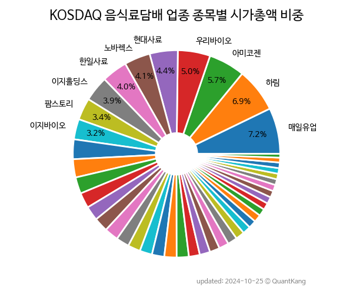

 

 
> **종목 목록 (42)**

| **종목** | **PER** | **PBR** | **DIV** | **비중** |
| :------- | ------: | ------: | ------: | -------: |
| 하림 | 83.8<small></small> | 1.4<small></small> | 0.5<small>%</small> | 8.3<small>%</small> |
| 카나리아바이오 | - | 7.0<small></small> | - | 7.8<small>%</small> |
| 아미코젠 | - | 2.0<small></small> | - | 6.7<small>%</small> |
| 매일유업 | 20.4<small></small> | 0.6<small></small> | 3.0<small>%</small> | 6.2<small>%</small> |
| 노바렉스 | 9.7<small></small> | 1.2<small></small> | 1.3<small>%</small> | 4.3<small>%</small> |
| 한일사료 | - | 3.9<small></small> | - | 4.1<small>%</small> |
| 이지홀딩스 | 17.3<small></small> | 0.4<small></small> | 2.5<small>%</small> | 3.9<small>%</small> |
| 팜스토리 | - | 0.9<small></small> | 1.5<small>%</small> | 3.8<small>%</small> |
| 에이치피오 | 15.3<small></small> | 1.2<small></small> | 0.9<small>%</small> | 3.5<small>%</small> |
| 풍국주정 | 42.7<small></small> | 1.0<small></small> | 0.5<small>%</small> | 2.9<small>%</small> |
| 코스맥스엔비티 | - | 3.4<small></small> | - | 2.9<small>%</small> |
| 우듬지팜 | - | - | - | 2.4<small>%</small> |
| 미래생명자원 | 111.0<small></small> | 2.7<small></small> | - | 2.3<small>%</small> |
| 이지바이오 | 12.8<small></small> | 2.3<small></small> | 2.2<small>%</small> | 2.3<small>%</small> |
| 국순당 | - | 0.4<small></small> | 3.4<small>%</small> | 2.1<small>%</small> |
| 우리손에프앤지 | 4.2<small></small> | 0.4<small></small> | 3.3<small>%</small> | 2.1<small>%</small> |
| 진로발효 | 31.7<small></small> | 1.4<small></small> | 2.9<small>%</small> | 2.0<small>%</small> |
| 매일홀딩스 | 14.4<small></small> | 0.3<small></small> | 2.0<small>%</small> | 2.0<small>%</small> |
| 엠에스씨 | 4.8<small></small> | 0.7<small></small> | 1.2<small>%</small> | 1.7<small>%</small> |
| 프롬바이오 | 26.3<small></small> | 1.0<small></small> | - | 1.7<small>%</small> |
| 창해에탄올 | 910.0<small></small> | 0.5<small></small> | 5.5<small>%</small> | 1.6<small>%</small> |
| 흥국에프엔비 | 6.7<small></small> | 0.9<small></small> | 1.9<small>%</small> | 1.6<small>%</small> |
| 우양 | - | 1.8<small></small> | - | 1.6<small>%</small> |
| 정다운 | 5.3<small></small> | 0.9<small></small> | 4.0<small>%</small> | 1.6<small>%</small> |
| 에이치엘사이언스 | 47.4<small></small> | 0.7<small></small> | - | 1.5<small>%</small> |
| 동우팜투테이블 | 4.7<small></small> | 0.4<small></small> | - | 1.5<small>%</small> |
| 에스앤디 | 7.4<small></small> | 0.9<small></small> | 1.7<small>%</small> | 1.4<small>%</small> |
| 인산가 | 15.7<small></small> | 1.1<small></small> | 2.2<small>%</small> | 1.4<small>%</small> |
| 체리부로 | 7.4<small></small> | 1.0<small></small> | - | 1.3<small>%</small> |
| 뉴트리 | 13.2<small></small> | 0.6<small></small> | 3.6<small>%</small> | 1.3<small>%</small> |
| 대주산업 | 14.2<small></small> | 0.9<small></small> | 2.0<small>%</small> | 1.2<small>%</small> |
| 팜스빌 | 14.9<small></small> | 1.0<small></small> | 1.3<small>%</small> | 1.2<small>%</small> |
| 제주맥주 | - | 1.8<small></small> | - | 1.1<small>%</small> |
| 한국맥널티 | - | 1.4<small></small> | - | 1.0<small>%</small> |
| 오에스피 | 39.0<small></small> | 1.5<small></small> | - | 1.0<small>%</small> |
| 네오크레마 | - | 1.0<small></small> | - | 1.0<small>%</small> |
| 마니커에프앤지 | - | 0.8<small></small> | - | 1.0<small>%</small> |
| 푸드웰 | 10.4<small></small> | 0.5<small></small> | 1.9<small>%</small> | 0.9<small>%</small> |
| 휴럼 | - | 1.3<small></small> | - | 0.9<small>%</small> |
| 비피도 | 28.2<small></small> | 0.8<small></small> | - | 0.9<small>%</small> |
| 케이씨피드 | 9.7<small></small> | 0.7<small></small> | 1.9<small>%</small> | 0.9<small>%</small> |
| 한탑 | - | 0.8<small></small> | - | 0.8<small>%</small> |

---
