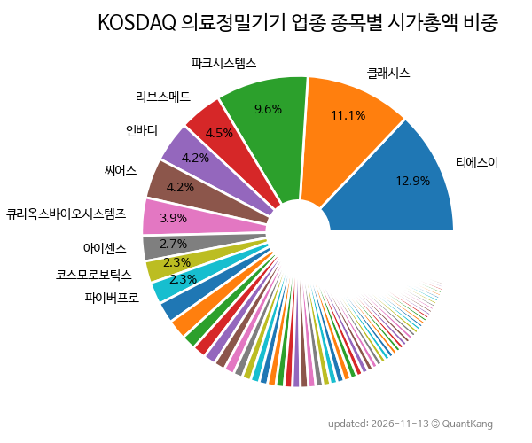

{: .align-center}

> **종목 목록 (99)**

| **종목** | **PER** | **PBR** | **DIV** | **비중** |
| :------- | ------: | ------: | ------: | -------: |
| [티에스이](/131290/) | 52.5 | 5.2 | 0.2<small>%</small> | 12.9<small>%</small> |
| [클래시스](/214150/) | 12.9 | 3.1 | 3.8<small>%</small> | 11.1<small>%</small> |
| [파크시스템스](/140860/) | 43.3 | 6.6 | 0.2<small>%</small> | 9.6<small>%</small> |
| 리브스메드 | - | 5.8 | - | 4.5<small>%</small> |
| 인바디 | 23.6 | 2.4 | 1.1<small>%</small> | 4.2<small>%</small> |
| 씨어스 | 48.5 | 19.9 | - | 4.2<small>%</small> |
| [큐리옥스바이오시스템즈](/445680/) | - | 15.8 | - | 3.9<small>%</small> |
| 아이센스 | - | 1.2 | 0.7<small>%</small> | 2.7<small>%</small> |
| 코스모로보틱스 | - | 7.7 | - | 2.3<small>%</small> |
| 파이버프로 | 30.9 | 6.3 | 1.0<small>%</small> | 2.3<small>%</small> |
| 원텍 | 9.2 | 2.1 | 1.4<small>%</small> | 2.2<small>%</small> |
| 토모큐브 | - | 9.2 | - | 2.0<small>%</small> |
| 바텍 | 6.3 | 0.5 | 1.8<small>%</small> | 1.5<small>%</small> |
| 넥스트바이오메디컬 | - | 4.9 | - | 1.4<small>%</small> |
| 뷰웍스 | 12.0 | 1.1 | 2.4<small>%</small> | 1.3<small>%</small> |
| 바이오다인 | 197.2 | 3.8 | - | 1.1<small>%</small> |
| 아스테라시스 | 18.9 | 3.8 | 2.2<small>%</small> | 1.1<small>%</small> |
| 코메론 | 8.7 | 0.8 | 3.2<small>%</small> | 0.9<small>%</small> |
| 에스오에스랩 | - | 5.2 | - | 0.9<small>%</small> |
| 재영솔루텍 | 11.5 | 1.2 | - | 0.9<small>%</small> |
| 그린광학 | 43.1 | 1.6 | - | 0.9<small>%</small> |
| 엠아이텍 | 6.4 | 1.0 | 3.0<small>%</small> | 0.9<small>%</small> |
| 인터로조 | 13.9 | 1.1 | 4.6<small>%</small> | 0.9<small>%</small> |
| 메디아나 | 26.7 | 1.0 | - | 0.9<small>%</small> |
| 하이비젼시스템 | - | 0.5 | 0.9<small>%</small> | 0.8<small>%</small> |
| 디오 | - | 0.6 | - | 0.8<small>%</small> |
| 큐리오시스 | - | 5.6 | - | 0.8<small>%</small> |
| 케이엔알시스템 | - | 7.8 | - | 0.8<small>%</small> |
| 시너지이노베이션 | 40.1 | 0.6 | - | 0.8<small>%</small> |
| 나노엔텍 | 87.0 | 1.7 | - | 0.7<small>%</small> |
| 리센스메디컬 | - | 6.8 | - | 0.7<small>%</small> |
| 이엘씨 | 16.2 | 0.8 | 3.2<small>%</small> | 0.7<small>%</small> |
| 레이언스 | - | 0.5 | 3.9<small>%</small> | 0.7<small>%</small> |
| 메쥬 | 36.8 | 13.0 | - | 0.6<small>%</small> |
| 동방메디컬 | 8.8 | 0.8 | - | 0.6<small>%</small> |
| 시지메드텍 | 13.6 | 0.9 | - | 0.6<small>%</small> |
| 레메디 | 13.3 | 6.0 | - | 0.5<small>%</small> |
| 오상헬스케어 | 23.3 | 0.3 | 3.8<small>%</small> | 0.5<small>%</small> |
| 엘앤케이바이오 | - | 2.5 | - | 0.5<small>%</small> |
| 위드텍 | 12.3 | 0.6 | 2.5<small>%</small> | 0.5<small>%</small> |
| 피에스텍 | 7.6 | 0.5 | 5.9<small>%</small> | 0.5<small>%</small> |
| 해성옵틱스 | - | 2.3 | - | 0.5<small>%</small> |
| 빅텍 | 18.1 | 1.3 | 1.1<small>%</small> | 0.5<small>%</small> |
| 하이로닉 | 17.6 | 0.9 | - | 0.5<small>%</small> |
| 오스테오닉 | 10.8 | 1.2 | - | 0.5<small>%</small> |
| 다이나믹솔루션 | - | 0.8 | - | 0.4<small>%</small> |
| 리메드 | 148.8 | 1.9 | - | 0.4<small>%</small> |
| 디알텍 | - | 0.7 | - | 0.4<small>%</small> |
| 엠엑스온 | 33.8 | 0.8 | 1.7<small>%</small> | 0.4<small>%</small> |
| 휴비츠 | - | 0.6 | 4.1<small>%</small> | 0.4<small>%</small> |
| 레이 | 20.5 | 0.8 | - | 0.4<small>%</small> |
| 피제이전자 | 7.3 | 0.5 | 4.4<small>%</small> | 0.4<small>%</small> |
| 센코 | 11.7 | 1.1 | - | 0.4<small>%</small> |
| 피앤에스로보틱스 | 22.9 | 1.5 | 0.8<small>%</small> | 0.4<small>%</small> |
| 피엠티 | - | 3.9 | - | 0.3<small>%</small> |
| LK삼양 | - | 1.5 | - | 0.3<small>%</small> |
| 이오플로우 | - | - | - | 0.3<small>%</small> |
| 스마트레이더시스템 | - | 2.2 | - | 0.3<small>%</small> |
| 프로티아 | 14.5 | 2.1 | - | 0.3<small>%</small> |
| 셀바스헬스케어 | 16.4 | 0.9 | - | 0.3<small>%</small> |
| 옵트론텍 | - | 0.9 | - | 0.3<small>%</small> |
| 웨이브일렉트로 | 33.3 | 0.9 | - | 0.3<small>%</small> |
| 디알젬 | 7.9 | 0.6 | 3.6<small>%</small> | 0.3<small>%</small> |
| 3S | - | 1.4 | - | 0.3<small>%</small> |
| 코렌텍 | 9.9 | 0.8 | - | 0.3<small>%</small> |
| 퓨런티어 | - | 0.9 | - | 0.3<small>%</small> |
| 퀀타매트릭스 | - | 0.9 | - | 0.3<small>%</small> |
| 제노레이 | 47.5 | 0.4 | 5.2<small>%</small> | 0.3<small>%</small> |
| 제이피아이헬스케어 | 6.1 | 0.6 | 3.3<small>%</small> | 0.2<small>%</small> |
| 레이저옵텍 | - | 1.7 | - | 0.2<small>%</small> |
| 세코닉스 | 8.2 | 0.3 | - | 0.2<small>%</small> |
| 아이빔테크놀로지 | - | 1.3 | - | 0.2<small>%</small> |
| 얼라인드 | 12.9 | 1.0 | - | 0.2<small>%</small> |
| 덴티스 | - | 0.8 | - | 0.2<small>%</small> |
| 옴니시스템 | - | 0.3 | - | 0.2<small>%</small> |
| 지슨 | - | 4.4 | - | 0.2<small>%</small> |
| 민테크 | - | 0.9 | - | 0.2<small>%</small> |
| 코아시아씨엠 | 9.1 | 0.5 | - | 0.2<small>%</small> |
| 파인메딕스 | - | 1.6 | - | 0.2<small>%</small> |
| 진시스템 | - | 3.5 | - | 0.2<small>%</small> |
| 코셈 | - | 2.6 | - | 0.2<small>%</small> |
| 프리시젼바이오 | - | 0.8 | - | 0.2<small>%</small> |
| 세종메디칼 | - | 1.2 | - | 0.2<small>%</small> |
| 에스에이티 | 38.9 | 0.3 | 4.3<small>%</small> | 0.2<small>%</small> |
| 솔디펜스 | 8.5 | 0.5 | - | 0.2<small>%</small> |
| 마이크로디지탈 | - | 0.3 | - | 0.1<small>%</small> |
| 씨유메디칼 | 27.3 | 0.4 | - | 0.1<small>%</small> |
| 멕아이씨에스 | - | 0.6 | - | 0.1<small>%</small> |
| 라메디텍 | - | 1.9 | - | 0.1<small>%</small> |
| 이엘피 | 7.9 | 0.3 | 4.1<small>%</small> | 0.1<small>%</small> |
| 에스지헬스케어 | 23.9 | 0.9 | - | 0.1<small>%</small> |
| 비스토스 | - | 0.7 | - | 0.1<small>%</small> |
| 한국비티비 | - | 1.4 | - | 0.1<small>%</small> |
| 롤링스톤 | - | 1.2 | - | 0.1<small>%</small> |
| 넥스트아이 | - | 0.3 | - | 0.1<small>%</small> |
| 플라즈맵 | - | 2.3 | - | 0.1<small>%</small> |
| 노을 | - | 0.5 | - | 0.1<small>%</small> |
| 알파AI | - | 0.3 | - | 0.1<small>%</small> |
| 시스웍 | - | - | - | 0.0<small>%</small> |

