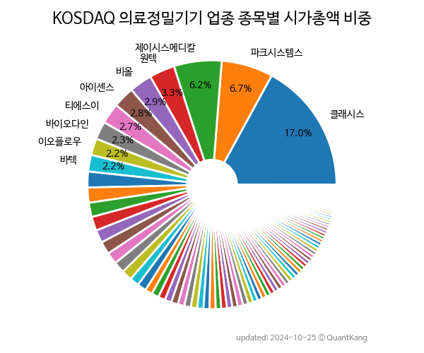

 

 
> **종목 목록 (71)**

| **종목** | **PER** | **PBR** | **DIV** | **비중** |
| :------- | ------: | ------: | ------: | -------: |
| [클래시스](/214150/) | 29.6 | 9.7 | 0.3<small>%</small> | 14.4<small>%</small> |
| [파크시스템스](/140860/) | 45.4 | 10.7 | 0.2<small>%</small> | 8.3<small>%</small> |
| [제이시스메디칼](/287410/) | 27.7 | 9.5 | - | 5.2<small>%</small> |
| [원텍](/336570/) | 54.4 | 13.2 | - | 4.9<small>%</small> |
| [아이센스](/099190/) | 45.4 | 2.6 | 1.3<small>%</small> | 4.7<small>%</small> |
| 비올 | 45.2 | 13.4 | 0.1<small>%</small> | 3.4<small>%</small> |
| [바텍](/043150/) | 6.3 | 1.4 | 0.3<small>%</small> | 3.1<small>%</small> |
| 인바디 | 10.6 | 1.7 | 1.1<small>%</small> | 2.4<small>%</small> |
| 인터로조 | 14.6 | 1.8 | 2.2<small>%</small> | 2.4<small>%</small> |
| 디오 | - | 2.0 | - | 2.2<small>%</small> |
| 바이오다인 | 61.3 | 7.4 | - | 2.2<small>%</small> |
| 레이 | 41.0 | 2.7 | - | 2.2<small>%</small> |
| 디알텍 | 40.3 | 4.0 | - | 1.9<small>%</small> |
| 뷰웍스 | 9.9 | 1.3 | 2.4<small>%</small> | 1.8<small>%</small> |
| 하이비젼시스템 | 10.8 | 1.3 | 0.6<small>%</small> | 1.8<small>%</small> |
| 큐리옥스바이오시스템즈 | - | 5.2 | - | 1.8<small>%</small> |
| 시너지이노베이션 | 14.3 | 1.7 | - | 1.5<small>%</small> |
| 휴비츠 | 12.0 | 2.0 | 1.0<small>%</small> | 1.5<small>%</small> |
| 퓨런티어 | 110.9 | 5.9 | - | 1.5<small>%</small> |
| 인트로메딕 | - | 14.8 | - | 1.5<small>%</small> |
| 엠아이텍 | 11.2 | 2.6 | 1.8<small>%</small> | 1.4<small>%</small> |
| 엘앤케이바이오 | - | 10.6 | - | 1.1<small>%</small> |
| 셀바스헬스케어 | 56.4 | 4.5 | - | 1.1<small>%</small> |
| 빅텍 | - | 2.7 | - | 1.1<small>%</small> |
| 하이로닉 | 46.8 | 2.3 | - | 1.0<small>%</small> |
| 코렌텍 | 81.8 | 2.2 | - | 1.0<small>%</small> |
| HLB파나진 | 52.6 | 3.7 | - | 1.0<small>%</small> |
| 레이언스 | 6.5 | 0.6 | 3.3<small>%</small> | 1.0<small>%</small> |
| 덴티스 | 108.1 | 4.5 | - | 0.9<small>%</small> |
| 이루다 | 15.0 | 2.7 | - | 0.9<small>%</small> |
| 시스웍 | - | 2.6 | - | 0.8<small>%</small> |
| 디알젬 | 8.4 | 1.6 | 2.9<small>%</small> | 0.8<small>%</small> |
| [이오플로우](/294090/) | - | 1.2 | - | 0.8<small>%</small> |
| 휴센텍 | 8.5 | 3.0 | - | 0.8<small>%</small> |
| 노을 | - | 7.6 | - | 0.8<small>%</small> |
| 파이버프로 | - | 4.0 | - | 0.8<small>%</small> |
| 수젠텍 | 4.1 | 0.8 | 2.2<small>%</small> | 0.8<small>%</small> |
| 세코닉스 | - | 1.0 | - | 0.7<small>%</small> |
| 메디아나 | 10.5 | 1.2 | 0.7<small>%</small> | 0.7<small>%</small> |
| 오스테오닉 | 107.0 | 2.4 | - | 0.7<small>%</small> |
| 피제이전자 | 14.5 | 0.8 | 1.5<small>%</small> | 0.7<small>%</small> |
| 위드텍 | 8.2 | 0.9 | 1.0<small>%</small> | 0.6<small>%</small> |
| 제노레이 | 7.0 | 1.1 | 2.3<small>%</small> | 0.6<small>%</small> |
| 리메드 | 24.2 | 3.2 | - | 0.6<small>%</small> |
| 센코 | 95.8 | 2.2 | - | 0.6<small>%</small> |
| 마이크로디지탈 | - | 16.3 | - | 0.6<small>%</small> |
| 이노시스 | - | 1.6 | - | 0.6<small>%</small> |
| 나노엔텍 | 19.9 | 1.6 | - | 0.6<small>%</small> |
| 삼양옵틱스 | 11.1 | 2.5 | 10.0<small>%</small> | 0.6<small>%</small> |
| 미코바이오메드 | - | 2.7 | - | 0.5<small>%</small> |
| 코메론 | 5.0 | 0.4 | 2.8<small>%</small> | 0.5<small>%</small> |
| 퀀타매트릭스 | - | 1.9 | - | 0.5<small>%</small> |
| 피에스텍 | - | 0.5 | 5.6<small>%</small> | 0.4<small>%</small> |
| 플라즈맵 | - | 6.3 | - | 0.4<small>%</small> |
| 피엠티 | - | 1.2 | - | 0.4<small>%</small> |
| 진시스템 | - | 1.8 | - | 0.4<small>%</small> |
| 코아시아씨엠 | - | 0.8 | - | 0.4<small>%</small> |
| 프리시젼바이오 | - | 1.8 | - | 0.4<small>%</small> |
| 얼라인드 | 25.8 | 2.1 | - | 0.4<small>%</small> |
| 넥스트아이 | - | 0.6 | - | 0.4<small>%</small> |
| 옴니시스템 | 75.2 | 0.5 | - | 0.4<small>%</small> |
| 이즈미디어 | - | 1.9 | - | 0.3<small>%</small> |
| 멕아이씨에스 | - | 0.8 | 0.9<small>%</small> | 0.3<small>%</small> |
| 비스토스 | - | 3.0 | - | 0.3<small>%</small> |
| 네오펙트 | - | 3.6 | - | 0.3<small>%</small> |
| 씨유메디칼 | 4.1 | 0.6 | - | 0.3<small>%</small> |
| 프로티아 | 26.7 | 2.1 | - | 0.2<small>%</small> |
| 세종메디칼 | - | 1.3 | - | 0.2<small>%</small> |
| 지티지웰니스 | - | 6.0 | - | 0.2<small>%</small> |
| 솔고바이오 | - | 0.9 | - | 0.2<small>%</small> |
| 노블엠앤비 | - | 0.3 | - | 0.1<small>%</small> |

---
