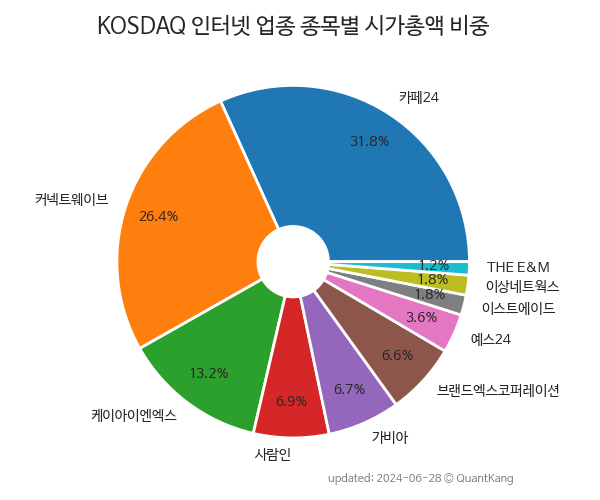

 

 
> **종목 목록 (10)**

| **종목** | **PER** | **PBR** | **DIV** | **비중** |
| :------- | ------: | ------: | ------: | -------: |
| [커넥트웨이브](/119860/) | 60.8 | 0.9 | - | 25.2<small>%</small> |
| 카페24 | - | 3.2 | - | 20.2<small>%</small> |
| 케이아이엔엑스 | 19.5 | 3.4 | 0.6<small>%</small> | 19.3<small>%</small> |
| 가비아 | 10.5 | 1.9 | 0.4<small>%</small> | 9.1<small>%</small> |
| 사람인 | 6.5 | 1.1 | 4.1<small>%</small> | 7.8<small>%</small> |
| 브랜드엑스코퍼레이션 | 16.6 | 2.1 | 2.1<small>%</small> | 6.5<small>%</small> |
| 예스24 | 88.2 | 0.7 | 4.0<small>%</small> | 4.9<small>%</small> |
| 줌인터넷 | - | 2.7 | - | 3.2<small>%</small> |
| 이상네트웍스 | 5.4 | 0.5 | 1.8<small>%</small> | 2.1<small>%</small> |
| THE E&M | - | 0.6 | - | 1.5<small>%</small> |

---
