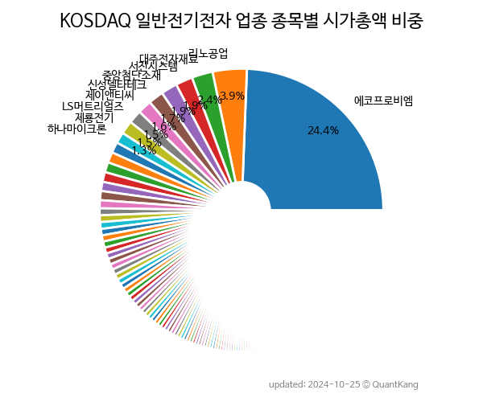

 

 
> **종목 목록 (74)**

| **종목** | **PER** | **PBR** | **DIV** | **비중** |
| :------- | ------: | ------: | ------: | -------: |
| [에코프로비엠](/247540/) | 96.7 | 19.9 | 0.2<small>%</small> | 54.6<small>%</small> |
| [엘앤에프](/066970/) | 23.3 | 5.0 | 0.3<small>%</small> | 14.0<small>%</small> |
| LS머트리얼즈 | 253.3 | 22.1 | 0.1<small>%</small> | 5.6<small>%</small> |
| 신성델타테크 | 99.7 | 10.3 | 0.2<small>%</small> | 3.4<small>%</small> |
| [더블유씨피](/393890/) | 23.7 | 1.6 | - | 3.1<small>%</small> |
| [인텔리안테크](/189300/) | 40.6 | 3.6 | 0.1<small>%</small> | 1.5<small>%</small> |
| [제이앤티씨](/204270/) | - | 1.9 | - | 1.3<small>%</small> |
| [RFHIC](/218410/) | 176.9 | 1.8 | 0.5<small>%</small> | 1.0<small>%</small> |
| [탑머티리얼](/360070/) | 35.7 | 4.9 | - | 0.9<small>%</small> |
| 덕산하이메탈 | 53.1 | 1.1 | - | 0.6<small>%</small> |
| 티엘비 | 9.6 | 2.6 | 1.0<small>%</small> | 0.6<small>%</small> |
| 대아티아이 | 28.8 | 2.2 | - | 0.5<small>%</small> |
| 에브리봇 | 34.3 | 3.8 | - | 0.5<small>%</small> |
| 그린리소스 | 52.7 | 8.9 | - | 0.5<small>%</small> |
| 포인트모바일 | 37.8 | 4.8 | - | 0.5<small>%</small> |
| 세경하이테크 | 13.8 | 1.3 | - | 0.5<small>%</small> |
| 아이쓰리시스템 | 34.7 | 2.7 | 0.7<small>%</small> | 0.4<small>%</small> |
| 우리기술 | 57.2 | 2.1 | - | 0.4<small>%</small> |
| 파세코 | 21.9 | 1.9 | 2.0<small>%</small> | 0.4<small>%</small> |
| 아비코전자 | 20.0 | 1.6 | 0.5<small>%</small> | 0.4<small>%</small> |
| 이랜시스 | 34.9 | 4.3 | 0.8<small>%</small> | 0.4<small>%</small> |
| 에이프로 | - | 3.0 | - | 0.4<small>%</small> |
| 지투파워 | 229.3 | 5.7 | - | 0.4<small>%</small> |
| 위닉스 | 72.7 | 0.8 | 4.0<small>%</small> | 0.4<small>%</small> |
| 슈프리마 | 9.6 | 0.9 | - | 0.4<small>%</small> |
| 범한퓨얼셀 | 67.0 | 1.6 | - | 0.3<small>%</small> |
| 우리바이오 | 7.4 | 0.9 | - | 0.3<small>%</small> |
| 덕우전자 | 12.5 | 1.5 | 0.7<small>%</small> | 0.3<small>%</small> |
| 와이엠텍 | 13.1 | 2.8 | 2.5<small>%</small> | 0.3<small>%</small> |
| 지오엘리먼트 | 24.1 | 3.3 | 0.8<small>%</small> | 0.3<small>%</small> |
| 엑스페릭스 | 38.7 | 2.5 | - | 0.3<small>%</small> |
| 자이글 | - | 2.7 | - | 0.2<small>%</small> |
| 에스퓨얼셀 | 133.2 | 1.6 | 0.3<small>%</small> | 0.2<small>%</small> |
| 트루윈 | - | 1.6 | - | 0.2<small>%</small> |
| 대한광통신 | - | 1.0 | - | 0.2<small>%</small> |
| 제일전기공업 | 14.3 | 0.9 | 2.1<small>%</small> | 0.2<small>%</small> |
| 엔시스 | 29.5 | 1.8 | 0.6<small>%</small> | 0.2<small>%</small> |
| 서남 | - | 11.9 | - | 0.2<small>%</small> |
| 프리엠스 | 66.4 | 1.5 | 0.3<small>%</small> | 0.2<small>%</small> |
| 서호전기 | 8.4 | 1.0 | 8.1<small>%</small> | 0.2<small>%</small> |
| 유라테크 | 107.6 | 0.8 | 1.2<small>%</small> | 0.2<small>%</small> |
| 에이텀 | - | 34.3 | - | 0.2<small>%</small> |
| 에스텍 | 7.4 | 0.5 | 3.6<small>%</small> | 0.2<small>%</small> |
| 머큐리 | 157.8 | 0.9 | - | 0.2<small>%</small> |
| 프로이천 | 19.3 | 2.7 | 0.6<small>%</small> | 0.2<small>%</small> |
| 에스씨디 | 10.3 | 0.7 | 2.0<small>%</small> | 0.2<small>%</small> |
| 아이엘사이언스 | 38.0 | 4.8 | - | 0.2<small>%</small> |
| TJ미디어 | 17.8 | 0.9 | 4.0<small>%</small> | 0.2<small>%</small> |
| 지엔씨에너지 | 2.6 | 0.6 | 1.1<small>%</small> | 0.1<small>%</small> |
| 하츠 | 13.8 | 0.7 | 1.3<small>%</small> | 0.1<small>%</small> |
| DH오토웨어 | - | 1.0 | - | 0.1<small>%</small> |
| 파워넷 | 33.5 | 0.7 | - | 0.1<small>%</small> |
| 이지트로닉스 | - | 1.0 | 1.6<small>%</small> | 0.1<small>%</small> |
| 상신전자 | 53.5 | 1.5 | - | 0.1<small>%</small> |
| 나노씨엠에스 | 267.4 | 1.8 | - | 0.1<small>%</small> |
| 에이에프더블류 | - | 0.8 | - | 0.1<small>%</small> |
| 파버나인 | 6.4 | 0.6 | 2.8<small>%</small> | 0.1<small>%</small> |
| 라닉스 | - | 3.1 | - | 0.1<small>%</small> |
| 삼진 | 26.2 | 0.5 | 1.4<small>%</small> | 0.1<small>%</small> |
| 유니온커뮤니티 | 18.0 | 1.0 | - | 0.1<small>%</small> |
| 서전기전 | - | 1.3 | - | 0.1<small>%</small> |
| 윌링스 | - | 1.4 | - | 0.1<small>%</small> |
| 포커스에이치엔에스 | 14.6 | 1.9 | 1.4<small>%</small> | 0.1<small>%</small> |
| 피앤씨테크 | 12.6 | 0.5 | - | 0.1<small>%</small> |
| KH 전자 | - | 0.3 | - | 0.1<small>%</small> |
| MIT | - | 5.2 | - | 0.1<small>%</small> |
| 소룩스 | - | 9.8 | 1.5<small>%</small> | 0.1<small>%</small> |
| 비츠로시스 | - | 1.5 | - | 0.1<small>%</small> |
| 에이치앤비디자인 | - | 0.6 | - | 0.1<small>%</small> |
| 삼영에스앤씨 | - | 1.1 | - | 0.1<small>%</small> |
| 인터엠 | 25.2 | 0.8 | - | 0.1<small>%</small> |
| 파인테크닉스 | 0.2 | 0.3 | - | 0.1<small>%</small> |
| 피피아이 | 44.2 | 4.7 | - | 0.0<small>%</small> |
| 위니아 | - | 0.8 | - | 0.0<small>%</small> |

---
