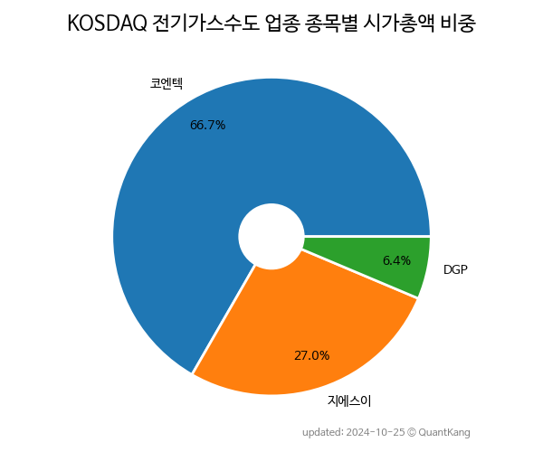

 

 
> **종목 목록 (2)**

| **종목** | **PER** | **PBR** | **DIV** | **비중** |
| :------- | ------: | ------: | ------: | -------: |
| 지에스이 | 18.7 | 1.2 | 1.1<small>%</small> | 73.8<small>%</small> |
| DGP | - | 0.9 | - | 26.2<small>%</small> |

---
