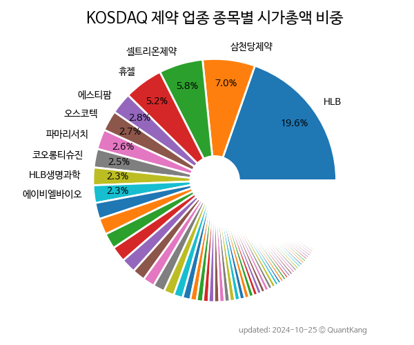

 

 
> **종목 목록 (119)**

| **종목** | **PER** | **PBR** | **DIV** | **비중** |
| :------- | ------: | ------: | ------: | -------: |
| HLB | - | 9.1 | - | 13.4% |
| 셀트리온제약 | 157.8 | 11.5 | - | 8.8% |
| 휴젤 | 33.3 | 2.4 | - | 4.3% |
| 삼천당제약 | 266.4 | 9.0 | - | 3.7% |
| 메디톡스 | 37.6 | 3.1 | 0.5% | 3.4% |
| 케어젠 | 40.7 | 5.2 | 2.4% | 2.7% |
| 파마리서치 | 28.8 | 3.4 | 0.6% | 2.7% |
| HK이노엔 | 31.4 | 1.0 | 0.8% | 2.7% |
| 씨젠 | 6.2 | 1.0 | 3.6% | 2.6% |
| 에스티팜 | 63.3 | 3.4 | 0.8% | 2.6% |
| HLB생명과학 | - | 4.4 | - | 2.3% |
| 에이비엘바이오 | 316.4 | 14.6 | - | 2.3% |
| 차바이오텍 | - | 3.3 | - | 2.2% |
| 코오롱티슈진 | - | - | - | 1.9% |
| 동국제약 | 14.5 | 1.5 | 1.0% | 1.7% |
| 오스코텍 | - | 6.0 | - | 1.7% |
| 바이오니아 | 60.4 | 3.1 | - | 1.6% |
| 보로노이 | - | 17.1 | - | 1.5% |
| 펩트론 | - | 11.3 | - | 1.3% |
| 엘앤씨바이오 | 130.0 | 6.0 | 0.2% | 1.3% |
| 콜마비앤에이치 | 12.2 | 1.2 | 1.8% | 1.1% |
| 네이처셀 | - | 8.1 | - | 1.1% |
| 엔케이맥스 | - | 5.2 | - | 1.1% |
| 휴온스 | 19.6 | 1.6 | 1.6% | 1.0% |
| 바디텍메드 | 17.4 | 2.5 | 0.8% | 1.0% |
| 바이오플러스 | 18.8 | 3.5 | 1.0% | 0.9% |
| 유바이오로직스 | - | 3.0 | - | 0.8% |
| 티앤엘 | 17.3 | 3.4 | 1.0% | 0.8% |
| 휴메딕스 | 12.9 | 1.9 | 1.7% | 0.7% |
| CMG제약 | - | 1.7 | - | 0.7% |
| 코오롱생명과학 | 145.7 | 1.8 | - | 0.7% |
| 코미팜 | - | 5.1 | - | 0.7% |
| 엑세스바이오 | - | - | - | 0.7% |
| 국전약품 | 32.4 | 3.2 | - | 0.6% |
| 휴온스글로벌 | - | 0.6 | 2.2% | 0.6% |
| 메디포스트 | 47.0 | 0.8 | - | 0.6% |
| 제테마 | 181.7 | 4.7 | - | 0.6% |
| 프레스티지바이오로직스 | - | 2.6 | - | 0.6% |
| 바이넥스 | 20.6 | 1.3 | - | 0.6% |
| 코아스템켐온 | - | 4.0 | - | 0.6% |
| 인트론바이오 | 44.6 | 2.3 | - | 0.6% |
| 한국비엔씨 | - | 1.3 | - | 0.5% |
| 휴마시스 | 1.2 | 0.6 | - | 0.5% |
| 한국파마 | - | 3.8 | 0.2% | 0.5% |
| 씨티씨바이오 | 32.1 | 2.3 | - | 0.5% |
| 퓨쳐켐 | - | 2.9 | - | 0.5% |
| 앱클론 | - | 5.4 | - | 0.4% |
| 티앤알바이오팹 | - | 5.0 | - | 0.4% |
| 이수앱지스 | - | 2.9 | - | 0.4% |
| 경동제약 | 14.2 | 0.7 | 6.3% | 0.4% |
| 나이벡 | - | 4.8 | - | 0.4% |
| 녹십자웰빙 | 22.4 | 1.9 | 1.0% | 0.4% |
| 한스바이오메드 | 19.9 | 2.6 | - | 0.4% |
| 지놈앤컴퍼니 | - | 1.6 | - | 0.4% |
| 대한약품 | 6.6 | 0.7 | 2.4% | 0.4% |
| 대화제약 | 138.9 | 2.0 | 1.7% | 0.4% |
| 동구바이오제약 | 24.2 | 1.6 | 1.9% | 0.4% |
| 엔지켐생명과학 | - | 0.8 | - | 0.3% |
| 비보존 제약 | - | 1.4 | - | 0.3% |
| 바이오솔루션 | - | 3.3 | - | 0.3% |
| 화일약품 | - | 0.8 | - | 0.3% |
| 테라젠이텍스 | 13.7 | 0.9 | - | 0.3% |
| 대한뉴팜 | 5.1 | 1.2 | 1.1% | 0.3% |
| 선바이오 | 135.1 | 5.2 | 0.5% | 0.3% |
| 안국약품 | 15.4 | 0.7 | 2.4% | 0.3% |
| 세운메디칼 | 11.5 | 1.0 | 2.2% | 0.3% |
| 인벤티지랩 | - | 3.8 | - | 0.3% |
| 바이오에프디엔씨 | 26.9 | 2.1 | - | 0.3% |
| JW신약 | 80.4 | 2.0 | - | 0.3% |
| 피씨엘 | - | 2.8 | - | 0.3% |
| 위더스제약 | 45.2 | 1.4 | - | 0.3% |
| 아이큐어 | - | 1.2 | - | 0.2% |
| 강스템바이오텍 | - | 1.7 | - | 0.2% |
| 중앙백신 | 27.1 | 1.1 | 0.9% | 0.2% |
| 쎌바이오텍 | 9.6 | 0.7 | 3.9% | 0.2% |
| 유틸렉스 | - | 1.2 | - | 0.2% |
| 옵티팜 | - | 3.5 | - | 0.2% |
| 삼아제약 | 8.0 | 0.5 | 2.6% | 0.2% |
| 바이젠셀 | - | 1.1 | - | 0.2% |
| 하이텍팜 | 16.8 | 1.0 | 0.8% | 0.2% |
| 메타바이오메드 | 35.9 | 1.6 | 0.5% | 0.2% |
| 애니젠 | - | 6.9 | - | 0.2% |
| 대봉엘에스 | 11.1 | 0.8 | 0.6% | 0.2% |
| 에스바이오메딕스 | - | - | - | 0.2% |
| 셀루메드 | - | 1.7 | - | 0.2% |
| 녹십자엠에스 | - | 2.8 | - | 0.2% |
| 테고사이언스 | 353.0 | 1.9 | - | 0.2% |
| 신신제약 | 20.5 | 1.5 | 0.8% | 0.2% |
| 파멥신 | - | 3.0 | - | 0.2% |
| 제노포커스 | - | 3.6 | - | 0.2% |
| 알리코제약 | 10.3 | 0.9 | 2.4% | 0.2% |
| 신일제약 | 6.7 | 0.7 | 1.4% | 0.2% |
| 옵투스제약 | 16.4 | 0.6 | 1.9% | 0.2% |
| 에스텍파마 | - | 0.7 | 1.5% | 0.2% |
| 제놀루션 | 4.8 | 0.7 | - | 0.2% |
| 아스타 | - | 10.4 | - | 0.2% |
| 알피바이오 | 14.1 | 0.8 | - | 0.2% |
| 고려제약 | 6.2 | 0.9 | 2.6% | 0.2% |
| 피플바이오 | - | 13.3 | - | 0.2% |
| 팬젠 | - | 4.2 | - | 0.2% |
| 진양제약 | 5.4 | 0.8 | 2.5% | 0.2% |
| 샤페론 | - | 2.4 | - | 0.2% |
| 젠큐릭스 | - | 6.3 | - | 0.2% |
| 브릿지바이오테라퓨틱스 | - | 1.1 | - | 0.1% |
| 에스씨엠생명과학 | - | 2.0 | - | 0.1% |
| 원바이오젠 | 18.5 | 2.2 | 0.6% | 0.1% |
| 제일바이오 | - | 1.7 | - | 0.1% |
| 조아제약 | 103.8 | 1.1 | - | 0.1% |
| 비씨월드제약 | 196.1 | 0.7 | 1.6% | 0.1% |
| 이노테라피 | - | 3.4 | - | 0.1% |
| 경남제약 | - | 0.5 | - | 0.1% |
| 대성미생물 | 26.3 | 1.2 | 0.6% | 0.1% |
| 그린생명과학 | - | 0.8 | - | 0.1% |
| 서울제약 | 38.0 | 1.2 | - | 0.1% |
| 한국유니온제약 | - | 0.7 | - | 0.1% |
| 우진비앤지 | 42.8 | 1.0 | - | 0.1% |
| 셀레믹스 | - | 1.9 | - | 0.1% |
| 애드바이오텍 | 11.4 | 1.9 | - | 0.1% |
| 올리패스 | - | 1.7 | - | 0.0% |

---
