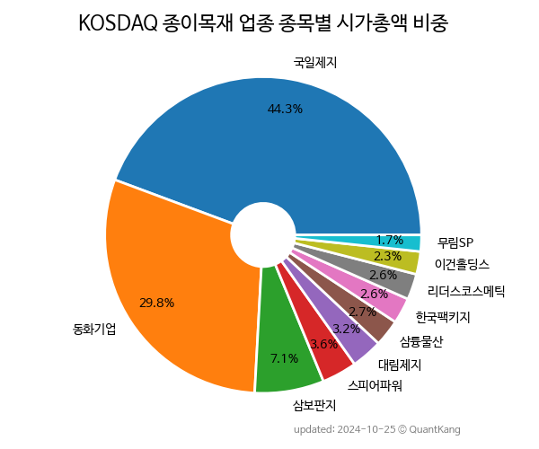

 

 
> **종목 목록 (10)**

| **종목** | **PER** | **PBR** | **DIV** | **비중** |
| :------- | ------: | ------: | ------: | -------: |
| [동화기업](/025900/) | 32.4 | 1.9 | - | 62.5<small>%</small> |
| 삼보판지 | 3.2 | 0.4 | 1.6<small>%</small> | 8.3<small>%</small> |
| 대양제지 | - | 0.7 | 0.9<small>%</small> | 5.5<small>%</small> |
| 스피어파워 | - | 8.6 | - | 5.1<small>%</small> |
| 국일제지 | - | 1.9 | - | 4.6<small>%</small> |
| 대림제지 | 3.0 | 0.3 | 1.2<small>%</small> | 3.4<small>%</small> |
| 이건홀딩스 | 30.7 | 0.4 | 1.7<small>%</small> | 3.0<small>%</small> |
| 한국팩키지 | - | 0.9 | 1.7<small>%</small> | 2.8<small>%</small> |
| 삼륭물산 | - | 1.0 | 1.9<small>%</small> | 2.7<small>%</small> |
| 무림SP | - | 0.2 | 0.8<small>%</small> | 2.0<small>%</small> |

