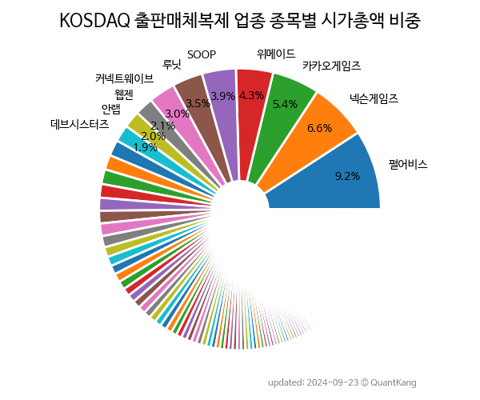

 

 
> **종목 목록 (26)**

| **종목** | **PER** | **PBR** | **DIV** | **비중** |
| :------- | ------: | ------: | ------: | -------: |
| 넵튠 | - | 0.8 | - | 11.6<small>%</small> |
| 와이더플래닛 | - | 19.1 | - | 8.3<small>%</small> |
| 양지사 | 148.1 | 1.0 | 0.4<small>%</small> | 7.9<small>%</small> |
| 녹원씨엔아이 | - | 3.2 | - | 7.0<small>%</small> |
| 신테카바이오 | - | 5.3 | - | 7.0<small>%</small> |
| 드림시큐리티 | 19.2 | 2.2 | - | 6.9<small>%</small> |
| 고스트스튜디오 | - | - | - | 6.8<small>%</small> |
| 메가스터디 | 6.5 | 0.4 | 9.9<small>%</small> | 4.7<small>%</small> |
| SBI핀테크솔루션즈 | - | - | - | 4.0<small>%</small> |
| 나무기술 | 264.0 | 2.2 | - | 3.4<small>%</small> |
| NE능률 | 19.6 | 1.0 | 1.1<small>%</small> | 3.3<small>%</small> |
| SM Life Design | 35.7 | 1.7 | - | 3.3<small>%</small> |
| FSN | - | 0.7 | - | 3.0<small>%</small> |
| 웨이버스 | - | 2.8 | - | 2.8<small>%</small> |
| 위세아이텍 | 15.5 | 2.1 | 1.5<small>%</small> | 2.7<small>%</small> |
| 수산아이앤티 | 27.7 | 0.8 | 1.2<small>%</small> | 2.6<small>%</small> |
| 썸에이지 | - | 1.6 | - | 2.1<small>%</small> |
| 아이스크림에듀 | 63.4 | 0.8 | - | 2.0<small>%</small> |
| 비유테크놀러지 | - | 1.6 | - | 1.6<small>%</small> |
| 디지캡 | 43.4 | 0.9 | 0.7<small>%</small> | 1.6<small>%</small> |
| 예림당 | - | 0.3 | - | 1.6<small>%</small> |
| 소프트캠프 | 41.4 | 2.2 | - | 1.4<small>%</small> |
| 지란지교시큐리티 | 23.8 | 0.8 | - | 1.3<small>%</small> |
| 제이엠아이 | 13.5 | 0.8 | - | 1.3<small>%</small> |
| 골드앤에스 | - | 1.8 | - | 1.0<small>%</small> |
| 이퓨쳐 | 7.7 | 1.0 | - | 0.9<small>%</small> |

---
