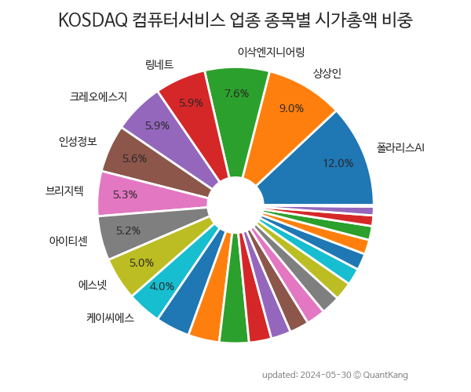

 

 
> **종목 목록 (26)**

| **종목** | **PER** | **PBR** | **DIV** | **비중** |
| :------- | ------: | ------: | ------: | -------: |
| 아이티센 | 138.5 | 4.4 | - | 13.2<small>%</small> |
| 상상인 | 4.0 | 0.2 | 2.9<small>%</small> | 9.3<small>%</small> |
| 인성정보 | 140.8 | 2.2 | - | 8.1<small>%</small> |
| 브리지텍 | 32.9 | 2.2 | 1.6<small>%</small> | 5.7<small>%</small> |
| 슈프리마에이치큐 | 7.6 | 0.6 | - | 5.2<small>%</small> |
| 에스넷 | - | 1.2 | - | 4.7<small>%</small> |
| 케이씨에스 | 106.1 | 4.8 | 1.9<small>%</small> | 4.3<small>%</small> |
| 이삭엔지니어링 | 41.4 | 1.8 | - | 4.2<small>%</small> |
| 오픈베이스 | 14.3 | 1.1 | 0.6<small>%</small> | 4.2<small>%</small> |
| 링네트 | 5.8 | 0.7 | - | 3.6<small>%</small> |
| 리노스 | - | 0.9 | - | 3.4<small>%</small> |
| 큐로컴 | - | 1.6 | - | 3.4<small>%</small> |
| 소프트센 | 5.0 | 0.8 | - | 3.2<small>%</small> |
| 쌍용정보통신 | 5.1 | 1.1 | - | 3.1<small>%</small> |
| 아이크래프트 | 100.2 | 1.5 | - | 3.0<small>%</small> |
| BF랩스 | - | 1.4 | - | 2.8<small>%</small> |
| 휴맥스홀딩스 | - | 0.5 | - | 2.6<small>%</small> |
| 케이씨티 | 75.6 | 1.5 | 2.0<small>%</small> | 2.5<small>%</small> |
| 솔트웨어 | - | 2.2 | - | 2.4<small>%</small> |
| 대신정보통신 | - | 1.7 | 1.6<small>%</small> | 2.3<small>%</small> |
| 플랜티넷 | - | 0.6 | 4.0<small>%</small> | 2.0<small>%</small> |
| 정원엔시스 | 33.6 | 1.0 | - | 2.0<small>%</small> |
| 로지시스 | 163.1 | 1.9 | 1.8<small>%</small> | 1.6<small>%</small> |
| 벨로크 | - | - | - | 1.6<small>%</small> |
| 한솔인티큐브 | - | 1.2 | - | 1.3<small>%</small> |
| 소프트센우 | - | - | - | 0.2<small>%</small> |

---
