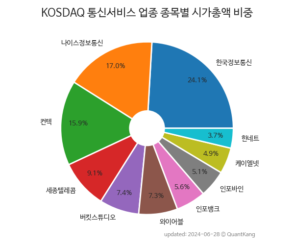

 

 
> **종목 목록 (10)**

| **종목** | **PER** | **PBR** | **DIV** | **비중** |
| :------- | ------: | ------: | ------: | -------: |
| [한국정보통신](/025770/) | 14.9 | 1.3 | - | 23.6<small>%</small> |
| 나이스정보통신 | 5.2 | 0.7 | 2.9<small>%</small> | 16.0<small>%</small> |
| 컨텍 | - | - | - | 16.0<small>%</small> |
| 세종텔레콤 | - | 0.6 | - | 10.1<small>%</small> |
| 와이어블 | 39.7 | 1.3 | 2.5<small>%</small> | 7.5<small>%</small> |
| 버킷스튜디오 | - | 0.6 | - | 6.8<small>%</small> |
| 인포뱅크 | 63.5 | 1.5 | 0.2<small>%</small> | 6.6<small>%</small> |
| 인포바인 | 8.1 | 0.5 | 4.0<small>%</small> | 5.1<small>%</small> |
| 케이엘넷 | 8.9 | 1.2 | 2.9<small>%</small> | 4.7<small>%</small> |
| 한네트 | 26.7 | 1.5 | 3.3<small>%</small> | 3.7<small>%</small> |

---
