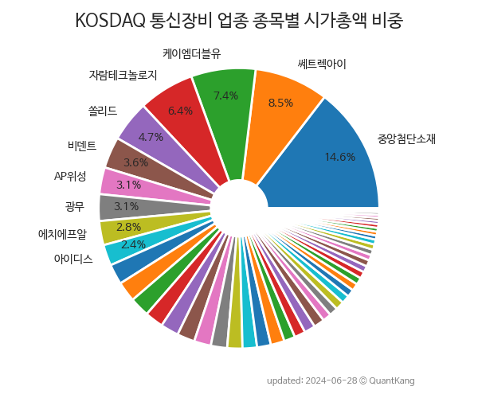

 

 
> **종목 목록 (53)**

| **종목** | **PER** | **PBR** | **DIV** | **비중** |
| :------- | ------: | ------: | ------: | -------: |
| 서진시스템 | 466.3 | 1.4 | - | 10.4% |
| 케이엠더블유 | - | 2.8 | - | 9.1% |
| 쏠리드 | 13.4 | 1.7 | 0.8% | 5.5% |
| 쎄트렉아이 | - | 2.7 | 0.2% | 5.5% |
| AP위성 | 59.4 | 2.8 | 0.4% | 3.6% |
| 비덴트 | - | 0.3 | - | 3.5% |
| 에치에프알 | 3.7 | 1.4 | - | 3.5% |
| 아이디스 | 18.9 | 1.2 | 1.6% | 3.3% |
| 에이스테크 | - | 2.4 | - | 3.1% |
| 이노와이어리스 | 14.6 | 1.5 | 1.2% | 3.1% |
| 팅크웨어 | 52.3 | 1.1 | - | 2.8% |
| 텔레필드 | - | 7.1 | - | 2.4% |
| 자람테크놀로지 | 231.4 | 7.6 | - | 2.3% |
| 유비쿼스 | 7.8 | 1.2 | 2.6% | 2.3% |
| 다산네트웍스 | 0.8 | 0.4 | - | 2.3% |
| 오이솔루션 | - | 1.1 | 1.3% | 2.2% |
| 휴맥스 | - | 0.5 | - | 1.9% |
| 제노코 | 50.8 | 4.1 | 0.3% | 1.9% |
| 삼지전자 | 2.7 | 0.4 | 5.4% | 1.9% |
| 알에프텍 | 10.6 | 0.5 | - | 1.8% |
| 광무 | - | 1.2 | - | 1.7% |
| 홈캐스트 | - | 1.0 | - | 1.4% |
| 텔콘RF제약 | - | 1.1 | - | 1.3% |
| 코콤 | - | 0.7 | - | 1.2% |
| 인포마크 | - | 1.8 | - | 1.2% |
| 가온그룹 | 7.5 | 0.4 | 2.0% | 1.2% |
| 다보링크 | - | 4.2 | - | 1.2% |
| 우리넷 | - | 1.3 | - | 1.1% |
| 라이콤 | - | 1.3 | - | 1.0% |
| 파이오링크 | 6.0 | 1.0 | 2.7% | 1.0% |
| 탑코미디어 | - | 1.5 | - | 1.0% |
| 에스에이티 | 7.8 | 0.7 | 1.8% | 1.0% |
| 아이즈비전 | - | 0.4 | - | 0.9% |
| 현대에이치티 | 30.0 | 0.6 | 1.7% | 0.9% |
| 코위버 | 13.2 | 0.4 | 0.8% | 0.9% |
| 옵티시스 | 7.1 | 1.0 | 1.8% | 0.8% |
| ITX-AI | 27.9 | 3.1 | - | 0.8% |
| 라이트론 | - | 0.9 | - | 0.8% |
| 코맥스 | - | 1.1 | 1.5% | 0.7% |
| 알로이스 | 8.6 | 1.7 | - | 0.7% |
| 파인디지털 | - | 0.5 | 1.0% | 0.7% |
| 옵티코어 | - | 2.1 | - | 0.7% |
| 백금T&A | 10.2 | 1.0 | - | 0.7% |
| 휴림네트웍스 | - | 0.8 | - | 0.6% |
| 인콘 | 7.6 | 0.3 | - | 0.6% |
| 이노인스트루먼트 | 7.3 | 0.4 | - | 0.6% |
| 기산텔레콤 | 12.5 | 1.1 | - | 0.5% |
| 삼영이엔씨 | - | 0.8 | - | 0.5% |
| 케스피온 | - | 2.0 | - | 0.5% |
| 에프알텍 | 3.4 | 0.5 | - | 0.4% |
| CS | - | 1.3 | - | 0.3% |
| 장원테크 | - | 0.2 | - | 0.2% |
| 아리온 | - | - | - | 0.1% |

---
