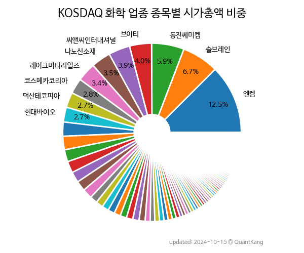

 

 
> **종목 목록 (100)**

| **종목** | **PER** | **PBR** | **DIV** | **비중** |
| :------- | ------: | ------: | ------: | -------: |
| [솔브레인](/357780/) | 14.4 | 3.0 | 0.7<small>%</small> | 10.0<small>%</small> |
| [엔켐](/348370/) | 83.5 | 6.6 | - | 8.4<small>%</small> |
| [나노신소재](/121600/) | 55.9 | 5.4 | 0.2<small>%</small> | 5.3<small>%</small> |
| [성일하이텍](/365340/) | 24.8 | 3.9 | - | 4.9<small>%</small> |
| [레이크머티리얼즈](/281740/) | 39.4 | 12.4 | - | 4.5<small>%</small> |
| [현대바이오](/048410/) | - | 16.8 | - | 4.2<small>%</small> |
| [천보](/278280/) | 24.2 | 2.6 | 0.6<small>%</small> | 3.9<small>%</small> |
| [에코프로에이치엔](/383310/) | 28.0 | 10.4 | 1.0<small>%</small> | 3.9<small>%</small> |
| 씨앤씨인터내셔널 | 44.4 | 5.4 | - | 3.1<small>%</small> |
| 브이티 | 51.8 | 7.4 | - | 2.7<small>%</small> |
| 클리오 | 55.7 | 3.0 | 0.6<small>%</small> | 2.5<small>%</small> |
| 코스메카코리아 | 159.8 | 2.9 | - | 1.8<small>%</small> |
| KG ETS | 0.8 | 0.5 | 1.4<small>%</small> | 1.6<small>%</small> |
| 이엔에프테크놀로지 | 8.1 | 1.0 | 0.6<small>%</small> | 1.6<small>%</small> |
| 마녀공장 | 18.1 | 6.1 | - | 1.6<small>%</small> |
| 켐트로닉스 | 55.6 | 2.3 | 0.9<small>%</small> | 1.5<small>%</small> |
| 동성화인텍 | 39.7 | 2.3 | 3.0<small>%</small> | 1.5<small>%</small> |
| [상아프론테크](/089980/) | 43.5 | 1.7 | 1.0<small>%</small> | 1.4<small>%</small> |
| 에코앤드림 | 4007.1 | 3.7 | - | 1.4<small>%</small> |
| 펌텍코리아 | 16.0 | 1.5 | 1.4<small>%</small> | 1.3<small>%</small> |
| 잉글우드랩 | - | - | - | 1.3<small>%</small> |
| 석경에이티 | 66.8 | 9.6 | - | 1.2<small>%</small> |
| 아이패밀리에스씨 | 36.3 | 5.6 | 0.2<small>%</small> | 1.2<small>%</small> |
| 새빗켐 | 31.3 | 4.5 | 0.5<small>%</small> | 1.2<small>%</small> |
| BGF에코머티리얼즈 | 4.7 | 0.8 | 2.0<small>%</small> | 1.1<small>%</small> |
| 디엔에프 | 42.7 | 1.6 | 0.9<small>%</small> | 1.1<small>%</small> |
| 한국알콜 | 7.4 | 0.5 | 0.5<small>%</small> | 1.0<small>%</small> |
| 피엔에이치테크 | 28.6 | 7.6 | - | 1.0<small>%</small> |
| 중앙첨단소재 | - | 5.0 | - | 1.0<small>%</small> |
| 네오팜 | 12.4 | 1.5 | 2.6<small>%</small> | 0.9<small>%</small> |
| 에이에스텍 | 62.8 | 30.2 | - | 0.9<small>%</small> |
| 연우 | 504.3 | 0.8 | - | 0.8<small>%</small> |
| 켐트로스 | 46.0 | 3.0 | - | 0.8<small>%</small> |
| 티케이케미칼 | 0.6 | 0.2 | - | 0.7<small>%</small> |
| 와이엠티 | - | 1.3 | - | 0.7<small>%</small> |
| 라파스 | - | 3.8 | - | 0.7<small>%</small> |
| 제이씨케미칼 | 7.4 | 1.0 | 2.3<small>%</small> | 0.7<small>%</small> |
| 현대바이오랜드 | 31.6 | 1.2 | 0.7<small>%</small> | 0.6<small>%</small> |
| 라이온켐텍 | 14.0 | 1.0 | 5.8<small>%</small> | 0.5<small>%</small> |
| 동아화성 | 7.5 | 0.8 | 1.6<small>%</small> | 0.5<small>%</small> |
| 대정화금 | 8.7 | 0.8 | 2.4<small>%</small> | 0.5<small>%</small> |
| 코리아나 | 59.6 | 1.1 | - | 0.5<small>%</small> |
| 스톰테크 | 9.0 | 2.4 | - | 0.5<small>%</small> |
| 선진뷰티사이언스 | 5.7 | 1.7 | 0.2<small>%</small> | 0.5<small>%</small> |
| 씨티케이 | - | 0.7 | 0.9<small>%</small> | 0.4<small>%</small> |
| 본느 | 44.6 | 3.5 | - | 0.4<small>%</small> |
| 상보 | 11.4 | 1.5 | - | 0.4<small>%</small> |
| EG | - | 1.5 | - | 0.4<small>%</small> |
| 코디 | - | 3.4 | - | 0.4<small>%</small> |
| 레몬 | - | 7.1 | - | 0.4<small>%</small> |
| HRS | 8.2 | 0.8 | 3.9<small>%</small> | 0.4<small>%</small> |
| KCI | 4.4 | 0.8 | 3.5<small>%</small> | 0.3<small>%</small> |
| CSA 코스믹 | - | 16.3 | - | 0.3<small>%</small> |
| 엔에프씨 | 41.9 | 1.4 | 0.2<small>%</small> | 0.3<small>%</small> |
| 아셈스 | 10.9 | 1.4 | - | 0.3<small>%</small> |
| 잉크테크 | 19.0 | 1.1 | - | 0.3<small>%</small> |
| 진영 | 10.2 | 2.5 | - | 0.3<small>%</small> |
| 소니드 | - | 0.5 | - | 0.3<small>%</small> |
| 케이피엠테크 | - | 0.7 | - | 0.3<small>%</small> |
| 전진바이오팜 | - | 6.6 | - | 0.3<small>%</small> |
| KBG | 19.6 | 1.8 | 1.7<small>%</small> | 0.3<small>%</small> |
| 효성오앤비 | 49.7 | 0.9 | - | 0.3<small>%</small> |
| TKG애강 | 13.8 | 0.7 | - | 0.3<small>%</small> |
| 뷰티스킨 | 15.3 | 1.6 | - | 0.3<small>%</small> |
| 대유 | - | 0.5 | - | 0.2<small>%</small> |
| 누보 | - | 1.9 | - | 0.2<small>%</small> |
| 한일화학 | 12.9 | 0.5 | 0.6<small>%</small> | 0.2<small>%</small> |
| 아우딘퓨쳐스 | - | 3.9 | - | 0.2<small>%</small> |
| 오공 | 7.3 | 0.5 | 1.6<small>%</small> | 0.2<small>%</small> |
| 나노브릭 | - | 5.1 | - | 0.2<small>%</small> |
| 씨큐브 | 8.7 | 0.7 | 3.5<small>%</small> | 0.2<small>%</small> |
| 케이디켐 | 5.9 | 0.5 | 3.4<small>%</small> | 0.2<small>%</small> |
| 세림B&G | 22.5 | 1.7 | - | 0.2<small>%</small> |
| 원풍 | 5.7 | 0.6 | 4.8<small>%</small> | 0.2<small>%</small> |
| 한국큐빅 | 6.9 | 0.6 | 2.2<small>%</small> | 0.2<small>%</small> |
| 폴라리스우노 | 10.5 | 0.5 | - | 0.2<small>%</small> |
| 디케이앤디 | 6.0 | 0.7 | 1.8<small>%</small> | 0.2<small>%</small> |
| 리더스코스메틱 | - | 1.0 | - | 0.2<small>%</small> |
| 나노 | - | 1.4 | - | 0.2<small>%</small> |
| TS트릴리온 | - | 2.1 | - | 0.2<small>%</small> |
| 세화피앤씨 | 28.3 | 1.0 | 1.1<small>%</small> | 0.2<small>%</small> |
| 메디앙스 | - | 0.4 | - | 0.2<small>%</small> |
| 인바이오 | - | 0.8 | - | 0.2<small>%</small> |
| 블레이드 Ent | - | 1.2 | - | 0.2<small>%</small> |
| 에스폴리텍 | - | 0.5 | - | 0.2<small>%</small> |
| 와토스코리아 | 6.6 | 0.5 | 4.1<small>%</small> | 0.1<small>%</small> |
| 뉴보텍 | - | 1.9 | - | 0.1<small>%</small> |
| 엔피케이 | 23.0 | 0.8 | 1.6<small>%</small> | 0.1<small>%</small> |
| 프럼파스트 | 21.5 | 0.8 | 1.5<small>%</small> | 0.1<small>%</small> |
| 엔터파트너즈 | - | 2.0 | - | 0.1<small>%</small> |
| 나노캠텍 | - | 0.8 | - | 0.1<small>%</small> |
| 코스나인 | - | 0.9 | - | 0.1<small>%</small> |
| 이노진 | 18.1 | 3.6 | - | 0.1<small>%</small> |
| 케이엠제약 | - | 0.8 | - | 0.1<small>%</small> |
| 웹스 | - | 0.8 | - | 0.1<small>%</small> |
| 제닉 | - | 1.6 | - | 0.1<small>%</small> |
| 예선테크 | - | 0.8 | - | 0.1<small>%</small> |
| 스타플렉스 | 3.5 | 0.3 | - | 0.1<small>%</small> |
| 에스아이리소스 | - | 1.1 | - | 0.1<small>%</small> |
| 에스디생명공학 | - | 0.6 | - | 0.1<small>%</small> |

---
