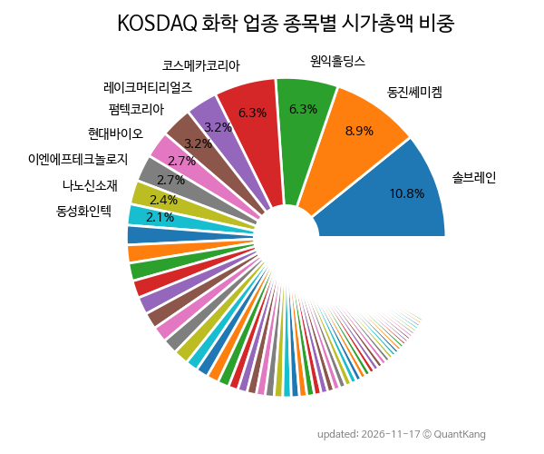

{: .align-center}

> **종목 목록 (127)**

| **종목** | **PER** | **PBR** | **DIV** | **비중** |
| :------- | ------: | ------: | ------: | -------: |
| [솔브레인](/357780/) | 24.2 | 1.8 | 0.9<small>%</small> | 10.8<small>%</small> |
| [동진쎄미켐](/005290/) | 17.3 | 1.6 | 1.9<small>%</small> | 8.9<small>%</small> |
| [원익홀딩스](/030530/) | 89.1 | 2.4 | - | 6.3<small>%</small> |
| [코스메카코리아](/241710/) | 23.1 | 4.2 | 0.4<small>%</small> | 6.3<small>%</small> |
| [레이크머티리얼즈](/281740/) | 85.0 | 4.8 | 0.3<small>%</small> | 3.2<small>%</small> |
| [펌텍코리아](/251970/) | 27.5 | 3.2 | 0.6<small>%</small> | 3.2<small>%</small> |
| [현대바이오](/048410/) | - | 5.2 | - | 2.7<small>%</small> |
| 이엔에프테크놀로지 | 10.8 | 1.2 | 0.5<small>%</small> | 2.7<small>%</small> |
| [나노신소재](/121600/) | 478.7 | 3.1 | 0.4<small>%</small> | 2.4<small>%</small> |
| [동성화인텍](/033500/) | 5.9 | 1.3 | 3.6<small>%</small> | 2.1<small>%</small> |
| 에코프로에이치엔 | 34.2 | 1.5 | 0.9<small>%</small> | 2.0<small>%</small> |
| [브이티](/018290/) | 5.9 | 1.5 | - | 1.8<small>%</small> |
| 성일하이텍 | - | 2.3 | - | 1.8<small>%</small> |
| 원익머트리얼즈 | 8.6 | 0.8 | 1.5<small>%</small> | 1.8<small>%</small> |
| [천보](/278280/) | - | 0.8 | - | 1.8<small>%</small> |
| [엔켐](/348370/) | - | 0.7 | - | 1.7<small>%</small> |
| 엘티씨 | 52.9 | 2.1 | 0.4<small>%</small> | 1.6<small>%</small> |
| 네오팜 | 12.1 | 1.7 | 3.5<small>%</small> | 1.5<small>%</small> |
| 켐트로닉스 | 26.5 | 1.3 | 1.2<small>%</small> | 1.5<small>%</small> |
| [씨앤씨인터내셔널](/352480/) | 12.5 | 0.6 | - | 1.2<small>%</small> |
| 마녀공장 | 24.5 | 1.8 | - | 1.2<small>%</small> |
| 삼양엔씨켐 | 12.9 | 1.6 | - | 1.2<small>%</small> |
| 한국알콜 | 9.7 | 0.6 | 0.8<small>%</small> | 1.1<small>%</small> |
| 클리오 | 13.5 | 0.7 | 2.5<small>%</small> | 1.0<small>%</small> |
| 상아프론테크 | 27.6 | 0.9 | 1.7<small>%</small> | 0.9<small>%</small> |
| 제닉 | 6.0 | 2.8 | - | 0.9<small>%</small> |
| 그래피 | - | 4.8 | - | 0.9<small>%</small> |
| 미래나노텍 | 10.7 | 0.5 | 1.3<small>%</small> | 0.9<small>%</small> |
| 덕산테코피아 | - | 1.4 | - | 0.9<small>%</small> |
| 와이씨켐 | 31.7 | 3.0 | - | 0.9<small>%</small> |
| 티이엠씨 | 16.0 | 1.3 | 1.2<small>%</small> | 0.8<small>%</small> |
| 석경에이티 | 41.2 | 3.5 | - | 0.8<small>%</small> |
| BGF에코머티리얼즈 | 11.9 | 0.4 | 1.9<small>%</small> | 0.7<small>%</small> |
| 바이오비쥬 | 50.3 | 3.6 | 0.7<small>%</small> | 0.7<small>%</small> |
| 잉글우드랩 | - | - | - | 0.7<small>%</small> |
| 티케이케미칼 | 1.4 | 0.1 | - | 0.7<small>%</small> |
| 아이패밀리에스씨 | 6.6 | 1.4 | 3.6<small>%</small> | 0.6<small>%</small> |
| 퓨릿 | 8.2 | 1.2 | 1.6<small>%</small> | 0.6<small>%</small> |
| 디엔에프 | 95.6 | 0.8 | 1.0<small>%</small> | 0.6<small>%</small> |
| 와이엠티 | - | 0.6 | - | 0.6<small>%</small> |
| 엘케이켐 | 27.5 | 2.0 | - | 0.5<small>%</small> |
| 켐트로스 | - | 1.7 | - | 0.5<small>%</small> |
| 현대바이오랜드 | 433.8 | 0.8 | 2.0<small>%</small> | 0.5<small>%</small> |
| 제이아이테크 | 15.5 | 1.4 | 3.0<small>%</small> | 0.5<small>%</small> |
| 씨피시스템 | 49.7 | 2.2 | 2.2<small>%</small> | 0.5<small>%</small> |
| 엔에프씨 | 9.2 | 1.4 | 1.2<small>%</small> | 0.5<small>%</small> |
| 아로마티카 | 12.8 | 1.7 | - | 0.5<small>%</small> |
| 대정화금 | 7.4 | 0.6 | 3.4<small>%</small> | 0.5<small>%</small> |
| 스톰테크 | 9.6 | 1.0 | 12.3<small>%</small> | 0.4<small>%</small> |
| 선진뷰티사이언스 | 11.9 | 0.8 | 3.4<small>%</small> | 0.4<small>%</small> |
| 나노 | 5.9 | 1.0 | - | 0.4<small>%</small> |
| 새빗켐 | - | 1.1 | - | 0.4<small>%</small> |
| 오성첨단소재 | 1.9 | 0.2 | - | 0.4<small>%</small> |
| 아이큐어 | - | 2.0 | - | 0.3<small>%</small> |
| 제이씨케미칼 | - | 0.4 | 1.8<small>%</small> | 0.3<small>%</small> |
| KX하이텍 | 11.2 | 0.4 | - | 0.3<small>%</small> |
| HRS | 5.6 | 0.6 | 6.3<small>%</small> | 0.3<small>%</small> |
| 라파스 | - | 2.2 | - | 0.3<small>%</small> |
| 한켐 | 8.7 | 0.8 | 3.1<small>%</small> | 0.3<small>%</small> |
| 삐아 | 11.9 | 1.3 | 3.5<small>%</small> | 0.3<small>%</small> |
| 라이온켐텍 | 7.7 | 0.5 | 5.4<small>%</small> | 0.3<small>%</small> |
| SY동아 | 2.2 | 0.3 | 7.1<small>%</small> | 0.3<small>%</small> |
| 잉크테크 | 25.8 | 0.8 | - | 0.3<small>%</small> |
| 원풍 | 8.3 | 0.6 | 8.4<small>%</small> | 0.3<small>%</small> |
| 레몬 | - | 6.3 | - | 0.2<small>%</small> |
| 앤디포스 | 5.6 | 0.3 | - | 0.2<small>%</small> |
| 삼양케이씨아이 | 5.4 | 0.4 | 5.1<small>%</small> | 0.2<small>%</small> |
| 코리아나 | - | 0.5 | - | 0.2<small>%</small> |
| 에스디생명공학 | - | 1.9 | - | 0.2<small>%</small> |
| 에이에스텍 | 14.8 | 0.5 | 8.8<small>%</small> | 0.2<small>%</small> |
| 제이투케이바이오 | 17.7 | 1.4 | 3.1<small>%</small> | 0.2<small>%</small> |
| 대진첨단소재 | - | 0.8 | - | 0.2<small>%</small> |
| 씨티케이 | - | 0.2 | 6.3<small>%</small> | 0.2<small>%</small> |
| 코스나인 | - | - | - | 0.2<small>%</small> |
| 아셈스 | 3.7 | 0.5 | 4.2<small>%</small> | 0.2<small>%</small> |
| 나노실리칸첨단소재 | - | 1.2 | - | 0.2<small>%</small> |
| 디케이앤디 | 4.5 | 0.5 | 3.9<small>%</small> | 0.2<small>%</small> |
| 본느 | - | 0.7 | - | 0.2<small>%</small> |
| 신화인터텍 | 12.1 | 0.4 | - | 0.2<small>%</small> |
| 효성오앤비 | 10.7 | 0.4 | - | 0.2<small>%</small> |
| 씨큐브 | 3.2 | 0.3 | - | 0.2<small>%</small> |
| 램테크놀러지 | - | 0.7 | - | 0.2<small>%</small> |
| 케이디켐 | 9.8 | 0.3 | 5.5<small>%</small> | 0.2<small>%</small> |
| 비비씨 | 5.3 | 0.4 | 7.6<small>%</small> | 0.2<small>%</small> |
| 누보 | 29.0 | 0.9 | - | 0.2<small>%</small> |
| 오공 | 5.8 | 0.3 | 2.6<small>%</small> | 0.2<small>%</small> |
| TS트릴리온 | - | 0.8 | - | 0.1<small>%</small> |
| 씨앤투스 | - | 0.2 | 3.9<small>%</small> | 0.1<small>%</small> |
| 한국큐빅 | 6.2 | 0.3 | 5.7<small>%</small> | 0.1<small>%</small> |
| 에코글로우 | - | 1.9 | - | 0.1<small>%</small> |
| 티케이지애강 | - | 0.5 | - | 0.1<small>%</small> |
| 피엔에이치테크 | 10.7 | 0.6 | 6.5<small>%</small> | 0.1<small>%</small> |
| EG | - | 0.6 | - | 0.1<small>%</small> |
| LSK아이로봇 | - | 1.0 | - | 0.1<small>%</small> |
| 지에프씨생명과학 | 32.0 | 0.8 | - | 0.1<small>%</small> |
| 와토스코리아 | - | 0.3 | 12.7<small>%</small> | 0.1<small>%</small> |
| 코디 | 4.3 | 0.4 | - | 0.1<small>%</small> |
| 에스켐 | - | 0.6 | - | 0.1<small>%</small> |
| 뷰티스킨 | - | 0.7 | - | 0.1<small>%</small> |
| 한일화학 | - | 0.3 | - | 0.1<small>%</small> |
| 제이엠아이 | 5.9 | 0.3 | - | 0.1<small>%</small> |
| KBG | 7.7 | 0.4 | 2.6<small>%</small> | 0.1<small>%</small> |
| 폴라리스우노 | 8.1 | 0.2 | - | 0.1<small>%</small> |
| 보원케미칼 | - | - | - | 0.1<small>%</small> |
| 프럼파스트 | 20.7 | 0.5 | 3.1<small>%</small> | 0.1<small>%</small> |
| 아우딘퓨쳐스 | - | 0.7 | - | 0.1<small>%</small> |
| 인바이오 | 20.2 | 0.5 | - | 0.1<small>%</small> |
| 세림B&G | 6.4 | 0.3 | - | 0.1<small>%</small> |
| 이엠앤아이 | - | 1.9 | - | 0.1<small>%</small> |
| 세화피앤씨 | 16.6 | 0.5 | 2.2<small>%</small> | 0.1<small>%</small> |
| CSA 코스믹 | - | 0.6 | - | 0.1<small>%</small> |
| 파커스 | 3.9 | 0.4 | - | 0.1<small>%</small> |
| 엔피케이 | 13.1 | 0.3 | 3.8<small>%</small> | 0.1<small>%</small> |
| 제이케이시냅스 | - | 0.1 | - | 0.1<small>%</small> |
| 스타플렉스 | 5.2 | 0.2 | 4.4<small>%</small> | 0.1<small>%</small> |
| 상보 | - | 0.5 | - | 0.1<small>%</small> |
| 웹스 | 2.8 | 0.3 | - | 0.1<small>%</small> |
| 에스폴리텍 | - | 0.3 | - | 0.1<small>%</small> |
| 이노진 | 48.4 | 1.0 | 7.2<small>%</small> | 0.1<small>%</small> |
| 전진바이오팜 | - | 1.1 | - | 0.1<small>%</small> |
| 베셀 | 0.4 | 0.2 | - | 0.1<small>%</small> |
| 뉴보텍 | 4.1 | 0.3 | 1.7<small>%</small> | 0.1<small>%</small> |
| 진영 | - | 0.2 | - | 0.1<small>%</small> |
| 예선테크 | - | 0.5 | - | 0.0<small>%</small> |
| 케이엠제약 | - | 0.1 | - | 0.0<small>%</small> |
| 에스아이리소스 | - | 0.7 | - | 0.0<small>%</small> |
| 코이즈 | - | - | - | 0.0<small>%</small> |

