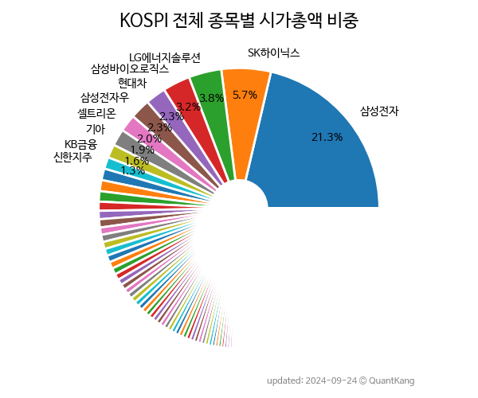

 

 
> **종목 목록**

| **종목** | **PER** | **PBR** | **DIV** | **비중** |
| :------- | ------: | ------: | ------: | -------: |
| 삼성전자 | 9.3 | 1.3 | 1.9% | 22.2% |
| SK하이닉스 | 43.6 | 1.5 | 0.8% | 5.1% |
| LG에너지솔루션 | 116.0 | 4.8 | - | 4.5% |
| 삼성바이오로직스 | 67.3 | 6.1 | - | 2.7% |
| 삼성전자우 | - | - | 2.4% | 2.5% |
| 현대차 | 6.4 | 0.4 | 3.8% | 1.9% |
| 셀트리온 | 46.9 | 6.1 | 0.2% | 1.9% |
| 기아 | 6.5 | 0.9 | 4.0% | 1.8% |
| POSCO홀딩스 | 10.0 | 0.6 | 2.9% | 1.7% |
| NAVER | 43.0 | 1.4 | 0.4% | 1.7% |
| LG화학 | 17.1 | 0.9 | 2.5% | 1.4% |
| 삼성SDI | 12.8 | 1.5 | 0.3% | 1.3% |
| 카카오 | 18.5 | 2.5 | 0.1% | 1.3% |
| 삼성물산 | 9.4 | 0.7 | 2.0% | 1.1% |
| 포스코퓨처엠 | 182.4 | 8.7 | 0.1% | 1.1% |
| KB금융 | 4.5 | 0.4 | 6.0% | 1.0% |
| 신한지주 | 4.4 | 0.4 | 5.6% | 0.9% |
| 현대모비스 | 7.4 | 0.5 | 2.0% | 0.9% |
| LG전자 | 13.8 | 0.8 | 0.8% | 0.7% |
| 에코프로머티 | 736.4 | 39.9 | - | 0.7% |
| 카카오뱅크 | 51.4 | 2.4 | 0.3% | 0.7% |
| HMM | 0.9 | 0.4 | 6.2% | 0.7% |
| 삼성에스디에스 | 11.7 | 1.6 | 1.9% | 0.6% |
| 메리츠금융지주 | 7.1 | 2.2 | 0.2% | 0.6% |
| 삼성생명 | 6.9 | 0.5 | 4.9% | 0.6% |
| 하나금융지주 | 3.5 | 0.3 | 8.1% | 0.6% |
| 한국전력 | - | 0.3 | - | 0.6% |
| SK이노베이션 | 6.2 | 0.5 | 5.1% | 0.6% |
| KT&G | 10.0 | 1.1 | 5.9% | 0.6% |
| LG | 5.8 | 0.4 | 4.2% | 0.6% |
| SK | 7.9 | 0.4 | 3.2% | 0.6% |
| 삼성전기 | 11.4 | 1.4 | 1.4% | 0.5% |
| 삼성화재 | 7.7 | 0.8 | 6.0% | 0.5% |
| SK텔레콤 | 12.0 | 1.0 | 6.7% | 0.5% |
| HD현대중공업 | - | 2.0 | - | 0.5% |
| 두산에너빌리티 | - | 1.4 | - | 0.5% |
| 고려아연 | 10.7 | 1.0 | 4.4% | 0.5% |
| 우리금융지주 | 3.0 | 0.3 | 9.0% | 0.5% |
| 크래프톤 | 18.1 | 1.8 | - | 0.5% |
| 기업은행 | 3.5 | 0.3 | 8.2% | 0.5% |
| 하이브 | 173.9 | 3.3 | - | 0.5% |
| 포스코인터내셔널 | 10.5 | 1.6 | 2.0% | 0.4% |
| KT | 6.5 | 0.5 | 5.8% | 0.4% |
| 포스코DX | 186.7 | 20.6 | 0.1% | 0.4% |
| 대한항공 | 4.8 | 0.9 | 3.3% | 0.4% |
| HD한국조선해양 | - | 0.8 | - | 0.4% |
| 아모레퍼시픽 | 67.5 | 1.6 | 0.5% | 0.4% |
| S-Oil | 3.7 | 0.9 | 8.3% | 0.4% |
| 한화에어로스페이스 | 36.5 | 2.6 | 0.7% | 0.4% |
| 카카오페이 | 127.8 | 3.8 | - | 0.3% |
| SK바이오팜 | - | 21.9 | - | 0.3% |
| 한화오션 | - | 3.6 | - | 0.3% |
| SK스퀘어 | 26.7 | 0.4 | - | 0.3% |
| 삼성중공업 | - | 1.8 | - | 0.3% |
| 현대글로비스 | 5.3 | 0.9 | 3.4% | 0.3% |
| 한국타이어앤테크놀로지 | 8.4 | 0.7 | 1.7% | 0.3% |
| 한미반도체 | 61.4 | 14.4 | 0.4% | 0.3% |
| 한화솔루션 | 17.4 | 0.7 | - | 0.3% |
| 두산로보틱스 | - | 96.7 | - | 0.3% |
| 한국항공우주 | 45.6 | 3.8 | 0.4% | 0.3% |
| 맥쿼리인프라 | - | - | - | 0.3% |
| DB손해보험 | 4.6 | 0.8 | 6.1% | 0.3% |
| SK아이이테크놀로지 | - | 2.5 | - | 0.3% |
| HD현대 | 3.3 | 0.6 | 6.9% | 0.3% |
| 금양 | - | 41.0 | - | 0.3% |
| LG이노텍 | 5.2 | 1.2 | 1.9% | 0.3% |
| 롯데케미칼 | 69.4 | 0.3 | 2.9% | 0.3% |
| LG생활건강 | 22.8 | 0.9 | 1.2% | 0.3% |
| 한진칼 | 7.3 | 2.0 | 0.2% | 0.2% |
| 현대오토에버 | 42.6 | 3.3 | 0.6% | 0.2% |
| SK바이오사이언스 | 39.5 | 2.8 | - | 0.2% |
| 넷마블 | - | 0.8 | - | 0.2% |
| 유한양행 | 46.9 | 2.2 | 0.7% | 0.2% |
| 삼성엔지니어링 | 7.1 | 1.8 | - | 0.2% |
| LG디스플레이 | - | 0.5 | - | 0.2% |
| 두산밥캣 | 7.0 | 0.9 | 3.0% | 0.2% |
| 코스모신소재 | 153.8 | 17.1 | - | 0.2% |
| CJ제일제당 | 7.7 | 0.6 | 1.9% | 0.2% |
| LG유플러스 | 6.3 | 0.5 | 6.7% | 0.2% |
| 엔씨소프트 | 9.0 | 1.2 | 3.5% | 0.2% |
| 현대제철 | 4.1 | 0.2 | 3.2% | 0.2% |
| 한미약품 | 48.8 | 4.6 | 0.2% | 0.2% |
| 코웨이 | 8.7 | 1.7 | 2.4% | 0.2% |
| 현대차2우B | - | - | 6.4% | 0.2% |
| 미래에셋증권 | 6.3 | 0.3 | 3.1% | 0.2% |
| GS | 1.8 | 0.3 | 6.2% | 0.2% |
| 현대건설 | 9.1 | 0.5 | 1.8% | 0.2% |
| 삼성카드 | 5.4 | 0.4 | 7.9% | 0.2% |
| 오리온 | 9.3 | 1.4 | 1.0% | 0.2% |
| HD현대일렉트릭 | 21.9 | 4.3 | 0.5% | 0.2% |
| 한화시스템 | - | 1.7 | 1.3% | 0.2% |
| NH투자증권 | 11.1 | 0.4 | 7.1% | 0.2% |
| 한온시스템 | 160.0 | 1.4 | 5.9% | 0.2% |
| 금호석유 | 3.0 | 0.5 | 4.9% | 0.2% |
| 강원랜드 | 26.0 | 0.9 | 2.4% | 0.2% |
| 삼성증권 | 7.5 | 0.5 | 4.8% | 0.2% |
| 한국금융지주 | 5.2 | 0.4 | 4.1% | 0.2% |
| SKC | - | 1.6 | 1.4% | 0.2% |
| 현대미포조선 | - | 1.4 | - | 0.1% |
| 현대로템 | 14.6 | 1.9 | - | 0.1% |
| 한미사이언스 | 40.6 | 3.8 | 0.5% | 0.1% |
| CJ대한통운 | 14.9 | 0.7 | 0.4% | 0.1% |
| F&F | 6.2 | 3.0 | 2.2% | 0.1% |
| 쌍용C&E | 21.4 | 1.7 | 8.1% | 0.1% |
| 한전기술 | 148.7 | 4.9 | 0.4% | 0.1% |
| LIG넥스원 | 21.5 | 2.8 | 1.2% | 0.1% |
| 현대차우 | - | - | 6.5% | 0.1% |
| 롯데지주 | 10.3 | 0.2 | 6.1% | 0.1% |
| LS | 4.9 | 0.6 | 1.9% | 0.1% |
| 현대해상 | 4.0 | 0.5 | 6.9% | 0.1% |
| CJ | 14.3 | 0.4 | 2.9% | 0.1% |
| BGF리테일 | 12.9 | 2.6 | 2.8% | 0.1% |
| 씨에스윈드 | - | 2.8 | 0.8% | 0.1% |
| 한솔케미칼 | 15.4 | 3.1 | 1.0% | 0.1% |
| 휠라홀딩스 | 7.0 | 1.3 | 4.0% | 0.1% |
| 키움증권 | 5.1 | 0.5 | 3.3% | 0.1% |
| DB하이텍 | 4.0 | 1.4 | 2.5% | 0.1% |
| 농심 | 18.6 | 0.9 | 1.3% | 0.1% |
| GS리테일 | 54.8 | 0.6 | 2.0% | 0.1% |
| 호텔신라 | - | 4.0 | 0.4% | 0.1% |
| BNK금융지주 | 2.9 | 0.2 | 8.9% | 0.1% |
| 아모레G | 39.4 | 0.6 | 0.8% | 0.1% |
| 한화생명 | 2.8 | 0.3 | - | 0.1% |
| 한국가스공사 | 1.3 | 0.2 | - | 0.1% |
| JB금융지주 | 3.5 | 0.4 | 7.9% | 0.1% |
| LG화학우 | - | - | 3.7% | 0.1% |
| 제일기획 | 9.4 | 1.5 | 6.4% | 0.1% |
| 에스원 | 12.0 | 1.2 | 4.7% | 0.1% |
| LS ELECTRIC | 22.0 | 1.3 | 1.6% | 0.1% |
| OCI홀딩스 | 2.7 | 0.6 | 2.5% | 0.1% |
| 롯데쇼핑 | - | 0.2 | 4.8% | 0.1% |
| 팬오션 | 2.9 | 0.4 | 4.1% | 0.1% |
| 이마트 | 1.8 | 0.2 | 3.0% | 0.1% |
| 영원무역 | 2.7 | 0.6 | 3.7% | 0.1% |
| 한올바이오파마 | 6890.0 | 10.4 | - | 0.1% |
| KCC | 44.3 | 0.3 | 4.0% | 0.1% |
| 이수페타시스 | 17.2 | 7.9 | 0.4% | 0.1% |
| 한화 | 1.6 | 0.3 | 3.2% | 0.1% |
| 동서 | 10.0 | 1.1 | 4.3% | 0.1% |
| 동원산업 | 6.3 | 0.5 | 3.0% | 0.1% |
| 효성중공업 | 161.8 | 1.7 | - | 0.1% |
| 대우건설 | 3.2 | 0.4 | - | 0.1% |
| HL만도 | 16.4 | 0.8 | 1.5% | 0.1% |
| 오뚜기 | 4.9 | 0.7 | 2.3% | 0.1% |
| 롯데에너지머티리얼즈 | 35.7 | 1.1 | 0.9% | 0.1% |
| 현대엘리베이 | 20.7 | 1.4 | 1.3% | 0.1% |
| 효성첨단소재 | 12.4 | 2.2 | 4.3% | 0.1% |
| 신세계 | 3.8 | 0.4 | 2.4% | 0.1% |
| 솔루엠 | 31.9 | 5.1 | - | 0.1% |
| 한전KPS | 15.1 | 1.2 | 3.9% | 0.1% |
| 현대위아 | 22.4 | 0.4 | 1.3% | 0.1% |
| 하이트진로 | 17.0 | 1.3 | 4.5% | 0.1% |
| 금호타이어 | - | 1.3 | - | 0.1% |
| 삼양식품 | 18.2 | 3.2 | 0.7% | 0.1% |
| KG모빌리티 | - | 1.3 | - | 0.1% |
| HD현대인프라코어 | 6.2 | 0.9 | 3.3% | 0.1% |
| 에스엘 | 9.3 | 0.9 | 1.9% | 0.1% |
| 한국앤컴퍼니 | 8.7 | 0.4 | 4.3% | 0.1% |
| DL이앤씨 | 3.7 | 0.3 | 2.7% | 0.1% |
| 삼아알미늄 | 61.4 | 7.7 | 0.3% | 0.1% |
| DGB금융지주 | 3.7 | 0.3 | 7.8% | 0.1% |
| 효성티앤씨 | 119.5 | 1.1 | 3.1% | 0.1% |
| DS단석 | 65.1 | 8.4 | - | 0.1% |
| SK가스 | 5.2 | 0.6 | 4.4% | 0.1% |
| 코스맥스 | 65.8 | 2.4 | - | 0.1% |
| 두산퓨얼셀 | 443.6 | 2.6 | - | 0.1% |
| 대덕전자 | 7.7 | 1.6 | 1.4% | 0.1% |
| TCC스틸 | 41.8 | 6.4 | 0.2% | 0.1% |
| 덴티움 | 12.3 | 2.8 | 0.2% | 0.1% |
| 종근당 | 16.9 | 2.2 | 0.9% | 0.1% |
| 더존비즈온 | 64.9 | 2.9 | 0.3% | 0.1% |
| SK네트웍스 | 14.1 | 0.5 | 2.2% | 0.1% |
| 두산 | - | 0.6 | 2.5% | 0.1% |
| 대웅제약 | 29.5 | 2.0 | 0.5% | 0.1% |
| LX세미콘 | 5.6 | 1.4 | 5.6% | 0.1% |
| 에스디바이오센서 | 1.2 | 0.4 | 9.5% | 0.1% |
| 효성 | 77.0 | 0.5 | 7.4% | 0.1% |
| 녹십자 | 19.0 | 0.9 | 1.6% | 0.1% |
| 코스모화학 | 98.6 | 5.4 | - | 0.1% |
| 롯데정밀화학 | 8.3 | 0.5 | 7.4% | 0.1% |
| 롯데칠성 | 10.3 | 0.9 | 2.5% | 0.1% |
| GS건설 | 3.6 | 0.2 | 9.1% | 0.1% |
| 대한전선 | 53.6 | 1.4 | - | 0.1% |
| 롯데웰푸드 | 20.5 | 0.6 | 1.8% | 0.1% |
| 한국콜마 | - | 1.8 | 1.0% | 0.1% |
| 코리안리 | 7.2 | 0.4 | 6.2% | 0.1% |
| 대웅 | 7.9 | 1.0 | 0.5% | 0.1% |
| 코오롱인더 | 6.8 | 0.4 | 3.2% | 0.1% |
| SK케미칼 | 6.4 | 0.5 | 2.4% | 0.1% |
| 제주항공 | - | 3.4 | - | 0.1% |
| 한샘 | - | 1.6 | 1.7% | 0.1% |
| 현대백화점 | 7.0 | 0.2 | 2.8% | 0.1% |
| DL | 19.0 | 0.3 | 2.0% | 0.1% |
| SK오션플랜트 | 33.5 | 1.8 | - | 0.1% |
| LX인터내셔널 | 1.9 | 0.4 | 11.2% | 0.1% |
| 풍산 | 5.8 | 0.6 | 2.7% | 0.1% |
| SK리츠 | - | - | - | 0.1% |
| HDC현대산업개발 | 20.0 | 0.4 | 3.9% | 0.1% |
| 동원시스템즈 | 13.8 | 1.4 | 1.8% | 0.0% |
| 영원무역홀딩스 | 1.9 | 0.4 | 4.2% | 0.0% |
| 후성 | 9.8 | 2.6 | 0.2% | 0.0% |
| 흥아해운 | 42.4 | 7.3 | - | 0.0% |
| 해성디에스 | 6.0 | 2.1 | 1.6% | 0.0% |
| 롯데렌탈 | 10.1 | 0.7 | 3.4% | 0.0% |
| 일진하이솔루스 | 133.8 | 3.0 | - | 0.0% |
| 하나투어 | - | 7.4 | - | 0.0% |
| HD현대건설기계 | 7.7 | 0.6 | 3.7% | 0.0% |
| 이수스페셜티케미컬 | - | - | - | 0.0% |
| 아시아나항공 | 24.1 | 1.3 | - | 0.0% |
| 명신산업 | 10.2 | 2.3 | - | 0.0% |
| 영풍 | 2.2 | 0.2 | 2.1% | 0.0% |
| 드림텍 | 12.8 | 2.0 | 1.6% | 0.0% |
| DN오토모티브 | 4.0 | 0.8 | 3.0% | 0.0% |
| JW중외제약 | 27.6 | 3.4 | 1.0% | 0.0% |
| 오리온홀딩스 | 7.8 | 0.4 | 5.2% | 0.0% |
| 세아제강지주 | 2.9 | 0.5 | 1.1% | 0.0% |
| 미래에셋생명 | 10.5 | 0.5 | - | 0.0% |
| 보령 | 18.7 | 1.5 | 0.8% | 0.0% |
| TKG휴켐스 | 9.4 | 1.0 | 5.0% | 0.0% |
| 미원상사 | 11.6 | 2.4 | 0.9% | 0.0% |
| 대한유화 | - | 0.4 | 0.8% | 0.0% |
| 이노션 | 11.4 | 0.9 | 10.7% | 0.0% |
| 제이알글로벌리츠 | - | - | - | 0.0% |
| 대한해운 | 4.9 | 0.5 | - | 0.0% |
| 한세실업 | 9.1 | 1.4 | 2.5% | 0.0% |
| 한일시멘트 | 10.0 | 0.6 | 5.1% | 0.0% |
| 세방전지 | 17.4 | 0.6 | 1.1% | 0.0% |
| 다우기술 | 2.0 | 0.3 | 3.4% | 0.0% |
| GKL | - | 2.0 | - | 0.0% |
| 한국단자 | 15.6 | 0.9 | 1.0% | 0.0% |
| ESR켄달스퀘어리츠 | - | - | - | 0.0% |
| 롯데손해보험 | - | 1.7 | - | 0.0% |
| PI첨단소재 | 16.6 | 2.2 | 3.0% | 0.0% |
| 한화투자증권 | - | 0.5 | - | 0.0% |
| KG스틸 | 1.4 | 0.4 | 2.0% | 0.0% |
| 넥센타이어 | - | 0.5 | 1.3% | 0.0% |
| 세아베스틸지주 | 7.9 | 0.4 | 5.9% | 0.0% |
| 아이에스동서 | 3.7 | 0.5 | - | 0.0% |
| 롯데리츠 | - | - | - | 0.0% |
| 더블유게임즈 | - | 1.1 | 1.5% | 0.0% |
| LG전자우 | - | - | 1.8% | 0.0% |
| 롯데정보통신 | 23.2 | 1.7 | 1.5% | 0.0% |
| 대신증권 | 8.0 | 0.4 | 8.6% | 0.0% |
| NHN | - | 0.4 | - | 0.0% |
| 진에어 | - | 6.4 | - | 0.0% |
| SK디스커버리 | 1.7 | 0.2 | 4.6% | 0.0% |
| HSD엔진 | - | 3.2 | - | 0.0% |
| OCI | - | - | - | 0.0% |
| 자화전자 | - | 1.8 | - | 0.0% |
| 롯데관광개발 | - | 2.8 | - | 0.0% |
| 녹십자홀딩스 | 20.3 | 0.6 | 2.0% | 0.0% |
| 동양생명 | 9.0 | 0.4 | - | 0.0% |
| 율촌화학 | - | 2.0 | 0.9% | 0.0% |
| 경동나비엔 | 12.6 | 1.3 | 1.1% | 0.0% |
| 미원에스씨 | 10.4 | 1.8 | 1.7% | 0.0% |
| 비에이치 | 4.2 | 1.1 | 1.3% | 0.0% |
| 케이씨텍 | 11.8 | 1.5 | 0.8% | 0.0% |
| CJ CGV | - | 1.0 | - | 0.0% |
| 태광산업 | 1.4 | 0.1 | 0.3% | 0.0% |
| 신풍제약 | - | 1.8 | - | 0.0% |
| 티웨이항공 | - | 8.6 | - | 0.0% |
| 동아쏘시오홀딩스 | 56.0 | 0.6 | 1.5% | 0.0% |
| 대상 | 7.9 | 0.5 | 4.4% | 0.0% |
| KCC글라스 | 6.7 | 0.4 | 6.1% | 0.0% |
| SNT모티브 | 6.6 | 0.6 | 3.7% | 0.0% |
| DI동일 | 9.2 | 0.8 | 1.0% | 0.0% |
| SK디앤디 | 9.0 | 0.9 | 2.9% | 0.0% |
| LS에코에너지 | - | 4.1 | 1.2% | 0.0% |
| 애경케미칼 | 10.0 | 0.8 | 4.4% | 0.0% |
| 동아에스티 | 45.7 | 0.9 | 1.0% | 0.0% |
| 동원F&B | 6.6 | 0.7 | 2.2% | 0.0% |
| 삼성화재우 | - | - | 7.6% | 0.0% |
| 신세계인터내셔날 | 4.9 | 0.7 | 3.1% | 0.0% |
| 신한알파리츠 | - | - | - | 0.0% |
| NICE평가정보 | 10.8 | 1.7 | 3.9% | 0.0% |
| 한국카본 | 23.0 | 1.2 | 1.2% | 0.0% |
| 신영증권 | 5.0 | 0.3 | 6.8% | 0.0% |
| F&F홀딩스 | 4.2 | 0.3 | 2.5% | 0.0% |
| 쿠쿠홀딩스 | 4.2 | 0.5 | 5.1% | 0.0% |
| 삼양홀딩스 | 7.0 | 0.3 | 5.4% | 0.0% |
| 교보증권 | 7.1 | 0.2 | 4.2% | 0.0% |
| 현대지에프홀딩스 | 5.4 | 0.2 | 6.1% | 0.0% |
| 쏘카 | - | 2.2 | - | 0.0% |
| 프레스티지바이오파마 | - | - | - | 0.0% |
| 동국제강 | - | - | - | 0.0% |
| 솔루스첨단소재 | - | 1.9 | 0.7% | 0.0% |
| LX홀딩스 | 3.1 | 0.3 | 4.6% | 0.0% |
| SPC삼립 | 9.1 | 1.2 | 2.8% | 0.0% |
| 빙그레 | 18.0 | 0.8 | 2.9% | 0.0% |
| 케이카 | 16.8 | 2.1 | 7.2% | 0.0% |
| 고려제강 | 6.2 | 0.3 | 1.5% | 0.0% |
| 미래에셋증권2우B | - | - | 5.7% | 0.0% |
| 현대홈쇼핑 | 5.4 | 0.2 | 6.4% | 0.0% |
| 엠씨넥스 | 21.0 | 1.6 | 1.8% | 0.0% |
| 유안타증권 | 11.6 | 0.3 | 4.6% | 0.0% |
| 부광약품 | - | 1.8 | - | 0.0% |
| SNT다이내믹스 | 14.1 | 0.5 | 3.5% | 0.0% |
| 화승엔터프라이즈 | - | 0.9 | 0.6% | 0.0% |
| SBS | 3.0 | 0.6 | 3.9% | 0.0% |
| 엘브이엠씨홀딩스 | - | - | - | 0.0% |
| 유니드 | 4.6 | 0.5 | 2.9% | 0.0% |
| 삼양사 | 6.5 | 0.3 | 2.8% | 0.0% |
| 일진전기 | 20.1 | 1.4 | 1.0% | 0.0% |
| NICE | 12.1 | 0.6 | 3.4% | 0.0% |
| 코리아써키트 | 7.7 | 1.0 | - | 0.0% |
| 한화손해보험 | 2.1 | 2.7 | - | 0.0% |
| 한섬 | 3.3 | 0.3 | 4.0% | 0.0% |
| 쿠쿠홈시스 | 3.9 | 0.6 | 3.5% | 0.0% |
| 애경산업 | 27.0 | 1.2 | 1.8% | 0.0% |
| 일동제약 | - | 2.2 | - | 0.0% |
| SK렌터카 | 21.0 | 0.8 | 1.6% | 0.0% |
| 코람코라이프인프라리츠 | - | - | - | 0.0% |
| 서연이화 | 7.8 | 0.6 | 0.9% | 0.0% |
| KG케미칼 | 1.4 | 0.6 | 1.6% | 0.0% |
| KISCO홀딩스 | 4.6 | 0.4 | 2.2% | 0.0% |
| 남양유업 | - | 0.6 | 0.2% | 0.0% |
| 신성이엔지 | 12.2 | 2.0 | - | 0.0% |
| 세아홀딩스 | 3.4 | 0.2 | 3.8% | 0.0% |
| 바이오노트 | 1.3 | 0.3 | 11.8% | 0.0% |
| 신영증권우 | - | - | 6.9% | 0.0% |
| 삼부토건 | - | 2.0 | - | 0.0% |
| KB스타리츠 | - | - | - | 0.0% |
| E1 | 2.4 | 0.2 | 6.1% | 0.0% |
| 유나이티드제약 | 8.0 | 1.1 | 1.6% | 0.0% |
| 아세아시멘트 | 6.2 | 0.4 | 2.2% | 0.0% |
| 화신 | 5.0 | 1.0 | 0.9% | 0.0% |
| LS네트웍스 | - | 0.7 | - | 0.0% |
| 삼성FN리츠 | - | - | - | 0.0% |
| 대동 | 8.4 | 1.0 | 0.6% | 0.0% |
| 한국자산신탁 | 3.5 | 0.4 | 7.1% | 0.0% |
| 풀무원 | - | 0.9 | 1.0% | 0.0% |
| 광동제약 | 12.4 | 0.6 | 1.4% | 0.0% |
| 현대그린푸드 | - | - | - | 0.0% |
| HDC | - | 0.2 | 3.9% | 0.0% |
| 아세아제지 | 4.0 | 0.5 | 2.4% | 0.0% |
| 삼화콘덴서 | 12.9 | 1.7 | 1.4% | 0.0% |
| 에어부산 | - | 3.0 | - | 0.0% |
| 아세아 | 3.8 | 0.3 | 2.1% | 0.0% |
| 맵스리얼티1 | - | - | - | 0.0% |
| 영진약품 | - | 4.2 | - | 0.0% |
| 송원산업 | 2.8 | 0.6 | 3.2% | 0.0% |
| 남해화학 | 7.5 | 0.7 | 1.4% | 0.0% |
| LF | 2.3 | 0.2 | 5.6% | 0.0% |
| 아모레퍼시픽우 | - | - | 2.0% | 0.0% |
| 대상홀딩스 | 11.6 | 0.5 | 2.7% | 0.0% |
| 삼천리 | 6.2 | 0.2 | 3.3% | 0.0% |
| 유진투자증권 | 22.2 | 0.4 | 1.6% | 0.0% |
| 한화리츠 | - | - | - | 0.0% |
| 이아이디 | - | 0.9 | - | 0.0% |
| KEC | 12.6 | 0.9 | 3.4% | 0.0% |
| 대신증권우 | - | - | 9.2% | 0.0% |
| 풍산홀딩스 | 4.6 | 0.4 | 3.7% | 0.0% |
| 세아제강 | 2.2 | 0.4 | 4.9% | 0.0% |
| 백광산업 | 15.9 | 1.6 | 0.8% | 0.0% |
| STX중공업 | 24.6 | 1.8 | - | 0.0% |
| 퍼시스 | 47.1 | 0.6 | 3.6% | 0.0% |
| 국도화학 | 4.5 | 0.4 | 3.6% | 0.0% |
| 삼성SDI우 | - | - | 0.5% | 0.0% |
| LG헬로비전 | - | 0.6 | 2.7% | 0.0% |
| BGF | 14.5 | 0.2 | 3.1% | 0.0% |
| LX하우시스 | - | 0.4 | 0.5% | 0.0% |
| 파미셀 | 31.3 | 4.3 | - | 0.0% |
| SGC에너지 | 2.9 | 0.5 | 7.2% | 0.0% |
| 이월드 | 59.9 | 1.4 | - | 0.0% |
| 한일홀딩스 | 3.7 | 0.2 | 7.4% | 0.0% |
| HL홀딩스 | 104.5 | 0.3 | 6.1% | 0.0% |
| 조광피혁 | 29.3 | 0.5 | - | 0.0% |
| 현대퓨처넷 | - | 0.4 | 3.0% | 0.0% |
| 알루코 | 21.9 | 1.3 | - | 0.0% |
| 대원제약 | 9.7 | 1.2 | 2.4% | 0.0% |
| 신도리코 | 6.4 | 0.3 | 4.6% | 0.0% |
| 한진 | 6.6 | 0.2 | 2.8% | 0.0% |
| DB | 53.5 | 1.1 | - | 0.0% |
| 대원강업 | 16.9 | 0.7 | 2.0% | 0.0% |
| 서흥 | 9.0 | 0.7 | 1.5% | 0.0% |
| STX | - | 6.2 | - | 0.0% |
| 지역난방공사 | - | 0.2 | - | 0.0% |
| HJ중공업 | - | 0.8 | - | 0.0% |
| 이리츠코크렙 | - | - | - | 0.0% |
| 대한제당 | 12.2 | 0.6 | 3.6% | 0.0% |
| 웅진씽크빅 | 96.3 | 0.8 | 4.2% | 0.0% |
| 한화3우B | - | - | 6.0% | 0.0% |
| LG생활건강우 | - | - | 2.8% | 0.0% |
| 대성에너지 | - | 0.9 | 2.3% | 0.0% |
| 효성화학 | - | 2.2 | - | 0.0% |
| 서울가스 | 13.0 | 0.2 | 3.0% | 0.0% |
| DL건설 | 5.5 | 0.3 | 1.9% | 0.0% |
| 포스코스틸리온 | 13.0 | 0.9 | 1.8% | 0.0% |
| 이연제약 | 38.0 | 1.1 | 1.0% | 0.0% |
| 한국쉘석유 | 10.9 | 2.6 | 8.0% | 0.0% |
| 한일현대시멘트 | 7.7 | 0.8 | 4.0% | 0.0% |
| 사조대림 | 3.3 | 0.5 | 1.1% | 0.0% |
| 종근당홀딩스 | 265.3 | 0.5 | 2.4% | 0.0% |
| 대한제강 | 1.9 | 0.3 | 6.3% | 0.0% |
| 남선알미늄 | 9.4 | 0.9 | - | 0.0% |
| SNT홀딩스 | 5.0 | 0.3 | 4.0% | 0.0% |
| SK증권 | 26.4 | 0.4 | 0.8% | 0.0% |
| 한국콜마홀딩스 | - | 0.5 | 3.8% | 0.0% |
| 세진중공업 | 23.7 | 1.7 | 3.0% | 0.0% |
| 농심홀딩스 | 8.4 | 0.3 | 4.1% | 0.0% |
| CJ4우(전환) | - | - | 3.8% | 0.0% |
| 삼진제약 | 11.8 | 1.0 | 3.9% | 0.0% |
| 스틱인베스트먼트 | 15.8 | 1.1 | 3.0% | 0.0% |
| HD현대에너지솔루션 | 4.6 | 0.7 | 2.4% | 0.0% |
| 케이씨 | 2.6 | 0.4 | 1.7% | 0.0% |
| 일양약품 | 14.1 | 1.1 | 1.0% | 0.0% |
| 아이마켓코리아 | 11.8 | 0.7 | 7.2% | 0.0% |
| 지누스 | 8.9 | 0.4 | 4.0% | 0.0% |
| 일성신약 | 1.5 | 0.4 | 19.2% | 0.0% |
| 이수화학 | 12.0 | 1.1 | 4.1% | 0.0% |
| 동화약품 | 13.5 | 0.8 | 1.8% | 0.0% |
| CR홀딩스 | 4.6 | 0.3 | 7.6% | 0.0% |
| 한국철강 | 3.1 | 0.3 | 4.7% | 0.0% |
| 현대비앤지스틸 | 10.6 | 0.5 | 0.6% | 0.0% |
| 코오롱플라스틱 | 7.6 | 1.1 | 2.5% | 0.0% |
| 삼양패키징 | 22.2 | 0.8 | 4.4% | 0.0% |
| TYM | 2.7 | 0.8 | 5.0% | 0.0% |
| 잇츠한불 | - | 0.6 | 1.2% | 0.0% |
| 환인제약 | 9.2 | 0.7 | 2.1% | 0.0% |
| STX엔진 | - | 1.0 | - | 0.0% |
| 휴스틸 | 0.8 | 0.3 | 7.4% | 0.0% |
| 모토닉 | 8.2 | 0.4 | 5.0% | 0.0% |
| YG PLUS | 22.8 | 1.9 | - | 0.0% |
| 스카이라이프 | 11.8 | 0.3 | 6.3% | 0.0% |
| 현대차증권 | 3.1 | 0.2 | 6.6% | 0.0% |
| 한국토지신탁 | 9.8 | 0.2 | 8.7% | 0.0% |
| 신성통상 | 3.1 | 0.6 | 2.8% | 0.0% |
| 현대차3우B | - | - | 6.6% | 0.0% |
| 조일알미늄 | 14.3 | 1.4 | - | 0.0% |
| 도화엔지니어링 | 162.3 | 1.0 | 3.7% | 0.0% |
| 수산인더스트리 | 5.0 | 0.6 | 3.4% | 0.0% |
| SIMPAC | 2.8 | 0.4 | 5.2% | 0.0% |
| 에이프로젠 | - | 1.0 | - | 0.0% |
| 콘텐트리중앙 | - | 1.3 | - | 0.0% |
| 락앤락 | - | 0.5 | 34.2% | 0.0% |
| 한솔제지 | 3.3 | 0.3 | 6.8% | 0.0% |
| 제일약품 | - | 1.5 | 0.3% | 0.0% |
| BYC | 9.3 | 0.5 | 0.8% | 0.0% |
| 한전산업 | 15.1 | 2.6 | 3.0% | 0.0% |
| JW홀딩스 | 10.7 | 2.2 | 3.0% | 0.0% |
| 한국무브넥스 | 7.3 | 0.8 | 0.9% | 0.0% |
| 경방 | 50.1 | 0.3 | 1.4% | 0.0% |
| 제이에스코퍼레이션 | 3.6 | 0.9 | 4.7% | 0.0% |
| 제주은행 | 11.8 | 0.5 | 1.3% | 0.0% |
| 하나제약 | 9.6 | 0.9 | 3.8% | 0.0% |
| 한국금융지주우 | - | - | 5.8% | 0.0% |
| 동국홀딩스 | 1.7 | 0.2 | 6.7% | 0.0% |
| 한화갤러리아 | - | - | - | 0.0% |
| 현대코퍼레이션 | 2.7 | 0.5 | 3.4% | 0.0% |
| 광주신세계 | 4.1 | 0.3 | 7.4% | 0.0% |
| 한농화성 | 26.8 | 1.5 | 0.8% | 0.0% |
| 이지스밸류리츠 | - | - | - | 0.0% |
| 키다리스튜디오 | - | 0.8 | 0.8% | 0.0% |
| 대교 | - | 0.5 | 1.1% | 0.0% |
| 삼영무역 | 4.0 | 0.5 | 4.9% | 0.0% |
| 백산 | 5.3 | 1.3 | 1.5% | 0.0% |
| 부국증권 | 4.6 | 0.2 | 6.9% | 0.0% |
| 조선내화 | - | - | - | 0.0% |
| 신대양제지 | 4.2 | 0.4 | 2.2% | 0.0% |
| 삼익THK | 13.2 | 1.0 | 2.8% | 0.0% |
| 동양 | - | 0.2 | 4.3% | 0.0% |
| 롯데하이마트 | - | 0.2 | 3.2% | 0.0% |
| 한솔테크닉스 | 14.8 | 0.7 | 1.4% | 0.0% |
| GS글로벌 | 3.2 | 0.6 | - | 0.0% |
| 신세계 I&C | 2.0 | 0.5 | 3.9% | 0.0% |
| 삼성출판사 | 18.7 | 1.2 | 0.9% | 0.0% |
| 세방 | 2.4 | 0.2 | 2.6% | 0.0% |
| 이엔플러스 | - | 2.8 | - | 0.0% |
| AK홀딩스 | - | 0.4 | 1.2% | 0.0% |
| 주성코퍼레이션 | - | 10.2 | - | 0.0% |
| KPX홀딩스 | 22.5 | 0.2 | 5.9% | 0.0% |
| 동성케미컬 | 6.1 | 0.6 | 4.6% | 0.0% |
| 대덕 | 11.5 | 0.4 | 6.3% | 0.0% |
| 일진다이아 | - | 0.5 | 2.0% | 0.0% |
| 다올투자증권 | 3.4 | 0.3 | 4.3% | 0.0% |
| KSS해운 | 4.6 | 0.5 | 3.8% | 0.0% |
| 진원생명과학 | - | 1.2 | - | 0.0% |
| 대한제분 | 5.1 | 0.2 | 2.0% | 0.0% |
| 아시아나IDT | 24.6 | 1.3 | 2.6% | 0.0% |
| 넥센 | 12.4 | 0.2 | 2.8% | 0.0% |
| 한국제지 | 28.4 | 0.6 | - | 0.0% |
| AJ네트웍스 | 23.1 | 0.6 | 5.8% | 0.0% |
| 코오롱 | 1.6 | 0.2 | 3.4% | 0.0% |
| KPX케미칼 | 7.1 | 0.4 | 6.5% | 0.0% |
| 사조산업 | 2.9 | 0.4 | 0.9% | 0.0% |
| 한미글로벌 | 7.6 | 1.1 | 3.0% | 0.0% |
| 디앤디플랫폼리츠 | - | - | - | 0.0% |
| 예스코홀딩스 | - | 0.3 | 7.4% | 0.0% |
| 삼성전기우 | - | - | 3.1% | 0.0% |
| 신한서부티엔디리츠 | - | - | - | 0.0% |
| 티와이홀딩스 | 1.6 | 0.1 | 3.8% | 0.0% |
| 삼영전자 | 11.1 | 0.4 | 3.0% | 0.0% |
| 에이블씨엔씨 | 214.2 | 1.7 | - | 0.0% |
| 성신양회 | - | 0.5 | 2.4% | 0.0% |
| 태림포장 | 11.2 | 0.6 | 1.8% | 0.0% |
| 경농 | 6.8 | 0.8 | 3.9% | 0.0% |
| 교촌에프앤비 | 36.9 | 1.1 | 2.5% | 0.0% |
| 하이트진로홀딩스 | 5.9 | 0.3 | 5.9% | 0.0% |
| 만호제강 | 15.2 | 0.5 | - | 0.0% |
| 일신방직 | 1.7 | 0.2 | 6.0% | 0.0% |
| 우진 | 20.1 | 1.2 | 1.6% | 0.0% |
| 동국씨엠 | - | - | - | 0.0% |
| JW생명과학 | 12.6 | 1.4 | 4.1% | 0.0% |
| 무림P&P | 4.3 | 0.3 | 4.9% | 0.0% |
| NPC | 7.7 | 0.6 | 1.9% | 0.0% |
| 코오롱글로벌 | 1.8 | 0.4 | 4.0% | 0.0% |
| HDC랩스 | 13.6 | 0.6 | 6.1% | 0.0% |
| S-Oil우 | - | - | 11.7% | 0.0% |
| HLB글로벌 | - | 3.0 | - | 0.0% |
| 유니켐 | 59.2 | 1.2 | 1.0% | 0.0% |
| 에스엠벡셀 | 18.3 | 2.8 | - | 0.0% |
| 코람코더원리츠 | - | - | - | 0.0% |
| 미원홀딩스 | 9.2 | 0.8 | 0.9% | 0.0% |
| 일진홀딩스 | 9.4 | 0.4 | 4.0% | 0.0% |
| 금호건설 | 8.6 | 0.3 | 10.0% | 0.0% |
| 흥국화재 | 1.4 | 0.3 | - | 0.0% |
| 두산우 | - | - | 4.4% | 0.0% |
| 그린케미칼 | 62.4 | 1.5 | 3.0% | 0.0% |
| 한독 | 17.2 | 0.5 | 3.0% | 0.0% |
| 자이에스앤디 | 1.9 | 0.4 | 6.4% | 0.0% |
| 한세예스24홀딩스 | 8.4 | 0.4 | 5.5% | 0.0% |
| 동아지질 | - | 0.8 | 3.9% | 0.0% |
| 아주스틸 | 134.3 | 0.8 | - | 0.0% |
| 제일파마홀딩스 | - | 0.5 | 0.4% | 0.0% |
| NH투자증권우 | - | - | 7.9% | 0.0% |
| 노루페인트 | 15.9 | 0.5 | 3.1% | 0.0% |
| 경보제약 | 288.1 | 1.2 | 0.7% | 0.0% |
| 코오롱모빌리티그룹 | - | - | - | 0.0% |
| 태경산업 | 5.3 | 0.6 | 4.9% | 0.0% |
| 화승인더 | 189.4 | 0.5 | 5.8% | 0.0% |
| 서연 | 2.5 | 0.3 | 1.3% | 0.0% |
| 금강공업 | 3.1 | 0.4 | 2.0% | 0.0% |
| KIB플러그에너지 | 15.2 | 1.6 | - | 0.0% |
| 한국석유 | 15.3 | 1.0 | 0.8% | 0.0% |
| 디아이 | 11.0 | 1.1 | 1.6% | 0.0% |
| 금호석유우 | - | - | 9.4% | 0.0% |
| 퍼스텍 | 96.1 | 3.0 | - | 0.0% |
| 디아이씨 | 56.3 | 1.7 | - | 0.0% |
| KTcs | 9.3 | 0.8 | 3.0% | 0.0% |
| 한신기계 | - | 1.8 | 0.2% | 0.0% |
| 진양홀딩스 | 6.8 | 0.5 | 6.5% | 0.0% |
| 한국공항 | 28.6 | 0.5 | - | 0.0% |
| CJ제일제당 우 | - | - | 4.3% | 0.0% |
| LG우 | - | - | 5.4% | 0.0% |
| 넥스틸 | 0.7 | 0.0 | - | 0.0% |
| 아남전자 | 12.1 | 1.7 | - | 0.0% |
| 벽산 | 14.0 | 0.6 | 1.0% | 0.0% |
| 대성산업 | - | 0.2 | - | 0.0% |
| 광전자 | 10.5 | 0.6 | 1.7% | 0.0% |
| 태경비케이 | 7.1 | 0.9 | 2.2% | 0.0% |
| 페이퍼코리아 | - | 0.7 | - | 0.0% |
| 삼화페인트 | 25.4 | 0.5 | 4.2% | 0.0% |
| DB금융투자 | - | 0.2 | 4.5% | 0.0% |
| 동인기연 | 4.6 | 2.6 | 3.0% | 0.0% |
| NI스틸 | 3.3 | 0.8 | 1.8% | 0.0% |
| 동아타이어 | 6.7 | 0.4 | 8.6% | 0.0% |
| 가온전선 | 9.3 | 0.5 | 0.2% | 0.0% |
| 세종공업 | 88.9 | 0.4 | 1.8% | 0.0% |
| 유수홀딩스 | 5.0 | 0.4 | 6.6% | 0.0% |
| 선진 | 6.8 | 0.4 | 1.5% | 0.0% |
| 덕양산업 | 10.0 | 1.9 | - | 0.0% |
| SNT에너지 | 9.1 | 0.5 | 3.8% | 0.0% |
| 삼영 | 57.8 | 3.0 | - | 0.0% |
| 인스코비 | - | 2.4 | - | 0.0% |
| 토니모리 | - | 1.7 | - | 0.0% |
| 대창단조 | 3.8 | 0.6 | 3.7% | 0.0% |
| 해태제과식품 | - | 0.6 | 3.8% | 0.0% |
| 진흥기업 | 3.1 | 0.7 | - | 0.0% |
| 삼성물산우B | - | - | 2.5% | 0.0% |
| 태경케미컬 | 16.8 | 1.0 | 1.5% | 0.0% |
| 디와이 | - | 0.4 | 2.1% | 0.0% |
| 미원화학 | 8.6 | 1.1 | 3.6% | 0.0% |
| 삼일제약 | - | 1.1 | - | 0.0% |
| 삼성제약 | - | 1.6 | - | 0.0% |
| 대성홀딩스 | 41.0 | 0.3 | 2.7% | 0.0% |
| 우신시스템 | 47.3 | 1.4 | 0.4% | 0.0% |
| 현대리바트 | - | 0.3 | - | 0.0% |
| 유니퀘스트 | 3.7 | 0.5 | 3.0% | 0.0% |
| 경인양행 | 10.3 | 0.6 | 1.4% | 0.0% |
| 한컴라이프케어 | 16.0 | 1.2 | - | 0.0% |
| 한국주철관 | 11.5 | 0.4 | 6.2% | 0.0% |
| 동성제약 | - | 3.0 | - | 0.0% |
| 샘표 | 10.5 | 0.6 | 0.4% | 0.0% |
| 극동유화 | 7.0 | 0.7 | 4.8% | 0.0% |
| 삼양통상 | 9.1 | 0.3 | 3.1% | 0.0% |
| 노루홀딩스 | 4.6 | 0.3 | 4.6% | 0.0% |
| 경동인베스트 | 9.3 | 0.3 | 1.2% | 0.0% |
| 신세계푸드 | - | 0.5 | 2.0% | 0.0% |
| 무학 | - | 0.3 | 4.6% | 0.0% |
| 유니온머티리얼 | - | 1.7 | 1.0% | 0.0% |
| 용평리조트 | - | 0.4 | - | 0.0% |
| 대한화섬 | 3.6 | 0.2 | 0.7% | 0.0% |
| 효성ITX | 9.7 | 2.0 | 6.2% | 0.0% |
| 휴비스 | - | 0.4 | - | 0.0% |
| NH올원리츠 | - | - | - | 0.0% |
| 동방 | 167.9 | 1.1 | - | 0.0% |
| 신흥 | 15.9 | 1.3 | 1.7% | 0.0% |
| HDC현대EP | 10.7 | 0.4 | 2.8% | 0.0% |
| 샘표식품 | 10.4 | 0.6 | 0.7% | 0.0% |
| 사조동아원 | 119.2 | 0.6 | - | 0.0% |
| 신라교역 | 9.3 | 0.2 | 6.0% | 0.0% |
| KCTC | 5.1 | 0.5 | 1.4% | 0.0% |
| 신일전자 | 124.9 | 1.6 | 0.5% | 0.0% |
| 대영포장 | 9.1 | 0.7 | - | 0.0% |
| 신원 | 5.7 | 0.4 | 7.8% | 0.0% |
| 디와이파워 | 7.3 | 0.5 | 2.1% | 0.0% |
| 이구산업 | 22.8 | 1.0 | 1.3% | 0.0% |
| 성창기업지주 | - | 0.2 | - | 0.0% |
| 수산중공업 | 7.1 | 0.8 | 0.5% | 0.0% |
| 아모레G3우(전환) | - | - | 3.7% | 0.0% |
| 에이프로젠바이오로직스 | 10.2 | 0.3 | - | 0.0% |
| 대신증권2우B | - | - | 9.4% | 0.0% |
| 금호에이치티 | - | 0.4 | - | 0.0% |
| 강남제비스코 | 20.5 | 0.2 | 2.6% | 0.0% |
| 깨끗한나라 | - | 0.5 | - | 0.0% |
| 영풍제지 | 13.9 | 0.8 | 28.8% | 0.0% |
| 미창석유 | 4.7 | 0.3 | 3.5% | 0.0% |
| 한국내화 | 132.2 | 0.5 | 1.5% | 0.0% |
| 종근당바이오 | - | 0.8 | - | 0.0% |
| 유화증권 | 32.6 | 0.2 | 5.0% | 0.0% |
| 현대약품 | - | 1.2 | 0.8% | 0.0% |
| 조선선재 | 9.4 | 0.7 | 1.5% | 0.0% |
| 테이팩스 | 6.4 | 0.8 | 3.5% | 0.0% |
| 동부건설 | 3.1 | 0.2 | 9.4% | 0.0% |
| 디씨엠 | 2.6 | 0.4 | 8.5% | 0.0% |
| 계룡건설 | 2.0 | 0.2 | 3.7% | 0.0% |
| 한솔홀딩스 | 2.5 | 0.2 | 4.2% | 0.0% |
| 한국수출포장 | 5.6 | 0.4 | 2.7% | 0.0% |
| 인지컨트롤스 | 7.9 | 0.6 | 2.7% | 0.0% |
| 대창 | 27.1 | 0.4 | - | 0.0% |
| 황금에스티 | 2.9 | 0.4 | 2.9% | 0.0% |
| 두올 | 15.6 | 0.6 | 2.3% | 0.0% |
| 삼원강재 | 8.8 | 0.5 | 3.6% | 0.0% |
| 세아특수강 | 6.1 | 0.3 | 7.5% | 0.0% |
| 동남합성 | 11.0 | 2.3 | 2.7% | 0.0% |
| 한양증권 | 4.8 | 0.2 | 9.0% | 0.0% |
| 와이투솔루션 | - | 1.2 | - | 0.0% |
| KH 필룩스 | - | 0.2 | - | 0.0% |
| 경동도시가스 | 4.6 | 0.3 | 4.6% | 0.0% |
| 일동홀딩스 | - | 9.3 | 1.0% | 0.0% |
| 삼화전기 | 10.5 | 1.6 | 1.8% | 0.0% |
| 덕성 | 45.2 | 1.2 | 0.6% | 0.0% |
| 팜스코 | - | 0.4 | 1.7% | 0.0% |
| CJ우 | - | - | 5.2% | 0.0% |
| DRB동일 | 69.2 | 0.3 | 0.7% | 0.0% |
| 인천도시가스 | 8.5 | 0.5 | 5.0% | 0.0% |
| 팜젠사이언스 | 1.3 | 0.5 | - | 0.0% |
| 화승코퍼레이션 | 34.3 | 0.6 | 2.3% | 0.0% |
| 국제약품 | 29.0 | 1.4 | - | 0.0% |
| 청호ICT | - | 2.2 | - | 0.0% |
| 모나리자 | 46.1 | 1.4 | 1.7% | 0.0% |
| 휴니드 | 10.8 | 0.7 | - | 0.0% |
| 화성산업 | 4.7 | 0.3 | 4.8% | 0.0% |
| 성안 | - | 3.5 | - | 0.0% |
| 한국화장품제조 | 21.1 | 1.8 | 0.4% | 0.0% |
| 신송홀딩스 | 64.5 | 1.0 | 1.3% | 0.0% |
| KTis | 6.1 | 0.5 | 3.9% | 0.0% |
| 한국화장품 | 177.8 | 4.7 | - | 0.0% |
| CJ씨푸드 | 14.3 | 1.4 | - | 0.0% |
| 미래에셋글로벌리츠 | - | - | - | 0.0% |
| 한국특강 | 2.5 | 0.5 | - | 0.0% |
| 동일산업 | 4.2 | 0.2 | 7.0% | 0.0% |
| 이지스레지던스리츠 | - | - | - | 0.0% |
| 씨티알모빌리티 | 91.2 | 1.0 | - | 0.0% |
| SK이노베이션우 | - | - | 7.2% | 0.0% |
| 태양금속 | - | 0.9 | 0.2% | 0.0% |
| 크라운제과 | 3.8 | 0.5 | 3.1% | 0.0% |
| 광명전기 | 18.7 | 0.9 | 0.4% | 0.0% |
| 조흥 | 9.0 | 0.6 | 3.9% | 0.0% |
| 대구백화점 | - | 0.3 | 0.5% | 0.0% |
| 태영건설 | 1.6 | 0.1 | 8.8% | 0.0% |
| 방림 | 15.3 | 0.4 | 1.9% | 0.0% |
| 태평양물산 | 3.5 | 0.4 | 1.6% | 0.0% |
| 코스맥스비티아이 | - | 0.3 | - | 0.0% |
| 아센디오 | - | 2.5 | - | 0.0% |
| HS애드 | 5.5 | 0.5 | 6.8% | 0.0% |
| 웅진 | 11.9 | 1.2 | - | 0.0% |
| 텔코웨어 | 14.6 | 0.5 | 6.0% | 0.0% |
| 콤텍시스템 | 4.0 | 0.6 | - | 0.0% |
| 다이나믹디자인 | - | 1.6 | - | 0.0% |
| 세이브존I&C | 9.6 | 0.2 | 1.3% | 0.0% |
| 모두투어리츠 | - | - | - | 0.0% |
| 현대코퍼레이션홀딩스 | 2.7 | 0.4 | 4.8% | 0.0% |
| 유유제약 | - | 0.8 | 1.9% | 0.0% |
| 삼익악기 | 5.6 | 0.3 | 4.8% | 0.0% |
| 인바이오젠 | - | 0.6 | - | 0.0% |
| 한진중공업홀딩스 | 5.6 | 0.2 | 3.2% | 0.0% |
| 웰바이오텍 | - | 1.8 | - | 0.0% |
| 일신석재 | 39.6 | 1.7 | - | 0.0% |
| 두산퓨얼셀1우 | - | - | - | 0.0% |
| 에이플러스에셋 | 1.8 | 0.6 | 5.0% | 0.0% |
| 유니온 | - | 0.8 | 2.2% | 0.0% |
| 동양철관 | 22.9 | 1.0 | - | 0.0% |
| 기신정기 | 20.5 | 0.4 | 4.9% | 0.0% |
| 무림페이퍼 | 5.9 | 0.2 | 2.3% | 0.0% |
| 플레이그램 | 49.9 | 1.0 | - | 0.0% |
| 대현 | 3.5 | 0.4 | 5.5% | 0.0% |
| 고려산업 | 125.2 | 0.8 | 0.7% | 0.0% |
| STX그린로지스 | - | - | - | 0.0% |
| 써니전자 | 16.5 | 1.1 | - | 0.0% |
| 동일고무벨트 | 11.1 | 0.4 | 1.9% | 0.0% |
| SG세계물산 | 47.4 | 0.4 | - | 0.0% |
| 인팩 | 6.6 | 0.8 | 2.1% | 0.0% |
| 동방아그로 | 11.6 | 0.5 | 4.0% | 0.0% |
| 크라운해태홀딩스 | 10.3 | 0.3 | 1.7% | 0.0% |
| KC코트렐 | - | 1.1 | - | 0.0% |
| 대원전선 | 63.7 | 0.9 | - | 0.0% |
| 신영와코루 | 3.5 | 0.2 | 1.6% | 0.0% |
| 삼호개발 | 12.3 | 0.3 | 5.8% | 0.0% |
| 제일연마 | 27.5 | 0.6 | 3.3% | 0.0% |
| 상상인증권 | 21.4 | 0.4 | - | 0.0% |
| 진양산업 | 13.2 | 1.6 | 3.2% | 0.0% |
| KC그린홀딩스 | - | 0.5 | 1.4% | 0.0% |
| 지엠비코리아 | 6.8 | 0.3 | 1.9% | 0.0% |
| 사조오양 | 9.4 | 0.4 | 1.4% | 0.0% |
| SH에너지화학 | 42.2 | 0.8 | 1.4% | 0.0% |
| 새론오토모티브 | - | 0.3 | 3.4% | 0.0% |
| 한신공영 | 1.7 | 0.1 | 4.4% | 0.0% |
| 동원금속 | 4.4 | 0.9 | 1.2% | 0.0% |
| 대원화성 | - | 1.2 | - | 0.0% |
| 다스코 | 46.2 | 0.6 | - | 0.0% |
| 대호에이엘 | 10.2 | 0.8 | - | 0.0% |
| 마니커 | 76.9 | 1.6 | - | 0.0% |
| 화천기계 | 19.7 | 0.6 | 0.8% | 0.0% |
| 보락 | 25.5 | 1.6 | 0.5% | 0.0% |
| 남성 | 21.1 | 0.6 | 1.2% | 0.0% |
| 미래산업 | 8.4 | 0.7 | - | 0.0% |
| 한솔로지스틱스 | 3.2 | 0.8 | 2.5% | 0.0% |
| 엔케이 | 7.1 | 0.7 | - | 0.0% |
| 일성건설 | 12.3 | 0.6 | 0.4% | 0.0% |
| 조광페인트 | - | 0.4 | 1.7% | 0.0% |
| 부국철강 | 10.8 | 0.6 | 2.0% | 0.0% |
| HL D&I | 6.7 | 0.2 | - | 0.0% |
| 상신브레이크 | 95.5 | 0.4 | 2.8% | 0.0% |
| 인터지스 | 2.3 | 0.3 | 4.7% | 0.0% |
| 명문제약 | 9.5 | 0.8 | - | 0.0% |
| 보해양조 | - | 0.9 | - | 0.0% |
| NH프라임리츠 | - | - | - | 0.0% |
| 씨아이테크 | - | 1.2 | - | 0.0% |
| 호전실업 | 2.6 | 0.5 | 4.0% | 0.0% |
| 까뮤이앤씨 | - | 0.9 | 1.2% | 0.0% |
| 남광토건 | 3.8 | 0.7 | - | 0.0% |
| SK우 | - | - | 3.9% | 0.0% |
| CS홀딩스 | 5.0 | 0.3 | 0.8% | 0.0% |
| 화승알앤에이 | 5.8 | 0.8 | 1.3% | 0.0% |
| 마스턴프리미어리츠 | - | - | - | 0.0% |
| 조비 | 8.4 | 1.2 | - | 0.0% |
| 유성기업 | 3.7 | 0.2 | 4.4% | 0.0% |
| 오리엔트바이오 | - | 1.0 | - | 0.0% |
| 영보화학 | 10.4 | 0.4 | 1.4% | 0.0% |
| 서울식품 | 94.5 | 2.5 | - | 0.0% |
| 쌍방울 | - | 0.5 | - | 0.0% |
| 혜인 | - | 0.6 | 1.1% | 0.0% |
| 평화산업 | 11.5 | 1.7 | - | 0.0% |
| 비상교육 | - | 0.3 | 1.9% | 0.0% |
| 삼화왕관 | - | 0.5 | 3.7% | 0.0% |
| 대동전자 | 5.9 | 0.2 | - | 0.0% |
| 이건산업 | 12.5 | 0.3 | 1.6% | 0.0% |
| 남양유업우 | - | - | 0.3% | 0.0% |
| 한익스프레스 | 9.8 | 0.7 | 2.3% | 0.0% |
| 화천기공 | 1.8 | 0.2 | 8.1% | 0.0% |
| 유한양행우 | - | - | 0.7% | 0.0% |
| 한솔홈데코 | - | 0.4 | - | 0.0% |
| 삼성공조 | 1.6 | 0.3 | 1.0% | 0.0% |
| 삼화전자 | - | 4.0 | - | 0.0% |
| 천일고속 | - | 2.5 | - | 0.0% |
| DSR | 2.8 | 0.3 | 1.4% | 0.0% |
| 일진디스플 | - | 2.3 | - | 0.0% |
| SG글로벌 | - | 0.5 | - | 0.0% |
| 금비 | - | 0.6 | 2.0% | 0.0% |
| 한세엠케이 | - | 1.5 | - | 0.0% |
| 유니드비티플러스 | 67.4 | 0.3 | - | 0.0% |
| 핸즈코퍼레이션 | - | 0.3 | - | 0.0% |
| 부산산업 | 24.7 | 1.1 | 0.4% | 0.0% |
| 한일철강 | - | 0.3 | 1.3% | 0.0% |
| 대양금속 | 6.7 | 0.5 | - | 0.0% |
| 케이비아이동국실업 | 12.4 | 0.3 | - | 0.0% |
| 대우부품 | - | 2.4 | - | 0.0% |
| 하이스틸 | 5.4 | 0.4 | 0.6% | 0.0% |
| 동양피스톤 | 24.0 | 0.5 | 1.3% | 0.0% |
| 세원정공 | - | 0.1 | 1.6% | 0.0% |
| 문배철강 | 2.3 | 0.4 | 1.6% | 0.0% |
| 우성 | 412.2 | 0.3 | - | 0.0% |
| 한국종합기술 | 15.6 | 0.4 | 1.8% | 0.0% |
| 아모레G우 | - | - | 2.2% | 0.0% |
| 서원 | 216.7 | 0.4 | - | 0.0% |
| 삼정펄프 | - | 0.3 | 4.1% | 0.0% |
| SK케미칼우 | - | - | 5.3% | 0.0% |
| 코오롱인더우 | - | - | 6.1% | 0.0% |
| 티에이치엔 | - | 0.7 | 1.5% | 0.0% |
| 갤럭시아에스엠 | 13.2 | 1.8 | - | 0.0% |
| GS우 | - | - | 7.5% | 0.0% |
| 우진플라임 | 2.8 | 0.6 | 1.6% | 0.0% |
| 사조씨푸드 | 7.3 | 0.2 | 1.1% | 0.0% |
| 한화솔루션우 | - | - | - | 0.0% |
| 대림B&Co | - | 0.4 | 3.0% | 0.0% |
| DSR제강 | 2.1 | 0.3 | 1.4% | 0.0% |
| 삼일씨엔에스 | - | 0.2 | - | 0.0% |
| 티웨이홀딩스 | 0.8 | 0.4 | - | 0.0% |
| IHQ | - | 0.8 | - | 0.0% |
| 에쓰씨엔지니어링 | 10.3 | 1.4 | - | 0.0% |
| 성보화학 | 14.3 | 0.4 | 4.6% | 0.0% |
| 부국증권우 | - | - | 8.0% | 0.0% |
| 미래에셋맵스리츠 | - | - | - | 0.0% |
| 인디에프 | - | 1.4 | - | 0.0% |
| 에스메디 | - | 0.4 | - | 0.0% |
| 진양폴리 | 16.6 | 1.9 | 3.5% | 0.0% |
| 모나미 | 18.4 | 0.6 | 2.3% | 0.0% |
| 메타랩스 | - | 0.7 | - | 0.0% |
| 에이엔피 | - | 1.7 | - | 0.0% |
| 두산2우B | - | - | 3.2% | 0.0% |
| 영흥 | - | 0.2 | - | 0.0% |
| 세원이앤씨 | - | 0.3 | - | 0.0% |
| SJM | 11.0 | 0.3 | 2.9% | 0.0% |
| 시디즈 | 17.8 | 0.7 | 1.5% | 0.0% |
| 유엔젤 | 22.1 | 0.9 | - | 0.0% |
| 선도전기 | - | 0.9 | - | 0.0% |
| 한창제지 | 43.1 | 0.5 | 2.2% | 0.0% |
| SJM홀딩스 | 27.8 | 0.3 | 4.2% | 0.0% |
| 현대건설우 | - | - | 1.3% | 0.0% |
| 미래에셋증권우 | - | - | 6.0% | 0.0% |
| 영화금속 | 106.4 | 0.8 | - | 0.0% |
| 롯데칠성우 | - | - | 5.0% | 0.0% |
| 체시스 | - | 1.6 | - | 0.0% |
| DL이앤씨2우(전환) | - | - | 4.2% | 0.0% |
| 범양건영 | - | 0.6 | - | 0.0% |
| MH에탄올 | 8.7 | 0.6 | 3.8% | 0.0% |
| 한국전자홀딩스 | 2.8 | 0.3 | 4.8% | 0.0% |
| 국동 | 28.8 | 0.4 | - | 0.0% |
| 진양화학 | - | 1.4 | - | 0.0% |
| 계양전기 | - | 0.4 | 1.4% | 0.0% |
| 평화홀딩스 | - | 0.4 | 4.7% | 0.0% |
| 신세계건설 | - | 0.2 | 4.4% | 0.0% |
| 케이탑리츠 | - | - | - | 0.0% |
| 윌비스 | - | 0.4 | - | 0.0% |
| 한화투자증권우 | - | - | - | 0.0% |
| 대유에이텍 | - | 0.3 | - | 0.0% |
| 신풍제약우 | - | - | - | 0.0% |
| DL우 | - | - | 4.2% | 0.0% |
| 원림 | 5.2 | 0.3 | 1.9% | 0.0% |
| 형지엘리트 | 20.4 | 0.6 | - | 0.0% |
| 대한방직 | - | 0.2 | - | 0.0% |
| SK디스커버리우 | - | - | 5.8% | 0.0% |
| 우진아이엔에스 | - | 0.4 | - | 0.0% |
| 이화산업 | 800.6 | 0.3 | - | 0.0% |
| 유화증권우 | - | - | 5.2% | 0.0% |
| 국보 | - | 0.8 | - | 0.0% |
| 대림통상 | 10.2 | 0.5 | 1.2% | 0.0% |
| 세우글로벌 | 25.8 | 0.9 | - | 0.0% |
| WISCOM | - | 0.4 | 2.0% | 0.0% |
| DL이앤씨우 | - | - | 5.7% | 0.0% |
| 동일제강 | 11.2 | 0.2 | 0.5% | 0.0% |
| 부산주공 | - | 1.5 | - | 0.0% |
| SUN&L | - | 0.2 | - | 0.0% |
| 경인전자 | 11.6 | 0.5 | 1.5% | 0.0% |
| 태원물산 | - | 1.2 | 1.0% | 0.0% |
| 한성기업 | 23.8 | 0.6 | - | 0.0% |
| 비비안 | - | 0.4 | - | 0.0% |
| TBH글로벌 | 7.4 | 0.6 | - | 0.0% |
| 동양고속 | - | 0.4 | - | 0.0% |
| 세기상사 | - | 1.3 | - | 0.0% |
| 전방 | 0.4 | 0.1 | 4.8% | 0.0% |
| 성문전자 | 14.0 | 0.9 | 0.3% | 0.0% |
| 호텔신라우 | - | - | 0.5% | 0.0% |
| 이스타코 | - | 0.7 | - | 0.0% |
| 주연테크 | - | 0.8 | - | 0.0% |
| 참엔지니어링 | - | 0.3 | - | 0.0% |
| KR모터스 | - | 1.0 | - | 0.0% |
| 미래아이앤지 | - | 0.5 | - | 0.0% |
| 대교우B | - | - | 2.6% | 0.0% |
| 카프로 | - | 1.2 | - | 0.0% |
| 하이트론 | - | 0.9 | - | 0.0% |
| 동원수산 | 5.3 | 0.5 | 3.5% | 0.0% |
| 에넥스 | - | 0.7 | - | 0.0% |
| 유안타증권우 | - | - | 6.4% | 0.0% |
| 화인베스틸 | - | 0.4 | - | 0.0% |
| 한국주강 | 17.5 | 1.0 | - | 0.0% |
| BYC우 | - | - | 2.2% | 0.0% |
| 솔루스첨단소재1우 | - | - | 2.8% | 0.0% |
| 금호전기 | - | 0.9 | - | 0.0% |
| 두산퓨얼셀2우B | - | - | - | 0.0% |
| 신풍 | - | 0.3 | 6.1% | 0.0% |
| 한국ANKOR유전 | - | - | - | 0.0% |
| 대상홀딩스우 | - | - | 0.9% | 0.0% |
| 대한항공우 | - | - | 3.2% | 0.0% |
| 롯데지주우 | - | - | 4.4% | 0.0% |
| 제이준코스메틱 | - | 0.6 | - | 0.0% |
| SHD | 2.5 | 0.5 | 0.5% | 0.0% |
| 세방우 | - | - | 4.4% | 0.0% |
| 대상우 | - | - | 4.3% | 0.0% |
| 한창 | - | 1.0 | - | 0.0% |
| 녹십자홀딩스2우 | - | - | 1.0% | 0.0% |
| 한솔PNS | 13.4 | 0.5 | 2.0% | 0.0% |
| 진도 | 5.4 | 0.2 | 3.6% | 0.0% |
| 대덕전자1우 | - | - | 4.0% | 0.0% |
| 코리아써우 | - | - | - | 0.0% |
| LX하우시스우 | - | - | 1.3% | 0.0% |
| 넥센타이어1우B | - | - | 3.5% | 0.0% |
| 대한제당우 | - | - | 4.2% | 0.0% |
| 태양금속우 | - | - | 0.2% | 0.0% |
| 비케이탑스 | - | 3.3 | - | 0.0% |
| 대유플러스 | - | 0.3 | - | 0.0% |
| 한국패러랠 | - | - | - | 0.0% |
| 하이트진로2우B | - | - | 6.4% | 0.0% |
| 덕성우 | - | - | 0.4% | 0.0% |
| 코아스 | - | 0.9 | - | 0.0% |
| 삼양홀딩스우 | - | - | 6.8% | 0.0% |
| 일정실업 | - | 3.5 | - | 0.0% |
| NPC우 | - | - | 3.6% | 0.0% |
| 한화우 | - | - | 2.5% | 0.0% |
| 에이리츠 | - | - | - | 0.0% |
| 유유제약1우 | - | - | 1.7% | 0.0% |
| 한진칼우 | - | - | 0.7% | 0.0% |
| 솔루스첨단소재2우B | - | - | 1.3% | 0.0% |
| 코오롱우 | - | - | 4.5% | 0.0% |
| 코오롱모빌리티그룹우 | - | - | - | 0.0% |
| LX홀딩스1우 | - | - | 3.5% | 0.0% |
| JW중외제약2우B | - | - | 0.6% | 0.0% |
| 코오롱글로벌우 | - | - | 3.0% | 0.0% |
| 한화갤러리아우 | - | - | - | 0.0% |
| JW중외제약우 | - | - | 1.3% | 0.0% |
| 넥센우 | - | - | 4.2% | 0.0% |
| 삼양사우 | - | - | 5.1% | 0.0% |
| SK증권우 | - | - | 0.4% | 0.0% |
| 성신양회우 | - | - | 2.0% | 0.0% |
| 대덕1우 | - | - | 5.5% | 0.0% |
| 남선알미우 | - | - | - | 0.0% |
| 노루홀딩스우 | - | - | 1.4% | 0.0% |
| 깨끗한나라우 | - | - | - | 0.0% |
| 크라운제과우 | - | - | 2.3% | 0.0% |
| 티와이홀딩스우 | - | - | 2.8% | 0.0% |
| 노루페인트우 | - | - | 1.8% | 0.0% |
| 일양약품우 | - | - | 1.1% | 0.0% |
| 한양증권우 | - | - | 6.8% | 0.0% |
| 대원전선우 | - | - | - | 0.0% |
| 크라운해태홀딩스우 | - | - | 1.0% | 0.0% |
| 코리아써키트2우B | - | - | - | 0.0% |
| 동원시스템즈우 | - | - | 2.8% | 0.0% |
| 하이트진로홀딩스우 | - | - | 4.5% | 0.0% |
| 동부건설우 | - | - | 2.3% | 0.0% |
| 금강공업우 | - | - | 1.4% | 0.0% |
| 태영건설우 | - | - | 5.6% | 0.0% |
| 계양전기우 | - | - | 0.7% | 0.0% |
| 금호건설우 | - | - | 3.6% | 0.0% |
| 유유제약2우B | - | - | 0.8% | 0.0% |
| CJ씨푸드1우 | - | - | - | 0.0% |
| 서울식품우 | - | - | - | 0.0% |
| 흥국화재우 | - | - | - | 0.0% |
| 성문전자우 | - | - | 0.2% | 0.0% |
| 동양우 | - | - | 1.5% | 0.0% |
| 진흥기업2우B | - | - | - | 0.0% |
| 진흥기업우B | - | - | - | 0.0% |
| 동양2우B | - | - | 1.4% | 0.0% |

---
