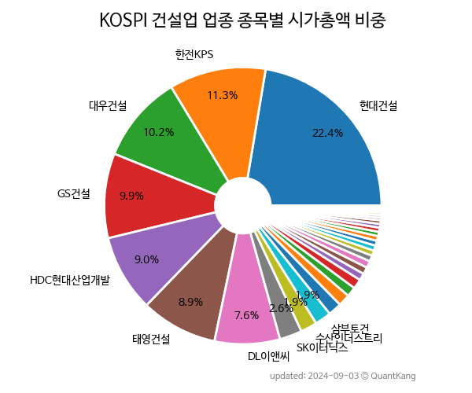

 
> **KOSPI 건설업 업종 종목별 시가총액 비중**

 
> **종목 목록**

| **종목** | **PER** | **PBR** | **DIV** | **비중** |
| :------- | ------: | ------: | ------: | -------: |
| 현대건설 : 9.1 | 0.5 | 1.8% | 26.3% |
| 대우건설 : 3.2 | 0.4 | - | 11.8% |
| 한전KPS : 15.1 | 1.2 | 3.9% | 10.8% |
| DL이앤씨 : 3.7 | 0.3 | 2.7% | 10.3% |
| GS건설 : 3.6 | 0.2 | 9.1% | 8.7% |
| HDC현대산업개발 : 20.0 | 0.4 | 3.9% | 7.2% |
| 삼부토건 : - | 2.0 | - | 2.9% |
| HJ중공업 : - | 0.8 | - | 2.2% |
| DL건설 : 5.5 | 0.3 | 1.9% | 2.1% |
| 수산인더스트리 : 5.0 | 0.6 | 3.4% | 1.8% |
| 코오롱글로벌 : 1.8 | 0.4 | 4.0% | 1.4% |
| HDC랩스 : 13.6 | 0.6 | 6.1% | 1.4% |
| 금호건설 : 8.6 | 0.3 | 10.0% | 1.3% |
| 동아지질 : - | 0.8 | 3.9% | 1.3% |
| 진흥기업 : 3.1 | 0.7 | - | 1.1% |
| 동부건설 : 3.1 | 0.2 | 9.4% | 0.9% |
| 계룡건설 : 2.0 | 0.2 | 3.7% | 0.9% |
| 화성산업 : 4.7 | 0.3 | 4.8% | 0.8% |
| 태영건설 : 1.6 | 0.1 | 8.8% | 0.7% |
| 삼호개발 : 12.3 | 0.3 | 5.8% | 0.6% |
| 한신공영 : 1.7 | 0.1 | 4.4% | 0.6% |
| 일성건설 : 12.3 | 0.6 | 0.4% | 0.5% |
| HL D&I : 6.7 | 0.2 | - | 0.5% |
| 까뮤이앤씨 : - | 0.9 | 1.2% | 0.5% |
| 남광토건 : 3.8 | 0.7 | - | 0.5% |
| 에쓰씨엔지니어링 : 10.3 | 1.4 | - | 0.4% |
| 현대건설우 : - | - | 1.3% | 0.4% |
| DL이앤씨2우(전환) : - | - | 4.2% | 0.4% |
| 범양건영 : - | 0.6 | - | 0.4% |
| 신세계건설 : - | 0.2 | 4.4% | 0.3% |
| 우진아이엔에스 : - | 0.4 | - | 0.3% |
| DL이앤씨우 : - | - | 5.7% | 0.3% |
| 코오롱글로벌우 : - | - | 3.0% | 0.1% |
| 동부건설우 : - | - | 2.3% | 0.0% |
| 태영건설우 : - | - | 5.6% | 0.0% |
| 금호건설우 : - | - | 3.6% | 0.0% |
| 진흥기업2우B : - | - | - | 0.0% |
| 진흥기업우B : - | - | - | 0.0% |

---
