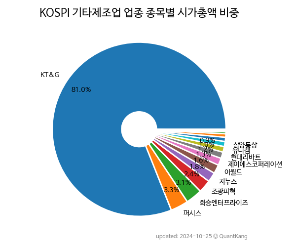

 

 
> **종목 목록**

| **종목** | **PER** | **PBR** | **DIV** | **비중** |
| :------- | ------: | ------: | ------: | -------: |
| KT&G | 10.0 | 1.1 | 5.9% | 79.5% |
| 화승엔터프라이즈 | - | 0.9 | 0.6% | 3.3% |
| 퍼시스 | 47.1 | 0.6 | 3.6% | 2.4% |
| 이월드 | 59.9 | 1.4 | - | 2.4% |
| 조광피혁 | 29.3 | 0.5 | - | 2.3% |
| 지누스 | 8.9 | 0.4 | 4.0% | 1.9% |
| 제이에스코퍼레이션 | 3.6 | 0.9 | 4.7% | 1.7% |
| 유니켐 | 59.2 | 1.2 | 1.0% | 1.3% |
| 동인기연 | 4.6 | 2.6 | 3.0% | 1.1% |
| 현대리바트 | - | 0.3 | - | 1.0% |
| 삼양통상 | 9.1 | 0.3 | 3.1% | 1.0% |
| 삼익악기 | 5.6 | 0.3 | 4.8% | 0.7% |
| 씨아이테크 | - | 1.2 | - | 0.5% |
| 시디즈 | 17.8 | 0.7 | 1.5% | 0.4% |
| 에넥스 | - | 0.7 | - | 0.2% |
| 코아스 | - | 0.9 | - | 0.1% |

---
