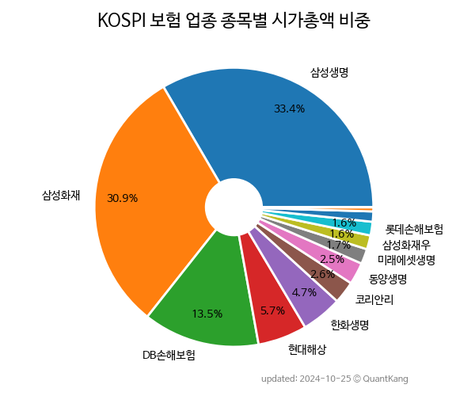

 

 
> **종목 목록 (13)**

| **종목** | **PER** | **PBR** | **DIV** | **비중** |
| :------- | ------: | ------: | ------: | -------: |
| [삼성생명](/032830/) | 6.9 | 0.5 | 4.9<small>%</small> | 32.0<small>%</small> |
| [삼성화재](/000810/) | 7.8 | 0.8 | 5.9<small>%</small> | 29.1<small>%</small> |
| [DB손해보험](/005830/) | 4.7 | 0.9 | 6.0<small>%</small> | 14.3<small>%</small> |
| [현대해상](/001450/) | 4.1 | 0.5 | 6.7<small>%</small> | 6.8<small>%</small> |
| [한화생명](/088350/) | 2.9 | 0.3 | - | 5.6<small>%</small> |
| 코리안리 | 7.3 | 0.4 | 6.1<small>%</small> | 3.1<small>%</small> |
| 미래에셋생명 | 10.1 | 0.4 | - | 2.1<small>%</small> |
| 롯데손해보험 | - | 1.6 | - | 1.9<small>%</small> |
| 동양생명 | 9.0 | 0.3 | - | 1.8<small>%</small> |
| 삼성화재우 | - | - | 7.5<small>%</small> | 1.5<small>%</small> |
| 한화손해보험 | 2.1 | 2.7 | - | 1.2<small>%</small> |
| 흥국화재 | 1.3 | 0.3 | - | 0.5<small>%</small> |
| 흥국화재우 | - | - | - | 0.0<small>%</small> |

---
