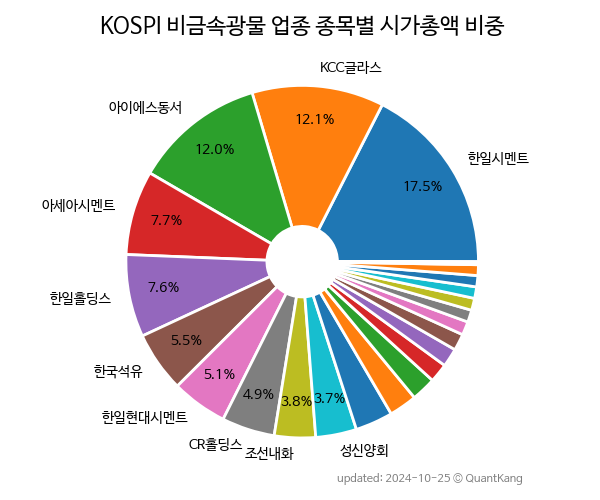

 

 
> **종목 목록 (26)**

| **종목** | **PER** | **PBR** | **DIV** | **비중** |
| :------- | ------: | ------: | ------: | -------: |
| [쌍용C&E](/003410/) | 23.5 | 1.9 | 7.4<small>%</small> | 35.2<small>%</small> |
| [한일시멘트](/300720/) | 10.6 | 0.6 | 4.8<small>%</small> | 9.9<small>%</small> |
| [아이에스동서](/010780/) | 4.0 | 0.6 | - | 9.5<small>%</small> |
| KCC글라스 | 6.8 | 0.4 | 6.0<small>%</small> | 7.6<small>%</small> |
| 아세아시멘트 | 6.4 | 0.4 | 2.1<small>%</small> | 4.8<small>%</small> |
| 한일홀딩스 | 3.8 | 0.2 | 7.2<small>%</small> | 4.1<small>%</small> |
| 한일현대시멘트 | 7.6 | 0.8 | 4.0<small>%</small> | 3.4<small>%</small> |
| CR홀딩스 | 4.6 | 0.3 | 7.6<small>%</small> | 3.3<small>%</small> |
| 동양 | - | 0.2 | 4.2<small>%</small> | 2.7<small>%</small> |
| 조선내화 | - | - | - | 2.6<small>%</small> |
| 성신양회 | - | 0.5 | 2.5<small>%</small> | 2.4<small>%</small> |
| 벽산 | 13.9 | 0.6 | 1.0<small>%</small> | 2.0<small>%</small> |
| 태경비케이 | 7.0 | 0.9 | 2.2<small>%</small> | 1.9<small>%</small> |
| 한국석유 | 13.6 | 0.9 | 0.9<small>%</small> | 1.9<small>%</small> |
| 유니온머티리얼 | - | 1.5 | 1.2<small>%</small> | 1.5<small>%</small> |
| 한국내화 | 132.6 | 0.5 | 1.5<small>%</small> | 1.5<small>%</small> |
| 유니온 | - | 0.7 | 2.3<small>%</small> | 1.0<small>%</small> |
| 제일연마 | 28.4 | 0.7 | 3.2<small>%</small> | 1.0<small>%</small> |
| 금비 | - | 0.6 | 2.0<small>%</small> | 0.8<small>%</small> |
| 부산산업 | 24.1 | 1.1 | 0.4<small>%</small> | 0.7<small>%</small> |
| 삼일씨엔에스 | - | 0.2 | - | 0.7<small>%</small> |
| 대림B&Co | - | 0.4 | 3.2<small>%</small> | 0.7<small>%</small> |
| 티웨이홀딩스 | 0.7 | 0.3 | - | 0.7<small>%</small> |
| 성신양회우 | - | - | 2.0<small>%</small> | 0.1<small>%</small> |
| 동양우 | - | - | 1.6<small>%</small> | 0.0<small>%</small> |
| 동양2우B | - | - | 1.3<small>%</small> | 0.0<small>%</small> |

---
