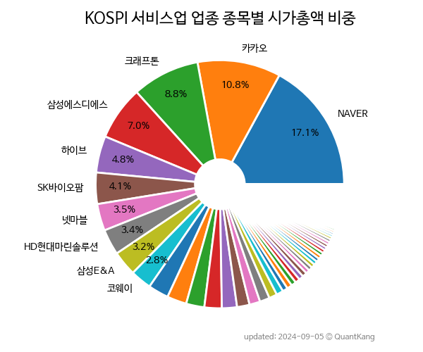

 

 
> **종목 목록 (102)**

| **종목** | **PER** | **PBR** | **DIV** | **비중** |
| :------- | ------: | ------: | ------: | -------: |
| NAVER | 43.0 | 1.4 | 0.4% | 20.8% |
| 카카오 | 18.5 | 2.5 | 0.1% | 15.2% |
| 삼성에스디에스 | 11.7 | 1.6 | 1.9% | 7.7% |
| 크래프톤 | 18.1 | 1.8 | - | 5.6% |
| 하이브 | 173.9 | 3.3 | - | 5.4% |
| 포스코DX | 186.7 | 20.6 | 0.1% | 5.1% |
| SK바이오팜 | - | 21.9 | - | 4.1% |
| 현대오토에버 | 42.6 | 3.3 | 0.6% | 2.9% |
| 넷마블 | - | 0.8 | - | 2.9% |
| 삼성엔지니어링 | 7.1 | 1.8 | - | 2.8% |
| 엔씨소프트 | 9.0 | 1.2 | 3.5% | 2.5% |
| 코웨이 | 8.7 | 1.7 | 2.4% | 2.4% |
| 강원랜드 | 26.0 | 0.9 | 2.4% | 1.9% |
| 한전기술 | 148.7 | 4.9 | 0.4% | 1.6% |
| 제일기획 | 9.4 | 1.5 | 6.4% | 1.2% |
| 에스원 | 12.0 | 1.2 | 4.7% | 1.2% |
| 더존비즈온 | 64.9 | 2.9 | 0.3% | 0.8% |
| SK리츠 | - | - | - | 0.6% |
| 롯데렌탈 | 10.1 | 0.7 | 3.4% | 0.6% |
| 하나투어 | - | 7.4 | - | 0.6% |
| 이노션 | 11.4 | 0.9 | 10.7% | 0.5% |
| 제이알글로벌리츠 | - | - | - | 0.5% |
| 다우기술 | 2.0 | 0.3 | 3.4% | 0.5% |
| GKL | - | 2.0 | - | 0.5% |
| ESR켄달스퀘어리츠 | - | - | - | 0.5% |
| 롯데리츠 | - | - | - | 0.4% |
| 더블유게임즈 | - | 1.1 | 1.5% | 0.4% |
| 롯데정보통신 | 23.2 | 1.7 | 1.5% | 0.4% |
| NHN | - | 0.4 | - | 0.4% |
| 롯데관광개발 | - | 2.8 | - | 0.4% |
| 녹십자홀딩스 | 20.3 | 0.6 | 2.0% | 0.4% |
| CJ CGV | - | 1.0 | - | 0.4% |
| SK디앤디 | 9.0 | 0.9 | 2.9% | 0.4% |
| 신한알파리츠 | - | - | - | 0.3% |
| NICE평가정보 | 10.8 | 1.7 | 3.9% | 0.3% |
| 쏘카 | - | 2.2 | - | 0.3% |
| 프레스티지바이오파마 | - | - | - | 0.3% |
| SBS | 3.0 | 0.6 | 3.9% | 0.3% |
| NICE | 12.1 | 0.6 | 3.4% | 0.3% |
| 쿠쿠홈시스 | 3.9 | 0.6 | 3.5% | 0.3% |
| SK렌터카 | 21.0 | 0.8 | 1.6% | 0.3% |
| 코람코라이프인프라리츠 | - | - | - | 0.3% |
| KB스타리츠 | - | - | - | 0.2% |
| 삼성FN리츠 | - | - | - | 0.2% |
| 아세아 | 3.8 | 0.3 | 2.1% | 0.2% |
| 한화리츠 | - | - | - | 0.2% |
| LG헬로비전 | - | 0.6 | 2.7% | 0.2% |
| DB | 53.5 | 1.1 | - | 0.2% |
| 이리츠코크렙 | - | - | - | 0.2% |
| 웅진씽크빅 | 96.3 | 0.8 | 4.2% | 0.2% |
| YG PLUS | 22.8 | 1.9 | - | 0.2% |
| 스카이라이프 | 11.8 | 0.3 | 6.3% | 0.2% |
| 도화엔지니어링 | 162.3 | 1.0 | 3.7% | 0.2% |
| 콘텐트리중앙 | - | 1.3 | - | 0.1% |
| 한전산업 | 15.1 | 2.6 | 3.0% | 0.1% |
| 이지스밸류리츠 | - | - | - | 0.1% |
| 키다리스튜디오 | - | 0.8 | 0.8% | 0.1% |
| 대교 | - | 0.5 | 1.1% | 0.1% |
| 신세계 I&C | 2.0 | 0.5 | 3.9% | 0.1% |
| 삼성출판사 | 18.7 | 1.2 | 0.9% | 0.1% |
| 동성케미컬 | 6.1 | 0.6 | 4.6% | 0.1% |
| 아시아나IDT | 24.6 | 1.3 | 2.6% | 0.1% |
| AJ네트웍스 | 23.1 | 0.6 | 5.8% | 0.1% |
| 한미글로벌 | 7.6 | 1.1 | 3.0% | 0.1% |
| 디앤디플랫폼리츠 | - | - | - | 0.1% |
| 예스코홀딩스 | - | 0.3 | 7.4% | 0.1% |
| 신한서부티엔디리츠 | - | - | - | 0.1% |
| 코람코더원리츠 | - | - | - | 0.1% |
| 자이에스앤디 | 1.9 | 0.4 | 6.4% | 0.1% |
| 제일파마홀딩스 | - | 0.5 | 0.4% | 0.1% |
| KTcs | 9.3 | 0.8 | 3.0% | 0.1% |
| 유수홀딩스 | 5.0 | 0.4 | 6.6% | 0.1% |
| 대성홀딩스 | 41.0 | 0.3 | 2.7% | 0.1% |
| 신세계푸드 | - | 0.5 | 2.0% | 0.1% |
| 용평리조트 | - | 0.4 | - | 0.1% |
| 효성ITX | 9.7 | 2.0 | 6.2% | 0.1% |
| NH올원리츠 | - | - | - | 0.1% |
| 성창기업지주 | - | 0.2 | - | 0.1% |
| KTis | 6.1 | 0.5 | 3.9% | 0.1% |
| 미래에셋글로벌리츠 | - | - | - | 0.1% |
| 이지스레지던스리츠 | - | - | - | 0.1% |
| 아센디오 | - | 2.5 | - | 0.1% |
| HS애드 | 5.5 | 0.5 | 6.8% | 0.1% |
| 웅진 | 11.9 | 1.2 | - | 0.1% |
| 텔코웨어 | 14.6 | 0.5 | 6.0% | 0.1% |
| 콤텍시스템 | 4.0 | 0.6 | - | 0.1% |
| 모두투어리츠 | - | - | - | 0.1% |
| NH프라임리츠 | - | - | - | 0.0% |
| 마스턴프리미어리츠 | - | - | - | 0.0% |
| 비상교육 | - | 0.3 | 1.9% | 0.0% |
| 한국종합기술 | 15.6 | 0.4 | 1.8% | 0.0% |
| 갤럭시아에스엠 | 13.2 | 1.8 | - | 0.0% |
| IHQ | - | 0.8 | - | 0.0% |
| 미래에셋맵스리츠 | - | - | - | 0.0% |
| 유엔젤 | 22.1 | 0.9 | - | 0.0% |
| 케이탑리츠 | - | - | - | 0.0% |
| 이스타코 | - | 0.7 | - | 0.0% |
| 미래아이앤지 | - | 0.5 | - | 0.0% |
| 대교우B | - | - | 2.6% | 0.0% |
| 녹십자홀딩스2우 | - | - | 1.0% | 0.0% |
| 비케이탑스 | - | 3.3 | - | 0.0% |
| 에이리츠 | - | - | - | 0.0% |

---
