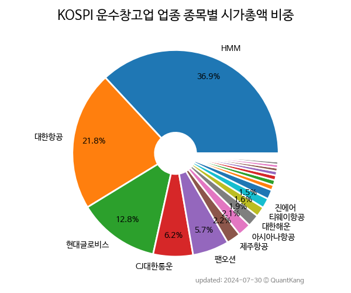

 

 
> **종목 목록 (29)**

| **종목** | **PER** | **PBR** | **DIV** | **비중** |
| :------- | ------: | ------: | ------: | -------: |
| [HMM](/011200/) | 0.9 | 0.5 | 6.3<small>%</small> | 29.0<small>%</small> |
| [대한항공](/003490/) | 4.8 | 0.9 | 3.3<small>%</small> | 18.5<small>%</small> |
| [현대글로비스](/086280/) | 5.9 | 1.0 | 3.0<small>%</small> | 15.4<small>%</small> |
| [한진칼](/180640/) | 7.2 | 2.0 | 0.2<small>%</small> | 10.8<small>%</small> |
| [CJ대한통운](/000120/) | 17.4 | 0.8 | 0.3<small>%</small> | 7.2<small>%</small> |
| [팬오션](/028670/) | 2.8 | 0.4 | 4.2<small>%</small> | 4.2<small>%</small> |
| 제주항공 | - | 3.1 | - | 2.2<small>%</small> |
| [아시아나항공](/020560/) | 26.8 | 1.4 | - | 2.2<small>%</small> |
| 흥아해운 | 32.6 | 5.6 | - | 1.6<small>%</small> |
| 진에어 | - | 6.2 | - | 1.5<small>%</small> |
| 대한해운 | 4.0 | 0.4 | - | 1.4<small>%</small> |
| 티웨이항공 | - | 7.9 | - | 1.3<small>%</small> |
| 한진 | 7.6 | 0.3 | 2.4<small>%</small> | 0.8<small>%</small> |
| 에어부산 | - | 2.9 | - | 0.8<small>%</small> |
| 세방 | 2.8 | 0.2 | 2.3<small>%</small> | 0.6<small>%</small> |
| KSS해운 | 4.6 | 0.5 | 3.8<small>%</small> | 0.5<small>%</small> |
| 한국공항 | 28.9 | 0.5 | - | 0.4<small>%</small> |
| KCTC | 4.7 | 0.5 | 1.4<small>%</small> | 0.3<small>%</small> |
| 동방 | 133.5 | 0.8 | - | 0.2<small>%</small> |
| 인터지스 | 2.3 | 0.3 | 4.8<small>%</small> | 0.2<small>%</small> |
| STX그린로지스 | - | - | - | 0.2<small>%</small> |
| 천일고속 | - | 2.6 | - | 0.2<small>%</small> |
| 한솔로지스틱스 | 2.8 | 0.7 | 2.8<small>%</small> | 0.2<small>%</small> |
| 한익스프레스 | 8.7 | 0.6 | 2.6<small>%</small> | 0.1<small>%</small> |
| 국보 | - | 0.8 | - | 0.1<small>%</small> |
| 동양고속 | - | 0.4 | - | 0.1<small>%</small> |
| 대한항공우 | - | - | 3.1<small>%</small> | 0.1<small>%</small> |
| 세방우 | - | - | 4.3<small>%</small> | 0.1<small>%</small> |
| 한진칼우 | - | - | 0.7<small>%</small> | 0.0<small>%</small> |

---
