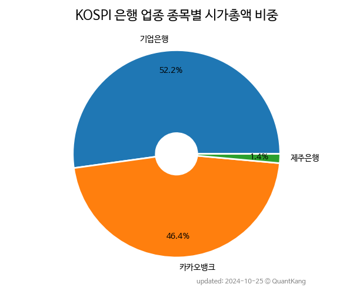

 

 
> **종목 목록 (3)**

| **종목** | **PER** | **PBR** | **DIV** | **비중** |
| :------- | ------: | ------: | ------: | -------: |
| [카카오뱅크](/323410/) | 48.5 | 2.2 | 0.3<small>%</small> | 54.0<small>%</small> |
| [기업은행](/024110/) | 4.0 | 0.4 | 7.3<small>%</small> | 44.2<small>%</small> |
| 제주은행 | 20.8 | 0.8 | 0.8<small>%</small> | 1.8<small>%</small> |

---
