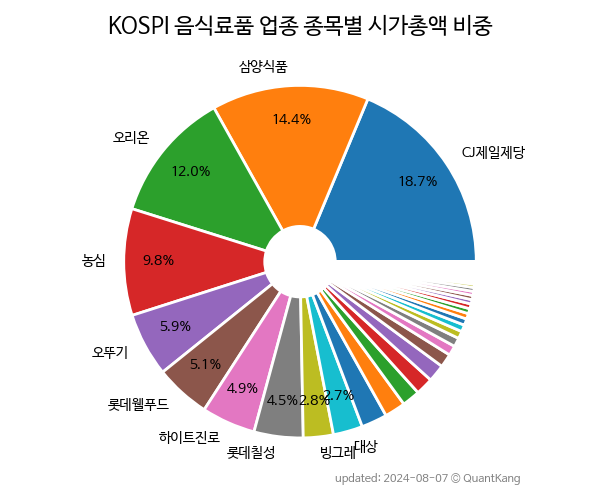

 

 
> **종목 목록 (46)**

| **종목** | **PER** | **PBR** | **DIV** | **비중** |
| :------- | ------: | ------: | ------: | -------: |
| [CJ제일제당](/097950/) | 8.1 | 0.7 | 1.8<small>%</small> | 18.7<small>%</small> |
| [오리온](/271560/) | 9.4 | 1.4 | 1.0<small>%</small> | 15.3<small>%</small> |
| [농심](/004370/) | 19.4 | 1.0 | 1.3<small>%</small> | 9.8<small>%</small> |
| [오뚜기](/007310/) | 5.2 | 0.8 | 2.2<small>%</small> | 6.9<small>%</small> |
| [하이트진로](/000080/) | 17.4 | 1.3 | 4.4<small>%</small> | 6.3<small>%</small> |
| [삼양식품](/003230/) | 16.6 | 2.9 | 0.8<small>%</small> | 5.5<small>%</small> |
| [롯데칠성](/005300/) | 10.0 | 0.8 | 2.6<small>%</small> | 4.9<small>%</small> |
| [롯데웰푸드](/280360/) | 20.2 | 0.5 | 1.9<small>%</small> | 4.9<small>%</small> |
| [대상](/001680/) | 8.4 | 0.5 | 4.1<small>%</small> | 2.8<small>%</small> |
| 동원F&B | 7.0 | 0.7 | 2.1<small>%</small> | 2.6<small>%</small> |
| 빙그레 | 18.8 | 0.8 | 2.7<small>%</small> | 2.2<small>%</small> |
| SPC삼립 | 9.1 | 1.2 | 2.9<small>%</small> | 2.1<small>%</small> |
| 삼양사 | 7.1 | 0.4 | 2.5<small>%</small> | 2.1<small>%</small> |
| 남양유업 | - | 0.5 | 0.2<small>%</small> | 1.7<small>%</small> |
| 풀무원 | - | 0.9 | 1.0<small>%</small> | 1.6<small>%</small> |
| 사조대림 | 3.9 | 0.6 | 0.9<small>%</small> | 1.4<small>%</small> |
| 대한제당 | 11.9 | 0.6 | 3.6<small>%</small> | 1.2<small>%</small> |
| 대한제분 | 5.5 | 0.2 | 1.8<small>%</small> | 1.0<small>%</small> |
| CJ제일제당 우 | - | - | 4.1<small>%</small> | 0.7<small>%</small> |
| 선진 | 7.3 | 0.4 | 1.4<small>%</small> | 0.7<small>%</small> |
| 해태제과식품 | - | 0.6 | 3.7<small>%</small> | 0.7<small>%</small> |
| 무학 | - | 0.3 | 4.3<small>%</small> | 0.6<small>%</small> |
| 사조동아원 | 117.2 | 0.6 | - | 0.5<small>%</small> |
| 샘표식품 | 10.0 | 0.6 | 0.7<small>%</small> | 0.5<small>%</small> |
| 팜스코 | - | 0.4 | 1.6<small>%</small> | 0.5<small>%</small> |
| 크라운제과 | 3.9 | 0.5 | 3.0<small>%</small> | 0.4<small>%</small> |
| CJ씨푸드 | 14.0 | 1.4 | - | 0.4<small>%</small> |
| 조흥 | 9.0 | 0.7 | 3.9<small>%</small> | 0.4<small>%</small> |
| 사조오양 | 9.5 | 0.4 | 1.4<small>%</small> | 0.3<small>%</small> |
| 고려산업 | 114.1 | 0.8 | 0.8<small>%</small> | 0.3<small>%</small> |
| 남양유업우 | - | - | 0.3<small>%</small> | 0.3<small>%</small> |
| 마니커 | 73.1 | 1.5 | - | 0.3<small>%</small> |
| 보해양조 | - | 0.9 | - | 0.3<small>%</small> |
| 서울식품 | 91.5 | 2.4 | - | 0.3<small>%</small> |
| 사조씨푸드 | 7.9 | 0.3 | 1.1<small>%</small> | 0.3<small>%</small> |
| 우성 | 410.2 | 0.3 | - | 0.3<small>%</small> |
| 롯데칠성우 | - | - | 5.0<small>%</small> | 0.2<small>%</small> |
| MH에탄올 | 8.7 | 0.7 | 3.7<small>%</small> | 0.2<small>%</small> |
| 한성기업 | 22.2 | 0.6 | - | 0.1<small>%</small> |
| 대상우 | - | - | 3.6<small>%</small> | 0.1<small>%</small> |
| 대한제당우 | - | - | 4.3<small>%</small> | 0.1<small>%</small> |
| 하이트진로2우B | - | - | 6.4<small>%</small> | 0.1<small>%</small> |
| 삼양사우 | - | - | 4.8<small>%</small> | 0.0<small>%</small> |
| 크라운제과우 | - | - | 2.4<small>%</small> | 0.0<small>%</small> |
| 서울식품우 | - | - | - | 0.0<small>%</small> |
| CJ씨푸드1우 | - | - | - | 0.0<small>%</small> |

