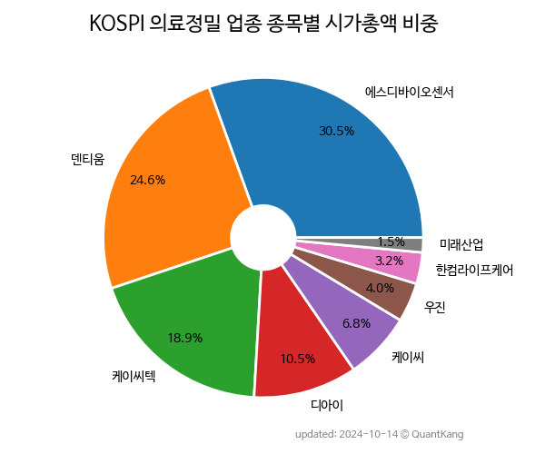

 

 
> **종목 목록 (8)**

| **종목** | **PER** | **PBR** | **DIV** | **비중** |
| :------- | ------: | ------: | ------: | -------: |
| [에스디바이오센서](/137310/) | 1.2 | 0.4 | 9.4<small>%</small> | 32.4<small>%</small> |
| [덴티움](/145720/) | 11.1 | 2.5 | 0.3<small>%</small> | 30.2<small>%</small> |
| 케이씨텍 | 11.7 | 1.5 | 0.8<small>%</small> | 16.2<small>%</small> |
| 케이씨 | 2.6 | 0.4 | 1.6<small>%</small> | 7.1<small>%</small> |
| 디아이 | 11.4 | 1.1 | 1.6<small>%</small> | 4.5<small>%</small> |
| 우진 | 17.8 | 1.1 | 1.8<small>%</small> | 4.3<small>%</small> |
| 한컴라이프케어 | 14.9 | 1.1 | - | 3.4<small>%</small> |
| 미래산업 | 7.8 | 0.7 | - | 1.8<small>%</small> |

---
