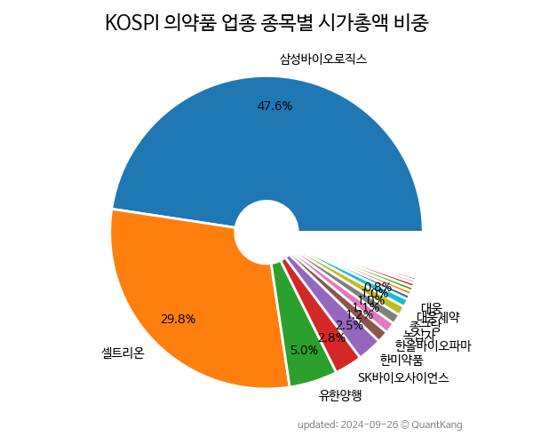

 

 
> **종목 목록 (54)**

| **종목** | **PER** | **PBR** | **DIV** | **비중** |
| :------- | ------: | ------: | ------: | -------: |
| [삼성바이오로직스](/207940/) | 71.2 | 6.5 | - | 44.8<small>%</small> |
| [셀트리온](/068270/) | 47.9 | 6.2 | 0.2<small>%</small> | 30.2<small>%</small> |
| [SK바이오사이언스](/302440/) | 40.7 | 2.9 | - | 3.9<small>%</small> |
| [유한양행](/000100/) | 48.1 | 2.3 | 0.7<small>%</small> | 3.8<small>%</small> |
| [한미약품](/128940/) | 51.3 | 4.9 | 0.1<small>%</small> | 3.3<small>%</small> |
| [한올바이오파마](/009420/) | 6500.0 | 9.8 | - | 1.3<small>%</small> |
| [종근당](/185750/) | 17.5 | 2.3 | 0.9<small>%</small> | 1.1<small>%</small> |
| [대웅](/003090/) | 9.8 | 1.2 | 0.4<small>%</small> | 1.1<small>%</small> |
| [대웅제약](/069620/) | 31.1 | 2.2 | 0.5<small>%</small> | 1.1<small>%</small> |
| [녹십자](/006280/) | 20.1 | 1.0 | 1.5<small>%</small> | 1.0<small>%</small> |
| 보령 | 19.0 | 1.6 | 0.8<small>%</small> | 0.6<small>%</small> |
| JW중외제약 | 25.9 | 3.2 | 1.1<small>%</small> | 0.6<small>%</small> |
| [신풍제약](/019170/) | - | 1.8 | - | 0.5<small>%</small> |
| 동아에스티 | 42.5 | 0.8 | 1.1<small>%</small> | 0.4<small>%</small> |
| 바이오노트 | 1.4 | 0.3 | 10.9<small>%</small> | 0.4<small>%</small> |
| 부광약품 | - | 1.6 | - | 0.3<small>%</small> |
| 일동제약 | - | 2.2 | - | 0.3<small>%</small> |
| 유나이티드제약 | 8.1 | 1.1 | 1.6<small>%</small> | 0.3<small>%</small> |
| 광동제약 | 12.8 | 0.6 | 1.3<small>%</small> | 0.3<small>%</small> |
| 영진약품 | - | 4.1 | - | 0.3<small>%</small> |
| 파미셀 | 31.2 | 4.3 | - | 0.3<small>%</small> |
| 대원제약 | 9.9 | 1.2 | 2.4<small>%</small> | 0.3<small>%</small> |
| 일성신약 | 1.7 | 0.4 | 16.9<small>%</small> | 0.2<small>%</small> |
| 종근당홀딩스 | 282.6 | 0.6 | 2.3<small>%</small> | 0.2<small>%</small> |
| 삼진제약 | 11.9 | 1.0 | 3.9<small>%</small> | 0.2<small>%</small> |
| 이연제약 | 36.5 | 1.1 | 1.0<small>%</small> | 0.2<small>%</small> |
| 환인제약 | 9.6 | 0.7 | 2.0<small>%</small> | 0.2<small>%</small> |
| 일양약품 | 13.8 | 1.1 | 1.1<small>%</small> | 0.2<small>%</small> |
| 동화약품 | 13.1 | 0.7 | 1.9<small>%</small> | 0.2<small>%</small> |
| 제일약품 | - | 1.6 | 0.3<small>%</small> | 0.2<small>%</small> |
| 하나제약 | 9.8 | 0.9 | 3.7<small>%</small> | 0.2<small>%</small> |
| 진원생명과학 | - | 1.1 | - | 0.2<small>%</small> |
| JW생명과학 | 13.2 | 1.4 | 3.9<small>%</small> | 0.2<small>%</small> |
| 한독 | 17.9 | 0.5 | 2.9<small>%</small> | 0.1<small>%</small> |
| 경보제약 | 296.1 | 1.3 | 0.7<small>%</small> | 0.1<small>%</small> |
| 동성제약 | - | 2.9 | - | 0.1<small>%</small> |
| 삼일제약 | - | 0.9 | - | 0.1<small>%</small> |
| 삼성제약 | - | 1.5 | - | 0.1<small>%</small> |
| 에이프로젠바이오로직스 | 9.9 | 0.3 | - | 0.1<small>%</small> |
| 현대약품 | - | 1.2 | 0.8<small>%</small> | 0.1<small>%</small> |
| 종근당바이오 | - | 0.8 | - | 0.1<small>%</small> |
| 일동홀딩스 | - | 9.0 | 1.1<small>%</small> | 0.1<small>%</small> |
| 팜젠사이언스 | 1.3 | 0.4 | - | 0.1<small>%</small> |
| 국제약품 | 27.1 | 1.3 | - | 0.1<small>%</small> |
| 유유제약 | - | 0.7 | 2.0<small>%</small> | 0.1<small>%</small> |
| 명문제약 | 9.4 | 0.8 | - | 0.1<small>%</small> |
| 오리엔트바이오 | - | 1.0 | - | 0.1<small>%</small> |
| 유한양행우 | - | - | 0.7<small>%</small> | 0.1<small>%</small> |
| 신풍제약우 | - | - | - | 0.0<small>%</small> |
| 유유제약1우 | - | - | 1.9<small>%</small> | 0.0<small>%</small> |
| JW중외제약2우B | - | - | 0.6<small>%</small> | 0.0<small>%</small> |
| JW중외제약우 | - | - | 1.3<small>%</small> | 0.0<small>%</small> |
| 일양약품우 | - | - | 1.1<small>%</small> | 0.0<small>%</small> |
| 유유제약2우B | - | - | 0.9<small>%</small> | 0.0<small>%</small> |

