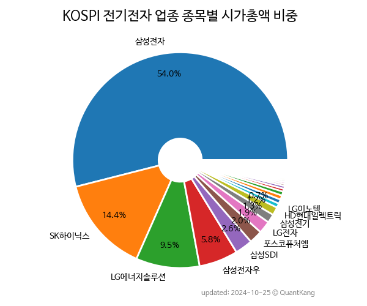

 

 
> **종목 목록 (78)**

| **종목** | **PER** | **PBR** | **DIV** | **비중** |
| :------- | ------: | ------: | ------: | -------: |
| [삼성전자](/005930/) | 9.1 | 1.3 | 2.0<small>%</small> | 54.2<small>%</small> |
| [SK하이닉스](/000660/) | 42.0 | 1.5 | 0.9<small>%</small> | 12.2<small>%</small> |
| [LG에너지솔루션](/373220/) | 115.2 | 4.8 | - | 11.0<small>%</small> |
| 삼성전자우 | - | - | 2.4<small>%</small> | 6.1<small>%</small> |
| [삼성SDI](/006400/) | 12.3 | 1.4 | 0.3<small>%</small> | 3.1<small>%</small> |
| [포스코퓨처엠](/003670/) | 174.8 | 8.4 | 0.1<small>%</small> | 2.6<small>%</small> |
| [LG전자](/066570/) | 14.1 | 0.8 | 0.8<small>%</small> | 1.9<small>%</small> |
| [에코프로머티](/450080/) | 543.2 | 29.4 | - | 1.4<small>%</small> |
| [삼성전기](/009150/) | 11.0 | 1.4 | 1.5<small>%</small> | 1.3<small>%</small> |
| [SK아이이테크놀로지](/361610/) | - | 2.6 | - | 0.7<small>%</small> |
| [LG이노텍](/011070/) | 4.8 | 1.1 | 2.1<small>%</small> | 0.6<small>%</small> |
| [LG디스플레이](/034220/) | - | 0.5 | - | 0.5<small>%</small> |
| [HD현대일렉트릭](/267260/) | 23.1 | 4.6 | 0.5<small>%</small> | 0.5<small>%</small> |
| [한화시스템](/272210/) | - | 1.5 | 1.5<small>%</small> | 0.4<small>%</small> |
| [DB하이텍](/000990/) | 3.9 | 1.3 | 2.6<small>%</small> | 0.3<small>%</small> |
| [LS ELECTRIC](/010120/) | 22.3 | 1.3 | 1.6<small>%</small> | 0.3<small>%</small> |
| 이수페타시스 | 18.3 | 8.4 | 0.3<small>%</small> | 0.2<small>%</small> |
| 효성중공업 | 168.6 | 1.8 | - | 0.2<small>%</small> |
| [롯데에너지머티리얼즈](/020150/) | 34.2 | 1.0 | 0.9<small>%</small> | 0.2<small>%</small> |
| 솔루엠 | 30.7 | 4.9 | - | 0.2<small>%</small> |
| [두산퓨얼셀](/336260/) | 455.3 | 2.7 | - | 0.2<small>%</small> |
| LX세미콘 | 5.7 | 1.4 | 5.5<small>%</small> | 0.2<small>%</small> |
| [대한전선](/001440/) | 59.4 | 1.5 | - | 0.2<small>%</small> |
| 대덕전자 | 7.2 | 1.5 | 1.6<small>%</small> | 0.2<small>%</small> |
| 드림텍 | 13.7 | 2.2 | 1.5<small>%</small> | 0.1<small>%</small> |
| DN오토모티브 | 4.3 | 0.9 | 2.8<small>%</small> | 0.1<small>%</small> |
| 해성디에스 | 5.4 | 1.9 | 1.8<small>%</small> | 0.1<small>%</small> |
| [세방전지](/004490/) | 17.3 | 0.6 | 1.1<small>%</small> | 0.1<small>%</small> |
| 한국단자 | 14.9 | 0.8 | 1.0<small>%</small> | 0.1<small>%</small> |
| LG전자우 | - | - | 1.8<small>%</small> | 0.1<small>%</small> |
| 경동나비엔 | 12.7 | 1.3 | 1.1<small>%</small> | 0.1<small>%</small> |
| 자화전자 | - | 1.7 | - | 0.1<small>%</small> |
| 비에이치 | 4.2 | 1.1 | 1.3<small>%</small> | 0.1<small>%</small> |
| 엠씨넥스 | 20.8 | 1.5 | 1.9<small>%</small> | 0.1<small>%</small> |
| 솔루스첨단소재 | - | 1.7 | 0.8<small>%</small> | 0.1<small>%</small> |
| 일진전기 | 19.9 | 1.4 | 1.1<small>%</small> | 0.1<small>%</small> |
| 코리아써키트 | 7.4 | 0.9 | - | 0.1<small>%</small> |
| 신성이엔지 | 11.5 | 1.9 | - | 0.0<small>%</small> |
| 삼화콘덴서 | 12.7 | 1.6 | 1.4<small>%</small> | 0.0<small>%</small> |
| KEC | 12.4 | 0.9 | 3.5<small>%</small> | 0.0<small>%</small> |
| 신도리코 | 6.8 | 0.3 | 4.4<small>%</small> | 0.0<small>%</small> |
| 삼성SDI우 | - | - | 0.5<small>%</small> | 0.0<small>%</small> |
| HD현대에너지솔루션 | 4.3 | 0.7 | 2.6<small>%</small> | 0.0<small>%</small> |
| 한솔테크닉스 | 14.9 | 0.7 | 1.4<small>%</small> | 0.0<small>%</small> |
| 주성코퍼레이션 | - | 10.2 | - | 0.0<small>%</small> |
| 삼성전기우 | - | - | 3.1<small>%</small> | 0.0<small>%</small> |
| 삼영전자 | 10.8 | 0.4 | 3.0<small>%</small> | 0.0<small>%</small> |
| 가온전선 | 10.7 | 0.5 | 0.2<small>%</small> | 0.0<small>%</small> |
| 아남전자 | 12.1 | 1.7 | - | 0.0<small>%</small> |
| 광전자 | 9.7 | 0.6 | 1.9<small>%</small> | 0.0<small>%</small> |
| 삼화전기 | 10.8 | 1.7 | 1.7<small>%</small> | 0.0<small>%</small> |
| KH 필룩스 | - | 0.2 | - | 0.0<small>%</small> |
| 와이투솔루션 | - | 1.1 | - | 0.0<small>%</small> |
| 광명전기 | 17.8 | 0.8 | 0.5<small>%</small> | 0.0<small>%</small> |
| 휴니드 | 9.3 | 0.6 | - | 0.0<small>%</small> |
| 두산퓨얼셀1우 | - | - | - | 0.0<small>%</small> |
| 대원전선 | 67.8 | 1.0 | - | 0.0<small>%</small> |
| 써니전자 | 16.2 | 1.1 | - | 0.0<small>%</small> |
| 삼화전자 | - | 4.5 | - | 0.0<small>%</small> |
| 대동전자 | 5.9 | 0.2 | - | 0.0<small>%</small> |
| 티에이치엔 | - | 0.7 | 1.5<small>%</small> | 0.0<small>%</small> |
| 일진디스플 | - | 2.0 | - | 0.0<small>%</small> |
| 에이엔피 | - | 1.6 | - | 0.0<small>%</small> |
| 선도전기 | - | 0.9 | - | 0.0<small>%</small> |
| 경인전자 | 11.7 | 0.5 | 1.4<small>%</small> | 0.0<small>%</small> |
| 성문전자 | 14.1 | 0.9 | 0.3<small>%</small> | 0.0<small>%</small> |
| 하이트론 | - | 0.9 | - | 0.0<small>%</small> |
| 주연테크 | - | 0.7 | - | 0.0<small>%</small> |
| 금호전기 | - | 0.9 | - | 0.0<small>%</small> |
| 두산퓨얼셀2우B | - | - | - | 0.0<small>%</small> |
| 솔루스첨단소재1우 | - | - | 3.3<small>%</small> | 0.0<small>%</small> |
| 대덕전자1우 | - | - | 4.0<small>%</small> | 0.0<small>%</small> |
| 대유플러스 | - | 0.3 | - | 0.0<small>%</small> |
| 코리아써우 | - | - | - | 0.0<small>%</small> |
| 솔루스첨단소재2우B | - | - | 1.8<small>%</small> | 0.0<small>%</small> |
| 대원전선우 | - | - | - | 0.0<small>%</small> |
| 코리아써키트2우B | - | - | - | 0.0<small>%</small> |
| 성문전자우 | - | - | 0.1<small>%</small> | 0.0<small>%</small> |

---
