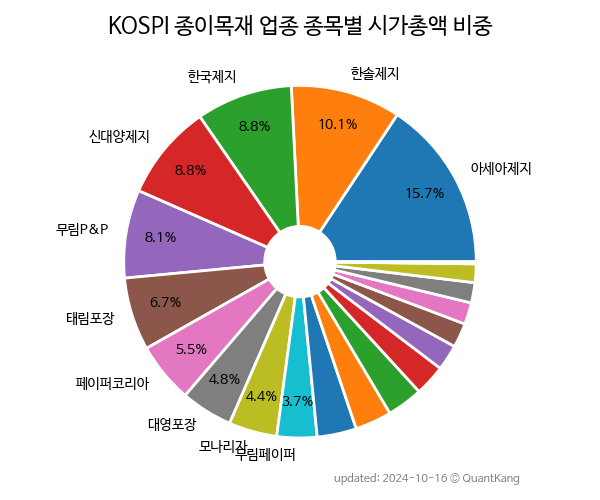

 

 
> **종목 목록 (20)**

| **종목** | **PER** | **PBR** | **DIV** | **비중** |
| :------- | ------: | ------: | ------: | -------: |
| 아세아제지 | 4.0 | 0.5 | 2.4% | 14.2% |
| 한솔제지 | 3.3 | 0.3 | 6.8% | 9.2% |
| 신대양제지 | 4.2 | 0.4 | 2.2% | 8.4% |
| 한국제지 | 28.4 | 0.6 | - | 7.9% |
| 태림포장 | 11.2 | 0.6 | 1.8% | 7.4% |
| 무림P&P | 4.3 | 0.3 | 4.9% | 7.1% |
| 페이퍼코리아 | - | 0.7 | - | 6.2% |
| 대영포장 | 9.1 | 0.7 | - | 4.9% |
| 깨끗한나라 | - | 0.5 | - | 4.7% |
| 영풍제지 | 13.9 | 0.8 | 28.8% | 4.7% |
| 한국수출포장 | 5.6 | 0.4 | 2.7% | 4.4% |
| 모나리자 | 46.1 | 1.4 | 1.7% | 4.0% |
| 무림페이퍼 | 5.9 | 0.2 | 2.3% | 3.3% |
| 이건산업 | 12.5 | 0.3 | 1.6% | 2.6% |
| 한솔홈데코 | - | 0.4 | - | 2.5% |
| 유니드비티플러스 | 67.4 | 0.3 | - | 2.4% |
| 삼정펄프 | - | 0.3 | 4.1% | 2.3% |
| 한창제지 | 43.1 | 0.5 | 2.2% | 2.0% |
| SUN&L | - | 0.2 | - | 1.4% |
| 깨끗한나라우 | - | - | - | 0.3% |

---
