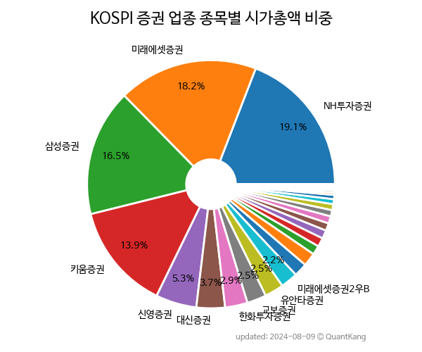

 

 
> **종목 목록 (30)**

| **종목** | **PER** | **PBR** | **DIV** | **비중** |
| :------- | ------: | ------: | ------: | -------: |
| 미래에셋증권 | 6.3<small></small> | 0.3<small></small> | 3.1<small>%</small> | 20.2<small>%</small> |
| NH투자증권 | 11.1<small></small> | 0.4<small></small> | 7.1<small>%</small> | 16.7<small>%</small> |
| 삼성증권 | 7.5<small></small> | 0.5<small></small> | 4.8<small>%</small> | 16.3<small>%</small> |
| 키움증권 | 5.1<small></small> | 0.5<small></small> | 3.3<small>%</small> | 12.4<small>%</small> |
| 한화투자증권 | - | 0.5<small></small> | - | 3.9<small>%</small> |
| 대신증권 | 8.0<small></small> | 0.4<small></small> | 8.6<small>%</small> | 3.7<small>%</small> |
| 신영증권 | 5.0<small></small> | 0.3<small></small> | 6.8<small>%</small> | 2.9<small>%</small> |
| 교보증권 | 7.1<small></small> | 0.2<small></small> | 4.2<small>%</small> | 2.8<small>%</small> |
| 미래에셋증권2우B | - | - | 5.7<small>%</small> | 2.5<small>%</small> |
| 유안타증권 | 11.6<small></small> | 0.3<small></small> | 4.6<small>%</small> | 2.5<small>%</small> |
| 신영증권우 | - | - | 6.9<small>%</small> | 2.1<small>%</small> |
| 유진투자증권 | 22.2<small></small> | 0.4<small></small> | 1.6<small>%</small> | 1.9<small>%</small> |
| 대신증권우 | - | - | 9.2<small>%</small> | 1.8<small>%</small> |
| SK증권 | 26.4<small></small> | 0.4<small></small> | 0.8<small>%</small> | 1.5<small>%</small> |
| 현대차증권 | 3.1<small></small> | 0.2<small></small> | 6.6<small>%</small> | 1.4<small>%</small> |
| 부국증권 | 4.6<small></small> | 0.2<small></small> | 6.9<small>%</small> | 1.2<small>%</small> |
| 다올투자증권 | 3.4<small></small> | 0.3<small></small> | 4.3<small>%</small> | 1.1<small>%</small> |
| NH투자증권우 | - | - | 7.9<small>%</small> | 0.9<small>%</small> |
| DB금융투자 | - | 0.2<small></small> | 4.5<small>%</small> | 0.8<small>%</small> |
| 대신증권2우B | - | - | 9.4<small>%</small> | 0.7<small>%</small> |
| 유화증권 | 32.6<small></small> | 0.2<small></small> | 5.0<small>%</small> | 0.6<small>%</small> |
| 한양증권 | 4.8<small></small> | 0.2<small></small> | 9.0<small>%</small> | 0.6<small>%</small> |
| 상상인증권 | 21.4<small></small> | 0.4<small></small> | - | 0.4<small>%</small> |
| 부국증권우 | - | - | 8.0<small>%</small> | 0.3<small>%</small> |
| 미래에셋증권우 | - | - | 6.0<small>%</small> | 0.3<small>%</small> |
| 한화투자증권우 | - | - | - | 0.2<small>%</small> |
| 유화증권우 | - | - | 5.2<small>%</small> | 0.2<small>%</small> |
| 유안타증권우 | - | - | 6.4<small>%</small> | 0.2<small>%</small> |
| SK증권우 | - | - | 0.4<small>%</small> | 0.0<small>%</small> |
| 한양증권우 | - | - | 6.8<small>%</small> | 0.0<small>%</small> |

---
