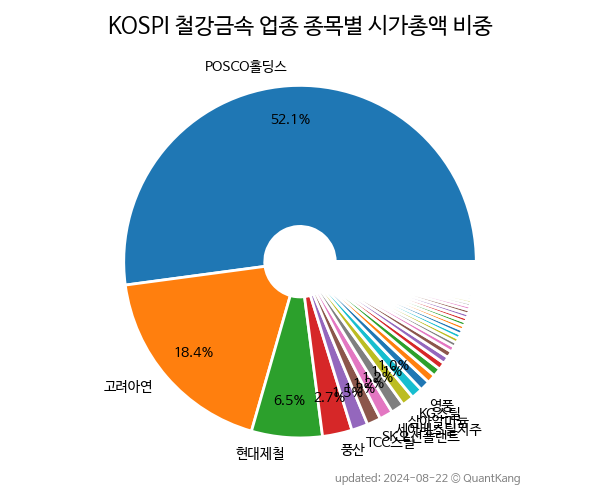

 
> **KOSPI 철강금속 업종 종목별 시가총액 비중**

 
> **종목 목록**

| **종목** | **PER** | **PBR** | **DIV** | **비중** |
| :------- | ------: | ------: | ------: | -------: |
| POSCO홀딩스 : 10.0 | 0.6 | 2.9% | 54.8% |
| 고려아연 : 10.7 | 1.0 | 4.4% | 15.0% |
| 현대제철 : 4.1 | 0.2 | 3.2% | 6.6% |
| 삼아알미늄 : 61.4 | 7.7 | 0.3% | 2.2% |
| TCC스틸 : 41.8 | 6.4 | 0.2% | 2.1% |
| SK오션플랜트 : 33.5 | 1.8 | - | 1.6% |
| 풍산 : 5.8 | 0.6 | 2.7% | 1.6% |
| 영풍 : 2.2 | 0.2 | 2.1% | 1.3% |
| KG스틸 : 1.4 | 0.4 | 2.0% | 1.2% |
| 세아베스틸지주 : 7.9 | 0.4 | 5.9% | 1.1% |
| 동국제강 : - | - | - | 0.8% |
| 고려제강 : 6.2 | 0.3 | 1.5% | 0.8% |
| KISCO홀딩스 : 4.6 | 0.4 | 2.2% | 0.7% |
| 세아홀딩스 : 3.4 | 0.2 | 3.8% | 0.7% |
| 세아제강 : 2.2 | 0.4 | 4.9% | 0.5% |
| 알루코 : 21.9 | 1.3 | - | 0.5% |
| 포스코스틸리온 : 13.0 | 0.9 | 1.8% | 0.5% |
| 대한제강 : 1.9 | 0.3 | 6.3% | 0.5% |
| 남선알미늄 : 9.4 | 0.9 | - | 0.5% |
| 한국철강 : 3.1 | 0.3 | 4.7% | 0.4% |
| 현대비앤지스틸 : 10.6 | 0.5 | 0.6% | 0.4% |
| 휴스틸 : 0.8 | 0.3 | 7.4% | 0.4% |
| 조일알미늄 : 14.3 | 1.4 | - | 0.4% |
| SIMPAC : 2.8 | 0.4 | 5.2% | 0.4% |
| 동국홀딩스 : 1.7 | 0.2 | 6.7% | 0.4% |
| 만호제강 : 15.2 | 0.5 | - | 0.3% |
| 동국씨엠 : - | - | - | 0.3% |
| 아주스틸 : 134.3 | 0.8 | - | 0.3% |
| 금강공업 : 3.1 | 0.4 | 2.0% | 0.3% |
| 넥스틸 : 0.7 | 0.0 | - | 0.3% |
| NI스틸 : 3.3 | 0.8 | 1.8% | 0.3% |
| 한국주철관 : 11.5 | 0.4 | 6.2% | 0.2% |
| 이구산업 : 22.8 | 1.0 | 1.3% | 0.2% |
| 디씨엠 : 2.6 | 0.4 | 8.5% | 0.2% |
| 대창 : 27.1 | 0.4 | - | 0.2% |
| 황금에스티 : 2.9 | 0.4 | 2.9% | 0.2% |
| 세아특수강 : 6.1 | 0.3 | 7.5% | 0.2% |
| 한국특강 : 2.5 | 0.5 | - | 0.2% |
| 동일산업 : 4.2 | 0.2 | 7.0% | 0.2% |
| 동양철관 : 22.9 | 1.0 | - | 0.1% |
| 대호에이엘 : 10.2 | 0.8 | - | 0.1% |
| 부국철강 : 10.8 | 0.6 | 2.0% | 0.1% |
| DSR : 2.8 | 0.3 | 1.4% | 0.1% |
| 한일철강 : - | 0.3 | 1.3% | 0.1% |
| 대양금속 : 6.7 | 0.5 | - | 0.1% |
| 하이스틸 : 5.4 | 0.4 | 0.6% | 0.1% |
| 문배철강 : 2.3 | 0.4 | 1.6% | 0.1% |
| 서원 : 216.7 | 0.4 | - | 0.1% |
| DSR제강 : 2.1 | 0.3 | 1.4% | 0.1% |
| 영흥 : - | 0.2 | - | 0.1% |
| 동일제강 : 11.2 | 0.2 | 0.5% | 0.1% |
| 화인베스틸 : - | 0.4 | - | 0.0% |
| SHD : 2.5 | 0.5 | 0.5% | 0.0% |
| 남선알미우 : - | - | - | 0.0% |
| 금강공업우 : - | - | 1.4% | 0.0% |

---
