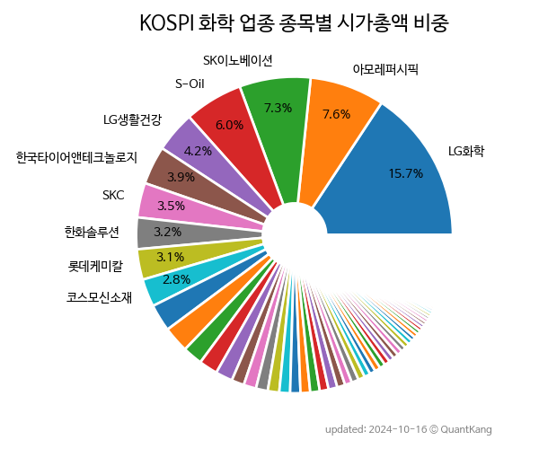

 

 
> **종목 목록 (125)**

| **종목** | **PER** | **PBR** | **DIV** | **비중** |
| :------- | ------: | ------: | ------: | -------: |
| [LG화학](/051910/) | 18.0 | 1.0 | 2.3<small>%</small> | 20.6<small>%</small> |
| [SK이노베이션](/096770/) | 6.4 | 0.5 | 5.0<small>%</small> | 8.0<small>%</small> |
| [아모레퍼시픽](/090430/) | 69.6 | 1.6 | 0.5<small>%</small> | 5.4<small>%</small> |
| [S-Oil](/010950/) | 3.7 | 0.9 | 8.2<small>%</small> | 5.2<small>%</small> |
| [한국타이어앤테크놀로지](/161390/) | 8.8 | 0.7 | 1.6<small>%</small> | 4.2<small>%</small> |
| [한화솔루션](/009830/) | 17.8 | 0.7 | - | 3.9<small>%</small> |
| [롯데케미칼](/011170/) | 76.7 | 0.3 | 2.7<small>%</small> | 3.9<small>%</small> |
| [LG생활건강](/051900/) | 22.5 | 0.9 | 1.3<small>%</small> | 3.4<small>%</small> |
| [금양](/001570/) | - | 35.6 | - | 3.1<small>%</small> |
| 코스모신소재 | 143.5 | 16.0 | - | 2.9<small>%</small> |
| [금호석유](/011780/) | 3.5 | 0.6 | 4.2<small>%</small> | 2.5<small>%</small> |
| [SKC](/011790/) | - | 1.5 | 1.4<small>%</small> | 2.0<small>%</small> |
| [한솔케미칼](/014680/) | 15.0 | 3.0 | 1.0<small>%</small> | 1.6<small>%</small> |
| [아모레G](/002790/) | 42.6 | 0.6 | 0.7<small>%</small> | 1.6<small>%</small> |
| [KCC](/002380/) | 53.5 | 0.3 | 3.3<small>%</small> | 1.5<small>%</small> |
| LG화학우 | - | - | 3.7<small>%</small> | 1.4<small>%</small> |
| [OCI홀딩스](/010060/) | 2.8 | 0.6 | 2.4<small>%</small> | 1.4<small>%</small> |
| [한화](/000880/) | 1.9 | 0.4 | 2.8<small>%</small> | 1.4<small>%</small> |
| [금호타이어](/073240/) | - | 1.6 | - | 1.2<small>%</small> |
| [효성첨단소재](/298050/) | 12.0 | 2.1 | 4.5<small>%</small> | 1.0<small>%</small> |
| [코스맥스](/192820/) | 65.2 | 2.3 | - | 0.9<small>%</small> |
| [효성티앤씨](/298020/) | 113.9 | 1.1 | 3.3<small>%</small> | 0.9<small>%</small> |
| [롯데정밀화학](/004000/) | 8.6 | 0.6 | 7.1<small>%</small> | 0.9<small>%</small> |
| [DL](/000210/) | 20.6 | 0.3 | 1.8<small>%</small> | 0.8<small>%</small> |
| [한국콜마](/161890/) | - | 1.7 | 1.0<small>%</small> | 0.8<small>%</small> |
| [SK케미칼](/285130/) | 6.6 | 0.5 | 2.3<small>%</small> | 0.8<small>%</small> |
| [코오롱인더](/120110/) | 6.9 | 0.4 | 3.2<small>%</small> | 0.8<small>%</small> |
| [코스모화학](/005420/) | 88.6 | 4.8 | - | 0.8<small>%</small> |
| DS단석 | 50.0 | 6.5 | - | 0.7<small>%</small> |
| 이수스페셜티케미컬 | - | - | - | 0.7<small>%</small> |
| 태광산업 | 2.0 | 0.2 | 0.2<small>%</small> | 0.6<small>%</small> |
| [동원시스템즈](/014820/) | 12.7 | 1.2 | 1.9<small>%</small> | 0.6<small>%</small> |
| [대한유화](/006650/) | - | 0.5 | 0.7<small>%</small> | 0.6<small>%</small> |
| [TKG휴켐스](/069260/) | 9.8 | 1.1 | 4.8<small>%</small> | 0.6<small>%</small> |
| 넥센타이어 | - | 0.5 | 1.2<small>%</small> | 0.6<small>%</small> |
| [후성](/093370/) | 8.2 | 2.2 | 0.2<small>%</small> | 0.6<small>%</small> |
| 미원상사 | 11.3 | 2.4 | 0.9<small>%</small> | 0.5<small>%</small> |
| [율촌화학](/008730/) | - | 2.1 | 0.9<small>%</small> | 0.5<small>%</small> |
| [PI첨단소재](/178920/) | 15.6 | 2.1 | 3.2<small>%</small> | 0.5<small>%</small> |
| OCI | - | - | - | 0.5<small>%</small> |
| 미원에스씨 | 10.3 | 1.8 | 1.7<small>%</small> | 0.5<small>%</small> |
| 애경케미칼 | 10.3 | 0.8 | 4.3<small>%</small> | 0.4<small>%</small> |
| 유니드 | 5.1 | 0.6 | 2.6<small>%</small> | 0.4<small>%</small> |
| 애경산업 | 26.3 | 1.2 | 1.9<small>%</small> | 0.3<small>%</small> |
| KG케미칼 | 1.3 | 0.5 | 1.6<small>%</small> | 0.3<small>%</small> |
| 아모레퍼시픽우 | - | - | 1.9<small>%</small> | 0.3<small>%</small> |
| 송원산업 | 2.8 | 0.6 | 3.2<small>%</small> | 0.3<small>%</small> |
| 남해화학 | 7.4 | 0.7 | 1.4<small>%</small> | 0.2<small>%</small> |
| 국도화학 | 4.6 | 0.4 | 3.5<small>%</small> | 0.2<small>%</small> |
| LX하우시스 | - | 0.5 | 0.5<small>%</small> | 0.2<small>%</small> |
| 백광산업 | 15.9 | 1.6 | 0.8<small>%</small> | 0.2<small>%</small> |
| 서흥 | 9.1 | 0.7 | 1.4<small>%</small> | 0.2<small>%</small> |
| 한화3우B | - | - | 5.7<small>%</small> | 0.2<small>%</small> |
| LG생활건강우 | - | - | 2.9<small>%</small> | 0.2<small>%</small> |
| 한국쉘석유 | 11.0 | 2.6 | 8.0<small>%</small> | 0.2<small>%</small> |
| 이수화학 | 12.1 | 1.1 | 4.1<small>%</small> | 0.2<small>%</small> |
| 효성화학 | - | 2.0 | - | 0.2<small>%</small> |
| 코오롱플라스틱 | 7.7 | 1.1 | 2.5<small>%</small> | 0.2<small>%</small> |
| 삼양패키징 | 21.8 | 0.7 | 4.4<small>%</small> | 0.2<small>%</small> |
| 잇츠한불 | - | 0.6 | 1.2<small>%</small> | 0.2<small>%</small> |
| 락앤락 | - | 0.5 | 34.0<small>%</small> | 0.2<small>%</small> |
| 한농화성 | 26.1 | 1.5 | 0.8<small>%</small> | 0.2<small>%</small> |
| 넥센 | 13.4 | 0.2 | 2.6<small>%</small> | 0.2<small>%</small> |
| KPX홀딩스 | 23.6 | 0.2 | 5.6<small>%</small> | 0.2<small>%</small> |
| 백산 | 5.2 | 1.3 | 1.5<small>%</small> | 0.2<small>%</small> |
| KPX케미칼 | 7.2 | 0.3 | 6.3<small>%</small> | 0.1<small>%</small> |
| 일진다이아 | - | 0.5 | 2.1<small>%</small> | 0.1<small>%</small> |
| 경농 | 6.7 | 0.8 | 4.0<small>%</small> | 0.1<small>%</small> |
| S-Oil우 | - | - | 11.4<small>%</small> | 0.1<small>%</small> |
| 에이블씨엔씨 | 201.7 | 1.6 | - | 0.1<small>%</small> |
| NPC | 7.6 | 0.6 | 1.9<small>%</small> | 0.1<small>%</small> |
| 화승인더 | 199.7 | 0.5 | 5.5<small>%</small> | 0.1<small>%</small> |
| 금호석유우 | - | - | 8.8<small>%</small> | 0.1<small>%</small> |
| 태경산업 | 5.3 | 0.6 | 4.9<small>%</small> | 0.1<small>%</small> |
| 노루페인트 | 15.7 | 0.5 | 3.1<small>%</small> | 0.1<small>%</small> |
| 진양홀딩스 | 6.9 | 0.5 | 6.4<small>%</small> | 0.1<small>%</small> |
| 그린케미칼 | 57.1 | 1.3 | 3.3<small>%</small> | 0.1<small>%</small> |
| 삼화페인트 | 25.7 | 0.5 | 4.1<small>%</small> | 0.1<small>%</small> |
| 동아타이어 | 6.9 | 0.4 | 8.3<small>%</small> | 0.1<small>%</small> |
| 토니모리 | - | 1.7 | - | 0.1<small>%</small> |
| 대한화섬 | 3.9 | 0.2 | 0.6<small>%</small> | 0.1<small>%</small> |
| 미원화학 | 8.7 | 1.1 | 3.6<small>%</small> | 0.1<small>%</small> |
| 태경케미컬 | 16.7 | 1.0 | 1.5<small>%</small> | 0.1<small>%</small> |
| 경인양행 | 10.2 | 0.6 | 1.4<small>%</small> | 0.1<small>%</small> |
| HDC현대EP | 11.1 | 0.4 | 2.7<small>%</small> | 0.1<small>%</small> |
| 휴비스 | - | 0.3 | - | 0.1<small>%</small> |
| 극동유화 | 6.6 | 0.7 | 5.1<small>%</small> | 0.1<small>%</small> |
| 삼영 | 48.9 | 2.6 | - | 0.1<small>%</small> |
| 아모레G3우(전환) | - | - | 3.6<small>%</small> | 0.1<small>%</small> |
| 미창석유 | 4.9 | 0.3 | 3.3<small>%</small> | 0.1<small>%</small> |
| 강남제비스코 | 20.4 | 0.2 | 2.6<small>%</small> | 0.1<small>%</small> |
| 테이팩스 | 6.1 | 0.8 | 3.7<small>%</small> | 0.1<small>%</small> |
| DRB동일 | 70.2 | 0.3 | 0.7<small>%</small> | 0.1<small>%</small> |
| 덕성 | 45.1 | 1.2 | 0.6<small>%</small> | 0.1<small>%</small> |
| 동남합성 | 10.5 | 2.2 | 2.8<small>%</small> | 0.1<small>%</small> |
| 한국화장품제조 | 20.9 | 1.8 | 0.4<small>%</small> | 0.1<small>%</small> |
| SK이노베이션우 | - | - | 7.2<small>%</small> | 0.1<small>%</small> |
| 동방아그로 | 11.9 | 0.5 | 3.9<small>%</small> | 0.1<small>%</small> |
| 동일고무벨트 | 11.2 | 0.4 | 1.9<small>%</small> | 0.1<small>%</small> |
| 진양산업 | 13.2 | 1.6 | 3.2<small>%</small> | 0.1<small>%</small> |
| 조광페인트 | - | 0.4 | 1.7<small>%</small> | 0.1<small>%</small> |
| 대원화성 | - | 1.2 | - | 0.1<small>%</small> |
| 보락 | 24.8 | 1.6 | 0.6<small>%</small> | 0.1<small>%</small> |
| SH에너지화학 | 39.4 | 0.8 | 1.5<small>%</small> | 0.1<small>%</small> |
| 영보화학 | 10.2 | 0.4 | 1.4<small>%</small> | 0.0<small>%</small> |
| 조비 | 8.0 | 1.1 | - | 0.0<small>%</small> |
| 코오롱인더우 | - | - | 6.0<small>%</small> | 0.0<small>%</small> |
| 아모레G우 | - | - | 2.2<small>%</small> | 0.0<small>%</small> |
| SK케미칼우 | - | - | 5.3<small>%</small> | 0.0<small>%</small> |
| 한화솔루션우 | - | - | - | 0.0<small>%</small> |
| 성보화학 | 14.3 | 0.4 | 4.6<small>%</small> | 0.0<small>%</small> |
| 진양폴리 | 16.5 | 1.9 | 3.5<small>%</small> | 0.0<small>%</small> |
| 진양화학 | - | 1.3 | - | 0.0<small>%</small> |
| DL우 | - | - | 4.0<small>%</small> | 0.0<small>%</small> |
| WISCOM | - | 0.4 | 1.9<small>%</small> | 0.0<small>%</small> |
| 카프로 | - | 1.1 | - | 0.0<small>%</small> |
| 제이준코스메틱 | - | 0.6 | - | 0.0<small>%</small> |
| 넥센타이어1우B | - | - | 3.4<small>%</small> | 0.0<small>%</small> |
| LX하우시스우 | - | - | 1.3<small>%</small> | 0.0<small>%</small> |
| 덕성우 | - | - | 0.4<small>%</small> | 0.0<small>%</small> |
| 한화우 | - | - | 2.5<small>%</small> | 0.0<small>%</small> |
| NPC우 | - | - | 3.7<small>%</small> | 0.0<small>%</small> |
| 넥센우 | - | - | 4.1<small>%</small> | 0.0<small>%</small> |
| 노루페인트우 | - | - | 1.7<small>%</small> | 0.0<small>%</small> |
| 동원시스템즈우 | - | - | 2.8<small>%</small> | 0.0<small>%</small> |

---
